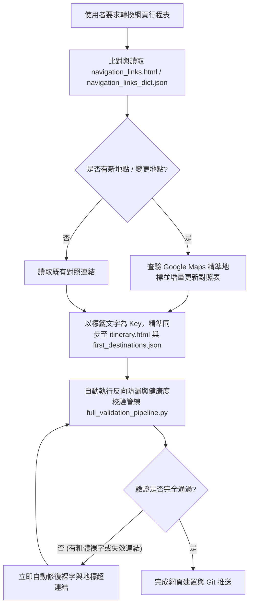

# Generate Travel Itinerary Skill

當使用者要求將旅遊行程、景點規劃或行程表（如 `README.md`）轉換或同步為網頁版行程（`itinerary.html`）時，請嚴格遵循以下核心規範與工作流程。

---

## 1. 核心設計規範（UI/UX & Mobile-First）

1. **手機優先與現代和風美學**：
   - 採用無邊框、精緻卡片式設計（Card Design）、毛玻璃效果（Glassmorphism）與滑順微動畫。
   - 所有點擊區域（如頁籤、連結、核取方塊）必須符合 iOS/Android 人體工學標準（觸控目標大於 44x44px）。
   - 使用 CSS 變數（Variables）建構深色模式（Dark Mode），搭配日系和風點綴色（如緋紅 `#E45F56`、松葉綠 `#2C3E50`、金茶 `#E5A823`）。
   - 嚴禁使用 Bootstrap、TailwindCSS 等外部框架，確保極速載入且可離線運作。
   - 必須包含 `<meta name="viewport" content="width=device-width, initial-scale=1.0, user-scalable=no">`。

2. **雙層內容結構與 iOS 風格抽屜彈出視窗（Bottom Sheet Modal）**：
   - **精簡卡片畫面**：預設僅呈現精簡但實用的行程摘要（重要資訊如建議路線、推薦必點、選項備案等），保持手機滑動順暢，避免無意義的佔位文字。
   - **完整原始說明抽屜**：提供「📖 完整原始說明」按鈕，點選後以 iOS 底部抽屜（Bottom Sheet）滑出完整段落。此處必須 100% 完整保留原始行程表（如 `README.md`）的內容與段落結構（如 blockquotes、條列清單、重要避坑警示）。
   - **智慧按鈕隱藏**：若時段內容本身已足夠簡短，且點擊前後顯示內容一致時，**必須自動隱藏**「📖 完整原始說明」按鈕，避免多餘互動。

3. **動態互動與狀態管理**：
   - **分天頁籤（Tabs）**：頂部置頂固定（`position: sticky`），支援平滑切換不同天數的行程。
   - **分線切換（Sub-toggles）**：針對特定天數的「雙路線（例如長輩室內組 vs 戶外散步組）」或「決策方案（Plan A vs Plan B）」，提供子切換按鈕，點擊後即時過濾當天時間軸。
   - **行程進度打勾（Checklist）**：每張卡片附有 checkbox，點擊可標記「已完成」，並透過 `localStorage` 儲存狀態，重新整理不消失，並連動更新頂部進度條。

---

## 2. PWA（Progressive Web App）規格

為了讓使用者能在 Android / iOS 上將行程表安裝為獨立 App 並離線使用，網頁必須完整支援 PWA：

1. **Web App Manifest (`manifest.json` 或 `manifest.webmanifest`)**：
   - 設定 `name`、`short_name`、`start_url: "./itinerary.html"`、`display: "standalone"`、`background_color` 與 `theme_color`。
   - 配置多解析度圖標（至少包含 192x192、512x512 與 maskable 圖標）。
2. **Service Worker (`sw.js`) 與自動更新機制**：
   - 實作快取策略（如 Stale-While-Revalidate 或 Network-First），確保無網路環境下仍可完整瀏覽所有天數行程與抽屜內容。
   - **版本更新通知/自動更新**：當網頁程式碼或行程更新時，Service Worker 必須偵測到新版本並自動更新快取（例如在頁面載入時檢查更新並觸發 `skipWaiting()` 或提示重載），避免使用者需要手動解除安裝再重新安裝 PWA。
3. **iOS 專屬 Meta 標籤**：
   - 包含 `apple-mobile-web-app-capable: yes`、`apple-mobile-web-app-status-bar-style: black-translucent` 及 `apple-touch-icon`。

---

## 3. 導航連結生命週期與 `navigation_links.html` 對照表機制

導航連結的維護以 [navigation_links.html](file:///home/owen/tokyo/navigation_links.html) 為唯一維護基準表。

### 3.1 對照表結構與規格
`navigation_links.html` 採用表格呈現，包含以下三欄：
1. **網頁行程標籤文字（名稱 Key）**：
   - **核心規則**：名稱必須使用**網頁行程表中帶有該連結的中文文字**（例如：`手打烏龍麵 杵屋`、`二木菓子`、`上野公園文化圈`），**嚴禁用日文 raw 分店名或長字串作為 Key**（例如不可用 `実演手打ちうどん 杵屋 吉祥寺キラリーナ店`）。
   - 確保名稱與網頁卡片/段落中肉眼可見的錨點文字 100% 精準對應。
2. **導航網址（URL）**：
   - 支援完整 Google Maps 搜尋連結（`https://www.google.com/maps/search/?api=1&query=...`）或使用者手動貼入的 Google 短網址（`https://maps.app.goo.gl/...`）。
   - 欄位以 `<input type="text" class="link-input" readonly onclick="this.select()">` 呈現，方便使用者複製與校對。
3. **預覽（Preview）**：
   - `<a href="..." target="_blank" class="btn-preview">🔗 開啟地圖</a>`，供使用者點擊即時在 Google Maps 驗證位置。

### 3.2 同步與增量維護工作流程
當使用者更新 `README.md` 或要求更新 `itinerary.html` 時：
1. **讀取對照表**：優先讀取 `navigation_links.html` 中已校對好的所有 Key 與 URL。
2. **檢測新增地點**：若 `README.md` 中出現新餐廳、景點、車站或商場，主動透過 Google Maps 查詢其**最精準、可直達該分店/確切地點**的導航連結。
3. **增量寫入對照表**：將新地點以對齊的「中文標籤文字」作為 Key，將精準地圖連結寫入 `navigation_links.html` 並依字首排序。
4. **注入網頁行程表**：將 `navigation_links.html` 中的最新連結全面同步注入 `itinerary.html`，保證兩者連結 100% 一致。

### 3.3 無死角導航與精準定位原則
- **內文所有景點/餐廳 100% 全覆蓋導航（Full In-text Anchor Coverage）**：
  - 行程表各時段的「內文說明、景點清單、順路名產、備案餐廳」中提及的**每一個實體景點、餐廳、商場、車站**（例如：`不忍池`、`清水觀音堂`、`兔屋`、`二木菓子`、`OS Drug`、`肉之大山`、`みなとや食品`、`多慶屋`、`押上站`、`東京都廳` 等），**一律必須加上 Google Maps 導航超連結**，嚴禁遺漏任何地點。
- **時段主導航「第一個目的地原則」（First Destination Principle）**：
  - 每張卡片右上角／標題旁的「📍 導航」按鈕，必須精準導向**該時段第一個要抵達的實體目的地**。
  - 若該時段為複合路線（如「`松坂屋出發 ➔ 不忍池 ➔ 清水觀音堂 ➔ 兔屋`」），主導航按鈕必須導向第一個目的地（即 `不忍池`），嚴禁誤導向出發點或最後的順路店家。
  - 若該時段為交通時段（如「`前往三鷹`」、「`前往吉祥寺`」、「`返回淺草橋`」），主導航按鈕必須導向該段移動的第一個目標（如 `三鷹站南口 9 號公車站`、`吉祥寺站`、`海茵娜酒店`）。
  - 若該時段為單一景點或用餐時段，則導向該主要景點或首選餐廳。
- **非移動／無特定實體目的地時段免附導航按鈕（No-Nav for Static / In-Hotel Slots）**：
  - 當該時段為**飯店內活動或無外出位移之行程**（例如：`飯店內吃早餐`、`整理行李`、`退房`、`回飯店休息整備`、`準時就寢`、`原地等待開門`），**卡片標題旁一律嚴禁顯示「📍 導航」按鈕**。
  - 嚴禁產生無意義的通用關鍵字搜尋導航（如 `query=早餐`、`query=退房`、`query=就寢` 等）。
  - 只有在該時段具備**明確外部實體目標**（如：前往景點、特定餐廳、搭車車站、逛街商場）時，才呈現精準導航按鈕。
- **永久官方標準網址（Canonical URLs with Place ID）**：
  - 所有地圖連結優先採用含經緯度與 Place ID 的官方永久標準格式（`https://www.google.com/maps/search/?api=1&query=LAT,LNG&query_place_id=PLACE_ID`），徹底避免 Firebase 動態短網址（`maps.app.goo.gl`）可能發生的 `Dynamic Link Not Found` 錯誤。
  - 若使用者提供短網址，可讓標準 Place ID 連結與 `[短網址備用導航 🔗](...)` 雙連結並存。
- **精準地標定位**：嚴禁使用模糊的通用關鍵字（避免跳轉至 Google Maps 大範圍搜尋）。如「鳥良商店 西新宿店」必須定位到新宿西口店，而非只搜尋「鳥良商店」。
- **地理普查與糾錯**：主動核實地點真實性。若原行程表有已歇業或不存在之店家，主動替換為當地評價優良之真實店家並加註說明。

### 3.4 Markdown 圖片解析與響應式渲染 (Markdown Images to Responsive ``)
- 當 Markdown 行程表中包含實景照片語法 ``（如公車站牌、彩繪接駁巴士外觀照）時：
  - 編譯器（如 `build_pwa.py`）**必須將其轉換為標準 HTML 響應式圖片標籤**：
    `

alt

`
  - **嚴禁**將圖片語法破壞或錯誤轉譯為純文字超連結 `!<a ...>`。

### 3.5 GitHub Pages (Docsify) 與 Markdown 行動端體驗規範
- **Docsify SPA 入口 (`index.html`)**：
  - 專案根目錄必須配置支援 Docsify 之 `index.html`，啟用 `homepage: 'README.md'`、`auto2top: true` 與行動端專屬 Viewport / CSS 樣式。
- **頂部快速跳轉膠囊 (Sticky Nav & Anchors)**：
  - `README.md` 頂部必須包含各大天數與核心章節之快速跳轉按鈕，且每一天結尾配置 `[⬆️ 回頂部](#...)`。
- **次要資訊摺疊 (`

`)**：
  - 餐廳點餐/付款技巧、備案餐廳清單、深度展區導覽、公車搭乘關鍵技巧、方案 A/B 動態決策等延伸資訊，一律採用 `

...

` 包裹，維持手機版面簡潔不疲勞。
- **Universal Links**：
  - 正文中所有地標超連結必須為支援一鍵喚醒 Google Maps App 之標準 Place ID 網址。

---

## 4. 行程更新標準作業程序（SOP）

當使用者給予更新指示（例如「我有更新 README.md 了」或「轉為網頁行程表並幫我 push」）：

1. **確認變更點**：比對 `README.md` 與現有 `itinerary.html` 的差異（如新增時段、替換首選/備案餐廳、更新時間）。
2. **維護導航對照表**：確保所有提及的地點皆在 `navigation_links_dict.json` 中有明確紀錄。
3. **安全更新 HTML**：針對 `itinerary.html` 進行精確文字與連結替換，保留所有原有 CSS 樣式、Modal 結構與 PWA Service Worker 邏輯。
4. **反向防漏與健康度自動校驗 (Reverse Missing-Link & Health Audit)**：
   - **粗體裸字零容忍 Linter**：掃描行程表內文所有粗體地標（如 `**中文 (日文)**`），確認**絕無遺漏超連結的純粗體店家**（100% 皆帶有 `[**...**](URL)`）。
   - **HTTP 與 Place ID 驗證**：確認全頁所有 Google Maps 導航連結皆為 Place ID 標準格式且狀態為 200 OK，無任何 `Dynamic Link Not Found` 或 404 錯誤。
   - **雙向一致性驗證**：確認 `README.md` 與 `2026東京親子自由行_V10_Henna.md` 內容 100% 一致。

