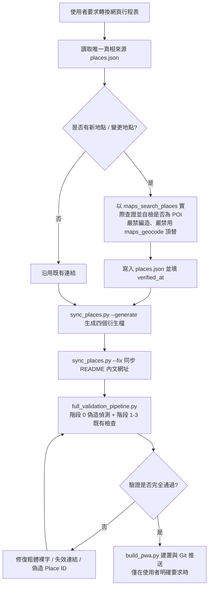

# Generate Travel Itinerary Skill

當使用者要求將旅遊行程、景點規劃或行程表（如 `README.md`）轉換或同步為網頁版行程（`itinerary.html`）時，請嚴格遵循以下核心規範與工作流程。

---

## 1. 核心設計規範（UI/UX & Mobile-First）

1. **手機優先與現代和風美學**：
   - 採用無邊框、精緻卡片式設計（Card Design）、毛玻璃效果（Glassmorphism）與滑順微動畫。
   - 所有點擊區域（如頁籤、連結、核取方塊）必須符合 iOS/Android 人體工學標準（觸控目標大於 44x44px）。
   - 使用 CSS 變數（Variables）建構深色模式（Dark Mode），搭配日系和風點綴色（如緋紅 `#E45F56`、松葉綠 `#2C3E50`、金茶 `#E5A823`）。
   - 嚴禁使用 Bootstrap、TailwindCSS 等外部框架，確保極速載入且可離線運作。
   - 必須包含 `<meta name="viewport" content="width=device-width, initial-scale=1.0, user-scalable=no">`。

2. **雙層內容結構與 iOS 風格抽屜彈出視窗（Bottom Sheet Modal）**：
   - **精簡卡片畫面**：預設僅呈現精簡但實用的行程摘要（重要資訊如建議路線、推薦必點、選項備案等），保持手機滑動順暢，避免無意義的佔位文字。
   - **完整原始說明抽屜**：提供「📖 完整原始說明」按鈕，點選後以 iOS 底部抽屜（Bottom Sheet）滑出完整段落。此處必須 100% 完整保留原始行程表（如 `README.md`）的內容與段落結構（如 blockquotes、條列清單、重要避坑警示）。
   - **智慧按鈕隱藏**：若時段內容本身已足夠簡短，且點擊前後顯示內容一致時，**必須自動隱藏**「📖 完整原始說明」按鈕，避免多餘互動。

   > 📏 **兩層各自的硬性長度上限（2026-08-17 依 390×844 實測訂定）**
   >
   > | 層 | 元素 | 上限 | 超標怎麼修 |
   > | :-- | :-- | :-- | :-- |
   > | 第一層 | `card-summary`（沒點開就看到） | **目標 ≤ 80 字，破格線 120 字** | 在 `CUSTOM_SUMMARIES_V10` 補一條手寫摘要覆蓋 |
   > | 第二層 | 抽屜 `original-content-holder` | 抽屜可視高 **650px**，展開後**不宜超過 2 屏（1300px）** | 在 `README.md` 用 `<details>` 分層，**不是刪字** |
   >
   > - 摘要只回答**「這段去哪、花多少錢」**。推薦菜色、備案餐廳、點餐步驟、防呆對照一律進第二層。
   > - 🔧 **縮短摘要一律改 `CUSTOM_SUMMARIES_V10`，嚴禁去刪 `README.md` 內文**——
   >   README 由 Docsify 直接渲染必須完整，而該 dict 存在的目的就是覆蓋 PWA 摘要。
   > - `build_pwa.py` 的 **`warn_long_summaries()`** 每次編譯後會分兩級回報並偵測空白摘要；
   >   **編譯後一定要看這段輸出**，不要只看 `✅ Successfully built`。
   > - 🚨 **空白摘要是紅燈**：代表該時段 README 內文被刪過頭，`clean_markdown_for_summary()`
   >   取不到首句，卡片會出現一片空白。

   > 🗂️ **抽屜分層判準：打開抽屜的當下，人在現場（2026-08-17 新增）**
   >
   > | 一律攤開 | 一律收進 `<details>` |
   > | :-- | :-- |
   > | 現在往哪走、搭什麼線、幾站、哪個出口 | 行前必讀介紹文連結 |
   > | ⚠️🚨 安全與避坑警語、🚻 廁所位置 | 票券規則、卡種比較、背景知識 |
   > | 價格、營業時間、樓層、`票務狀態` 標記 | 「如果搭錯方向怎麼辦」的防呆對照 |
   > | 站內指標實景照片（要照著找看板） | 多情境分支中**不屬於你**的那幾種 |
   >
   > - **診斷訣竅**：抽屜長不長，看的不是總字數，而是**「摺疊數是不是 0」**。
   >   2026-08-17 實測，總字數 1,737 字但有 3 個摺疊的卡片只有 1.6 屏；
   >   而 2.5 屏以上那幾張，摺疊數**全部是 0**。
   > - **多情境分支**（「若在 A 用餐…若在 B…若在 C…」）必須各包一個 `<details>`，
   >   `<summary>` 寫情境名，現場只點自己那個。
   > - 🚨 **`<details>` 嚴禁放在時段第一行**：`clean_markdown_for_summary()` 會把標籤當首句寫進摘要，
   >   在 `itinerary.html` 產生沒有結尾的孤兒 `<details>`（已於「抵達羽田機場第 3 航廈」實際踩到）。
   >   該函式已加防護跳過收合區塊，但仍請把「現場第一步做什麼」留在最前面。
   > - ✅ **改完必查**：`README.md` 與 `itinerary.html` **兩邊**的 `<details>`／`</details>` 都要配對，
   >   而且要**逐張卡片**檢查——全檔總數相等仍可能有單張不配對。巢狀摺疊是合法的，別誤判。

3. **卡片標籤（Card Tags）由內容自動偵測，不硬編清單**：
   - 目前共四類標籤，皆渲染在 `card-tags` 容器內：

     | 標籤 | 觸發條件 | 點擊行為 |
     | :-- | :-- | :-- |
     | `票務狀態` | 內文含 `> 🎫 **票務狀態：…**` | 純顯示 |
     | **🚻 廁所** | **時段內文含 `🚻`** | 開啟完整說明抽屜 |
     | 📄 攻略 N | 內文的介紹文連結數 | 開啟完整說明抽屜 |
     | 分類（食／交通／住宿／景點） | `get_category_info(title)` 的中文關鍵字 | 純顯示 |

   - 🚨 **`🚻` 在各時段內文中是保留字元**：它是廁所標籤的唯一觸發條件，
     **嚴禁拿來當一般裝飾 emoji**，否則室內時段會誤掛廁所標籤
     （2026-08-17 實際踩到兩張，已分別改為 🎒 與 💧）。置頂頁不受此限。
   - 採內容偵測而非硬編卡片清單，好處是日後在 `README.md` 新增 🚻 段落會自動長出標籤，不必改程式。

4. **動態互動與狀態管理**：
   - **分天頁籤（Tabs）**：頂部置頂固定（`position: sticky`），支援平滑切換不同天數的行程。
   - **分線切換（Sub-toggles）**：針對特定天數的「雙路線（例如長輩室內組 vs 戶外散步組）」或「決策方案（Plan A vs Plan B）」，提供子切換按鈕，點擊後即時過濾當天時間軸。
   - **行程進度打勾（Checklist）**：每張卡片附有 checkbox，點擊可標記「已完成」，並透過 `localStorage` 儲存狀態，重新整理不消失，並連動更新頂部進度條。

---

## 2. PWA（Progressive Web App）規格

為了讓使用者能在 Android / iOS 上將行程表安裝為獨立 App 並離線使用，網頁必須完整支援 PWA：

1. **Web App Manifest (`manifest.json` 或 `manifest.webmanifest`)**：
   - 設定 `name`、`short_name`、`start_url: "./itinerary.html"`、`display: "standalone"`、`background_color` 與 `theme_color`。
   - 配置多解析度圖標（至少包含 192x192、512x512 與 maskable 圖標）。
2. **Service Worker (`sw.js`) 與自動更新機制**：
   - 實作快取策略（如 Stale-While-Revalidate 或 Network-First），確保無網路環境下仍可完整瀏覽所有天數行程與抽屜內容。
   - **版本更新通知/自動更新**：當網頁程式碼或行程更新時，Service Worker 必須偵測到新版本並自動更新快取（例如在頁面載入時檢查更新並觸發 `skipWaiting()` 或提示重載），避免使用者需要手動解除安裝再重新安裝 PWA。
3. **iOS 專屬 Meta 標籤**：
   - 包含 `apple-mobile-web-app-capable: yes`、`apple-mobile-web-app-status-bar-style: black-translucent` 及 `apple-touch-icon`。

---

## 3. 導航連結生命週期與 `places.json` 單一真相來源機制

> ⚠️ **2026-08 重大流程變更**：導航連結的維護基準**已由 `navigation_links.html` 改為 [places.json](file:///home/owen/tokyo/places.json)**。
>
> 原因：同一網址原本散落在 5 個檔案且無同步機制，導致大量偽造 Place ID 與座標漂移（詳見 `.agents/AGENTS.md` 的「Place ID 品質規則」）。
>
> **`navigation_links.html`、`navigation_links_dict.json`、`first_destinations.json`、`text_entities.json` 四個檔案現已全部改為自動生成，嚴禁手動編輯。**

### 3.0 標準維護流程（Claude Code 與 Antigravity 一致）

```bash
# 1. 只編輯唯一真相來源 places.json，每個地點的欄位：
#      url            導航網址（含 query_place_id）
#      nav_dict       該地點在 navigation_links_dict.json 中的鍵名清單
#      text_entities  需要在內文自動加連結的名稱清單
#      first_dest     卡片導航按鈕的鍵，格式 "{天數}_{標題關鍵字}"
#      html           在對照表網頁中顯示的標籤清單
#      verified_at    Place ID 最後查證日期（YYYY-MM-DD，逾 12 個月會被告警）

# 2. 生成四個衍生檔
python3 sync_places.py --generate

# 3. 檢查／同步 README.md 內文網址
#    README 由 Docsify 直接渲染，必須是完成品、不能用佔位符，故只能被檢查與修正
python3 sync_places.py --check
python3 sync_places.py --fix

# 4. 稽核 Place ID 是否具偽造特徵（離線、免 API key）
python3 place_id_audit.py

# 5. 僅在使用者明確要求時才編譯 PWA
python3 build_pwa.py
```

### 3.1 對照表結構與規格
`navigation_links.html`（**由 `sync_places.py --generate` 自動生成，僅供人工開啟瀏覽器逐筆點開驗證**）採用表格呈現，包含以下三欄：

### 3.1 對照表結構與規格
`navigation_links.html` 採用表格呈現，包含以下三欄：
1. **網頁行程標籤文字（名稱 Key）**：
   - **核心規則**：名稱必須使用**網頁行程表中帶有該連結的中文文字**（例如：`手打烏龍麵 杵屋`、`二木菓子`、`上野公園文化圈`），**嚴禁用日文 raw 分店名或長字串作為 Key**（例如不可用 `実演手打ちうどん 杵屋 吉祥寺キラリーナ店`）。
   - 確保名稱與網頁卡片/段落中肉眼可見的錨點文字 100% 精準對應。
2. **導航網址（URL）**：
   - 支援完整 Google Maps 搜尋連結（`https://www.google.com/maps/search/?api=1&query=...`）或使用者手動貼入的 Google 短網址（`https://maps.app.goo.gl/...`）。
   - 欄位以 `<input type="text" class="link-input" readonly onclick="this.select()">` 呈現，方便使用者複製與校對。
3. **預覽（Preview）**：
   - `<a href="..." target="_blank" class="btn-preview">🔗 開啟地圖</a>`，供使用者點擊即時在 Google Maps 驗證位置。

### 3.2 同步與增量維護工作流程
當使用者更新 `README.md` 或要求更新 `itinerary.html` 時：
1. **讀取真相來源**：讀取 `places.json`（**不是** `navigation_links.html`，該檔已改為自動生成的產物）。
2. **檢測新增地點**：若 `README.md` 中出現新餐廳、景點、車站或商場，主動透過 Google Maps 查詢其**最精準、可直達該分店/確切地點**的導航連結。
   - ⚠️ **必須實際查證**，嚴禁憑空編造 Place ID 或座標。
   - 查證工具（依優先序）：**google-maps MCP 的 `maps_search_places`**（由店名找地點）與 **`maps_place_details`**（由 ID 取權威資料）；無 MCP 時用 [Place ID Finder](https://developers.google.com/maps/documentation/javascript/examples/places-placeid-finder)。
   - 🚨 **嚴禁改用 `maps_geocode` 頂替**：Geocoding 回傳行政區而非商家 POI，會靜默降級（詳見 `.agents/AGENTS.md`）。工具不可用時應停下回報，而非換 API 繼續跑。
   - ✅ **每筆結果都要自檢是否為 POI**：`formatted_address` 要有番地門牌；`types` 不可含 `political`／`sublocality`／`locality`／`administrative_area_*`。
3. **寫入 `places.json`**：新增一筆，填妥 `url`／`nav_dict`／`text_entities`／`first_dest`／`html`／`verified_at`。
4. **生成與同步**：執行 `python3 sync_places.py --generate` 生成四個衍生檔，再執行 `--fix` 讓 README 內文網址一致，最後（若使用者要求）執行 `python3 build_pwa.py`。

### 3.3 無死角導航與精準定位原則
- **內文所有景點/餐廳 100% 全覆蓋導航（Full In-text Anchor Coverage）**：
  - 行程表各時段的「內文說明、景點清單、順路名產、備案餐廳」中提及的**每一個實體景點、餐廳、商場、車站**（例如：`不忍池`、`清水觀音堂`、`兔屋`、`二木菓子`、`OS Drug`、`肉之大山`、`みなとや食品`、`多慶屋`、`押上站`、`東京都廳` 等），**一律必須加上 Google Maps 導航超連結**，嚴禁遺漏任何地點。
- **時段主導航「下一步走去哪原則」（Next-Step Walking Target Principle）**：

  > 🚨 **2026-08-14 修訂（本條原本寫反，導致全行程 21 張卡片指錯，請務必照新版理解）**
  > 舊版寫成「導向該時段第一個要**抵達**的實體目的地」，還加註「嚴禁誤導向出發點」，
  > 範例更給了 `前往三鷹 → 三鷹站`、`返回淺草橋 → 海茵娜酒店`——那些都是**搭完車才會到的終點**。
  > 使用者要的從來不是終點，而是**現在把手機拿起來，雙腳要往哪走**。

  - **唯一判準**：卡片右上角的「📍 導航」按鈕，指向**站在該時段起點時，第一個要用雙腳走到的實體地點**。
    問法是「**下一步往哪走？**」，不是「這段的目的地是哪裡？」。
  - **交通時段 ⇒ 幾乎一律是「上車的那個車站／站牌」**，因為你得先走去搭車：

    | 時段標題 | ⭕ 正確（起站） | ❌ 錯誤（終點） |
    | :-- | :-- | :-- |
    | Day 3 `前往東京車站`（從飯店出發） | `JR 淺草橋站` | ~~東京車站~~ |
    | Day 4 `前往三鷹`（從飯店出發） | `JR 淺草橋站` | ~~三鷹站~~ |
    | Day 4 `前往吉祥寺`（從吉卜力美術館出發） | `JR 三鷹站` | ~~吉祥寺站~~ |
    | Day 4 `返回淺草橋`（從吉祥寺出發） | `JR 吉祥寺站` | ~~海茵娜酒店~~ |
    | Day 2 `返回淺草橋（親子組）`（從迪士尼出發） | `迪士尼東巴士總站 1 號站牌` | ~~秋葉原站東口~~ |
    | Day 5 `前往東京晴空塔`（從淺草文化觀光中心出發） | `東武 淺草站` | ~~晴空街道裡的餐廳~~ |

  - **純步行時段 ⇒ 路線上第一個實體點**（如「`松坂屋出發 ➔ 不忍池 ➔ 清水觀音堂 ➔ 兔屋`」指向 `不忍池`），
    **嚴禁指向該時段結束後才抵達的終點或最後的順路店家**。
  - **單一景點或用餐時段 ⇒ 指向該景點或首選餐廳本身**（此時「下一步走去哪」就是它）。
  - **若第一個要走到的地點在 Google 上沒有獨立 POI**（例如「三鷹站南口 9 號公車站」、「美術館門口公車站」），
    退一層指向**它所屬的車站或建物**（如 `JR 三鷹站`），**不要**改指終點。
  - ⚠️ **卡片按鈕與內文超連結是兩回事**：內文仍須依
    [travel-itinerary-auditor](../travel-itinerary-auditor/SKILL.md) 第五節，把**起站與終點站都**加上導航連結；
    按鈕只有一個，只負責「下一步」。
  - 🔧 **實作位置**：改 `places.json` 對應地點的 `first_dest`，key 格式 `"{天數}_{標題關鍵字}"`
    （關鍵字須為該卡片標題的子字串，且同一天內不得同時命中兩張卡），改完執行 `python3 sync_places.py --generate`。
    **若兩張卡片標題完全相同**（例如長輩組與親子組都叫「返回淺草橋」），**必須先在 README 把標題改到可區分**，
    否則 key 無從分辨，兩張會拿到同一個網址。
- **非移動／無特定實體目的地時段免附導航按鈕（No-Nav for Static / In-Hotel Slots）**：
  - 當該時段為**飯店內活動或無外出位移之行程**（例如：`飯店內吃早餐`、`整理行李`、`退房`、`回飯店休息整備`、`準時就寢`、`原地等待開門`），**卡片標題旁一律嚴禁顯示「📍 導航」按鈕**。
  - 嚴禁產生無意義的通用關鍵字搜尋導航（如 `query=早餐`、`query=退房`、`query=就寢` 等）。
  - 只有在該時段具備**明確外部實體目標**（如：前往景點、特定餐廳、搭車車站、逛街商場）時，才呈現精準導航按鈕。
- **永久官方標準網址（Canonical URLs with Place ID）**：
  - 所有地圖連結優先採用含經緯度與 Place ID 的官方永久標準格式（`https://www.google.com/maps/search/?api=1&query=LAT,LNG&query_place_id=PLACE_ID`），徹底避免 Firebase 動態短網址（`maps.app.goo.gl`）可能發生的 `Dynamic Link Not Found` 錯誤。
  - 若使用者提供短網址，可讓標準 Place ID 連結與 `[短網址備用導航 🔗](...)` 雙連結並存。
- **精準地標定位**：嚴禁使用模糊的通用關鍵字（避免跳轉至 Google Maps 大範圍搜尋）。如「鳥良商店 西新宿店」必須定位到新宿西口店，而非只搜尋「鳥良商店」。
- **地理普查與糾錯**：主動核實地點真實性。若原行程表有已歇業或不存在之店家，主動替換為當地評價優良之真實店家並加註說明。

### 3.4 Markdown 圖片解析與響應式渲染 (Markdown Images to Responsive ``)
- 當 Markdown 行程表中包含實景照片語法 ``（如公車站牌、彩繪接駁巴士外觀照）時：
  - 編譯器（如 `build_pwa.py`）**必須將其轉換為標準 HTML 響應式圖片標籤**：
    `<div class="itinerary-img-wrapper" style="margin: 10px 0; text-align: center;"><p style="font-size: 0.82rem; color: #64748b; margin-top: 4px; font-style: italic;">alt</p></div>`
  - **嚴禁**將圖片語法破壞或錯誤轉譯為純文字超連結 `!<a ...>`。

### 3.5 GitHub Pages (Docsify) 與 Markdown 行動端體驗規範
- **Docsify SPA 入口 (`index.html`)**：
  - 專案根目錄必須配置支援 Docsify 之 `index.html`，啟用 `homepage: 'README.md'`、`auto2top: true` 與行動端專屬 Viewport / CSS 樣式。
- **頂部快速跳轉膠囊 (Sticky Nav & Anchors)**：
  - `README.md` 頂部必須包含各大天數與核心章節之快速跳轉按鈕，且每一天結尾配置 `[⬆️ 回頂部](#...)`。
- **次要資訊摺疊 (`<details><summary>`)**：
  - 餐廳點餐/付款技巧、備案餐廳清單、深度展區導覽、公車搭乘關鍵技巧、方案 A/B 動態決策等延伸資訊，一律採用 `<details><summary>...</summary></details>` 包裹，維持手機版面簡潔不疲勞。
- **Universal Links**：
  - 正文中所有地標超連結必須為支援一鍵喚醒 Google Maps App 之標準 Place ID 網址。

---

## 4. 行程更新標準作業程序（SOP）

當使用者給予更新指示（例如「我有更新 README.md 了」或「轉為網頁行程表並幫我 push」）：



1. **確認變更點**：比對 `README.md` 與現有 `itinerary.html` 的差異（如新增時段、替換首選/備案餐廳、更新時間）。
2. **維護導航對照表**：確保所有提及的地點皆在 `navigation_links_dict.json` 中有明確紀錄。
3. **安全更新 HTML**：針對 `itinerary.html` 進行精確文字與連結替換，保留所有原有 CSS 樣式、Modal 結構與 PWA Service Worker 邏輯。
4. **反向防漏與健康度自動校驗 (Reverse Missing-Link & Health Audit)**：
   - **粗體裸字零容忍 Linter**：掃描行程表內文所有粗體地標（如 `**中文 (日文)**`），確認**絕無遺漏超連結的純粗體店家**（100% 皆帶有 `[**...**](URL)`）。
   - **HTTP 與 Place ID 驗證**：確認全頁所有 Google Maps 導航連結皆為 Place ID 標準格式且狀態為 200 OK，無任何 `Dynamic Link Not Found` 或 404 錯誤。
   - **雙向一致性驗證**：確認 `README.md` 與 `2026東京親子自由行_V10_Henna.md` 內容 100% 一致。

