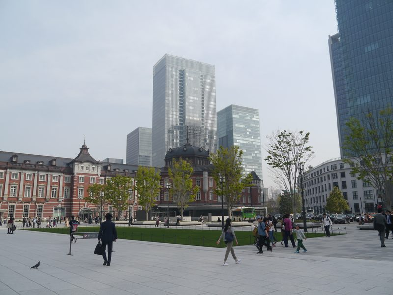

# **🇯🇵 2026 東京 6天5夜親子自由行**

## **👨‍👩‍👧‍👦 旅遊成員**

> * 我/ 父親/ 母親/ 女兒（9歲，150cm）/兒子（7歲，130cm）

## **✈️ 航班與機場接送資訊**

> * **去程航班**：CI220 松山(TSA) → 羽田(HND) 09:00－13:10  
> * **回程航班**：CI221 羽田(HND) → 松山(TSA) 14:30－16:55  
> * 🚗 **專車機場接送**：
>   * **去程送機**：Day 1（8/20）**05:30** 專車司機至竹東住家接送前往台北松山機場 (TSA)。
>   * **回程接機**：Day 6（8/25）班機抵達松山機場（預計 16:55 降落通關），專車接機送回竹東住家。

## **🏨 住宿資訊**

[**海茵娜酒店东京浅草桥 (変なホテル東京 浅草橋)**](https://www.google.com/maps/search/?api=1&query=35.6970775,139.7847605&query_place_id=ChIJRWR7EbKOGGARUkONjElltUA) (住宿 5 晚)

地址：1-10-5 Asakusabashi, Taito-ku, Tokyo 111-0053, JAPAN

## **💡 新手交通與搭車重要提醒**

> * 認顏色與月台比認日文快： 東京的 JR 線路都有專屬代表色。在車站搭車時，請認明「月台編號」與「車輛顏色」（例如：中央・總武線 \= 黃色列車、山手線 \= 綠色列車）。這比辨識複雜的日文漢字更直覺，最不容易坐錯方向。  
> * 🛗 大行李垂直動線規範（重要）： **Day 1（抵達）與 Day 6（返程）進出淺草橋站務必走「A1 出口無障礙電梯」**。其餘出口（A2/A3/A4）皆為純樓梯，切勿扛大行李走純階梯。
> * ⚠️ 純樓梯警示原則： 平日遊玩出入站以手扶梯為主；若規劃出口為純樓梯，行程中均已加註「純樓梯階數警示」與「手扶梯/電梯替代出口」。
> * 下載 App 協同輔助： 手機請先下載「乘車案內」App，或在進站時搭配「Google Maps」確認即時的月台與發車時間。  
> * 注意閘門內外（Day 3 關鍵）： 在 Day 3 東京車站跨越東西側時，必須走閘門外的「自由通路」（如北地下自由通路），切勿誤刷 Suica 進站。  
> * 善用飯店地利之便： 淺草橋站同時擁有 JR 中央・總武線與都營淺草線，前往淺草、晴空塔、羽田機場皆可直達。

## **📋 行程總覽與檢視 (Review)**

### **1\. 全程景點概覽**

| 天數 | 主行程景點 | 選項 / 備案 |
| :---: | ----- | ----- |
| Day 1 | [Plan A] 秋葉原漫遊 (GiGO/拍貼機/扭蛋) / [Plan B] 新宿東口快閃 (3D巨貓) | 友都八喜 6F 玩具模型展區 (Option) |
| Day 2  (長輩組) | 松坂屋上野店與PARCO_ya、不忍池、清水觀音堂、國立西洋美術館、上野公園噴水廣場 | 上野東照宮、舊岩崎邸庭園 (Option) |
| Day 2  (親子組) | 東京迪士尼樂園 | \- |
| Day 3 | 東京車站一番街、KITTE花園、國立科學博物館、阿美橫丁 | 多慶屋 (備案) |
| Day 4 | 三鷹之森吉卜力美術館、井之頭恩賜公園、吉祥寺商店街 (Loft/無印/大創/SATOU) | 哈莫尼卡橫丁 (Option)、Linde德國麵包 |
| Day 5 | ☀️晴天: 淺草寺/晴空塔/墨田水族館/[Plan A]都廳夜景/[Plan B]晴空街道 | ☔雨天備案: 日本科學未來館、DiverCity、SMALL WORLDS迷你世界 |
| Day 6 | 築地場外市場、羽田機場出境免稅店 | 羽田機場輕食與採買 |

### **2\. 全程餐點概覽**

| 天數 | 主要餐廳 (餐點類別) | 選項 / 備案餐廳 (餐點類別) |
| :---: | ----- | ----- |
| Day 1 | 晚餐: 壽司郎 (迴轉壽司) \[Plan A\] / Gusto (日式平價家庭料理) \[Plan B\] | 晚餐: 丸龜製麵 (烏龍麵) / CoCo壹番屋 (咖哩飯) / LUMINE EST 餐廳街 |
| Day 2  (長輩組) | 午餐: すき家 (牛丼/定食) 晚餐: 名代 宇奈とと (炭烤鰻魚飯) | 午餐: 松坂屋地下美食街 (各式餐盒/便當) 晚餐: 松屋 (牛丼/定食) |
| Day 2  (親子組) | 午餐: 紅心皇后宴會大廳 (主題排餐) 晚餐: 廣場閣樓餐廳 (歐式套餐) / 莎拉奶奶之家餐廳 (歐姆蛋包飯) | 午餐: 廣場閣樓餐廳 (歐式套餐) / 明日樂園舞台餐廳 (漢堡/三明治) 晚餐: 紅連火箭筒餐廳 (披薩/烤餅) |
| Day 3 | 午餐: 天丼てんや (日式天丼/炸蝦蓋飯) 點心: 鴨to蔥拉麵 (拉麵) 晚餐: 街邊小吃 / 彈性輕食 | 午餐: だし茶漬け えん (高湯茶泡飯) / 燕子烤肉漢堡排 晚餐: 吉野家 (牛丼) / 松屋 (牛丼) / 名代 宇奈とと (鰻魚飯) / 拉麵 ろく月 (拉麵) |
| Day 4 | 午餐: 大戶屋 (定食) 晚餐: 串家物語 (炸串) | 午餐: 花丸烏龍麵 (烏龍麵) 晚餐: 花丸烏龍麵 (烏龍麵) / 一風堂 (拉麵) |
| Day 5 | 午餐: 達摩文字燒 (東京下町文字燒/大阪燒) 晚餐: 麥當勞 (美式速食/漢堡) \[Plan A\] / 宮武讚岐烏龍麵 \[Plan B\] | 午餐: 利久牛舌 (碳烤牛舌) / 宮武讚岐烏龍麵 / 一風堂 \[Plan A備案\] 摩斯漢堡 (日式漢堡) \[Plan B備案\] 一風堂 / 松屋 押上店 |
| Day 6 | 早餐: 築地山長 (玉子燒/各式小吃) 午餐: 羽田機場餐廳街 (日式定食/烏龍麵) | 早餐備案: 築地丸武 (玉子燒) / 便利商店輕食 (飯糰/三明治) |

---

## **📅 Day 1（8/20 星期四）：抵達東京 × 秋葉原慢遊**

### **🎯 今日重點**

> * **05:30 專車接送出發**：竹東接送出發前往松山機場。
> * 於羽田機場完成 1 張成人實體 Suica 與 2 張兒童 Welcome Suica 辦理（另 2 位成人已自備 Suica 卡）。  
> * 首日攜帶大行李，淺草橋出站**唯一走 A1 出口無障礙電梯**。
> * 隔天迪士尼，建議盡早回飯店休息。

### **05:30－07:00 🚗 專車送機：竹東出發前往松山機場**

> * **05:30** 預約專車準時至竹東住家接送，全家上車出發前往台北松山機場 (TSA) 國際線航廈（車程約 70～80 分鐘）。  
> * 💡 **出門確認清單**：護照（5人份且有效期限半年以上）、日幣現金、海外信用卡、日本上網網卡/eSIM。

### **07:00－09:00 🛫 松山機場報到與登機**

> * 抵達台北松山機場 1F 國際線大廳，至中華航空櫃台辦理行李託運與劃位領取登機證。  
> * 通過安檢與證照查驗，前往登機門，搭乘 **CI220（09:00 起飛）** 直飛東京羽田機場。

### **13:10－14:10 🛬 抵達羽田機場第 3 航廈**

入境、提領行李、海關（預計 50～60 分鐘）。

* 🛬 **下飛機後動線**：跟著頭頂指標 **「Arrivals / 到着」**、**「Immigration / 入国審査」** 前進即可，先完成入境手續，不需特別找電車方向。
* 🛂 **入境審查**：準備全家 5 人護照及 Visit Japan Web QR Code（若已完成），依工作人員指示排隊通關。
* 🧳 **領取行李**：依電子看板尋找航班 **CI220** 對應之 **「Baggage Claim / 手荷物受取」** 行李轉盤提領行李。

> 📸 【辨識：T3 到達大廳】
> 

* 🛃 **海關檢查**：領完行李後依指標往 **「Customs / 税関」** 完成海關檢查與申報，出閘門正式進入 **T3 2F 到達大廳（Arrival Lobby）**。

> ⚠️ **出關後第一個容易走錯的地方**：
> * 出關後先不要停留逛商店，留在 **2F**（不用先搭電梯上樓）。
> * **先找頭頂大型指標「Railways（鉄道）」** ➔ 再依照 **「Keikyu Line（京急線 - KK16）」** 方向前進。
> * ❌ **請勿走「Tokyo Monorail（東京モノレール）」**（單軌電車只到浜松町，去淺草橋飯店必須轉車 2 次提大行李；京急線才能一車直達淺草橋）。

> 📸 【辨識：鐵路交通方向指標】
> 

---

### **14:10－14:40 ✈️ 機場整備與 Suica 交通卡辦理**

> 📍 **位置說明**：目前位於 **T3 2F 到達大廳**。京急入口、售票機及服務中心皆位於 **2F**，**不用先搭電梯上樓**。

#### 🟢 **Step 1：成人交通卡（1 人購買實體 Suica + 2 人已自備）**
* **已有 2 張成人 Suica**：2 位成人已自備 Suica 卡，可直接於 2F 售票機或便利商店儲值（建議餘額保持 **¥2,000～¥3,000**）。
* **購買 1 張成人實體 Suica**：於 2F 售票機區尋找帶有 **「Suica / きっぷ / Tickets / 自動券売機」** 之機台購買 1 張成人實體 Suica，先儲值 **¥2,000～¥3,000**。

> 📸 【辨識：2F 售票機區】
> 

#### 🔴 **Step 2：小孩（2 人）辦理「兒童 Welcome Suica」**
* 請至 2F 的 **Welcome Suica 專用販售機** 或改札旁的 **[JR EAST Travel Service Center (JR東日本旅行服務中心)](https://www.tokyo-monorail.co.jp/english/haneda-tokyo-access/kokusaisen_bldg/concept.html)** 辦理：
  * 👦👧 **辦卡要點**：
    1. 需出示**兒童本人護照**（出關後護照先不要收進行李箱）。
    2. 每張建議先儲值 **¥2,000～¥3,000**（搭乘電車地鐵自動扣半價兒童票）。
    3. **免 ¥500 押金**，**有效期限為 28 天**（本次 6 天行程完全足夠）。

> 📸 【辨識：Welcome Suica 專用機】
> 

#### 🆘 **Step 3：迷路與求助對策 SOP**
* 📍 服務中心：若現場找不到機台，直接前往 2F 改札旁的 **「JR EAST Travel Service Center」**（營業時間 06:45～20:00）。
* 📱 **溝通小卡（出示手機畫面即可）**：
  * **找京急線**：`Where is the Keikyu Line? / 京急線はどこですか？`
  * **購買兒童卡**：`I'd like to buy two child Welcome Suica cards. / 子供用のWelcome Suicaを買いたいです。`

#### 🚻 **Step 4：辦卡完成後整備**
* 5 張交通卡準備妥當後，於 2F 處理：洗手間、ATM 提款、購買飲料、整理隨身裝備。

---

### **14:40－15:25 🚇 前往飯店**

> * 目標地點：[**海茵娜酒店东京浅草桥 (変なホテル東京 浅草橋)**](https://www.google.com/maps/search/?api=1&query=35.6970775,139.7845347&query_place_id=ChIJ8Y-8_JuOGGAR5e4o-gq0F88)

#### 🚶 **Step 1：前往京急月台**
* 辦好交通卡後，依照現場 **「Keikyu Line（京急線 - KK16）」** 指標前往剪票口：
  * 於 [**京急 羽田機場第3航廈站 (羽田空港第3ターミナル駅)**](https://www.google.com/maps/search/?api=1&query=35.544843,139.768443&query_place_id=ChIJyXG_6pyOGGAR2u4o-gq0F93)（**KK16**） 地下 2 樓改札口感應刷卡進站。
  * 成人：3 位持成人實體 Suica 直接感應刷卡進站。
  * 小孩：2 位持兒童 Welcome Suica 直接感應刷卡進站。
  * **不用另外購買單程車票。**
* ⚠️ 通過剪票口後，搭乘電梯或電扶梯下至地下月台。

> 📸 【辨識：京急線改札口實景】
> 

#### 🚆 **Step 2：搭乘京急直通都營淺草線（一車直達淺草橋）**
* 於 [**京急 羽田機場第3航廈站 (羽田空港第3ターミナル駅)**](https://www.google.com/maps/search/?api=1&query=35.544843,139.768443&query_place_id=ChIJyXG_6pyOGGAR2u4o-gq0F93)（**KK16**） 搭乘 **🔴 京急機場線直通 🌹 都營淺草線（A）** 列車（紅色/玫瑰紅色列車，往 成田空港／青砥／押上 方向），一車直達 [**淺草橋站 (浅草橋駅)**](https://www.google.com/maps/search/?api=1&query=35.6974952,139.7859834&query_place_id=ChIJr-AfyrOOGGARWBazD9OfYeg)（**A16**）（車程約 40-45 分鐘，免提大行李轉乘）。
* 💡 **最簡單判斷法（上車防搭錯）**：
  * ✅ **月台電子看板有「浅草橋（Asakusabashi）」停靠站即可上車**！不需要刻意分辨普通、急行、特急或快特，只要顯示停靠「浅草橋」即為直達車。
  * 若不確定可詢問月台站務人員：`Does this train stop at Asakusabashi? / この電車は浅草橋に停まりますか？`

#### 🛗 **Step 3：淺草橋出站動線（大行李必看）**
* 抵達淺草橋站後，請跟隨無障礙標誌搭電梯至剪票口，並**走「A1 出口（設有直達地面電梯）」**出站。出站後過馬路直行約 95 公尺（約 2 分鐘）即達飯店大門。
* ⚠️ **警告**：A2 出口距離雖近但為「純長樓梯（約 35 階，無手扶梯與電梯）」，攜帶大行李切勿走 A2。

### **15:25－16:20 🏨 飯店 Check-in 與休息**

> * 辦理 Check-in、置放行李、吹冷氣稍作休息、更換輕便服裝。

---

## **⭐ Day 1 Check-in 後動態決策**

### **✅ Plan A（首選推薦：秋葉原漫遊 × 拍貼扭蛋）**

#### **16:20 🚶‍♂️ 前往秋葉原**

> * 16:20 離開飯店 ➔ 慢步 2 分鐘至 [**JR 淺草橋站 (浅草橋駅)**](https://www.google.com/maps/search/?api=1&query=35.6974952,139.7859834&query_place_id=ChIJr-AfyrOOGGARWBazD9OfYeg)（**JB20**）（西口進站有電梯）。  
> * 於 [**JR 淺草橋站 (浅草橋駅)**](https://www.google.com/maps/search/?api=1&query=35.6974952,139.7859834&query_place_id=ChIJr-AfyrOOGGARWBazD9OfYeg)（**JB20**） 1 號月台搭乘 **🟡 JR 中央・總武線（JB）** 往 **秋葉原（Akihabara／JB19）／新宿 方向**，搭乘 **1 站** 至 [**秋葉原站 (秋葉原駅)**](https://www.google.com/maps/search/?api=1&query=35.698383,139.7730717&query_place_id=ChIJKTP54qeOGGARsZf1fyU2jxU)（**JB19**）（車程約 2 分鐘，下一站即為秋葉原，由電氣街口出站即達）。

#### **16:30－16:50 🕹️ 日式夾娃娃機體驗**

> * 目標地點：[**GiGO 秋葉原3號館 (GiGO 秋葉原3号館)**](https://www.google.com/maps/search/?api=1&query=35.6992456,139.7709552&query_place_id=ChIJR-PMBx2MGGARPFrgtULaJB0) (1F/2F 夾娃娃機專區)  
> * **核心體驗（1F/2F）**：專注體驗日式夾娃娃機（UFO Catcher），全家感受秋葉原熱鬧的動漫周邊、人氣公仔與玩偶夾娃娃樂趣。  
> * 💡 **消費預估**：夾娃娃機體驗約 ¥500～¥1,000 / 全家，小試身手體驗日式機台手感即可。  
> * （Option：若想參觀其他樓層大型電玩，3F 為音樂節奏遊戲、7F 為懷舊復古遊戲專區 RETRO:G，可視時間與興趣順路搭手扶梯快閃參觀）。

#### **16:50－17:10 📸 日系拍貼機全家合影體驗**

> * 目標地點：[**日系拍貼機體驗 (Purikura / GiGO 拍貼機專區)**](https://www.google.com/maps/search/?api=1&query=35.6992456,139.7709552&query_place_id=ChIJR-PMBx2MGGARPFrgtULaJB0) (GiGO 秋葉原3號館 2F 拍貼機專區 / 或下一站 namco 3F)
> * **全家合影紀念**：走進日本最新的「大眼美肌拍貼機 (プリクラ)」，全家 5 人一起拍下東京自由行第一天的開場全家福！  
> * **趣味塗鴉**：拍攝後在觸控螢幕上自由畫畫、寫上「2026.8.20 東京家族旅行 初日紀念！」、加上可愛動漫貼圖。  
> * **現場取件**：當場印出全彩分割貼紙，每人分一張貼在手帳或護照套上；還可手機掃描下載高畫質電子照片留念。  
> * 💡 **消費預估**：每次固定為 **¥500**（約台幣 105 元，極具紀念價值）。

#### **17:10－17:30 🪙 萬代官方扭蛋體驗**

> * 目標地點：[**萬代扭蛋百貨店 秋葉原店 (ガシャポンのデパート 秋葉原店)**](https://www.google.com/maps/search/?api=1&query=35.6996473,139.7713703&query_place_id=ChIJzdWdgh2MGGARh4kg2pVZL3c) (いちご秋葉原駅前ビル 4F / namco 4F)
> * 前往全秋葉原規模最大之一的官方扭蛋專門店，擁有近千台最新動漫、寶可夢、迪士尼、可愛動物與微縮模型扭蛋機。  
> * 館內冷氣充足、動線好逛，每位小朋友選扭 1～2 顆喜愛的扭蛋作為開場禮物。  
> * 💡 **消費預估**：每顆約 ¥300～¥500，預算約 ¥600～¥1,000 / 2 位小孩。  
> * （Option：若想參觀大型玩具模型展區，可順路快閃 [友都八喜 (ヨドバシカメラ マルチメディアAkiba)](https://www.google.com/maps/search/?api=1&query=35.698917,139.774798&query_place_id=ChIJGU_M2aeOGGARdnOLcMYXuXs) (6F 玩具模型展區) 欣賞展示模型）。

#### **17:30－19:00 🍽️ 晚餐：壽司郎**

> * 首選餐廳：[**壽司郎 (スシロー 秋葉原駅前店)**](https://www.google.com/maps/search/?api=1&query=35.698736,139.77189&query_place_id=ChIJMfORxzyNGGARskRptNTnsVE) (BiTO AKIBA B1F) 享用平價迴轉壽司（推薦：鮭魚三貫、鮪魚泥海苔包、炸蝦天婦羅壽司、茶碗蒸、酥脆薯條、甜點百匯），人均約 ¥1,000～¥1,800。  
>   * 💡 **點餐與用餐祕訣（全繁體中文平板）**：  
>     1. **免排隊時段**：17:30 入座剛好避開晚間 18:30 後的下班人潮，迅速入座免久候。  
>     2. **零語言壓力**：桌上設有繁體中文觸控平板，小孩可自己點選喜歡的壽司、熟食與甜點，現點現做由軌道極速直送。  
>     3. **90 分鐘寬裕時間**：長輩慢慢喝熱茶品嚐鮮魚握壽司，全家無壓力享受第一晚的日式美食！  
> * 備案餐廳 1：[**丸龜製麵 (丸亀製麺 秋葉原店)**](https://www.google.com/maps/search/?api=1&query=35.6984426,139.7724317&query_place_id=ChIJFa5T2GqNGGARmSiHDgcJFf8) (アトレ秋葉原1 1F) 享用讚岐烏龍麵（推薦：豚骨烏龍麵、炸天婦羅），人均約 ¥500～¥900。  
>   * 💡 **點餐祕訣**：拿托盤 ➔ 向廚師手指照片點麵（說 "Hot/Cold"、"Regular"）➔ 自己夾炸物 ➔ 結帳 ➔ 免費自助加蔥花與天婦羅酥。  
> * 備案餐廳 2：[**CoCo壹番屋 (CoCo壱番屋 JR秋葉原駅昭和通り口店)**](https://www.google.com/maps/search/?api=1&query=35.6984515,139.7757913&query_place_id=ChIJ8Y-8_JuOGGAR5e4o-gq0F96) (渡辺ビル 1F) 享用日式咖哩（推薦：炸豬排咖哩、兒童咖哩套餐），人均約 ¥800～¥1,200。

#### **19:00－19:15 🚆 返回淺草橋**

> * 從秋葉原商圈步行至 [**JR 秋葉原站 (秋葉原駅)**](https://www.google.com/maps/search/?api=1&query=35.698383,139.7730717&query_place_id=ChIJKTP54qeOGGARsZf1fyU2jxU)（**JB19**） 電氣街口或中央口進站。
> * 於 [**JR 秋葉原站 (秋葉原駅)**](https://www.google.com/maps/search/?api=1&query=35.698383,139.7730717&query_place_id=ChIJKTP54qeOGGARsZf1fyU2jxU)（**JB19**） 6 號月台搭乘 **🟡 JR 中央・總武線（JB）** 往 **千葉（Chiba／JB39） 方向**，搭乘 **1 站** 直達 [**淺草橋站 (浅草橋駅)**](https://www.google.com/maps/search/?api=1&query=35.6974952,139.7859834&query_place_id=ChIJr-AfyrOOGGARWBazD9OfYeg)（**JB20**）（車程約 2 分鐘，下一站即為淺草橋）。
> * 由 **「東口（East Exit）」** 出站，步行約 2 分鐘前往超市採買。

### **✅ Plan B（備案：新宿 3D 巨貓）**

#### **16:30－17:15 🚇 前往新宿東口**

> * 16:30 離開飯店 ➔ 慢步約 2 分鐘至 [**JR 淺草橋站 (浅草橋駅)**](https://www.google.com/maps/search/?api=1&query=35.6974952,139.7859834&query_place_id=ChIJr-AfyrOOGGARWBazD9OfYeg)（**JB20**） 1 號月台進站。  
> * 於 [**JR 淺草橋站 (浅草橋駅)**](https://www.google.com/maps/search/?api=1&query=35.6974952,139.7859834&query_place_id=ChIJr-AfyrOOGGARWBazD9OfYeg)（**JB20**） 搭乘 **🟡 JR 中央・總武線（JB）** 往 **新宿（JB10）／三鷹 方向**，搭乘 **2 站** 至 御茶之水站（JB18）（車程約 4 分鐘）。  
> * 於 **御茶之水站（JC03）** **不用出站**，於同月台對面直接平行轉乘 **🟠 JR 中央線快速（JC）** 往 **新宿（Shinjuku／JC05）／高尾 方向**，搭乘 **4 站** 直達 [**新宿站 (新宿駅)**](https://www.google.com/maps/search/?api=1&query=35.6895924,139.7004128&query_place_id=ChIJ126rX_uLGGARvj7L442E6p0)（**JC05**）（車程約 9 分鐘，總車程約 18 分鐘，在冷氣車廂內坐著休息補眠）。  
> * 抵達新宿站後不趕時間，跟隨 **「東口（East Exit）」** 黃色指標走地下通道出站（步行約 5-8 分鐘）。

#### **17:15－17:40 🐈 欣賞新宿 3D 巨貓**

> * 目標地點：[**Cross Shinjuku 3D 巨貓 (クロス新宿ビジョン)**](https://www.google.com/maps/search/?api=1&query=35.6926882,139.7008265&query_place_id=ChIJrwWR35uNGGARG7Svj20aEfM)
> * **亮點特色**：從新宿東口一出站，在站前廣場抬頭即可看見生動逼真、會發出叫聲的超巨大 3D 三花貓！  
> * **安心觀賞**：東口廣場空間開闊平坦，全家安心站在廣場欣賞巨貓每隔數分鐘的趣味 3D 演出（打哈欠、伸懶腰、睡覺、跳出來打招呼），同時感受新宿繁華璀璨的街景，完全不需要走進複雜巷弄。

#### **17:40－18:35 🍽️ 晚餐：Gusto 家庭餐廳**

> * 首選餐廳：[**Gusto (ガスト 新宿NOWAビル店)**](https://www.google.com/maps/search/?api=1&query=35.6903733,139.7013626&query_place_id=ChIJFUOWQQCNGGARHkjPPx28PfI) (新宿NOWAビル 7F) 享用平價日式家庭料理（推薦：起司流心漢堡排、炸豬排定食、兒童咖哩/鬆餅餐），人均約 ¥800～¥1,200。  
>   * 親子優勢：店內座位寬敞舒適、全中文平板點餐、出餐極快，還有超人氣「貓咪送餐機器人」穿梭送餐，小朋友互動超開心！  
> * 備案餐廳：[**LUMINE EST 餐廳街 (ルミネエスト新宿 7&8 DINER)**](https://www.google.com/maps/search/?api=1&query=35.6912505,139.7011419&query_place_id=ChIJ_TibA9qMGGARNYmVIFyGU9k) (東口車站直結 7F/8F) 享用日式洋食/定食/蛋包飯（推薦：オムライス 卵と私、洋食亭ブラームス），人均約 ¥1,300～¥2,000。  
>   * 動線優勢：就在東口車站正上方，直接搭電梯上樓吹冷氣用餐，吃完搭電梯下樓直接進站搭車，最省力。

#### **18:35－19:15 🚆 返回淺草橋**

> * 於 [**JR 新宿站 (新宿駅)**](https://www.google.com/maps/search/?api=1&query=35.6895924,139.7004128&query_place_id=ChIJ126rX_uLGGARvj7L442E6p0)（**JC05**） 7/8 號月台搭乘 **🟠 JR 中央線快速（JC）** 往 **東京（Tokyo／JC01） 方向**，搭乘 **4 站** 至 御茶之水站（JC03）（車程約 9 分鐘）。
> * 於 **御茶之水站（JB18）** **不用出站**，於同月台對面直接平行轉乘 **🟡 JR 中央・總武線（JB）** 往 **千葉（Chiba／JB39） 方向**，搭乘 **2 站** 直達 [**淺草橋站 (浅草橋駅)**](https://www.google.com/maps/search/?api=1&query=35.6974952,139.7859834&query_place_id=ChIJr-AfyrOOGGARWBazD9OfYeg)（**JB20**）（車程約 4 分鐘）。由 東口 出站步行前往超市採買。
> * 💡 此時段剛好稍微避開晚間下班尖峰，電車平穩舒適。

---

### **🛒 共同收尾行程（Plan A / Plan B 適用）**

#### **19:15－19:35 🛒 生鮮超市採買**

> * 返回淺草橋站出站後，慢步 2 分鐘順路前往 [**肉之Hanamasa超市 (肉のハナマサ 浅草橋店)**](https://www.google.com/maps/search/?api=1&query=35.6966953,139.7840376&query_place_id=ChIJS7K2bLKOGGARGySfwejBx4o) 採買：明日早餐鮮乳、麵包、優格、礦泉水與當季水果（比超商更經濟實惠）。

#### **19:40 🏨 回飯店休息**

> * 19:40 已完成超市採買並回到海茵娜酒店。  
> * 整理明日迪士尼裝備：門票 QR Code、Welcome Suica 卡、行動電源、防曬用品、帽子、小毛巾。  
> * 全家輪流洗澡泡澡放鬆。

#### **21:00－21:30 🛌 準時就寢**

> * 最晚於 21:30 前入睡，隔天 06:20 起床，獲得完整 9 小時充足睡眠，全家精力充沛迎戰東京迪士尼！

---

## **📅 Day 2（8/21 星期五）：雙線交織 - 上野漫遊 (長輩組)**

### **08:20－09:00 🍳 早餐**

起床梳洗吃早餐，準備 09:00 出發。

### **09:00－09:20 🚇 前往上野御徒町**

> * 從飯店步行約 2 分鐘至 [**JR 淺草橋站 (浅草橋駅)**](https://www.google.com/maps/search/?api=1&query=35.6974952,139.7859834&query_place_id=ChIJr-AfyrOOGGARWBazD9OfYeg)（**JB20**） 東口進站。
> * 於 [**JR 淺草橋站 (浅草橋駅)**](https://www.google.com/maps/search/?api=1&query=35.6974952,139.7859834&query_place_id=ChIJr-AfyrOOGGARWBazD9OfYeg)（**JB20**） 1 號月台搭乘 **🟡 JR 中央・總武線（JB）** 往 **秋葉原（Akihabara／JB19）／新宿 方向**，搭乘 **1 站** 直達 [**秋葉原站 (秋葉原駅)**](https://www.google.com/maps/search/?api=1&query=35.698383,139.7730717&query_place_id=ChIJKTP54qeOGGARsZf1fyU2jxU)（車程僅 2 分鐘）。

> 📸 【辨識：秋葉原站轉乘指標（最重要）】
> 
> 
> * ✔ **請認準頭頂綠藍雙色指標**：
>   * 🟢 **山手線 (JY)**
>   * 🔵 **京濱東北線 (JK)**
>   * 標註 **「for Ueno & Omiya（往上野、大宮）」**
>   * 看到此指標即可順著階梯/電扶梯往下走至月台，表示方向正確。

> * 於秋葉原站 **不用出站**，跟隨指標下樓至月台：
>   * ⚠️ **月台方向確認**：請認明月台指標目的地方向為「**上野 (Ueno) ／ 池袋 (Ikebukuro) ／ 大宮 (Omiya)**」，看到這三個站名即代表方向正確；**若看到「東京 (Tokyo) ／ 品川 (Shinagawa)」請切勿搭乘，那是反方向**。
> * 搭乘 **JR 山手線 (綠色列車)** 或 **JR 京濱東北線 (水藍色列車)** 1 站直達 [**御徒町站 (御徒町駅)**](https://www.google.com/maps/search/?api=1&query=35.7075185,139.7748564&query_place_id=ChIJc-deL6COGGARRENyB-YX2eI)（車程約 2 分鐘）。
> * 🚶‍♂️ **出站動線**：於 **「御徒町站北口（North Exit）」** 出站，過馬路即直接抵達百貨公司 [**松坂屋 (松坂屋 上野店)**](https://www.google.com/maps/search/?api=1&query=35.707472,139.773395&query_place_id=ChIJo3tx-Z-OGGARmtgBAh8wp8o) 與 [**PARCO_ya (PARCO_ya 上野)**](https://www.google.com/maps/search/?api=1&query=35.7068605,139.7731332&query_place_id=ChIJsW9uBKCOGGAR3hWpxKX-ag0)。

---

### **☀️ 晴天首選方案：上野慢活湖畔與藝術散策**

#### **09:20－10:20 🌿 晨間不忍池與清水觀音堂散步**

> * 趁著早晨陽光尚未炙熱，散步前往鄰近的不忍池與清水觀音堂：  
>   * [**不忍池 (不忍池 弁天堂)**](https://www.google.com/maps/search/?api=1&query=35.7122453,139.7709849&query_place_id=ChIJz-n2a5yOGGARkO91888iW-Q)：欣賞夏日滿池盛開的荷花與湖中弁天堂，步道平緩好走，晨風涼爽宜人。  
>   * [**清水觀音堂 (清水観音堂)**](https://www.google.com/maps/search/?api=1&query=35.7126261,139.7735391&query_place_id=ChIJqZzHZZyOGGARkQYqM_0g4r8)：仿京都清水寺的紅色舞台建築，於樹蔭高台俯瞰不忍池與著名的「月之松」。  
>   * 🍪 **順路名產**：回程順道步行至 [**兔屋 (うさぎや)**](https://www.google.com/maps/search/?api=1&query=35.7061495,139.7725974&query_place_id=ChIJp0K6QVOLGGARzD9G_rV4j07) 購買全東京排名前三的現做百年熱騰騰銅鑼燒，帶至咖啡廳享用。

#### **10:20－11:30 ☕ 室內基地營避暑**

> * 10:00 百貨營業，兩人先至基地營咖啡廳會合歇腳，吹冷氣避開逐漸升高的氣溫：  
>   * 首選基地營：[**DEAN & DELUCA CAFE (DEAN & DELUCA CAFE パルコヤ上野)**](https://www.google.com/maps/search/?api=1&query=35.7068605,139.7733596&query_place_id=ChIJYw_RZZyOGGARkQYqM_0g4r8) (PARCO_ya 1F，座位舒適好找）。  
>     * 💡 **長輩點餐祕訣**：櫃台有大字菜單，手指照片說 "Hot Coffee" 或 "Latte"，手指玻璃櫃裡的點心即可。  
>   * 備案基地營：[**喫茶 Tricolore (喫茶トリコロール 松坂屋上野店)**](https://www.google.com/maps/search/?api=1&query=35.7078274,139.7733596&query_place_id=ChIJp0K6QVOLGGARzD9G_rV4j0s) (松坂屋本館 4F，復古日式優雅咖啡廳）。  
>     * 💡 **長輩點餐祕訣**：入座後服務生送上彩色大圖菜單，手指熱咖啡與招牌復古布丁即可。  
> * **室內自由活動**：可在咖啡廳悠閒品嚐咖啡與銅鑼燒，或逛松坂屋上野店地下美食街、書店與 PARCO_ya 精緻商場。

#### **11:30－12:45 🍽️ 午餐：すき家**

> * 於約定地點會合。  
> * 首選餐廳：[**すき家 (すき家 上野三丁目店)**](https://www.google.com/maps/search/?api=1&query=35.7060633,139.772478&query_place_id=ChIJ87mm5h-MGGARngNQHoLCi8k) (松坂屋正對面，中央通旁) 享用日式定食與丼飯（推薦：牛鮭定食［燒肉+煎鮭魚雙拼］、滑蛋牛肉丼、秋葵牛肉丼），人均約 ¥550～¥850。  
>   * 💡 **長輩點餐與付款祕訣（繁體中文平板）**：  
>     1. 入座後，桌上設有觸控平板，點選螢幕右上角切換至「繁體中文」。  
>     2. 螢幕上有大彩色照片，直接觸控點選喜歡的餐點（如牛鮭定食、牛丼套餐），按「確認點餐」。  
>     3. 店員送餐時會附上一張結帳單，吃飽後拿著結帳單到門口櫃台，可在自動收銀機直接投入日幣紙鈔/硬幣，或感應 Suica 卡付款找零，全程零溝通壓力！  
> * 備案餐廳：[**松坂屋地下美食街 (松坂屋上野店 ほっぺタウン)**](https://www.google.com/maps/search/?api=1&query=35.707472,139.773395&query_place_id=ChIJo3tx-Z-OGGARmtgBAh8wp8o) (本館 B1F) 挑選各式日式名店外帶便當（人均約 ¥650～¥1,100）。  
>   * 💡 **長輩購買、座位與付款祕訣**：  
>     1. 玻璃櫃內擺滿實體日式便當（如和牛便當、鰻魚飯盒、炸天婦羅拼盤），看中哪個直接**用手指比便當實物與數量**。  
>     2. 櫃台結帳時直接以現金或感應 Suica 卡付款。  
>     3. 松坂屋 B1F/各樓層設有顧客休息座位區（亦可搭電梯至 7F/頂樓空中庭園休息座椅區）吹冷氣舒適坐著享用。  
> * 建議 11:30 準時入座，免排隊享受悠閒午餐時光。

#### **13:00－15:30 🏛️ 參觀國立西洋美術館**

> * ☀️ **正午避暑策略**：13:00~15:30 是一天中最炎熱時段，由松坂屋步行 5 分鐘穿越公園林蔭，進入世界文化遺產 [**國立西洋美術館 (国立西洋美術館)**](https://www.google.com/maps/search/?api=1&query=35.7153869,139.7758145&query_place_id=ChIJl1155pyOGGAR23aZpC-Y27A) 參觀室內常設展。  
>   * 💡 **長輩專屬優惠與免費入場方式**：
>     * **官方規定**：**滿 65 歲以上長者參觀常設展「完全免費」**（一般成人票價 ¥500；特別展除外）。
>     * **入場方式**：入館前至**售票窗口（券売窓口）**向工作人員**出示護照（確認年齡滿 65 歲）**，即可直接領取「免費常設展入場券（無料観覧券）」，憑券驗票進場。
>   * **參觀亮點**：館內冷氣充足、座位長椅極多、動線寬敞平順；館藏莫內《睡蓮》真跡、雷諾瓦名畫與大師雕塑，兼具頂級藝術饗宴與避暑歇腳。  
>   * （若室內悠閒組長輩不想看展，亦可繼續留於松坂屋/PARCO_ya 吹冷氣逛街休息）。

#### **15:30－16:45 🌳 傍晚噴水廣場林蔭散步**

> * 參觀完美術館後，陽光已大幅減弱，於周邊林蔭漫步：  
>   * **西洋美術館戶外庭園**：免費近距離欣賞羅丹世界名作「地獄之門」與「沉思者」青銅雕塑。  
>   * [**東京文化會館 (東京文化会館)**](https://www.google.com/maps/search/?api=1&query=35.7144707,139.7751315&query_place_id=ChIJyXG_6pyOGGAR2u4o-gq0F88)：欣賞經典現代主義音樂廳建築。  
>   * [**上野公園大噴水廣場 (上野恩賜公園 大噴水)**](https://www.google.com/maps/search/?api=1&query=35.7147557,139.7745778&query_place_id=ChIJqZzHZZyOGGARkQYqM_0g4rA)：於綠蔭長椅上坐著吹微風、看噴泉放鬆。  
> * 漫步走回松坂屋上野店/御徒町。

---

☔ 雨天備案：全室內文化藝術與百貨散策（點擊展開）

#### **09:20－11:20 🏛️ 參觀東京國立博物館本館常設展**

> * 目標地點：[**東京國立博物館 (東京国立博物館)**](https://www.google.com/maps/search/?api=1&query=35.719056,139.77667&query_place_id=ChIJV-u30l2OGGAR55t616_o1sA)
> * 🚶‍♂️ **雨天動線**：由御徒町站/松坂屋步行前往上野恩賜公園北側的東京國立博物館（日本歷史最悠久、規模最大的博物館）。
> * 💡 **長輩專屬優惠與免費入場方式**：
>   * **官方規定**：**滿 70 歲以上長者參觀「綜合文化展（本館常設展）」完全免費**（一般成人票價 ¥1,000；特別展除外）。
>   * **入場方式**：前往**正門售票處窗口（正門チケット売場 窓口）**向工作人員**出示護照（確認年齡滿 70 歲）**，即可直接領取「免費入場券（無料観覧券）」或依工作人員指引由專用通道驗票免費進場。
> * **參觀亮點與無障礙**：
>   * 本館為經典「帝冠樣式」國家重要文化財建築，室內空間宏偉開闊、冷氣涼爽、長椅極多且設有無障礙電梯。
>   * 悠閒參觀 1F/2F 日本古代文物精華：武士刀劍、佛像雕刻、國寶浮世繪、蒔繪漆器與和風屏風畫，全程室內平坦好走、免受風雨影響。

#### **11:20－13:00 ☕🍽️ 松坂屋／PARCO_ya 百貨室內休息與午餐**

> * 慢步走回松坂屋上野店與 PARCO_ya（兩棟全室內連通）：
> * ☕ **室內基地營歇腳**：前往 [**喫茶 Tricolore (喫茶トリコロール 松坂屋上野店)**](https://www.google.com/maps/search/?api=1&query=35.7078274,139.7733596&query_place_id=ChIJp0K6QVOLGGARzD9G_rV4j0s) (松坂屋 4F) 或 [**DEAN & DELUCA CAFE (DEAN & DELUCA CAFE パルコヤ上野)**](https://www.google.com/maps/search/?api=1&query=35.7068605,139.7733596&query_place_id=ChIJYw_RZZyOGGARkQYqM_0g4r8) (PARCO_ya 1F) 喝熱茶/手沖咖啡，舒服坐著休息。
> * 🍽️ **午餐享用**：至松坂屋正對面 [**すき家 (すき家 上野三丁目店)**](https://www.google.com/maps/search/?api=1&query=35.7060633,139.772478&query_place_id=ChIJ87mm5h-MGGARngNQHoLCi8k) 享用熱騰騰牛鮭定食，或於 [**松坂屋地下美食街 (松坂屋上野店 ほっぺタウン)**](https://www.google.com/maps/search/?api=1&query=35.707472,139.773395&query_place_id=ChIJo3tx-Z-OGGARmtgBAh8wp8o) 挑選精緻便當於館內休息區享用。

#### **13:00－15:30 🏛️ 參觀國立西洋美術館室內常設展**

> * 目標地點：[**國立西洋美術館 (国立西洋美術館)**](https://www.google.com/maps/search/?api=1&query=35.7153869,139.7758145&query_place_id=ChIJl1155pyOGGAR23aZpC-Y27A)
> * 💡 **長輩專屬優惠與免費入場方式**：
>   * **官方規定**：**滿 65 歲以上長者參觀常設展「完全免費」**。
>   * **入場方式**：入館前至**售票窗口（券売窓口）**向工作人員**出示護照（確認年齡滿 65 歲）**領取免費入場券進場。
> * **參觀亮點**：雨天進入世界文化遺產室內展廳，欣賞莫內《睡蓮》、雷諾瓦與大師名畫，全館無障礙平坦舒適。

#### **15:30－16:45 🛍️ 館內休息與松坂屋／PARCO_ya 室內逛街**

> * 參觀後若戶外雨勢持續，可於西洋美術館內咖啡廳歇腳，或返回松坂屋上野店與 PARCO_ya 逛地下美食街伴手禮、日式工藝品專櫃與書店，全程室內乾爽不濕鞋。

---

### **17:00－18:00 🍽️ 晚餐：宇奈とと鰻魚飯**

> * 於約定地點會合。  
> * 首選餐廳：[**名代 宇奈とと (名代 宇奈とと 上野店)**](https://www.google.com/maps/search/?api=1&query=35.7111357,139.7748663&query_place_id=ChIJ6RMcXZ6OGGARLLk8PdeakXs) 享用炭火現烤平價鰻魚飯（人均約 ¥640～¥1,100）。（[📄 點此看彩色菜單照片](https://lh3.googleusercontent.com/gps-cs-s/AHRPTWkClwNYLjKkY9Yq3zdrKmYer9-i4sd-Dfoe7MrBF_E9Pmu6bZnkb78va0NJUKlYzWuGogIqP4gPLT8fvfqwv4sM6CT5L8IMPPEEAfQZt_cVm00WiqkgT7CwRQGH74Y-37QJ_6jQqcjVx3U=s680-w680-h510-rw)）  
>   * 💡 **長輩點餐與付款祕訣**：  
>     1. 入座後翻開彩色大圖菜單，直接用手指照片上的「**うな丼 (平價鰻魚丼 ¥640)**」或「**うな重 (厚切大片鰻魚重 ¥1,100)**」比數量即可！  
>     2. 炭火現點現烤香氣十足，出餐快速。吃飽後拿著桌上的結帳單到門口櫃台，以現金或感應 Suica 卡付款即可。  
> * 備案餐廳：步行至 JR 御徒町站旁的 [**松屋 (松屋 上野店)**](https://www.google.com/maps/search/?api=1&query=35.710037,139.773889&query_place_id=ChIJZ44cNJ6OGGAR5MROF68O1B0) (御徒町北口) 享用平價日式快餐（人均約 ¥500～¥900）。  
>   * 💡 **長輩點餐與付款祕訣（全繁體中文自動售票機）**：  
>     1. 進店門口就是自動點餐機，直接點螢幕右上角「繁體中文」按鈕。  
>     2. 全中文圖文觸控點選喜歡的餐點（推薦：牛燒肉定食、牛丼）。  
>     3. 在機台直接投入日幣紙鈔或感應 Suica 卡付款，機器會自動找零並印出餐券。  
>     4. 拿餐券入座等候店內螢幕叫號或店員送餐，全程 100% 零語言障礙！

### **18:10－18:30 🚆 返回淺草橋**

> * 從 [**松坂屋上野店 (松坂屋 上野店)**](https://www.google.com/maps/search/?api=1&query=35.707472,139.773395&query_place_id=ChIJo3tx-Z-OGGARmtgBAh8wp8o) 步行約 2 分鐘至 [**JR 御徒町站 (御徒町駅)**](https://www.google.com/maps/search/?api=1&query=35.7075185,139.7748564&query_place_id=ChIJc-deL6COGGARRENyB-YX2eI)（**JY04**） 北口進站。
> * 於 [**JR 御徒町站 (御徒町駅)**](https://www.google.com/maps/search/?api=1&query=35.7075185,139.7748564&query_place_id=ChIJc-deL6COGGARRENyB-YX2eI)（**JY04**） 進站後前往 **🟢 JR 山手線（JY）** 月台：
>   * ⚠️ **月台方向確認**：請認明月台指標目的地方向為「**東京 (Tokyo) ／ 品川 (Shinagawa)**」，看到這兩個站名即代表方向正確。
>   * 💡 **搭車防呆判斷**：搭車後下一站應為「**秋葉原 (Akihabara)**」，若列車下一站顯示「上野 (Ueno)」表示搭錯方向，請立即下車至對面月台改搭反方向列車。
> * 搭乘 **JR 山手線 (綠色列車)** 1 站至 [**秋葉原站 (秋葉原駅)**](https://www.google.com/maps/search/?api=1&query=35.698383,139.7730717&query_place_id=ChIJKTP54qeOGGARsZf1fyU2jxU)。

> 📸 【辨識：秋葉原站轉乘指標（最重要）】
> 
> 
> * ✔ **請認準頭頂黃色指標**：
>   * 🟡 **JR 中央・總武線 (JB)**
>   * **6 號月台 (Platform 6)**
>   * 標註 **「for Chiba（千葉）」**
>   * 看到 **Chiba（千葉）** 即代表方向正確，搭乘手扶梯/電梯上至 5F 總武線 6 號月台。

> * 於秋葉原站 6 號月台搭乘 **JR 中央・總武線 (黃色列車，往千葉方向)**：
>   * 💡 **搭車防呆判斷**：搭車後下一站應為「**淺草橋 (Asakusabashi)**」，若列車下一站顯示「御茶之水 (Ochanomizu)」表示搭錯方向，請立即下車改搭反方向列車。
> * 搭車 1 站直達 [**淺草橋站 (浅草橋駅)**](https://www.google.com/maps/search/?api=1&query=35.6974952,139.7859834&query_place_id=ChIJr-AfyrOOGGARWBazD9OfYeg)，出站步行回飯店休息（全程約 10 分鐘）。
> * 💡 **長輩防迷路問路小卡**：若一時找不到方向，可直接向站務人員詢問：
>   * **"Akihabara?"**（要去秋葉原）
>   * **"Chiba platform?"**（請問往千葉方向月台）

---

## **📅 Day 2（8/21 星期五）：雙線交織 \- 迪士尼夢幻 (親子組)**

### **07:10－07:50 🍳 早餐**

起床梳洗吃早餐。

### **07:50－08:45 🚆 前往東京迪士尼樂園**

> * 目標地點：[**秋葉原站 (秋葉原駅)**](https://www.google.com/maps/search/?api=1&query=35.698383,139.7730717&query_place_id=ChIJKTP54qeOGGARsZf1fyU2jxU)
> * **07:50－08:00 總武線移動**：於 [**JR 淺草橋站 (浅草橋駅)**](https://www.google.com/maps/search/?api=1&query=35.6974952,139.7859834&query_place_id=ChIJr-AfyrOOGGARWBazD9OfYeg)（**JB20**） 搭乘 **🟡 JR 中央・總武線（JB）** 往 **秋葉原（Akihabara／JB19）／新宿 方向**，搭乘 **1 站** 至 [**秋葉原站 (秋葉原駅)**](https://www.google.com/maps/search/?api=1&query=35.698383,139.7730717&query_place_id=ChIJKTP54qeOGGARsZf1fyU2jxU)（**JB19**）（車程約 2 分鐘，下一站即為秋葉原）。
> * **08:00－08:12 日比谷線移動**：由昭和通り口閘門出站，依指標轉乘 **⚪ 東京 Metro 日比谷線（H） 秋葉原站（H16）**，搭乘往 **中目黑（Naka-meguro／H01） 方向** 列車，搭乘 **4 站** 至 八丁堀站（H12）（車程約 7 分鐘）。
> * **08:12－08:25 地下通道轉乘**：抵達 **八丁堀站（H12）** 後，跟隨 **🔴 JR 京葉線（JE）** 指標，經地下聯絡通道（設有手扶梯與無障礙坡道，全程免出地面吹冷氣）轉乘 **JR 八丁堀站（JE02）**。（此站轉乘結構單純直線，比東京車站輕鬆太多，極適合牽小孩移動）。
> * **08:25－08:37 京葉線直達**：於 **JR 八丁堀站（JE02）** 搭乘 **🔴 JR 京葉線（JE）** 往 **舞濱（Maihama／JE07）／蘇我（Soga／JE18） 方向**，搭乘 **5 站** 直達 [**舞濱站 (舞浜駅)**](https://www.google.com/maps/search/?api=1&query=35.6361543,139.8838749&query_place_id=ChIJU8HXjRF9GGARwy_hGqDRvhE)（**JE07**）（車程約 12 分鐘）。
> * **08:37－08:45 抵達出站**：於 **舞濱站（JE07）** 由 **「南口（South Exit）」** 出站（設有無障礙斜坡與手扶梯），順著右前方行人專用天橋步行約 5 分鐘即可抵達 [**東京迪士尼樂園 (東京ディズニーランド)**](https://www.google.com/maps/search/?api=1&query=35.6328964,139.8803943&query_place_id=ChIJszdHEQN9GGARy9MJ1TY22eQ) 正門。

### **08:45 🏰 抵達樂園入園**

先不急著拍照，直接排隊等開園。一刷卡入園立刻打開 Tokyo Disney Resort 官方 App：
1. **設施預約**：購買 Disney Premier Access (DPA) 或領取免費 Priority Pass (PP)。
2. **餐廳點餐（關鍵防排隊）**：立刻使用 **「Disney Mobile Order (手機點餐)」** 預選今日午餐（約 11:30）與晚餐（約 18:00）的餐廳與取餐時段，時間一到直接走專用通道領餐入座，免受正午排隊日曬之苦！

### **🎢 暢玩熱門遊樂設施**

> * 第一站（必玩）： 美女與野獸：魔法物語(美女と野獣“魔法のものがたり”) (建議直上 DPA)  
> * 第二站： 小熊維尼獵蜜記(プーさんのハニーハント) (經典必玩)  
> * 第三站： 巨雷山(ビッグサンダー・マウンテン) (130cm 可搭，刺激度剛好)  
> * 穿插行程： 灰姑娘城堡(シンデレラ城)拍照、買爆米花

### **11:45 🍽️ 午餐：園區主題餐廳**

> * 💡 **海外遊客雙重預約策略（免日本門號）**：  
>   * **策略 A（出發前 1 個月搶優先席）**：用餐日前 1 個月（台灣時間 09:00）於官方 App 開放「Priority Seating (優先席預約)」，綁定台灣信用卡與 Email 即可免費預約，入園當天憑預約紀錄走快速通道。  
>   * **策略 B（入園當天 App 手機點餐）**：一進樂園大門立刻打開 App 點選「Disney Mobile Order」，預約 11:30 取餐時段，免排隊直接取餐！  
> * 首選餐廳：[**紅心皇后宴會大廳 (クイーン・オブ・ハートのバンケットホール)**](https://www.google.com/maps/search/?api=1&query=35.6318964,139.8808964&query_place_id=ChIJd_6R8NaOGGAR_H6n4m5Jj3a) 享用主題排餐（推薦：烤雞、漢堡排），人均約 ¥1,500～¥2,000（目前【無】提供 Mobile Order，尖峰時段需排隊 45-60 分鐘。若小孩不耐餓，強烈建議改用官方 App 預約備案餐廳）。  
> * 備案餐廳：使用官方 App 的 Mobile Order (行動點餐) 功能提前預約 [**廣場閣樓餐廳 (プラザパビリオン・レストラン)**](https://www.google.com/maps/search/?api=1&query=35.6328604,139.8803604&query_place_id=ChIJszdHEQN9GGARy9MJ1TY22eM) 享用歐式套餐（推薦：漢堡排與炸蝦拼盤），人均約 ¥1,500～¥2,000 或 [**明日樂園舞台餐廳 (トゥモローランド・テラス)**](https://www.google.com/maps/search/?api=1&query=35.6328964,139.8803943&query_place_id=ChIJszdHEQN9GGARy9MJ1TY22eR) 享用輕食（推薦：炸雞漢堡、三明治），人均約 ¥1,000～¥1,500。時間到直接取餐入座，免去排隊地獄，拯救大人的腿與小孩的情緒！

### **🎠 欣賞日間遊行與午後設施**

> * 必玩： 幽靈公館(ホーンテッドマンション)、加勒比海盜(カリブの海賊)、叢林巡航(ジャングルクルーズ：ワイルドライフ・エクスペディション)。  
> * 下午遊行： Tokyo Disneyland Daytime Parade(東京ディズニーランド・デイタイムパレード)（提早 30～45 分鐘卡位）。  
> * 傍晚推薦： 飛濺山(スプラッシュ・マウンテン)（夏天玩很舒服）。  
> * Option: 怪獸電力公司(モンスターズ・インク“ライド＆ゴーシーク！”)、小小世界(イッツ・ア・スモールワールド)、米奇幻想曲(ミッキーのフィルハーマジック)。

### **18:00－19:00 🍽️ 晚餐：主題餐廳**

> * 推薦餐廳：[**廣場閣樓餐廳 (プラザパビリオン・レストラン)**](https://www.google.com/maps/search/?api=1&query=35.6328604,139.8803604&query_place_id=ChIJszdHEQN9GGARy9MJ1TY22eM) 享用歐式套餐（推薦：漢堡排與炸蝦拼盤），人均約 ¥1,500～¥2,000 或 [**莎拉奶奶之家餐廳 (グランマ・サラのキッチン)**](https://www.google.com/maps/search/?api=1&query=35.631147,139.878847&query_place_id=ChIJszdHEQN9GGARy9MJ1TY22eQ) 享用家庭風味套餐（推薦：歐姆蛋包飯），人均約 ¥1,500～¥2,000。（建議入園時即於 App 透過 Mobile Order 預訂 18:00 取餐時段）。  
> * 備案餐廳（快速免久候）：若未預約且上述客滿，直接帶小朋友改往明日樂園區的 [**紅連火箭筒餐廳 (パン・ギャラクティック・ピザ・ポート)**](https://www.google.com/maps/search/?api=1&query=35.6330921,139.8810921&query_place_id=ChIJd-Z9-daOGGAR1wK46v6F7oQ) 享用披薩（推薦：義式臘腸披薩、卡爾佐內烤餅），人均約 ¥1,000～¥1,500，出餐極快最省時間。

### **19:00－19:45 🏰 城堡夜間點燈拍照與遊行卡位**

> * 灰姑娘城堡夜間點燈拍照，留下夢幻全家福。  
> * 購買吉事果或米奇冰棒作為夜間點心。  
> * 19:30 前往圓環區域或明日樂園通道邊卡位休息。

### **19:45－20:30 🎆 欣賞電子大遊行「夢之光」**

> * 全長約 45 分鐘，欣賞璀璨燈光花車與經典迪士尼音樂，全家可坐著休息放鬆雙腿。

### **20:55－21:20 🏰 欣賞城堡高空投影秀**

> * 2026 夏季特別版（約 25 分鐘），於灰姑娘城堡前欣賞結合漫威、大英雄天團與迪士尼經典動畫的 3D 燈光投影與焰火秀。

### **21:20－21:50 🛍️ 世界市集紀念品採買與出園**

> * 於 [**世界市集 (ワールドバザール)**](https://www.google.com/maps/search/?api=1&query=35.6335001,139.8795001&query_place_id=ChIJe-a0-daOGGAR0vL55w7G8pR) 購買紀念品與伴手禮，約 21:50 離開樂園前往 JR 舞濱站。

### **21:50－22:45 🚌🚆 返回淺草橋**

> * 目標地點：[**秋葉原站東口 (秋葉原駅東口交通広場)**](https://www.google.com/maps/search/?api=1&query=35.698383,139.7741315&query_place_id=ChIJ8Y-8_JuOGGAR5e4o-gq0F92)
> * ✅ **Plan A（首選：直達高速巴士，免轉乘一路睡回秋葉原）**：
>   * **乘車地點**：出園剪票口後往右前方步行約 2 分鐘，至迪士尼樂園正門外「東巴士總站東面（Bus Terminal East）」[**東京迪士尼樂園東巴士總站 1 號站牌 (東京ディズニーランド・バスターミナル・イースト 1番のりば)**](https://www.google.com/maps/search/?api=1&query=35.6364946,139.8807661&query_place_id=ChIJ3w8y8xN9GGARe5_gvaqDCMo)（[短網址備用導航 🔗](https://maps.app.goo.gl/EkzBtj7Q6RDJCh2C6)；地面與立柱有明顯標示「1番：秋葉原駅行」；可參考 [巴士總站設施與動線介紹文](https://secure.j-bus.co.jp/busrepo/2025/06/23/post-32156/)）。  
    
>   * **巴士特徵與路線**：搭乘京成巴士 (Keisei Bus) 或東京灣城市交通 (Tokyo Bay City Bus) 高速巴士直達 **秋葉原站東口**。車程約 35～45 分鐘，全家每人皆有獨立舒適大座席，免除深夜帶著疲憊小孩擠電車與轉乘的辛苦。  
>   * **抵達與轉乘**：抵達秋葉原站東口後，步行 1 分鐘進 **JR 秋葉原站（JB19）** 閘門，於 5F 6 號月台搭乘 **🟡 JR 中央・總武線（JB）** 往 **千葉（Chiba／JB39） 方向**，搭乘 **1 站**（車程約 2 分鐘）即返抵 [**淺草橋站 (浅草橋駅)**](https://www.google.com/maps/search/?api=1&query=35.6974952,139.7859834&query_place_id=ChIJr-AfyrOOGGARWBazD9OfYeg)（**JB20**）。

🔰 迪士尼回程高速巴士搭乘 3 大關鍵技巧（點擊展開）

> * **先到先排隊免預約**：採現場排隊上車制（無需提前購票或劃位，客滿即發車或等下一班車）。  
> * **前門上車感應刷卡**：票價為大人 ¥1,000 / 兒童 ¥500。上車時由**前門上車**並直接以手機/實體 Suica 感應付款即可。  
> * **嬰兒車與戰利品放行李艙**：若有折疊嬰兒車或大包戰利品，上車前可請司機開啟車側下層行李艙免費放置。  
> * **行駛高速公路嚴禁站立**：高速巴士行駛首都高速道路，上車後請務必全程繫好安全帶，等車輛停妥開門後再起立下車。  

🚆 Plan B 備案：電車轉乘路線（若巴士滿載或班次無法配合）（點擊展開）

> 1. 於 [**JR 舞濱站 (舞浜駅)**](https://www.google.com/maps/search/?api=1&query=35.6361543,139.8838749&query_place_id=ChIJU8HXjRF9GGARwy_hGqDRvhE)（**JE07**） 南口進站，搭乘 **🔴 JR 京葉線（JE）** 往 **東京（Tokyo／JE01） 方向**（2 號月台），搭乘 **5 站** 至 [**八丁堀站 (八丁堀駅)**](https://www.google.com/maps/search/?api=1&query=35.674998,139.777402&query_place_id=ChIJe0e8kkfuGGARvH2cE14g_0J)（**JE02**）（車程約 12 分鐘）。  
> 2. 經地下連通道轉乘 **⚪ 東京 Metro 日比谷線（H） 八丁堀站（H12）**，於 2 號月台搭乘往 **北千住（Kita-senju／H22） 方向** 列車，搭乘 **4 站** 至 [**秋葉原站 (秋葉原駅)**](https://www.google.com/maps/search/?api=1&query=35.698383,139.7731315&query_place_id=ChIJ8Y-8_JuOGGAR5e4o-gq0F88)（**H16**）（車程約 8 分鐘）。  
> 3. 抵達秋葉原站後，轉乘 **🟡 JR 中央・總武線（JB）** 往 **千葉（Chiba／JB39） 方向**，搭乘 **1 站** 直達 [**淺草橋站 (浅草橋駅)**](https://www.google.com/maps/search/?api=1&query=35.6974952,139.7859834&query_place_id=ChIJr-AfyrOOGGARWBazD9OfYeg)（**JB20**）返抵飯店休息。  

### **🎟️ 建議購買 Disney Premier Access (依優先順序)**

> 1. 美女與野獸(美女と野獣“魔法のものがたり”) ⭐⭐⭐⭐⭐  
> 2. 夜間遊行觀賞區（如果你們不想提早卡位）⭐⭐⭐⭐  
> 3. 巨雷山(ビッグサンダー・マウンテン)（若排隊超過 60 分鐘）  
> 4. 飛濺山(スプラッシュ・マウンテン)（若排隊超過 70 分鐘）

### **⏱️ 免費 Priority Pass（若當天仍提供）**

優先拿：  
1\. 小熊維尼獵蜜記(プーさんのハニーハント)  
2\. 怪獸電力公司(モンスターズ・インク“ライド＆ゴーシーク！”)  
3\. 幽靈公館(ホーンテッドマンション)。  
\*官方公告顯示，40 週年 Priority Pass 將提供到 2026/8/31，你的旅遊日期（2026/8/21）仍可使用。

### **🍿 今日必做**

> * 買特色爆米花桶  
> * 品嚐米奇冰棒

### **💰 迪士尼預估旅費 (3人)**

| 項目 | 金額（日圓） |
| :---: | :---: |
| 門票 | 約 ¥23,000～26,000 |
| DPA（2～3 項） | 約 ¥6,000～9,000 |
| 午/晚餐與點心 | 約 ¥12,000 |
| 紀念品（預留） | 約 ¥8,000～15,000 |
| 合計 | 約 ¥50,000～62,000（約新台幣 10,300～12,800） |

---

[⬆️ 回頂部](#2026東京親子自由行-henna)

---

## **📅 Day 3（8/22 星期六）：動漫盛宴 × 科學探險與阿美橫丁採買**

### **08:20－09:00 🍳 早餐**

起床梳洗吃早餐。視小朋友作息彈性出發。

### **09:10 🚇 前往東京車站**

> * 從飯店步行約 2 分鐘至 [**JR 淺草橋站 (浅草橋駅)**](https://www.google.com/maps/search/?api=1&query=35.6974952,139.7859834&query_place_id=ChIJr-AfyrOOGGARWBazD9OfYeg)（**JB20**） 1 號月台搭乘 **🟡 JR 中央・總武線（JB）** 往 **秋葉原（Akihabara／JB19）／新宿 方向**，搭乘 **1 站** 至 秋葉原站（JB19）（車程約 2 分鐘）。
> * 於 **JR 秋葉原站（JY03）** **不用出站**，轉乘 **🟢 JR 山手線（JY）** 或 **🔵 JR 京濱東北線（JK）** 往 **東京（Tokyo／JY01）／品川 方向**，搭乘 **2 站** 直達 [**東京站 (東京駅)**](https://www.google.com/maps/search/?api=1&query=35.6812996,139.7670659&query_place_id=ChIJn0PtQVOLGGARqZ-06r4mC70)（**JY01**）（車程約 4 分鐘，總車程約 8 分鐘）。  
🚶‍♂️ **出站指引**：下月台後請跟隨頭頂黃色指標前往 1F **「丸之內中央口 / 丸之內南口」** 閘門出站，一走出站體正前方即為開闊的「丸之內站前廣場」。

### **09:25－09:45 📸 欣賞東京車站丸之內站舍建築**

> * 目標地點：[**東京車站丸之內站舍 (東京駅丸の内駅舎)**](https://www.google.com/maps/search/?api=1&query=35.6814247,139.7659944&query_place_id=ChIJE9qjZ0-LGGARQiAs8hULJsg)
> * 拍全家福、欣賞東京車站百年經典紅磚文藝復興式建築（清晨氣溫舒適、陽光順光，最適合戶外合影）。

### **09:45－10:00 🚶‍♂️ 移動至東京車站一番街動漫街（室內無腦走法）**

> * 🚶‍♂️ **室內零迷路步行動線（全程不需 GPS，抬頭看指標）**：
>   1. 在丸之內廣場拍完照後，面向紅磚站舍往**左手邊（北側）**走入 **「丸之內北口」**。
> 
> 
> 
>   * 💡 **通道入口辨識指引**：欣賞完丸之內紅磚站舍後，進入「丸之內北口」圓頂大廳，依循指標下階梯進入 B1F「北地下自由通路」，不進剪票口免刷卡直通八重洲地下中央口動漫街。
>   2. **切勿刷卡進 JR 閘門**！在閘門前搭乘手扶梯/電梯**下至 B1F**。
>   3. 抬頭看到黃底黑字標示 **「北地下自由通路 (North Underground Passage)」**，沿著這條寬敞筆直的冷氣地下通道直走到底（約 3 分鐘）。
>   4. 出通道即抵達 **「八重洲地下中央口」**，正前方與兩側整條就是 [**東京車站一番街 (東京駅一番街)**](https://www.google.com/maps/search/?api=1&query=%E6%9D%B1%E4%BA%AC%E9%A7%85%E4%B8%80%E7%95%AA%E8%A1%97) 的「東京動漫人物街」！

### **10:00－11:05 🛍️ 逛東京車站一番街動漫街**

> * 目標地點：[**東京車站一番街 (東京駅一番街)**](https://www.google.com/maps/search/?api=1&query=%E6%9D%B1%E4%BA%AC%E9%A7%85%E4%B8%80%E7%95%AA%E8%A1%97) (八重洲地下中央口 B1F)
> * 10:00 店家開始營業，整條動漫街為直線單純動線，依照優先順序輕鬆逛：
> * [**寶可夢商店 (ポケモンストア 東京駅店)**](https://www.google.com/maps/search/?api=1&query=35.6815344,139.7671239&query_place_id=ChIJp0K6QVOLGGARzD9G_rV4j0s) (動漫人物街 B1F)：精選寶可夢周邊，包含東京車站限定版站長皮卡丘。  
> * [**TOMICA專賣店 (トミカショップ 東京店)**](https://www.google.com/maps/search/?api=1&query=35.6816001,139.7671501&query_place_id=ChIJ-Q1qQVOLGGARrK8i8u1d1gU) (動漫人物街 B1F)：小車迷天堂，各式合金小車與組裝工廠。  
> * [**橡子共和國 (ジブリがいっぱい どんぐり共和国 東京駅店)**](https://www.google.com/maps/search/?api=1&query=35.6814502,139.7671802&query_place_id=ChIJJb3hQlOLGGARp0FqX5_w3mE) (動漫人物街 B1F)：吉卜力工作室官方周邊。  
> * [**吉伊卡哇專賣店 (ちいかわらんど TOKYO Station)**](https://www.google.com/maps/search/?api=1&query=35.6813803,139.7672203&query_place_id=ChIJN8ZtQVOLGGARHqT_8o2w3k8) (動漫人物街 B1F)：超人氣 Chiikawa 日本限定文具與玩偶。  
> * [**迪士尼商店 (ディズニーストア 東京駅店)**](https://www.google.com/maps/search/?api=1&query=35.6812904,139.7672504&query_place_id=ChIJO0Z_QVOLGGARz8y08o3_2wU) (動漫人物街 B1F)：迪士尼限定商品專區。

### **11:05－11:25 🌇 KITTE頂樓花園眺望東京車站**

> * 目標地點：[**KITTE花園 (ＫＩＴＴＥガーデン)**](https://www.google.com/maps/search/?api=1&query=35.6795336,139.7654445&query_place_id=ChIJtZRvRvqLGGARdS57rQP2NEk) (KITTE 6F)
> * 🚶‍♂️ **移動動線**：從一番街 B1F 往南側地下通道直通 [**KITTE丸之內 (KITTE丸の内)**](https://www.google.com/maps/search/?api=1&query=35.6795336,139.7654445&query_place_id=ChIJtZRvRvqLGGARdS57rQP2NEk) B1F 連通道，搭乘館內中庭電梯直達 6F 免費屋頂花園，俯瞰東京車站紅磚全景與新幹線進出站。

### **11:30－12:45 🍽️ 午餐：天丼てんや**

> * 首選餐廳：[**天丼てんや (天丼てんや 八重洲店)**](https://www.google.com/maps/search/?api=1&query=35.6790668,139.7679772&query_place_id=ChIJzQEVm_yLGGAR1QSl3jr9CNU) (八重洲地下街 南1號) 享用日式平價炸蝦天丼（推薦：特選海老天丼、野菜天丼、兒童迷你烏龍麵套餐），人均約 ¥650～¥1,100。出餐極快、平價美味、長輩小孩皆愛！

🍽️ 查看東京車站午餐備案（KITTE茶泡飯 / 燕子漢堡排）（點擊展開）

> * 備案餐廳 1：[**だし茶漬け えん (だし茶漬け＋肉うどん えん KITTE丸の内店)**](https://www.google.com/maps/search/?api=1&query=35.6792913,139.7653382&query_place_id=ChIJqVS6VgCLGGAR-5BoRnVee14) (KITTE丸の内 B1F) 享用和風高湯茶泡飯（推薦：鯛魚高湯茶泡飯、鮭魚親子茶泡飯、肉烏龍麵），人均約 ¥850～¥1,100。  
> * 備案餐廳 2：[**燕子烤肉漢堡排 (つばめグリル 大丸東京店)**](https://www.google.com/maps/search/?api=1&query=35.6812026,139.7678523&query_place_id=ChIJ60m9202LGGAR79K37s2o_a0) (大丸東京店 12F) 享用經典日式洋食漢堡排（推薦：特製鋁箔包烤漢堡排、和風蘿蔔泥漢堡排），人均約 ¥1,500～¥2,300。  

### **12:50 🚇 前往上野**

> * 目標地點：[**上野站 (上野駅)**](https://www.google.com/maps/search/?api=1&query=35.7141672,139.7774091&query_place_id=ChIJqZzHZZyOGGAR0M4X5P7X77A) (公園改札)
> * 🚶‍♂️ **進站乘車**：從天丼てんや（八重洲地下街）搭手扶梯上至 1F [**JR 東京站 (東京駅)**](https://www.google.com/maps/search/?api=1&query=35.6812996,139.7670659&query_place_id=ChIJn0PtQVOLGGARqZ-06r4mC70)（**JY01**） **「JR 八重洲南口」** 閘門，刷 Suica 卡進站，前往 **4 號月台** 搭乘 **🟢 JR 山手線（JY）** 往 **上野（Ueno／JY05）／池袋（Ikebukuro／JY13） 方向**，搭乘 **4 站** 直達 [**上野站 (上野駅)**](https://www.google.com/maps/search/?api=1&query=35.7141672,139.7774091&query_place_id=ChIJqZzHZZyOGGAR0M4X5P7X77A)（**JY05**）（車程約 8 分鐘）。
> 
> 
> 
> * 💡 **出站防爬坡指引**：抵達上野站後，請在月台搭乘電梯/手扶梯上樓走 **「公園改札（公園口）」** 出站，一出站即為平坦景觀徒步廣場，直通國立科學博物館，完全免走長階梯爬山坡！

### **13:25－15:25 🦕 參觀國立科學博物館**

> * 目標地點：[**國立科學博物館 (国立科学博物館)**](https://www.google.com/maps/search/?api=1&query=35.7164273,139.7763336&query_place_id=ChIJ8Vuh65yOGGARyj4L5IBFiIk)
> * 上野站走「公園口」（設有無障礙手扶梯與電梯）出站，步行約 8-10 分鐘至科博館。

🦕 國立科學博物館推薦參觀路線與重點展區（點擊展開）

> * 建議路線：地球館 B1(恐龍化石) → 地球館 3F(動物標本) → 隼鳥(Hayabusa)返回艙 → THEATER 360°(依現場人潮決定) → 日本館(自然史)  
>   * **恐龍化石展**：位於地球館 B1，展示巨大恐龍骨骸與演化史，是小朋友的最愛。(建議停留 30~40 分鐘)  
>   * **動物區**：位於地球館 3F，展示大型哺乳類、鳥類等逼真標本，能近距離觀察地球上的生物多樣性。(建議停留 20~30 分鐘)  
>   * **隼鳥(Hayabusa)返回艙**：展示日本小行星探測器實際返回艙，是館內熱門展品之一。  
>   * **THEATER 360°**：約 6 分鐘的 360 度球幕劇場，免費參觀，採現場排隊，若人潮不多極值得體驗。  
>   * **科學體驗設施**：設有多項互動式科學儀器，讓孩子在遊玩中學習基礎科學知識。  
> * **Option**：若累了可於上野公園樹下稍作休息，並於周邊購買冰品飲料；或欣賞國立西洋美術館外觀拍照。  

### **16:00 🍜 晚餐：鴨 to 蔥拉麵**

規則： 排隊 ≤ 3 組就吃 [**鴨 to 蔥拉麵 (らーめん 鴨to葱 御徒町本店)**](https://www.google.com/maps/search/?api=1&query=35.7083768,139.7744318&query_place_id=ChIJS2pQn5SOGGARIvO8fG048X0) 享用鴨肉拉麵（推薦：鴨蔥醬油拉麵、親子丼），人均約 ¥1,000～¥1,500，超過 3 組直接放棄，前往阿美橫丁 (アメ横)。

* 💡 **點餐祕訣**：先於門口自動食券機買票 ➔ 入座後店員會拿出一塊「當月 3 種蔥」牌子問「3選2」，直接用手指號碼（例如：1 和 3）即可！
* 🚶‍♂️ **步行避暑提醒**：從科博館步行至鴨 to 蔥約 1.1 公里（家庭步速約 20 分鐘），建議穿過上野站走中央通騎樓或阿美橫丁商店街遮蔭處。
* 若順利吃到，可在返程回飯店前，在阿美橫丁購買小吃回飯店吃，以免晚上肚子餓。例如：🍗 炸雞、🍢 烤雞串、牛串、🥟 煎餃或燒賣、🍤 炸海鮮

### **16:40－18:40 🛍️ 阿美橫丁逛街採買**

[阿美橫丁介紹文章](https://www.google.com/maps/search/?api=1&query=35.7090028,139.7746259&query_place_id=ChIJh7eDrwCPGGARCs9fpCkKS2U)、[介紹文2](https://bobbytravel.tw/ameya-yokocho/?utm_source=chatgpt.com)  
建議路線：二木菓子 ➔ OS Drug/松本清 ➔ 街邊美食區 ➔ 多慶屋 (備案)  
景點與商店說明：

> * [**二木菓子 (二木の菓子 第一営業所)**](https://www.google.com/maps/search/?api=1&query=35.7083528,139.7748439&query_place_id=ChIJwWvXn5SOGGAR0kGqP0uE1rE)：規模宏大的零食專賣店，種類極多且價格極具競爭力。可刷卡，可退稅。[介紹文1](https://bobbytravel.tw/niki-no-kashi/)、[介紹文2](https://yukigo.tw/nikinokashi/)、[日本必掃日本零食](https://bobbytravel.tw/japan-souvenir/#%E5%BF%85%E6%8E%83%E6%97%A5%E6%9C%AC%E9%9B%B6%E9%A3%9F%E3%80%81%E6%9E%9C%E5%87%8D%E3%80%81%E6%B3%A1%E9%BA%B5)  
>   * ⭐⭐⭐ 必買：提拉米蘇巧克力、東京限定 KitKat、Royce 洋芋片巧克力、干貝糖、龍角散喉糖  
>   * ⭐⭐ 很推薦：Calbee 薯條三兄弟、北海道起司米果、各式日本限定洋芋片、大包裝巧克力（分送同事 CP 值高）  
> * [**OS Drug 藥妝店 (OSドラッグ 上野店)**](https://www.google.com/maps/search/?api=1&query=35.7108985,139.7748721&query_place_id=ChIJ5c3Vd5yOGGARkO0_7s2P4p8) / [**松本清 (マツモトキヨシ 上野アメ横店)**](https://www.google.com/maps/search/?api=1&query=35.7099502,139.7747201&query_place_id=ChIJY-y5k5SOGGARxK308s2j1jM)：以現金交易為主的 OS Drug 是當地藥妝價格指標店。  
>   * TODO: 建議購買的項目  
>   * [藥妝攻略1](https://bobbytravel.tw/japan-souvenir/)  
> * 街邊美食：可品嚐章魚燒、鯛魚燒、烤干貝或新鮮水果串，體驗在地市集樂趣。  
>   * [**肉之大山 (肉の大山 上野店)**](https://www.google.com/maps/search/?api=1&query=35.7103925,139.7752423&query_place_id=ChIJsfxOVJ6OGGARYR08nkWSLdY)：和牛炸肉餅、可樂餅  
>   * [**みなとや食品 (みなとや食品 本店)**](https://www.google.com/maps/search/?api=1&query=35.7083669,139.7746294&query_place_id=ChIJbfIujp-OGGARQpzhp7F2ocY) (大章魚燒/海鮮丼)  
> * [**多慶屋 (多慶屋 TAKEYA1)**](https://www.google.com/maps/search/?api=1&query=35.7068257,139.7770977&query_place_id=ChIJi8e8_JuOGGAR5e4o-gq0F88) (備案)：知名的紫色大樓綜合商場，若在阿美橫丁沒買齊生活用品可來此補貨。

### **19:00 🚆 前往御徒町站搭車**

> * 目標地點：[**海茵娜酒店东京浅草桥 (変なホテル東京 浅草橋)**](https://www.google.com/maps/search/?api=1&query=35.6970775,139.7845347&query_place_id=ChIJ8Y-8_JuOGGAR5e4o-gq0F88)
> * 🚶‍♂️ **移動與乘車動線**：
>   * 從阿美橫丁/多慶屋步行 2 分鐘至 [**JR 御徒町站 (御徒町駅)**](https://www.google.com/maps/search/?api=1&query=35.7075185,139.7748564&query_place_id=ChIJc-deL6COGGARRENyB-YX2eI)（**JY04**） 北口進站（站內設有手扶梯）。
>   * 於 [**JR 御徒町站 (御徒町駅)**](https://www.google.com/maps/search/?api=1&query=35.7075185,139.7748564&query_place_id=ChIJc-deL6COGGARRENyB-YX2eI)（**JY04**） 搭乘 **🟢 JR 山手線（JY）** 或 **🔵 JR 京濱東北線（JK）** 往 **東京（Tokyo／JY01）／品川 方向**，搭乘 **1 站** 至 秋葉原站（JY03）（車程約 2 分鐘，下一站即為秋葉原）。
>   * 於 **JR 秋葉原站（JB19）** **不用出站**，上至 5F **6 號月台** 轉乘 **🟡 JR 中央・總武線（JB）** 往 **千葉（Chiba／JB39） 方向**，搭乘 **1 站** 直達 [**淺草橋站 (浅草橋駅)**](https://www.google.com/maps/search/?api=1&query=35.6974952,139.7859834&query_place_id=ChIJr-AfyrOOGGARWBazD9OfYeg)（**JB20**）（車程約 2 分鐘）。
>   * 由 **「東口（East Exit）」** 出站，步行約 2 分鐘返回海茵娜酒店。

### **19:20 🍽️ 晚餐：吉野家（若下午未吃拉麵）**

> * 首選餐廳：[**吉野家 (吉野家 浅草橋店)**](https://www.google.com/maps/search/?api=1&query=35.697878,139.786407&query_place_id=ChIJM2s0MnaPGGARLSDkTkqBlG4) (淺草橋站東口旁) 享用經典日式牛丼與定食（推薦：特選牛丼、牛燒肉定食、滑蛋牛肉丼），人均約 ¥500～¥900。  
> * 備案餐廳 1：[**松屋 (松屋 浅草橋店)**](https://www.google.com/maps/search/?api=1&query=35.696998,139.786388&query_place_id=ChIJW_fJurOOGGARyv4l77z-WHQ) (淺草橋站東口前) 享用平價日式快餐（推薦：牛燒肉定食、蔥蛋牛丼、原創咖哩飯），人均約 ¥500～¥900。  
> * 備案餐廳 2：[**拉麵 ろく月 (らーめん ろく月)**](https://www.google.com/maps/search/?api=1&query=35.6988822,139.7853036&query_place_id=ChIJJXBZm7GOGGARs9xs2jSt0lI) (淺草橋 2-4-5) 享用高人氣濃郁雞白湯拉麵（推薦：特製濃厚豚骨雞白湯拉麵、炙燒叉燒拉麵），人均約 ¥1,000～¥1,500。  
> * 備案餐廳 3：[**名代 宇奈とと (名代 宇奈とと 上野店)**](https://www.google.com/maps/search/?api=1&query=35.7111357,139.7748663&query_place_id=ChIJ6RMcXZ6OGGARLLk8PdeakXs) (上野/御徒町) 享用炭火現烤平價鰻魚飯（推薦：うな丼平價鰻魚丼、うな重厚切大片鰻魚重），人均約 ¥640～¥1,100。

### **19:20 🍩 外帶點心宵夜（若下午已吃拉麵）**

> * 享用阿美橫丁或便利商店購買的點心

---

## **📅 Day 4（8/23 星期日）：吉卜力童話 × 吉祥寺風格散步與 DIY 炸串**

### **08:00－08:40 🍳 早餐**

起床梳洗吃早餐。

### **08:50－09:35 🚇 前往三鷹**

> * 目標地點：[**三鷹站 (三鷹駅)**](https://www.google.com/maps/search/?api=1&query=35.702683,139.560333&query_place_id=ChIJ317-57btGGARX-0r5Zf3774)
> * 於 [**JR 淺草橋站 (浅草橋駅)**](https://www.google.com/maps/search/?api=1&query=35.6974952,139.7859834&query_place_id=ChIJr-AfyrOOGGARWBazD9OfYeg)（**JB20**） 1 號月台搭乘 **🟡 JR 中央・總武線（JB）** 往 **新宿（JB10）／三鷹（Mitaka／JB01） 方向**，搭乘 **2 站** 至 御茶之水站（JB18）（車程約 4 分鐘）。
> * 於 **御茶之水站（JC03）** **不用出站**，於同月台對面直接平行轉乘 **🟠 JR 中央線快速（JC）** 往 **三鷹（Mitaka／JC12）／高尾 方向**，搭乘 **5 站**（快速停靠：四谷、新宿、中野、荻窪、吉祥寺、三鷹）直達 [**三鷹站 (三鷹駅)**](https://www.google.com/maps/search/?api=1&query=35.702683,139.560333&query_place_id=ChIJ317-57btGGARX-0r5Zf3774)（**JC12**）（車程約 24 分鐘，總車程約 32 分鐘）。
> * 🚶‍♂️ **出站指引**：由 **「南口（South Exit）」** 閘門出站，搭乘手扶梯下至 1F 站前圓環，前往 **9 號公車站牌**。

### **09:35－09:50 🚌 搭乘吉卜力接駁巴士**

> * 目標地點：[**三鷹之森吉卜力美術館 (三鷹の森ジブリ美術館)**](https://www.google.com/maps/search/?api=1&query=35.696238,139.5704317&query_place_id=ChIJLYwD5TTuGGARBZKEP5BV4U0)
> * 乘車地點：[**三鷹站 (三鷹駅)**](https://www.google.com/maps/search/?api=1&query=35.7027878,139.5604169&query_place_id=ChIJ8Y-8_JuOGGAR5e4o-gq0F90) 南口 9 號公車站（出站後搭乘電梯/手扶梯下至 1F 公車總站；9 號站牌旁設有深綠色「吉卜力售票機」，全家使用 Suica 嗶卡搭車直接排隊即可，不需特別買紙本車票）。  
>   
> * 目的地：直達吉卜力美術館（車程約 5 分鐘，約 10 分鐘一班）。
> * 🚌 **接駁巴士外觀特徵**：車身為鮮豔的**亮黃色**，上面印滿宮崎駿動畫經典角色彩繪（如龍貓、煤炭精靈灰塵粒子、貓巴士等白色圖畫），車頭與車身側邊寫有「三鷹の森ジブリ美術館」與「MITAKA CITY BUS」字樣，非常醒目好認。  
>   

🔰 日本公車搭乘 3 大關鍵技巧（點擊展開）

> * **不用揮手**：人在站牌依序等候即可，公車到站會自動靠站開啟車門，不需要像在台灣一樣招手。  
> * **上下車刷卡**：請由**後門上車**感應 Suica ➔ 抵達後由**前門下車**再感應 Suica。  
> * **車停妥再站起來（最重要！）**：公車行進或減速時請絕對保持坐姿、切勿提前站立。請等公車完全停穩、車門開啟後，再起立走往前門下車即可，司機會非常耐心地等待全家，完全不用急著搶下車。  

### **09:50－12:15 🌳 參觀三鷹之森吉卜力美術館**

> * 目標地點：[**三鷹之森吉卜力美術館 (三鷹の森ジブリ美術館)**](https://www.google.com/maps/search/?api=1&query=35.696238,139.5704317&query_place_id=ChIJLYwD5TTuGGARBZKEP5BV4U0)
參觀重點：先看貓巴士 (ネコバス) ➔ 土星座動畫 (土星座) ➔ 屋頂機器人士兵 (屋上庭園 巨神兵)。建議：不用趕行程，慢慢體驗。

### **12:15－12:50 🚌🚃 前往吉祥寺**

> * ✅ **Plan A（首選：接駁車 ＋ JR 電車，零腦力順暢轉乘）**：
>   * **第一段（回程接駁巴士至三鷹站）**：離開美術館後，直接至門口正前方公車站牌等候。此處等候的接駁巴士外觀與去程完全相同（亮黃色彩繪巴士），100% 都是開往三鷹站，完全不用看路線，閉著眼睛上車即可（車程約 5 分鐘，後門上車嗶 Suica ➔ 前門下車嗶 Suica，車停妥再起立）。  
>     
>   * **第二段（轉乘 JR 至吉祥寺站）**：抵達三鷹站南口後搭電梯/手扶梯上樓刷 Suica 進站。於 [**JR 三鷹站 (三鷹駅)**](https://www.google.com/maps/search/?api=1&query=35.702683,139.560333&query_place_id=ChIJ317-57btGGARX-0r5Zf3774)（**JC12 / JB01**） 搭乘 **🟠 JR 中央線快速（JC）** 或 **🟡 JR 中央・總武線（JB）** 往 **新宿（JC05）／東京（JC01） 方向**，僅搭 **1 站**（車程約 2 分鐘）即達 [**吉祥寺站 (吉祥寺駅)**](https://www.google.com/maps/search/?api=1&query=35.7031125,139.5797825&query_place_id=ChIJe0e8kkfuGGARvH2cE14g_0I)（**JC11 / JB02**）（建議由「公園口 / 南口」出站前往商圈與大戶屋）。
>   * **選擇優勢**：門口直接原線接駁車上車，完全不需要在路口判斷一般公車路線，對新手與家庭來說最簡單直覺且全冷氣。

🌲 Plan B 備案：井之頭恩賜公園林蔭散步（點擊展開）

> * 若當天微風涼爽且全家體力充沛，可選擇由美術館一路往下坡漫步穿過 [**井之頭恩賜公園 (井の頭恩賜公園)**](https://www.google.com/maps/search/?api=1&query=35.7001429,139.5760205&query_place_id=ChIJo3N_X5yOGGARyv4l77z-WHQ) 往吉祥寺方向，樹蔭多、湖景漂亮。途中於 [**井之頭池 (井の頭池)**](https://www.google.com/maps/search/?api=1&query=35.69974759999999,139.5769222&query_place_id=ChIJbfIujp-OGGARQpzhp7F2ocZ) 停留約 10～15 分鐘拍照、欣賞湖景，但不建議租船（因後面還有商圈行程）。  

### **13:00－14:10 🍽️ 午餐：大戶屋**

> * 首選餐廳：[**大戶屋 (大戸屋ごはん処 吉祥寺店)**](https://www.google.com/maps/search/?api=1&query=35.7027156,139.5786162&query_place_id=ChIJz-n765yOGGARkO0_7s2P4p8) (ホワイトハウスビル 2F) 享用定食（推薦：烤魚定食、雞肉野菜定食），人均約 ¥1,000～¥1,500。  
> * 備案餐廳：[**花丸烏龍麵 (はなまるうどん 吉祥寺南口店)**](https://www.google.com/maps/search/?api=1&query=35.70285620000001,139.5789358&query_place_id=ChIJI3N-B0juGGARVFt2kRKykZs) (大竹ビル B1F) 享用讚岐烏龍麵（推薦：牛肉烏龍麵、炸天婦羅），人均約 ¥500～¥800。

### **14:10－16:50 🛍️ 吉祥寺商圈漫遊與下午茶**

> * 吉祥寺 Sunroad 商店街 (吉祥寺サンロード商店街)：  
>   * 主要逛 [**Loft (吉祥寺ロフト)**](https://www.google.com/maps/search/?api=1&query=35.7050504,139.5786162&query_place_id=ChIJ8_W69A2OGGARi3i22fD64B2)、[**無印良品 (無印良品 コピス吉祥寺)**](https://www.google.com/maps/search/?api=1&query=35.7048979,139.5789312&query_place_id=ChIJd2m9j0fuGGARs8j03g3B7mY) (Coppice吉祥寺 B1F)、[**大創 (DAISO 吉祥寺サンロード店)**](https://www.google.com/maps/search/?api=1&query=35.7046001,139.5794002&query_place_id=ChIJo3v-j0fuGGARx_j09g1C2lE)、藥妝。  
>   * Loft / 無印良品：大規模的旗艦空間，是挑選日式文具、美妝與居家質感好物的主場。  
> * Option： 哈莫尼卡橫丁 (ハーモニカ横丁)。具昭和風情小巷，非常有特色，建議停留 20 分鐘。  
> * 15:20－15:50 🍘 下午茶:   
>   * [**SATOU (黒毛和牛専門店 さとう 吉祥寺店)**](https://www.google.com/maps/search/?api=1&query=35.703975,139.5786162&query_place_id=ChIJi8e8kkfuGGAR32X1_t2M5n8) (1F 外帶炸牛肉丸櫃台 / 2F 鐵板牛排) (炸牛肉丸)  
>   * 規則： 排隊 10 人以下就買，超過則直接放棄，不用浪費時間。  
>   * 當地超人氣排隊美食，以黑毛和牛製作，外皮酥脆且肉汁橫溢。

### **17:00－18:30 🍽️ 晚餐：串家物語**

> * 首選餐廳：[**串家物語 (神楽食堂 串家物語 吉祥寺店)**](https://www.google.com/maps/search/?api=1&query=35.7048979,139.5802557&query_place_id=ChIJNbTiyUfuGGAR6lter_U3i7g) (ダイヤパレス吉祥寺 2F) 享用 DIY 炸串（推薦：各式肉類與蔬菜串炸），人均約 ¥2,000～¥3,000。  
>   * 建議：事先預約 17:00，可避開週末晚餐尖峰時段（位於 Sunroad 商店街內的ダイヤパレス吉祥寺 2F）。  
>   * 💡 **用餐祕訣**：入座後由店員開鍋 ➔ 90 分鐘吃到飽，自行至吧檯夾肉串/蔬菜/麵糊 ➔ 桌上有「炸物時間圖卡」（肉類約 2-3 分鐘、蔬菜約 1 分鐘），照著圖卡油炸最美味！  
> * 備案餐廳：[**花丸烏龍麵 (はなまるうどん 吉祥寺南口店)**](https://www.google.com/maps/search/?api=1&query=35.70285620000001,139.5789358&query_place_id=ChIJI3N-B0juGGARVFt2kRKykZs) (大竹ビル B1F) 享用讚岐烏龍麵（推薦：溫玉濃湯烏龍麵），人均約 ¥500～¥800。  
> * 備案餐廳：[**一風堂 (一風堂 吉祥寺店)**](https://www.google.com/maps/search/?api=1&query=35.7052815,139.5786162&query_place_id=ChIJZziKmUfuGGAR8iau_mxpQKw) (古城ビル 1F) 享用經典博多豚骨拉麵（推薦：白丸元味、赤丸新味、一口煎餃），人均約 ¥900～¥1,400。

### **18:30－19:20 🚆 返回淺草橋**

> * 目標地點：[**海茵娜酒店东京浅草桥 (変なホテル東京 浅草橋)**](https://www.google.com/maps/search/?api=1&query=35.6970775,139.7845347&query_place_id=ChIJ8Y-8_JuOGGAR5e4o-gq0F88)
> * 🚆 **首選推薦（平行轉乘快速方案，約 28 分鐘）**：
>   * 於 [**JR 吉祥寺站 (吉祥寺駅)**](https://www.google.com/maps/search/?api=1&query=35.7031125,139.5797825&query_place_id=ChIJe0e8kkfuGGARvH2cE14g_0I)（**JC11**） 搭乘 **🟠 JR 中央線快速（JC）** 往 **東京（Tokyo／JC01） 方向**，搭乘 **5 站**（快速停靠：荻窪、中野、新宿、四谷、御茶之水）至 御茶之水站（JC03）（車程約 21 分鐘）。
>   * 於 **御茶之水站（JB18）** **不用出站**，於同月台對面直接平行轉乘 **🟡 JR 中央・總武線（JB）** 往 **千葉（Chiba／JB39） 方向**，搭乘 **2 站** 直達 [**淺草橋站 (浅草橋駅)**](https://www.google.com/maps/search/?api=1&query=35.6974952,139.7859834&query_place_id=ChIJr-AfyrOOGGARWBazD9OfYeg)（**JB20**）（車程約 4 分鐘）。由 東口 出站步行約 2 分鐘回飯店。
> * 🚆 **備案（各站停車直達免換車方案，約 45 分鐘）**：
>   * 於 [**JR 吉祥寺站 (吉祥寺駅)**](https://www.google.com/maps/search/?api=1&query=35.7031125,139.5797825&query_place_id=ChIJe0e8kkfuGGARvH2cE14g_0I)（**JB02**） 直接搭乘 **🟡 JR 中央・總武線（JB）** 各站停車往 **千葉（Chiba／JB39） 方向** 列車，一車直達 **淺草橋站（JB20）**（免換車、在車廂內吹冷氣安穩休息）。
> * ⚠️ **閘門提醒**：吉祥寺站同時有 JR 和京王電鐵（井之頭線）。進站時請認明 JR 的「綠色招牌」或「JR」Logo 閘門進站，切勿誤入京王電鐵閘門。

### **19:20 🏨 回飯店休息**

> * 慢步返回飯店，放妥今日採買戰利品、更衣梳洗放鬆休息。

---

[⬆️ 回頂部](#2026東京親子自由行-henna)

---

## **📅 Day 5（8/24 星期一）：下町風情 × 晴空塔水族館 × 新宿都廳百萬夜景**

### **07:25－08:05 🍳 早餐**

起床梳洗吃早餐。

### **08:15－08:35 🚇 前往淺草**

> * 目標地點：[**雷門 (雷門)**](https://www.google.com/maps/search/?api=1&query=35.7111163,139.7963495&query_place_id=ChIJp0K6QVOLGGARzD9G_rV4j08)
> * 從飯店步行約 2 分鐘至 [**都營 淺草橋站 (浅草橋駅)**](https://www.google.com/maps/search/?api=1&query=35.6974952,139.7859834&query_place_id=ChIJr-AfyrOOGGARWBazD9OfYeg)（**A16**）（走 A1/A3 出口進站）。
> * 於 [**都營 淺草橋站 (浅草橋駅)**](https://www.google.com/maps/search/?api=1&query=35.6974952,139.7859834&query_place_id=ChIJr-AfyrOOGGARWBazD9OfYeg)（**A16**） 搭乘 **🌹 都營淺草線（A）** 往 **押上（Oshiage／A20）／青砥 方向** 列車，搭乘 **2 站** 直達 [**淺草站 (浅草駅)**](https://www.google.com/maps/search/?api=1&query=35.7120743,139.7984852&query_place_id=ChIJrY9W4-eOGGARbW0X2d_H7kE)（**A18**）（車程僅約 3 分鐘）。
> * 🚶‍♂️ **出站動線與電梯指引**：由 **「1 號出口」**（約 28 階短樓梯）出站即達雷門前廣場；若需無障礙電梯請走 **「A2b 電梯出口」**。

### **08:45－10:15 ⛩️ 參觀淺草寺與雷門散策**

> * 目標地點：[**雷門 (雷門)**](https://www.google.com/maps/search/?api=1&query=35.7111163,139.7963656&query_place_id=ChIJ0YwG28aOGGARvRKAXIBWqNk) ➔ [**仲見世商店街 (仲見世商店街)**](https://www.google.com/maps/search/?api=1&query=35.7118413,139.7964542&query_place_id=ChIJPd37MMGOGGARvJ2hfxoiNVE) ➔ [**淺草寺 (浅草寺)**](https://www.google.com/maps/search/?api=1&query=35.7147651,139.7966553&query_place_id=ChIJ8T1GpMGOGGARDYGSgpooDWw)
建議路線：雷門 ➔ 仲見世商店街 ➔ 寶藏門 ➔ 五重塔 ➔ 本堂   
（清晨人潮較少，慢步拍照最舒適）

景點與商店說明：

> * 雷門 (雷門)：淺草寺的地標，懸掛著巨大的紅燈籠，是東京最具代表性的拍照景點。  
> * 仲見世商店街 (仲見世商店街)：日本最古老的商店街之一，販售人形燒、雷米花等在地特色小吃。  
> * 寶藏門 (宝蔵門)  
> * 五重塔 (五重塔)  
> * 本堂 (本堂)：供奉聖觀世音菩薩，可在此體驗日本傳統的參拜流程與求籤。

### **10:15－10:35 🌇 淺草文化觀光中心眺望晴空塔**

> * 目標地點：[**淺草文化觀光中心 (浅草文化観光センター)**](https://www.google.com/maps/search/?api=1&query=35.7107074,139.7965461&query_place_id=ChIJr2cNBsGOGGARSX3xfkspQHc) (8F 展望台)
俯瞰雷門 (雷門)、仲見世商店街 (仲見世商店街)、淺草寺 (浅草寺) 全景與遠眺晴空塔 (東京スカイツリー)。館內有冷氣、座位與洗手間，全家在此稍作歇腳、充飽電。

### **10:35－11:00 🚇 前往東京晴空塔**

> * 目標地點：[**東京晴空街道 (東京ソラマチ)**](https://www.google.com/maps/search/?api=1&query=35.7102333,139.8107185&query_place_id=ChIJc860WVOLGGARk8zK8s1d1gU)
> * 🚶‍♂️ **搭車路線（最省力直達首選）**：
>   * 從淺草文化觀光中心步行約 3 分鐘至 [**東武 淺草站 (東武浅草駅)**](https://www.google.com/maps/search/?api=1&query=35.7118,139.7977&query_place_id=ChIJL68h0YmNGGARm2u01N4793Y)（**TS01**）。
>   * 於 [**東武 淺草站 (東武浅草駅)**](https://www.google.com/maps/search/?api=1&query=35.7118,139.7977&query_place_id=ChIJL68h0YmNGGARm2u01N4793Y)（**TS01**） 搭乘 **🔷 東武晴空塔線（TS）** 往 **東京晴空塔（TS02）／春日部 方向** 列車，搭乘 **1 站** 直達 [**東京晴空塔站 (とうきょうスカイツリー駅)**](https://www.google.com/maps/search/?api=1&query=35.7100627,139.8107004&query_place_id=ChIJ31sMxpqOGGAR8r0hZ9xP631)（**TS02**）（車程僅 2 分鐘）。
>   * 出站即直通晴空塔與東京晴空街道商場西館 1F，全程免曬太陽爬坡。

### **11:00－12:30 🍽️ 午餐：達摩文字燒**

> * 首選餐廳：[**達摩文字燒 (月島名物もんじゃ だるま 東京スカイツリータウン・ソラマチ店)**](https://www.google.com/maps/search/?api=1&query=35.7101381,139.8122049&query_place_id=ChIJUaJR8NaOGGAR48j6xkTvMeY) (東京ソラマチ 東館 7F 餐廳街) 享用東京下町文字燒與大阪燒（推薦：麻糬明太子起司文字燒、特選海鮮大阪燒、日式炒麵），人均約 ¥1,200～¥1,800。  
>   * 特色與代烤服務：月島百年文字燒名店直營，全家圍坐鐵板前香氣四溢。店內服務生會親自在桌邊鐵板現場代煎代烤，海外遊客完全不需擔心不會煎！大人小孩拿著小鐵鏟刮香脆鍋巴吃，兼具美味與極佳的日本文化沉浸感。吃完搭電梯下樓就是 5F/6F 墨田水族館，動線 100% 順路零繞路！  
> * 備案餐廳 1：[**利久牛舌 (牛たん炭焼 利久 東京ソラマチ店)**](https://www.google.com/maps/search/?api=1&query=35.7103501,139.8118002&query_place_id=ChIJL8P8-daOGGARz0_59g1L3pE) (東京ソラマチ 東館 6F 餐廳街) 享用碳烤牛舌（推薦：極品牛舌定食、牛舌與燉肉拼盤），人均約 ¥2,000～¥3,000。  
> * 備案餐廳 2：[**宮武讚岐烏龍麵 (宮武讃岐うどん 東京ソラマチ店)**](https://www.google.com/maps/search/?api=1&query=35.7101502,139.8105001&query_place_id=ChIJb-X7-daOGGAR3yH28t4D5lM) (東京ソラマチ 西館 3F 美食街 タベテラス) 享用烏龍麵（推薦：肉烏龍麵、炸天婦羅），人均約 ¥700～¥1,000。  
> * 備案餐廳 3：[**一風堂 (一風堂 東京ソラマチ店)**](https://www.google.com/maps/search/?api=1&query=35.7101803,139.8105502&query_place_id=ChIJc-Y8-daOGGAR2xJ37u5E6nQ) (東京ソラマチ 西館 3F 美食街 タベテラス) 享用拉麵（推薦：白丸元味、赤丸新味），人均約 ¥900～¥1,300。

### **12:30－14:45 🐧 參觀墨田水族館**

> * 目標地點：[**墨田水族館 (すみだ水族館)**](https://www.google.com/maps/search/?api=1&query=35.7099301,139.8095855&query_place_id=ChIJO6bK3daOGGARYEFGg4Xm-VI) (東京晴空塔城 5F/6F)
> * 午餐後搭乘手扶梯至 5 樓入場。  
> * 推薦參觀：超大開放式企鵝池、水母萬花筒隧道、金魚大展、東京大水槽。  
> * 館內冷氣充足、座位長椅多，長輩與小朋友可坐著吃點心、充分吹冷氣休息。

### **14:45－15:30 🛍️ 晴空街道散策與高空景觀**

> * 目標地點：[**東京晴空街道 (東京ソラマチ)**](https://www.google.com/maps/search/?api=1&query=35.7102333,139.8115747&query_place_id=ChIJD9Pd-daOGGARCYgMMXqki5E) (東館 30F/31F 高空景觀)
> * 🛍️ **商場散策**：逛生活雜貨、動漫玩具與伴手禮，推薦逛 [**Loft (ロフト 東京ソラマチ店)**](https://www.google.com/maps/search/?api=1&query=35.7102004,139.8112003&query_place_id=ChIJd-Z9-daOGGAR1wK46v6F7oA) (東京ソラマチ 3F)、[**寶可夢中心 (ポケモンセンタースカイツリータウン)**](https://www.google.com/maps/search/?api=1&query=35.7102505,139.8123004&query_place_id=ChIJe-a0-daOGGAR0vL55w7G8pB) (東京ソラマチ 4F) 或文具選物店 [**Neue (ノイエ 東京ソラマチ店)**](https://www.google.com/maps/search/?api=1&query=35.7102806,139.8124005&query_place_id=ChIJf-b1-daOGGAR9uM64x8H9qC) (東京ソラマチ 4F)。  
> * 🌇 **30/31F 高空景觀**：搭乘直達景觀電梯至 30、31 樓餐廳樓層免費觀景窗，俯瞰東京晴空塔周邊市景。  
> * 💡 **時間彈性**：若水族館後想直接前往新宿或保留更多體力，可省略此段直接進入 Plan A。

---

## **⭐ Day 5 下午/傍晚動態決策（水族館後）**

### **✅ Plan A（首選推薦：新宿都廳百萬夜景）**

> * 目標地點：[**押上站 (押上駅)**](https://www.google.com/maps/search/?api=1&query=35.710448,139.8132155&query_place_id=ChIJn84f3CmPGGARP2Jv-Wz2sL0)
> * 15:30 離開晴空塔 ➔ 慢步前往 [**押上站 (押上駅)**](https://www.google.com/maps/search/?api=1&query=35.710448,139.8132155&query_place_id=ChIJn84f3CmPGGARP2Jv-Wz2sL0)。  
> * 🚇 **舒適補眠電車移動**：
>   * 於 [**都營 押上站 (押上駅)**](https://www.google.com/maps/search/?api=1&query=35.710448,139.8132155&query_place_id=ChIJn84f3CmPGGARP2Jv-Wz2sL0)（**A20**） 搭乘 **🌹 都營淺草線（A）** 往 **西馬込（A01）／羽田空港 方向**，搭乘 **3 站** 至 淺草橋站（A16）（車程約 6 分鐘）。
>   * 於 [**JR 淺草橋站 (浅草橋駅)**](https://www.google.com/maps/search/?api=1&query=35.6974952,139.7859834&query_place_id=ChIJr-AfyrOOGGARWBazD9OfYeg)（**JB20**） 轉乘 **🟡 JR 中央・總武線（JB）** 往 **新宿（JB10） 方向**，搭乘 **2 站** 至 御茶之水站（JB18）（車程約 4 分鐘）。
>   * 於 **御茶之水站（JC03）** **不用出站**，於同月台對面直接平行轉乘 **🟠 JR 中央線快速（JC）** 往 **新宿（Shinjuku／JC05）／高尾 方向**，搭乘 **4 站** 直達 [**新宿站 (新宿駅)**](https://www.google.com/maps/search/?api=1&query=35.6895924,139.7004128&query_place_id=ChIJ126rX_uLGGARvj7L442E6p0)（**JC05**）（車程約 9 分鐘，總移動約 28 分鐘）。  
>   * 💡 **長輩小孩充能**：下午正好在冷氣電車上坐著小歇補眠，完全不耗體力。  
> * 16:15 抵達新宿站：由 **「西口地下剪票口（West Underground Exit）」** 出站，走至地面西口商圈。  
> * 16:45－17:40 🍽️ **晚餐**：  
>   * 首選餐廳：[**麥當勞 (マクドナルド 新宿西口店)**](https://www.google.com/maps/search/?api=1&query=35.6892366,139.6981928&query_place_id=ChIJj8aWGtGMGGARxgm4q3X9Rt4) (西新宿 1-4-5 1F點餐 / 2F-3F座位區) 享用平價速食（推薦：日本限定蝦排堡、照燒豬肉堡、兒童快樂餐），人均約 ¥500～¥900。  
>     * 💡 **點餐祕訣（全繁體中文自動點餐機）**：店內設有多語言觸控售票機，支援繁體中文介面，出餐僅需 3～5 分鐘，極速吃飽、時間最彈性好掌控！  
>   * 備案餐廳 1：[**摩斯漢堡 (モスバーガー 新宿西口店)**](https://www.google.com/maps/search/?api=1&query=35.694661,139.698994&query_place_id=ChIJKdESUJGNGGAReuO_-gbd6jY) (西新宿 1-12-1 高倉第一ビル 1F/B1F) 享用日式漢堡（推薦：經典米漢堡、摩斯吉士漢堡），人均約 ¥650～¥1,000。  
> * 17:45 離開餐廳 ➔ 走向 [**新宿西口地下通路 (新宿副都心4号街路地下道)**](https://www.google.com/maps/search/?api=1&query=35.690800,139.696500)（從地面入口下階梯進入全空調地下通道與電動步道），沿通道直行約 6～8 分鐘直達 [**東京都廳 (東京都庁)**](https://www.google.com/maps/search/?api=1&query=35.6894807,139.6917502&query_place_id=ChIJ60m9202LGGAR79K37s2o_a8)。  
>   * 💡 **從地面進入地下道指引**：由西口商圈餐廳出來後，順著中央通前進即可看見「新宿副都心地下通路 (往東京都廳)」地面入口階梯，走下 B1 即進入全冷氣自動步道，全程免曬太陽直達東京都廳 B1 基地。
> * 18:00－19:15 🌇 [**東京都廳南展望室 (東京都庁 南展望室)**](https://www.google.com/maps/search/?api=1&query=35.6894807,139.6917502&query_place_id=ChIJ60m9202LGGAR79K37s2o_a8) (第一本廳舍 45F)：搭乘專用直達高速電梯直達 45 樓（免費入場），俯瞰全東京夜景。  
> * 19:20－19:45 🚆 **回程**：從都廳沿地下全空調通道走回 [**JR 新宿站 (新宿駅)**](https://www.google.com/maps/search/?api=1&query=35.6895924,139.7004128&query_place_id=ChIJ126rX_uLGGARvj7L442E6p0)（**JC05**），於 7/8 號月台搭乘 **🟠 JR 中央線快速（JC）** 往 **東京（Tokyo／JC01） 方向**，搭乘 **4 站** 至 御茶之水站（JC03）（車程約 9 分鐘）。於 **御茶之水站（JB18）** **不用出站**，於同月台對面直接平行轉乘 **🟡 JR 中央・總武線（JB）** 往 **千葉（Chiba／JB39） 方向**，搭乘 **2 站** 直達 [**淺草橋站 (浅草橋駅)**](https://www.google.com/maps/search/?api=1&query=35.6974952,139.7859834&query_place_id=ChIJr-AfyrOOGGARWBazD9OfYeg)（**JB20**）（車程約 4 分鐘，總車程約 20 分鐘）。由 東口 出站步行回飯店。  
> * 19:50 回飯店打包整理行李、準備明日退房。

### **✅ Plan B（備案：繼續留晴空街道商場與美食街晚餐）**

> * 目標地點：[**東京晴空街道 (東京ソラマチ)**](https://www.google.com/maps/search/?api=1&query=35.7102333,139.8115747&query_place_id=ChIJD9Pd-daOGGARCYgMMXqki5E)
> * 15:30－16:40 繼續悠閒漫逛晴空街道商場、採買各式日本特色伴手禮。  
> * 16:40－17:30 🍽️ 晚餐：  
>   * 首選餐廳：[**宮武讚岐烏龍麵 (宮武讃岐うどん 東京ソラマチ店)**](https://www.google.com/maps/search/?api=1&query=35.7102333,139.8115747&query_place_id=ChIJD9Pd-daOGGARCYgMMXqki5E) (東京ソラマチ 西館 3F 美食街 タベテラス) 享用讚岐烏龍麵（推薦：牛肉溫玉烏龍麵、炸蝦天婦羅、豆皮烏龍麵），人均約 ¥700～¥1,000。  
>   * 備案餐廳 1：[**一風堂 (一風堂 東京ソラマチ店)**](https://www.google.com/maps/search/?api=1&query=35.7102333,139.8115747&query_place_id=ChIJD9Pd-daOGGARCYgMMXqki5E) (東京ソラマチ 西館 3F 美食街 タベテラス) 享用經典博多豚骨拉麵（推薦：白丸元味、赤丸新味、特製一口煎餃），人均約 ¥900～¥1,300。  
>   * 備案餐廳 2：[**松屋 (松屋 押上店)**](https://www.google.com/maps/search/?api=1&query=35.710448,139.8142155&query_place_id=ChIJmeev5CmPGGARBOtl8Si0G2o) (押上站 A1 出口) 享用平價日式定食與牛丼（推薦：牛燒肉定食、蔥蛋牛丼、原創咖哩飯），人均約 ¥500～¥800。  
> * 17:40 🚇 返程：於 [**都營 押上站 (押上駅)**](https://www.google.com/maps/search/?api=1&query=35.710448,139.8132155&query_place_id=ChIJn84f3CmPGGARP2Jv-Wz2sL0)（**A20**） 搭乘 **🌹 都營淺草線（A）** 往 **西馬込（Nishi-magome／A01）／羽田空港 方向**，搭乘 **3 站** 直達 [**淺草橋站 (浅草橋駅)**](https://www.google.com/maps/search/?api=1&query=35.6974952,139.7859834&query_place_id=ChIJr-AfyrOOGGARWBazD9OfYeg)（**A16**）（車程僅約 6 分鐘）。由 A1 出口 出站步行回飯店休息。  
> * 18:00 回飯店休息、打包整理行李。

---

☔ 雨天備案：台場科技 × 微縮世界 × 室內購物（點擊展開）

### **08:30－09:15 🍳 早餐**

起床梳洗吃早餐，準備 09:15 出發。

### **09:15－10:00 🚇 前往台場（日本科學未來館）**

> * 目標地點：[**日本科學未來館 (日本科学未来館)**](https://www.google.com/maps/search/?api=1&query=35.6193358,139.7764353&query_place_id=ChIJt28B1s6LGGAR6G_j4s9F9y0)
> * 從飯店步行約 2 分鐘至 [**都營 淺草橋站 (浅草橋駅)**](https://www.google.com/maps/search/?api=1&query=35.6974952,139.7859834&query_place_id=ChIJr-AfyrOOGGARWBazD9OfYeg)（**A16**）（走 A1 出口進站）。
> * 於 [**都營 淺草橋站 (浅草橋駅)**](https://www.google.com/maps/search/?api=1&query=35.6974952,139.7859834&query_place_id=ChIJr-AfyrOOGGARWBazD9OfYeg)（**A16**） 1 號月台搭乘 **🌹 都營淺草線（A）** 往 **西馬込（Nishi-magome／A01）／羽田空港 方向**，搭乘 **4 站** 直達 [**新橋站 (新橋駅)**](https://www.google.com/maps/search/?api=1&query=35.666379,139.75834&query_place_id=ChIJq0X3kZaLGGARF0k9yTjYI-8)（**A10**）（車程約 7 分鐘）。
> * 於 **新橋站（A10）** 跟隨 **「ゆりかもめ（百合海鷗線）」** 指標經地下全空調通道轉乘至 **百合海鷗線 新橋站（U01）**（步行約 3 分鐘）。
> * 於 [**百合海鷗線 新橋站 (新橋駅)**](https://www.google.com/maps/search/?api=1&query=35.666379,139.75834&query_place_id=ChIJq0X3kZaLGGARF0k9yTjYI-8)（**U01**） 搭乘 **🟠 百合海鷗線（U）** 往 **豐洲（Toyosu／U16） 方向**，搭乘 **7 站** 至 [**東京國際郵輪碼頭站 (東京国際クルーズターミナル駅)**](https://www.google.com/maps/search/?api=1&query=35.621213,139.772592&query_place_id=ChIJc1979puNGGARR5_P_y3m5uE)（**U08**）（車程約 16 分鐘）。
> * 由 **1 號出口（東口）** 出站，沿平緩景觀步道步行約 5 分鐘（約 400 公尺）直達日本科學未來館大門。

### **10:00－12:00 🤖 參觀日本科學未來館**

> * 目標地點：[**日本科學未來館 (日本科学未来館)**](https://www.google.com/maps/search/?api=1&query=35.6193358,139.7764353&query_place_id=ChIJt28B1s6LGGAR6G_j4s9F9y0)
> * ☀️ **雨天避雨優勢**：全館為國家級超大型全室內科技館，冷氣涼爽、空間開闊、長椅極多。
> * **參觀亮點**：
>   * **Geo-Cosmos 巨大動態地球儀**：懸掛於 6 樓挑高中庭，即時投影全球氣象與發光地球，躺在 1F 圓形躺椅上仰望極為震撼。
>   * **AI 與機器人常設展**：近距離觀賞最新人型機器人互動演示、未來生活與醫療科技體驗。
>   * **探索宇宙與地球環境**：從國際太空站 ISS 生活模型到微觀粒子世界，小孩可親手觸摸操作多項互動實驗裝置。

### **12:00－14:45 🍽️🛍️ DiverCity Tokyo Plaza 午餐、鋼彈與室內逛街**

> * 目標地點：[**DiverCity Tokyo Plaza (ダイバーシティ東京 プラザ)**](https://www.google.com/maps/search/?api=1&query=35.6252988,139.7753177&query_place_id=ChIJ38yV_L2LGGAR7_G4P3j64Ew)
> * 🚶‍♂️ **移動動線**：從未來館沿著有明/台場空橋步道慢步約 9 分鐘（約 700 公尺），直接進入 DiverCity Tokyo Plaza 2F/3F 商場。
> * 🍽️ **午餐享用**：
>   * 首選餐廳：[**信州蕎麥處 そじ坊 (そじ坊 ダイバーシティ東京プラザ店)**](https://www.google.com/maps/search/?api=1&query=35.6252988,139.7753177&query_place_id=ChIJ38yV_L2LGGAR7_G4P3j64Ew) (6F 餐廳街) 享用手打蕎麥麵（推薦：生芥末自磨手打蕎麥麵、炸天婦羅蕎麥麵套餐、鴨肉沾汁蕎麥麵），人均約 ¥900～¥1,500。
>   * 備案餐廳 1：[**田中蕎麥麵店 (田中そば店 ダイバーシティ東京プラザ店)**](https://www.google.com/maps/search/?api=1&query=35.6252988,139.7753177&query_place_id=ChIJ38yV_L2LGGAR7_G4P3j64Ew) (2F 東京美食廣場) 享用喜多方風味拉麵（推薦：特製中華拉麵、山形辣味噌拉麵、特製叉燒飯），人均約 ¥900～¥1,400。
>   * 備案餐廳 2：[**かつ煮専門店 かつゑもん (かつゑもん ダイバーシティ東京プラザ店)**](https://www.google.com/maps/search/?api=1&query=35.6252988,139.7753177&query_place_id=ChIJ38yV_L2LGGAR7_G4P3j64Ew) (2F 東京美食廣場) 享用特製炸豬排煮定食（推薦：特選熟成豬排煮定食、滑蛋炸豬排丼），人均約 ¥900～¥1,400。
> * 🤖🛍️ **室內逛街與獨角獸鋼彈**：
>   * 於商場節點欣賞 [**實物大獨角獸鋼彈立像 (実物大ユニコーンガンダム立像)**](https://www.google.com/maps/search/?api=1&query=35.6243889,139.7754444&query_place_id=ChIJi1a39b2LGGAR7_G4P3j64Ew)（雨天可在 2F 階梯遮雨棚處近距離合影，13:00 / 15:00 有整點變形演出）。
>   * 逛 7F THE GUNDAM BASE TOKYO（鋼彈模型旗艦店）、Uniqlo、BicCamera、各式日系生活雜貨與伴手禮專賣店，長輩可在商場咖啡廳休息。

### **14:45－17:00 🔍 參觀東京迷你世界博物館（微縮世界展）**

> * 目標地點：[**東京迷你世界博物館 (ミニチュアミュージアム スモールワールズ)**](https://www.google.com/maps/search/?api=1&query=35.6379228,139.7909305&query_place_id=ChIJZRKFm-eJGGAR6KL5MGY7U14)
> * 🚇 **最順移動動線（搭臨海線直達 1 站，免淋雨走遠路）**：
>   * 從 DiverCity 步行約 3 分鐘進入 [**臨海線 東京電訊港站 (東京テレポート駅)**](https://www.google.com/maps/search/?api=1&query=35.628889,139.777222&query_place_id=ChIJyXG_6pyOGGAR2u4o-gq0F98)（**R04**）。
>   * 搭乘 **🟣 臨海線（R）** 往 **新木場（Shin-kiba／R01） 方向** 列車，搭乘 **1 站** 直達 [**國際展示場站 (国際展示場駅)**](https://www.google.com/maps/search/?api=1&query=35.634444,139.7925&query_place_id=ChIJ317-57btGGARX-0r5Zf3774)（**R03**）（車程僅約 3 分鐘）。
>   * 出站後步行約 8～9 分鐘即達有明物流中心內的「SMALL WORLDS」。
> * **參觀亮點**：
>   * 亞洲最大規模 1:80 全室內動態微縮模型樂園（全館室內完全不受風雨影響）。
>   * **太空中心展區**：真實倒數發射之阿波羅火箭升空震撼噴煙聲光秀。
>   * **世界小鎮與動漫場景**：穿梭於蒸氣龐克奇幻小鎮、美少女戰士麻布十番街景與新世紀福音戰士第 3 新東京市地下格納庫，精緻度破表！

### **17:00－18:15 🍽️ 晚餐：月島文字燒 くうや / かつゑもん**

> * 目標地點：[**DiverCity Tokyo Plaza (ダイバーシティ東京 プラザ)**](https://www.google.com/maps/search/?api=1&query=35.6252988,139.7753177&query_place_id=ChIJ38yV_L2LGGAR7_G4P3j64Ew)
> * 🚇 **返回 DiverCity 交通**：從 SMALL WORLDS 步行約 3 分鐘至 [**百合海鷗線 有明網球之森站 (有明テニスの森駅)**](https://www.google.com/maps/search/?api=1&query=35.640833,139.791667&query_place_id=ChIJe0e8kkfuGGARvH2cE14g_0I)（**U13**），搭乘 **🟠 百合海鷗線（U）** 往 **新橋（Shimbashi／U01） 方向**，搭乘 **6 站** 至 [**台場站 (台場駅)**](https://www.google.com/maps/search/?api=1&query=35.626111,139.771667&query_place_id=ChIJU8HXjRF9GGARwy_hGqDRvhE)（**U07**）（車程約 11 分鐘），走 2F 遮雨空橋 5 分鐘抵達 DiverCity 6F/2F 餐廳。
> * 🍽️ **晚餐享用**：
>   * 首選餐廳：[**月島文字燒 くうや (月島もんじゃ くうや ダイバーシティ東京プラザ店)**](https://www.google.com/maps/search/?api=1&query=35.6252988,139.7753177&query_place_id=ChIJ38yV_L2LGGAR7_G4P3j64Ew) (6F 餐廳街) 享用築地直送海鮮與桌邊現場代煎文字燒（推薦：明太子麻糬起司文字燒、特選海鮮文字燒、極品牛筋大阪燒），人均約 ¥1,500～¥2,500。
>   * 備案餐廳 1：[**かつ煮専門店 かつゑもん (かつゑもん ダイバーシティ東京プラザ店)**](https://www.google.com/maps/search/?api=1&query=35.6252988,139.7753177&query_place_id=ChIJ38yV_L2LGGAR7_G4P3j64Ew) (2F 美食廣場) 享用特製炸豬排煮定食（推薦：特選熟成豬排煮定食、滑蛋炸豬排丼），人均約 ¥900～¥1,400。

### **18:15－19:00 🚆 返回淺草橋飯店**

> * 目標地點：[**海茵娜酒店东京浅草桥 (変なホテル東京 浅草橋)**](https://www.google.com/maps/search/?api=1&query=35.6970775,139.7845347&query_place_id=ChIJ8Y-8_JuOGGAR5e4o-gq0F88)
> * 從 DiverCity 走空橋通道步行約 5 分鐘至 [**百合海鷗線 台場站 (台場駅)**](https://www.google.com/maps/search/?api=1&query=35.626111,139.771667&query_place_id=ChIJU8HXjRF9GGARwy_hGqDRvhE)（**U07**）。
> * 於 [**百合海鷗線 台場站 (台場駅)**](https://www.google.com/maps/search/?api=1&query=35.626111,139.771667&query_place_id=ChIJU8HXjRF9GGARwy_hGqDRvhE)（**U07**） 搭乘 **🟠 百合海鷗線（U）** 往 **新橋（Shimbashi／U01） 方向**，搭乘 **6 站** 至 [**新橋站 (新橋駅)**](https://www.google.com/maps/search/?api=1&query=35.666379,139.75834&query_place_id=ChIJq0X3kZaLGGARF0k9yTjYI-8)（**U01**）（車程約 15 分鐘）。
> * 於 **新橋站（A10）** 經地下通道轉乘 **🌹 都營淺草線（A）** 往 **押上（Oshiage／A20）／青砥 方向**，搭乘 **4 站** 直達 [**淺草橋站 (浅草橋駅)**](https://www.google.com/maps/search/?api=1&query=35.6974952,139.7859834&query_place_id=ChIJr-AfyrOOGGARWBazD9OfYeg)（**A16**）（車程約 7 分鐘）。
> * 由 **「A1 出口（直達地面無障礙電梯）」** 出站，步行約 2 分鐘返抵海茵娜酒店。
> * 19:00 回飯店洗澡休息、打包整理大件行李與最後秤重整備。

---

[⬆️ 回頂部](#2026東京親子自由行-henna)

---

## **📅 Day 6（8/25 星期二）：築地晨間美食巡禮 × 回程前往機場**

### **07:10－07:50 🍳 早餐與整理行李**

起床梳洗吃早餐，整理打包行李。

### **07:50－08:00 🧳 飯店退房與寄放行李**

> * 辦理 Check-out，將大型行李寄放飯店。

### **08:00－08:15 🚇 前往築地場外市場**

> * 目標地點：[**築地場外市場 (築地場外市場)**](https://www.google.com/maps/search/?api=1&query=35.6655513,139.7707436&query_place_id=ChIJk546Zp6LGGARhZk4aK7r6q0)
> * 從飯店步行約 2 分鐘至 [**都營 淺草橋站 (浅草橋駅)**](https://www.google.com/maps/search/?api=1&query=35.6974952,139.7859834&query_place_id=ChIJr-AfyrOOGGARWBazD9OfYeg)（**A16**）。
> * 於 [**都營 淺草橋站 (浅草橋駅)**](https://www.google.com/maps/search/?api=1&query=35.6974952,139.7859834&query_place_id=ChIJr-AfyrOOGGARWBazD9OfYeg)（**A16**） 搭乘 **🌹 都營淺草線（A）** 往 **西馬込（Nishi-magome／A01）／羽田空港 方向**，搭乘 **4 站** 直達 [**東銀座站 (東銀座駅)**](https://www.google.com/maps/search/?api=1&query=35.6697003,139.7672886&query_place_id=ChIJb328XZ-OGGAR5e4o-gq0F98)（**A11**）（車程約 7 分鐘）。
> * 🚶‍♂️ **出站動線**：由 **「6 號出口（歌舞伎座/築地方向，設有手扶梯與電梯）」** 出站，沿晴海通平緩直行步行約 5 分鐘即達築地場外市場。

### **08:15－10:00 🐟 築地場外市場美食散策**

> * 趁著早晨人潮還沒到最擁擠的時候，前往 築地場外市場（築地）享用鮮食小吃。  
> * 首選店家：[**築地山長 (山長 玉子焼)**](https://www.google.com/maps/search/?api=1&query=35.66512609999999,139.77007&query_place_id=ChIJpYBA196LGGARHJnwxaxGNKg) (築地場外市場) 享用現煎日式厚蛋燒與街邊小吃（推薦：現煎熱騰騰玉子燒、炙燒和牛串、烤帆立貝、草莓大福），人均約 ¥1,000～¥2,000。  
> * 備選店家：[**築地丸武 (丸武 玉子焼)**](https://www.google.com/maps/search/?api=1&query=35.6652495,139.7702808&query_place_id=ChIJb328XZ-OGGAR5e4o-gq0F97) (築地場外市場) 享用百年傳承玉子燒（推薦：特製厚煎玉子燒），人均約 ¥150～¥300。  
> * 建議路線：築地交叉口 → 波除稻荷神社 → 玉子燒（山長/丸武）→ 和牛串 → 海鮮美食區 → 乾貨餐具街  
>   * 波除稻荷神社：守護築地市場的小巧神廟，入口處巨大的獅子頭神像極具特色。

### **10:00－10:15 🚇 返回淺草橋飯店**

> * 目標地點：[**海茵娜酒店东京浅草桥 (変なホテル東京 浅草橋)**](https://www.google.com/maps/search/?api=1&query=35.6970775,139.7845347&query_place_id=ChIJ8Y-8_JuOGGAR5e4o-gq0F88)
> * 於 [**都營 東銀座站 (東銀座駅)**](https://www.google.com/maps/search/?api=1&query=35.6697003,139.7672886&query_place_id=ChIJb328XZ-OGGAR5e4o-gq0F98)（**A11**） 搭乘 **🌹 都營淺草線（A）** 往 **押上（Oshiage／A20）／青砥 方向**，搭乘 **4 站** 直達 [**淺草橋站 (浅草橋駅)**](https://www.google.com/maps/search/?api=1&query=35.6974952,139.7859834&query_place_id=ChIJr-AfyrOOGGARWBazD9OfYeg)（**A16**）（車程約 7 分鐘）。
> * 由 **「A1 出口（直達地面無障礙電梯）」** 出站，回飯店領取行李。

### **10:15－10:40 🧳 領取行李並前往車站**

> * 回飯店領取行李，做最後的隨身物品確認，慢步前往淺草橋站。  
> * 🛗 **大行李進站唯一動線**：**走「A1 出口無障礙電梯」直達都營淺草線月台**，切勿走純樓梯出口。

### **10:40－11:30 🚆 前往羽田機場**

> * 目標地點：[**羽田機場第3航廈 (羽田空港第3ターミナル)**](https://www.google.com/maps/search/?api=1&query=35.544843,139.768443&query_place_id=ChIJyXG_6pyOGGAR2u4o-gq0F93)
> * 於 [**都營 淺草橋站 (浅草橋駅)**](https://www.google.com/maps/search/?api=1&query=35.6974952,139.7859834&query_place_id=ChIJr-AfyrOOGGARWBazD9OfYeg)（**A16**）（走 A1 出口無障礙電梯進站）搭乘 **🌹 都營淺草線直通 🔴 京急機場線（KK）** 之「機場特快 (エアポート快特) / 快特」列車，往 **羽田空港（Haneda Airport／KK16） 方向**，直達 [**羽田機場第3航廈站 (羽田空港第3ターミナル駅)**](https://www.google.com/maps/search/?api=1&query=35.544843,139.768443&query_place_id=ChIJyXG_6pyOGGAR2u4o-gq0F93)（**KK16**）（車程約 35-40 分鐘，一車直達免換車）。  
> * 🛗 **出站動線**：下車後搭乘無障礙電梯直上 **3F 出境大廳**。

### **11:30－12:30 🛫 辦理登機與行李託運**

> * 提早於起飛前 3 小時抵達，這時間點足以從容應付 8 月下旬暑假的出境與安檢排隊人潮。  
> * 報到櫃檯掛行李、過安檢、查驗出境。

### **12:30－14:00 🍽️🛍️ 機場輕食午餐與免稅採買**

> * 全家可於出境大廳或管制區內 [**羽田機場餐廳街 (羽田空港第3ターミナル レストラン街)**](https://www.google.com/maps/search/?api=1&query=35.544843,139.768132&query_place_id=ChIJg4gqf3aKGGAReP-56k2M5n8) 享用最後簡餐（推薦：日式定食、烏龍麵），人均約 ¥1,000～¥1,500，不用擔心時間壓迫。  
> * 利用最後的空檔在機場免稅店採買白色戀人、東京香蕉等伴手禮。

### **14:30 ✈️ 搭機返台 (CI221)**

> * 搭乘中華航空 CI221（羽田 14:30 起飛 → 松山 16:55 抵達），結束東京 6 天 5 夜家庭之旅。

### **16:55－18:30 🚗 專車接機：松山機場返抵竹東住家**

> * **16:55** 班機降落台北松山機場 (TSA) 國際線航廈。  
> * 提領行李與通關出關後，搭乘預約專車直接接送返回新竹竹東住家（車程約 70～80 分鐘）。

[⬆️ 回頂部](#2026東京親子自由行-henna)
