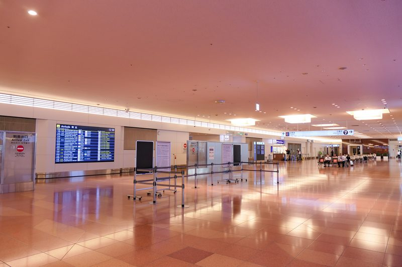
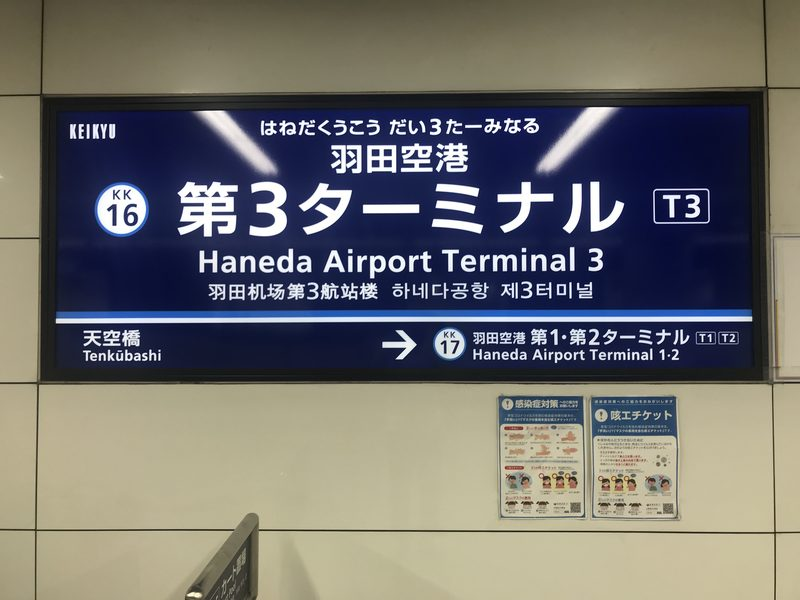
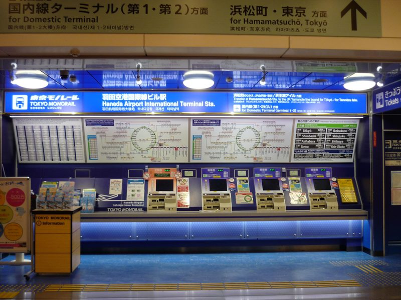
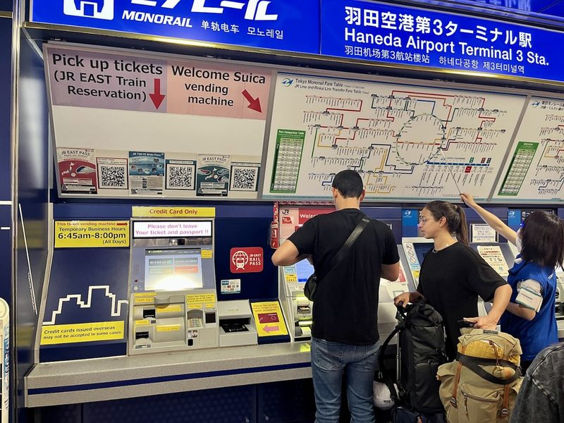
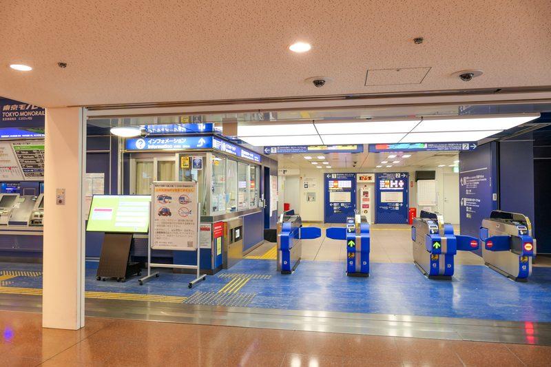
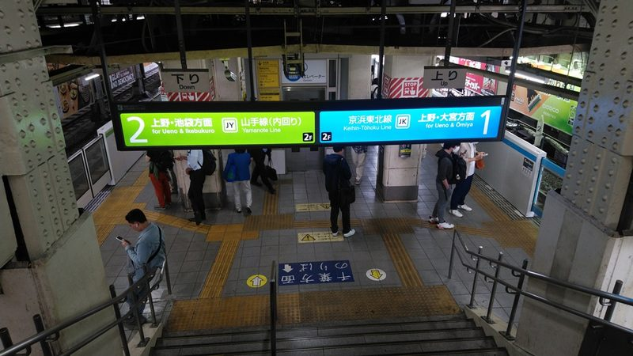
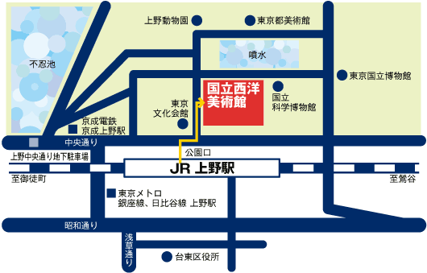
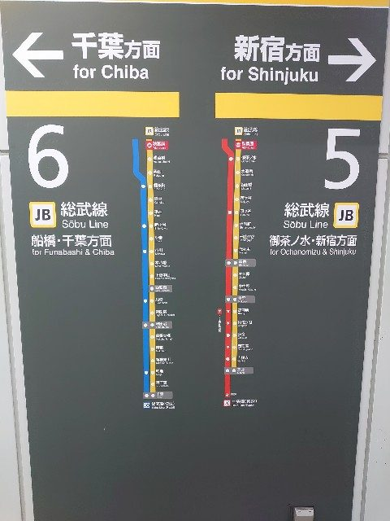
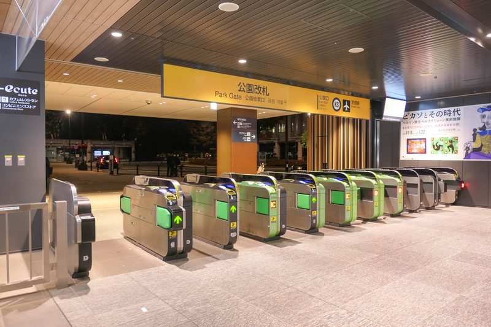

# **🇯🇵 2026 東京 6天5夜親子自由行**

## **👨‍👩‍👧‍👦 旅遊成員**

> * 我 / 父親 / 母親 / 女兒（小學生）/ 兒子（小學生）

## **✈️ 航班與機場接送資訊**

> * **去程航班**：CI220 松山(TSA) → 羽田(HND) 09:00－13:10  
> * **回程航班**：CI221 羽田(HND) → 松山(TSA) 14:30－16:55  
> * 🚗 **專車機場接送**：
>   * **去程送機**：Day 1（8/20）**05:30** 專車司機至住家接送前往台北松山機場 (TSA)。
>   * **回程接機**：Day 6（8/25）班機抵達松山機場（預計 16:55 降落通關），專車接機送回住家。

## **🏨 住宿資訊**

[**海茵娜酒店东京浅草桥 (変なホテル東京 浅草橋)**](https://www.google.com/maps/search/?api=1&query=35.6970775,139.7847605&query_place_id=ChIJRWR7EbKOGGARUkONjElltUA) (住宿 5 晚)

地址：1-10-5 Asakusabashi, Taito-ku, Tokyo 111-0053, JAPAN

## **💡 新手交通與搭車重要提醒**

🎫 西瓜卡過閘門、車站找路與大行李動線（點擊展開）

> 📄 **行前必讀介紹文（第一次搭日本電車必看）**：[東京電車地鐵新手搭車完整攻略文章（2026）](https://watabi.org/articles/tokyo-train-subway-guide)｜[東京地鐵新手一定要知道的十件事介紹文](https://linshibi.com/?p=14604)
>
> 🎫 **西瓜卡過閘門，其實只有三個動作**：
>
> 1. **進站**：把卡**平貼**在閘門上方的感應區（有 IC 標誌的那一塊），聽到「嗶」一聲、閘門沒關起來就是過了。系統會自動記錄你從哪一站進站。
> 2. **搭車**：中途換車、換線大多**不用再刷**（同一公司站內轉乘）；只有跨不同公司（如 JR ↔ 東京 Metro／都營）才需要出閘門再進閘門。
> 3. **出站**：再感應一次，**車資自動從卡片餘額扣掉**，螢幕會顯示扣了多少、還剩多少。**全程不需要事先算錢、不需要買票。**
>
> * 💡 **卡片放在票夾或皮夾裡也能感應**，不必特地拿出來；但**一次只能貼一張 IC 卡**，兩張疊在一起會讀取失敗。
> * 💡 **要「貼平、停半秒」**，不是快速掃過。閘門的燈號與音效會告訴你成功與否。
> * 👨‍👩‍👧‍👦 **五個人請一個一個過**，同一張卡不能連續給兩個人進站。
>
> ⚠️ **閘門刷不過怎麼辦？別緊張，這很常見**：[Suica 進出站錯誤常見狀況與處理方式介紹文](https://akita-bus.jp/suica-guide/suica-gate-error.htm)
>
> * **最常見的原因是餘額不足**。閘門會關起來並亮紅燈——此時**不要硬擠、也不要往回走**，直接到旁邊的 **精算機（のりこし精算機）** 或售票機加值，再重新感應出站即可。
> * 若加值後仍過不去（例如忘了刷進站、卡片沒讀到），走到閘門旁**有站務員的那一格窗口**，把卡遞過去說「**すみません、これ、通れません**」（不好意思，這張過不去），站務員會查明原因、補收差額後放行。**不會被罰款，也不需要會日文。**
> * 🔗 官方說明（JR 東日本官網，非中文）：[通過檢票口的方法](https://www.jreast.co.jp/en/suica/ic/use/gate/)｜[Suica 可用設備一覽](https://www.jreast.co.jp/en/suica/ic/use/equip/index.html/)

> * 認顏色與月台比認日文快： 東京的 JR 線路都有專屬代表色。在車站搭車時，請認明「月台編號」與「車輛顏色」（例如：中央・總武線 \= 黃色列車、山手線 \= 綠色列車）。這比辨識複雜的日文漢字更直覺，最不容易坐錯方向。  
> * 🛗 大行李垂直動線規範（重要）： **Day 1（抵達）與 Day 6（返程）進出淺草橋站務必走「A1 出口無障礙電梯」**。其餘出口（A2/A3/A4）皆為純樓梯，切勿扛大行李走純階梯。
> * 🚪 **淺草橋站出入口通則（JR 與都營是兩座分開的車站，出入口不共用）**：
>   * **搭 JR 中央・總武線 ➔ 一律走「西口」**。西口到飯店 **110 公尺**，東口 180 公尺，**差 70 公尺**。西口開在江戶通西側，出站不必過大馬路。
>     📍 **西口定位用連結**：[**淺草橋站西口正對面 (浅草橋駅 西口 目印)**](https://www.google.com/maps/search/?api=1&query=35.6973254,139.7837543&query_place_id=ChIJL0tMG7KOGGAR9J2prCH0on8)。Google 沒有西口的圖釘，這個連結指的是**西口正對面的燒肉店**，用來確認自己站對邊。**不是要去這家店。**
>   * **搭都營淺草線、沒帶大行李 ➔ 走「A3 出口」**（與 JR 東口同一側，到飯店約 180 公尺，純樓梯）。
>   * **搭都營淺草線、帶大行李（Day 1、Day 6）➔ 一定走「A1 出口」**，它是唯一有直達地面電梯的出口；距離略遠但不必扛行李走樓梯。
>   * ⚠️ **導航連結分不出出入口**：Google 地圖上「浅草橋駅」只有**一個**地標，A1～A6 與東口、西口**都沒有獨立圖釘**。所以行程表裡所有淺草橋站的導航連結都會指向同一個點（靠東口／A3 那側）。**出口要看文字說明，不要照導航的圖釘走。**
> * ⚠️ 純樓梯警示原則： 平日遊玩出入站以手扶梯為主；若規劃出口為純樓梯，行程中均已加註「純樓梯階數警示」與「手扶梯/電梯替代出口」。
> * 下載 App 協同輔助： 手機請先下載「乘車案內」App，或在進站時搭配「Google Maps」確認即時的月台與發車時間。  
> * 注意閘門內外（Day 3 關鍵）： 在 Day 3 東京車站跨越東西側時，必須走閘門外的「自由通路」（如北地下自由通路），切勿誤刷 Suica 進站。  
> * 善用飯店地利之便： 淺草橋站同時擁有 JR 中央・總武線與都營淺草線，前往淺草、晴空塔、羽田機場皆可直達。

🚃 車廂禮儀與優先席、大行李搭車須知（點擊展開）

> 📄 **參考介紹文**：[在日本搭電車必須注意的 12 件事介紹文](https://livejapan.com/zh-tw/in-tokyo/in-pref-tokyo/in-tokyo_train_station/article-a0001396/)｜[優先席怎麼坐、要不要讓座的辨識與開口指南文章](https://j-eps.net/japan-train-priority-seat-offer-seat-manners-guide-taiwan-zh-tw/)
>
> * 🪑 **優先席**：車廂兩端、座椅顏色與其他座位不同的區塊。**離峰空車時一般人可以坐**，但只要有長者、孕婦、行動不便者上車就要讓位。我們家長輩本身就是優先席的對象，**可以安心坐**。
> * 🤫 **車內不講電話**、手機轉靜音；小孩講話音量請壓低，這是日本電車最被在意的一點。
> * 🎒 **後背包請抱在胸前或放腳邊**，不要背在背後撞到別人。
> * 🧳 **大行李避開通勤尖峰 07:30－09:00**：Day 1 抵達（下午）與 Day 6 出發（上午 09:00 後）都已避開，但若臨時提早移動請留意。行李請靠車廂角落或車門旁，不要擋走道。
> * 🚪 **先下後上**：車門開啟時站兩側等候，讓車上乘客先下車；上車後往車廂內側移動，不要卡在門口。
> * 🍱 **通勤電車上不吃東西**（新幹線、特急則可以）。

## **🧳 行前實用常識與緊急應變**

🏥 生病、受傷、想買藥怎麼辦（帶長輩小孩必看，點擊展開）

> 📄 **參考介紹文**：[日本旅遊就醫注意事項、找醫院與保險理賠攻略文章](https://linshibi.com/?p=49095)｜[緊急看病求診日語教學文章](https://www.letsgojp.com/archives/391530/)
>
> 🔗 **官方查詢**：[日本政府觀光局：身體不適時的應急指南與醫療機構搜尋（繁體中文）](https://www.jnto.go.jp/emergency/chc/mi_guide.html) —— 可依所在地區、對應語言、就診科別、能否刷卡篩選醫院。
>
> * ☎️ **緊急電話**：救護車與消防 **119**、警察 **110**（免費、24 小時）。日本政府觀光局的 **訪日旅客熱線 050-3816-2787** 也是 24 小時全年無休，提供中文，遇狀況不知道找誰時打這支。
> * 💊 **小症狀先去藥妝店**：頭痛、腹瀉、感冒、蚊蟲叮咬、貼布，藥妝店的市售藥就能解決，日本店員多半聽得懂簡單英文或看得懂漢字。
> * 👦 **但小孩發燒／持續嘔吐不要自行買成藥**：日本市售藥的年齡與劑量標示與台灣不同，**帶小孩直接找小兒科（小児科）就醫**最保險。
> * 💴 **外國人就醫全額自費**，一次門診常見落在 ¥5,000～¥15,000。**務必索取正式收據（領収書）與診斷證明**，回台灣才能申請旅平險或健保核退。
> * 🧾 **出發前確認旅平險有含海外醫療**，並把保單號碼與 24 小時客服電話存在手機裡。
> * 🩹 **隨身小藥包建議**：常用退燒／止痛藥、腸胃藥、暈車藥、OK 繃、長輩的慢性病處方藥（**請帶原包裝與處方箋副本**）。

💴 日幣現金、刷卡與 ATM 提款（點擊展開）

> 📄 **參考介紹文**：[日幣現金不夠時的自救方法介紹文](https://matcha-jp.com/tw/5487)｜[日本旅遊信用卡與電子支付使用心得文章](https://linshibi.com/?p=46124)
>
> * 💵 **本行程有不少地方只收現金**：Day 4 的炸牛肉丸名店、阿美橫丁的街邊小吃、部分神社寺廟、舊式投幣置物櫃、公車與扭蛋機。**每人身上請至少留一些千圓鈔與百圓硬幣。**
> * 🏧 **現金不夠時去便利商店 ATM**：24 小時營業的便利商店 ATM 多數支援海外金融卡（機台會貼 PLUS／Cirrus／銀聯標誌），螢幕可切換中文，選「引き出し（提款）」即可。
> * ⚠️ **出國前務必先向發卡銀行開通「海外提款」功能**，並確認**四位數的國際提款密碼**（與台灣一般的密碼可能不同）以及每日提領上限。**臨櫃或網銀都能辦，但到了日本才發現沒開通就來不及了。**
> * 💳 **刷卡普及但別全押**：百貨、連鎖餐廳、藥妝店幾乎都能刷；個人小店、屋台、老舖仍以現金為主。
> * 🪙 **硬幣會越積越多**：日本 ¥500／¥100 硬幣面額大，找零很快堆滿。**投幣置物櫃、扭蛋、自動販賣機正好拿來消化硬幣。**

🔌 電壓插座、廁所、垃圾、小費等生活常識（點擊展開）

> 📄 **參考介紹文**：[日本旅遊必知注意事項懶人包文章（2026）](https://www.funliday.com/posts/japan-travel-tips/)｜[日本插頭與插座規格完整說明文章](https://www.tripool.app/articles/japan-plug-and-socket)
>
> * 🔌 **電壓 100V、兩孔扁平插座**，與台灣（110V）幾乎相容，**手機、相機、筆電、行動電源直接插就好，不需要變壓器或轉接頭**。唯一要注意的是台灣的三孔插頭需要「三轉二」轉接頭，以及吹風機、電棒等高功率電器會變弱。
> * 🔋 **行動電源與鋰電池只能隨身攜帶，嚴禁託運**；且依規定需能看到容量標示。
> * 🚻 **廁所衛生紙可以直接沖進馬桶**（是可溶紙），旁邊的垃圾桶是給衛生用品的。公共廁所大多免費且乾淨，車站、百貨、便利商店都有。
> * 🗑️ **路上幾乎沒有垃圾桶**：請隨身帶一個小塑膠袋裝垃圾，帶回飯店或到便利商店門口分類丟。
> * 💰 **日本沒有小費文化**，餐廳、計程車、飯店都不用給，硬給反而造成困擾。
> * 🚬 **路上禁菸**，抽菸請找標示「喫煙所」的區域。
> * 🥩 **肉類製品（含肉乾、香腸）與新鮮蔬果禁止帶入日本**，回程也禁止把日本的肉製品帶回台灣。

🏪 便利商店與超市必買清單（點擊展開）

> 📄 **三家一次看**：[日本便利商店全攻略：7-11／全家／LAWSON 必買清單文章](https://www.funliday.com/posts/japan-convenience-store/)｜[三大超商 15 款必買商品與刷卡、退稅、內用常見問題懶人包](https://tw.wamazing.com/media/article/a-708/)
>
> 📄 **7-ELEVEN 專篇**：[7-11 全攻略：7-PREMIUM 熱銷 TOP 5、季節限定與行李寄放服務（2026/07 更新）](https://www.letsgojp.com/archives/662817/)｜[7-11 必買美食 23 選，逐項寫口感與推薦理由（2026 最新版）](https://tasting-japan.com/archives/2551)
>
> 📄 **全家 FamilyMart 專篇**：[全家攻略：必買商品、可折抵 50～100 日圓的限定優惠券、聯名周邊（2026/07 更新）](https://www.letsgojp.com/archives/704500/)｜[全家必買 20 選：酥炸熟食、起司零食、冰品飲料（2026 最新版）](https://tasting-japan.com/archives/2697)
>
> 📄 **LAWSON 專篇**：[LAWSON 全攻略：炸雞君、街角廚房現做熟食、Uchi Café 甜點與無印良品專區](https://www.letsgojp.com/archives/734007/)｜[LAWSON 必買美食 18 選：生乳捲、炸雞君（2026/07 更新）](https://tasting-japan.com/archives/2412)
>
> 📄 **MINISTOP 專篇**（第四大超商，多數門市設有內用座位）：[MINISTOP 必買甜點與熟食 14 選](https://tasting-japan.com/archives/4425)｜[MINI STOP 必吃攻略與三家超商差異比較](https://marukoblog.tw/ministop.html)
>
> 📄 **超市介紹文**：[日本超市必買、連鎖品牌比較與購物指南文章（2026）](https://marukoblog.tw/grocery-store.html)｜[肉之Hanamasa 平價超市必買攻略文章](https://marukoblog.tw/2020-06-22.html)
>
> * 🏪 **三大超商各有強項**：7-11 的 7 PREMIUM 自有品牌零食與聯名甜點、LAWSON 的炸雞君（からあげクン）與麻糬口感生乳捲、全家的舒芙蕾布丁與厚燒玉子燒。
> * 🍙 **本行程用得到的**：Day 1 松山機場與 Day 6 羽田機場的機場早餐、Day 2 長輩組的午晚餐備案、每天回飯店的宵夜與隔日飲料。
> * 💳 **三大超商都收 Suica 與信用卡**，多數門市設有 ATM，螢幕可切換中文。
> * 🎫 LAWSON 店內的 **Loppi** 機台可購票與取票；吉卜力美術館即為此系統（本行程已於行前購票，無須現場操作）。
> * ⚠️ **MINISTOP 的現做飯糰便當不一定買得到**：2025 年 8 月因部分門市偽造消費期限，全國約 1,800 家暫停販售**店內現做**的飯糰、便當與熟食；同年 10 月起分批恢復，但**截至 2026 年 2 月底只恢復約四成門市**。**霜淇淋與一般包裝商品不受影響**。要把它當正餐備案前，請先看店內有沒有在賣。
> * 🛒 **超市比超商便宜**：牛奶、麵包、優格、水果、熟食價差明顯。Day 1 晚上安排的 [**肉之Hanamasa超市 (肉のハナマサ 浅草橋店)**](https://www.google.com/maps/search/?api=1&query=35.6966953,139.7840376&query_place_id=ChIJS7K2bLKOGGARGySfwejBx4o) 營業時間 **06:00－01:00**（**不是 24 小時**，深夜與清晨 01:00－06:00 沒開）。
> * ⚠️ **超市退稅不含生鮮蔬果與熟食**，且退稅櫃檯多數只到傍晚。本行程 19:15 才採買、且買的是當天要吃的生鮮，不走退稅。

🍞 每晚回飯店前買隔日早餐（點擊展開）

> **本行程的做法：前一晚回飯店前買好隔天早餐**，早上起床直接吃、不出門找店。
>
> 🚶 **走哪個出口，差很多**：
>
> | 出口 | 走回飯店 | 哪幾天會用 |
> | :-- | :-- | :-- |
> | **JR 西口** | **110 公尺** | Day 2～5 晚上（搭 JR 中央・總武線回來） |
> | JR 東口／都營 A 出口 | 180 公尺 | Day 1 抵達、Day 5 晴空塔與台場、Day 6 |
>
> ⚠️ **搭 JR 回來一律走西口**，比東口近 70 公尺。東口與都營 A3 出口在同一側。
>
> 📏 下表的「**多走**」＝ 出口➔店➔飯店 的總距離**減掉**直接回飯店的距離，也就是為了買早餐多花的腳程。全部以 Google 地圖實際步行路線量測。

> **① 走 JR 西口（Day 2～5，基準 110 公尺）**
>
> | 店家 | 多走 | 營業時間 | 必買參考 |
> | :-- | :-- | :-- | :-- |
> | [**Lawson+ThreeF**](https://www.google.com/maps/search/?api=1&query=35.6977110,139.7843910&query_place_id=ChIJ_WvQ9LGOGGARqFqgQ8633TA) | **＋25 公尺** | 24 小時 | [LAWSON](https://www.letsgojp.com/archives/734007/) |
> | [**肉之Hanamasa**](https://www.google.com/maps/search/?api=1&query=35.6966953,139.7840376&query_place_id=ChIJS7K2bLKOGGARGySfwejBx4o) | ＋98 公尺 | 06:00－01:00 | [超市](https://marukoblog.tw/2020-06-22.html) |
> | [**Lawson 一丁目**](https://www.google.com/maps/search/?api=1&query=35.6969657,139.7834740&query_place_id=ChIJw9iFBbKOGGARZDWKRGMH-ns) | ＋112 公尺 | 24 小時 | [LAWSON](https://tasting-japan.com/archives/2412) |
> | [**My Basket 一丁目**](https://www.google.com/maps/search/?api=1&query=35.6968077,139.7832051&query_place_id=ChIJ4TBoCLKOGGARhn4DJt5etlg) | ＋160 公尺 | 07:00－23:00 | [超市](https://marukoblog.tw/grocery-store.html) |
> | [**My Basket 西口**](https://www.google.com/maps/search/?api=1&query=35.6980518,139.7836158&query_place_id=ChIJcZqBdz-PGGARrusDnryuuEw) | ＋182 公尺 | 07:00－00:00 | [超市](https://marukoblog.tw/grocery-store.html) |
> | [**7-ELEVEN 西口**](https://www.google.com/maps/search/?api=1&query=35.6979742,139.7833930&query_place_id=ChIJP2pU_LGOGGAR2jc0UvRDEng) | ＋198 公尺 | 24 小時 | [7-11](https://www.letsgojp.com/archives/662817/) |
> | [**MINISTOP**](https://www.google.com/maps/search/?api=1&query=35.6982928,139.7848673&query_place_id=ChIJO5ABibGOGGAR-yitIDyEQ-A) | ＋260 公尺 | 24 小時 | [MINISTOP](https://tasting-japan.com/archives/4425) |
>
> 📏 **各段實測**（西口➔店／店➔飯店，公尺）：Lawson+ThreeF 67／68｜肉之Hanamasa 110／98｜Lawson 一丁目 82／140｜My Basket 一丁目 110／160｜My Basket 西口 92／200｜7-ELEVEN 西口 98／210｜MINISTOP 210／160
>
> * 🥇 **預設走Lawson+ThreeF**：多走只有 **25 公尺**，等於順路。
> * 🛒 **想買便宜一點的鮮乳、麵包、水果**：肉之Hanamasa 只多走 98 公尺，是西口側最划算的一家；**但 01:00－06:00 沒開**。
> * ❌ **FamilyMart 不要從西口去**：它在江戶通東側，從西口過去要多走 **530 公尺**。

> **② 走東口／都營 A 出口（Day 1、Day 5、Day 6，基準 180 公尺）**
>
> | 店家 | 多走 | 營業時間 | 必買參考 |
> | :-- | :-- | :-- | :-- |
> | [**Lawson+ThreeF**](https://www.google.com/maps/search/?api=1&query=35.6977110,139.7843910&query_place_id=ChIJ_WvQ9LGOGGARqFqgQ8633TA) | **＋68 公尺** | 24 小時 | [LAWSON](https://www.letsgojp.com/archives/734007/) |
> | [**7-ELEVEN 柳橋**](https://www.google.com/maps/search/?api=1&query=35.6966679,139.7861440&query_place_id=ChIJVbyS1NuPGGARRd4fF9slH2U) | ＋100 公尺 | 24 小時 | [7-11](https://www.letsgojp.com/archives/662817/) |
> | [**肉之Hanamasa**](https://www.google.com/maps/search/?api=1&query=35.6966953,139.7840376&query_place_id=ChIJS7K2bLKOGGARGySfwejBx4o) | ＋188 公尺 | 06:00－01:00 | [超市](https://marukoblog.tw/2020-06-22.html) |
> | [**MINISTOP**](https://www.google.com/maps/search/?api=1&query=35.6982928,139.7848673&query_place_id=ChIJO5ABibGOGGAR-yitIDyEQ-A) | ＋210 公尺 | 24 小時 | [MINISTOP](https://tasting-japan.com/archives/4425) |
> | [**FamilyMart 站前**](https://www.google.com/maps/search/?api=1&query=35.6980951,139.7869921&query_place_id=ChIJ2X0h6rOOGGARNIo-5lZ5tqo) | ＋230 公尺 | 24 小時 | [FamilyMart](https://www.letsgojp.com/archives/704500/) |
>
> * 🥇 **一樣是 Lawson+ThreeF 最順**，多走 68 公尺。
> * 🥈 **7-ELEVEN 柳橋第二順**（多走 100 公尺）：出東口往南 90 公尺就到。**但它在飯店東側，回飯店要往西走 190 公尺**；走西口的日子別選它（要繞 380 公尺）。
> * 🏪 **FamilyMart 離出口最近（120 公尺）**，適合「先買了再走回飯店」；但它在江戶通東側，回飯店要過一次馬路。
> * ⏱️ 其餘三家從東口出發要多走 **190～230 公尺**；表上沒列的（Lawson 一丁目、My Basket）從東口都要繞 260 公尺以上，不建議。

> **Day 1 抵達當晚（走 A1 電梯出口、帶大行李）**
>
> * 這晚已排 **19:15－19:35 肉之Hanamasa超市採買**，早餐一次買足，不必再另外跑。

> ⚠️ **Day 2 迪士尼日 06:25 就要吃早餐，一定要 Day 1 晚上先買好。**

> 🚦 **動線**
>
> * 飯店與**除了 FamilyMart 以外的所有店家，全部在江戶通西側**。**JR 西口就開在西側**，出站後全程走西側巷弄，**不用過大馬路**。
> * ⚠️ **東口與都營 A 出口都在江戶通東側**，回飯店一定要**過一次江戶通**（浅草橋駅前交叉點有紅綠燈）。
> * ⚠️ **FamilyMart 也在東側（柳橋側）**：從東口過去只要 120 公尺，但回飯店要過馬路；從西口過去要繞 350 公尺，不划算。
> * 🛗 全程平路、店面都在 1 樓，**沒有階梯**，帶行李或推車都能走。

> 🍞 **麵包店晚上買不到**：飯店半徑 300 公尺內只有三家麵包店，**最晚都 18:00 關門**（Bois de Boulogne 07:00－18:00、週日休；Haru Bouz 08:00－18:00、週六日休；另一家在 Google 上查無獨立店家頁）。本行程各晚回到淺草橋多在 18:35 之後，**趕不上**。想吃麵包請在上表的超市或超商買。

## **📋 行程總覽與檢視 (Review)**

### **1\. 全程景點概覽**

| 天數 | 主行程景點 | 選項 / 備案 |
| :---: | ----- | ----- |
| **Day 1** 方案 A | 秋葉原漫遊、GiGO 夾娃娃機、日系拍貼機、萬代扭蛋百貨店 | 友都八喜 6F 玩具模型展區 |
| **Day 1** 方案 B | 新宿東口、3D 巨貓 | — |
| **Day 2** 長輩組・晴天 | 不忍池、清水觀音堂、客美多咖啡（基地營）、國立西洋美術館、上野公園大噴水廣場、松坂屋 | 聖瑪克咖啡、松坂屋 8F 與頂樓休憩所 |
| **Day 2** 長輩組・雨天 | 東京國立博物館、國立西洋美術館、客美多咖啡（基地營）、松坂屋、PARCO_ya | 聖瑪克咖啡、松坂屋 8F 與頂樓休憩所 |
| **Day 2** 親子組 | 東京迪士尼樂園、夢之光電子大遊行、城堡高空投影秀 | 米奇魔法音樂世界、日間遊行、跳跳熱舞 |
| **Day 3** | 東京菓子樂園、GRANSTA、KITTE 花園、國立科學博物館、阿美橫丁 | Intermediatheque 博物館（雨天）、多慶屋 |
| **Day 4** | 三鷹之森吉卜力美術館、哈莫尼卡橫丁、天音鯛魚燒、小笹和菓子、THANK YOU MART、SATOU 炸牛肉丸、大創、Loft、無印良品 | Dream Market、gashacoco 扭蛋專門店、Linde 德國麵包 |
| **Day 5** 晴天 | 淺草寺、晴空塔、墨田水族館、東京都廳夜景與光雕投影秀（方案 A）、晴空街道（方案 B） | — |
| **Day 5** 雨天 | 日本科學未來館、DiverCity、SMALL WORLDS 迷你世界 | — |
| **Day 6** | 築地場外市場、羽田機場出境免稅店 | 羽田機場輕食與採買 |

### **2\. 全程餐點概覽**

| 天數 | 主要餐廳 (餐點類別) | 選項 / 備案餐廳 (餐點類別) |
| :---: | ----- | ----- |
| **Day 1** 方案 A | **早餐**：松山機場便利商店（飯糰、三明治） **晚餐**：壽司郎（迴轉壽司） | **早餐**：管制區內 Wing café、好饗廚房 **晚餐**：丸龜製麵（烏龍麵）、CoCo 壹番屋（咖哩飯） |
| **Day 1** 方案 B | **晚餐**：Gusto（日式平價家庭料理） | LUMINE EST 餐廳街 |
| **Day 2** 長輩組 | **午餐**：松屋（牛丼、燒肉定食） **下午茶**：客美多咖啡（咖啡）＋兔屋（銅鑼燒） **晚餐**：名代 宇奈鰻魚飯（炭烤鰻魚飯） | **午餐**：吉野家（牛丼、滑蛋牛肉丼） **下午茶**：聖瑪克咖啡（咖啡、巧克力可頌）、松坂屋 8F 休憩所 **晚餐**：松屋（牛丼、燒肉定食） |
| **Day 2** 親子組 | **午餐與晚餐**：園內彈性用餐、不跨區（行動點餐首選、行動餐車簡餐） | 園區各主題餐廳（依官方 App 即時篩選）、特色爆米花與造型點心 |
| **Day 3** | **午餐**：天丼 Tenya（天丼、炸蝦蓋飯） **點心**：鴨與蔥拉麵（選配） **晚餐**：吉野家（牛丼） | **午餐**：高湯茶泡飯 圓、燕子烤肉漢堡排 **晚餐**：松屋（牛丼）、名代 宇奈鰻魚飯（鰻魚飯） |
| **Day 4** | **午餐**：薩莉亞（義式輕食） **下午茶**：天音（鯛魚燒） **晚餐**：串家物語（炸串） | **午餐**：大戶屋（定食）、一風堂（拉麵）、花丸烏龍麵（烏龍麵） **點心**：SATOU（炸牛肉丸，選配）、小笹（最中） **晚餐**：一風堂（拉麵）、花丸烏龍麵（烏龍麵） |
| **Day 5** 晴天 | **午餐**：鳥一味親子丼 **晚餐**：麥當勞（方案 A）、宮武烏龍麵（方案 B） | 達摩文字燒、利久牛舌、摩斯漢堡、一風堂 |
| **Day 5** 雨天 | **午餐**：祖師坊蕎麥麵 **晚餐**：庫屋文字燒 | 田中蕎麥麵、勝衛門炸豬排 |
| **Day 6** | **早餐**：築地山長（玉子燒、各式小吃） **午餐**：羽田機場餐廳街（日式定食、烏龍麵） | **早餐**：築地丸武（玉子燒）、便利商店輕食（飯糰、三明治） |

---

## **📅 Day 1（8/20 星期四）：抵達東京 × 秋葉原慢遊**

### **🎯 今日重點**

> * **05:30 專車接送出發**：自住家出發前往松山機場。
> * 於羽田機場完成 1 張成人實體 Suica 與 2 張兒童 Welcome Suica 辦理（另 2 位成人已自備 Suica 卡）。  
> * 首日攜帶大行李，淺草橋出站**唯一走 A1 出口無障礙電梯**。
> * 隔天迪士尼，建議盡早回飯店休息。

### **05:30－07:00 🚗 專車送機：前往松山機場**

> * **05:30** 預約專車準時至住家接送，全家上車出發前往台北松山機場 (TSA) 國際線航廈（車程約 70～80 分鐘）。  
> * 💡 **出門確認清單**：護照（5人份且有效期限半年以上）、日幣現金、海外信用卡、日本上網網卡/eSIM。

### **07:00－07:40 🛫 松山機場報到與行李託運**

> * 抵達台北松山機場 1F 國際線大廳，至中華航空櫃台辦理行李託運與劃位領取登機證。  
> * 🧳 **先託運再吃早餐**：託運完手上只剩隨身行李，買東西、過安檢都輕鬆。

### **07:40－08:00 🍙 早餐：機場便利商店**

> 🏪 **便利商店位置（松山機場官網查證）**
>
> | 店家 | 位置 | 管制區 | 營業時間 |
> | :-- | :-- | :--: | :-- |
> | [**7-ELEVEN 松航門市**](https://www.google.com/maps/search/?api=1&query=25.0640539,121.5518526&query_place_id=ChIJsY0-OuqrQjQRe9qx3EyVAi4) | **第一航廈 國際線報到大廳北側**（敦化北路 340-9 號） | ❌ 管制區外 | **05:30－22:00** |
> | 7-ELEVEN 松機門市 | 第二航廈 國內線到站大廳（敦化北路 340-10 號） | ❌ 管制區外 | 05:30－22:00 |
>
> * ⚠️ **兩家名字只差一字、門牌只差 1 號**：機場官網把松航門市標示為「統一超商複合式概念店（國際航廈）」，認明 **340-9 號** 就對了。
>
> * ✅ **本行程要去的是第一航廈報到大廳北側那家**：與中華航空櫃台同一層，託運完走過去即到，**不必跑到第二航廈**。
> * 🍙 **買了帶進管制區吃**：飯糰、三明治、麵包、茶葉蛋等固體食物都可以通過安檢，08:00 準時往安檢移動，在候機室吃。
> * 🚨 **飲料不能過安檢**：隨身行李液體限制每個容器 100 毫升。買的飲料請在過安檢前喝完，或直接在管制區內買。
> * 💡 五人份一次買齊；小孩早起沒胃口也先買著，登機前或上飛機再吃。

### **08:00－09:00 ✈️ 通關安檢與登機**

> * 通過安檢與證照查驗，前往登機門，於候機室享用早餐，搭乘 **CI220（09:00 起飛）** 直飛東京羽田機場。
> * ☕ **管制區內要補飲料或熱食**（松山機場官網查證）：
>
> | 店家 | 位置 | 營業時間 |
> | :-- | :-- | :-- |
> | **Wing café** | 第一航廈出境樓層 **5 號登機門旁** | **05:30－18:00** |
> | **homee KITCHEN 好饗廚房** | 第一航廈出境樓層 **8 號登機門旁** | **05:30－20:00** |

### **13:10－14:10 🛬 抵達羽田機場第 3 航廈**

> 📄 **行前必讀介紹文**：[Visit Japan Web 申請與快速通關教學文章](https://www.letsgojp.com/archives/535150/)｜[手把手圖解填寫教學文章](https://debbiechien.com/visit-japan-web/)
>
> 📄 **羽田入境流程**：[羽田第三航廈入境各關卡實拍教學文章（2026）](https://pp761211.pixnet.net/blog/posts/898816563562705637)｜[入境六步驟動線與出關後京急線搭乘整理文章](https://za3c.com.tw/travel-japan-airport-002/)
>
> 📄 **自助通關機（KIOSK）操作**：[共同自助通關機操作步驟與適用航廈介紹文](https://www.travelerluxe.com/article/desc/250011455)｜[二合一 QR Code 與同行家人登錄教學文章（2026）](https://theluns.com/visit-japan-web-guide/)
>
> 🔗 **日本官方**：[財務省關稅局：稅關檢查場電子申告閘門說明頁](https://www.customs.go.jp/kaigairyoko/egate.htm)（令和 7 年 4 月更新，羽田為 7 座適用機場之一）｜[官方繁體中文操作影片](https://youtu.be/O5-_3jkuobU)

> * ⚠️ **出發前務必在台灣完成 Visit Japan Web**：它整合「入境審查」與「海關申報」，完成後會產生 QR Code。
> * 💡 **羽田第 3 航廈已導入「共同自助通關機（共同キオスク）」**，憑 QR Code 自助完成入境審查與海關手續，平均可縮短 15～30 分鐘。
> * 👨‍👩‍👧‍👦 **五人份都要各自申請**（每人一組 QR Code，小孩也要），建議行前一次做完並截圖存手機相簿，避免現場沒網路。

🛂 自助通關機現場怎麼操作（日本官方規定，點擊展開）

> 以下出自[財務省關稅局官網](https://www.customs.go.jp/kaigairyoko/egate.htm)，不是部落格轉述：
>
> * 📕 **必須是 IC 晶片護照**：機台要讀護照晶片。無晶片的舊護照不能用自助機，要走人工櫃檯。
> * 👨‍👩‍👧‍👦 **一家人也要一人操作一次**，不能一個人代刷五份。五個人請排好順序、輪流操作。
> * 😷 **拍照時要脫口罩、拿下墨鏡與帽子**：機台會拍臉與護照晶片內的照片比對，通過閘門時還會再辨識一次。
> * 🧒 **身高未滿 100 公分的小孩**才需要跟家人一起通過；本行程兩位小朋友都超過，各自操作一次即可。
> * 🛒 **行李推車可以直接推過電子閘門**，不用把行李搬下來；輪椅也能直接通過。
> * ⚠️ 若有超過免稅額度或需申報的物品，機台會把你導向**有人檢查台**，這是正常流程，不是機器故障。
>
> ⚠️ 網路上有文章寫「身高要 135 公分以上才能用」，**官網查無此規定**，官方寫的是 100 公分，以官網為準。

入境、提領行李、海關（預計 50～60 分鐘）。

* 🛬 **下飛機後動線**：跟著頭頂指標 **「Arrivals / 到着」**、**「Immigration / 入国審査」** 前進即可，先完成入境手續，不需特別找電車方向。
* 🛂 **入境審查**：準備全家 5 人護照及 Visit Japan Web QR Code（若已完成），依工作人員指示排隊通關。
* 🧳 **領取行李**：依電子看板尋找航班 **CI220** 對應之 **「Baggage Claim / 手荷物受取」** 行李轉盤提領行李。

> 📸 【辨識：T3 到達大廳】
> 

* 🛃 **海關檢查**：領完行李後依指標往 **「Customs / 税関」** 完成海關檢查與申報，出閘門正式進入 **T3 2F 到達大廳（Arrival Lobby）**。

> ⚠️ **出關後第一個容易走錯的地方**：
> * 出關後先不要停留逛商店，留在 **2F**（不用先搭電梯上樓）。
> * **先找頭頂大型指標「Railways（鉄道）」** ➔ 再依照 **「Keikyu Line（京急線 - KK16）」** 方向前進。
> * ❌ **請勿走「Tokyo Monorail（東京モノレール）」**（單軌電車只到浜松町，去淺草橋飯店必須轉車 2 次提大行李；京急線才能一車直達淺草橋）。

> 📸 【辨識：鐵路交通方向指標】
> 

---

### **14:10－14:55 ✈️ 機場整備與 Suica 交通卡辦理**

> 📄 **行前必讀介紹文**：[Welcome Suica 購買／增值／使用完整教學文章（含兒童卡）](https://2bunny.tw/welcome-suica/)｜[另一篇購買方式教學文章](https://gototravel.tw/welcome-suica/)
>
> 📄 **成人綠色 Suica 介紹文**：[Suica 購買儲值與手機綁定完整教學文章](https://tokyo.letsgojp.com/archives/83485/)｜[2026 各類 IC 卡比較與購買攻略文章](https://jp-travel.williamlion.tw/japan/suica-ic-card-guide-2026/)
>
> * 💡 **無記名綠色 Suica 已於 2025/3/1 恢復發售**（先前因晶片短缺停售）：售價 **¥2,000**，其中 ¥1,500 為可用餘額、**¥500 為押金**，不用時可退卡取回押金。
> * ⚠️ 購買免登記個人資料，但**遺失無法補發**；若擔心遺失，可改用手機版 Suica（加入 Apple 錢包／Google 錢包）。
>
> * 💡 **兒童卡重點**：可購買 **6～11 歲**兒童版，購買時需出示**兒童本人護照**；滿 12 歲後至該年 3 月 31 日止仍可使用。Welcome Suica **免押金、不需退卡**，儲值上限 ¥20,000，**有效期自首次使用起 28 天**。

> 📍 **位置說明**：目前位於 **T3 2F 到達大廳**。京急入口、售票機及服務中心皆位於 **2F**，**不用先搭電梯上樓**。

#### 🟢 **Step 1：成人交通卡（1 人購買實體 Suica + 2 人已自備）**
* **已有 2 張成人 Suica**：2 位成人已自備 Suica 卡，可直接於 2F 售票機或便利商店儲值（建議餘額保持 **¥2,000～¥3,000**）。
* **購買 1 張成人實體 Suica**：於 2F 售票機區尋找帶有 **「Suica / きっぷ / Tickets / 自動券売機」** 之機台購買 1 張成人實體 Suica，先儲值 **¥2,000～¥3,000**。

> 📸 【辨識：2F 售票機區】
> 

#### 🔴 **Step 2：小孩（2 人）辦理「兒童 Welcome Suica」**
* 請至 2F 的 **Welcome Suica 專用販售機** 或改札旁的 **[JR EAST Travel Service Center (JR東日本旅行服務中心)](https://www.tokyo-monorail.co.jp/english/haneda-tokyo-access/kokusaisen_bldg/concept.html)** 辦理：
  * 👦👧 **辦卡要點**：
    1. 需出示**兒童本人護照**（出關後護照先不要收進行李箱）。
    2. 每張建議先儲值 **¥2,000～¥3,000**（搭乘電車地鐵自動扣半價兒童票）。
    3. **免 ¥500 押金**，**有效期限為 28 天**（本次 6 天行程完全足夠）。

> 📸 【辨識：Welcome Suica 專用機】
> 

#### 🆘 **Step 3：迷路與求助對策 SOP**
* 📍 服務中心：若現場找不到機台，直接前往 2F 改札旁的 **「JR EAST Travel Service Center」**（營業時間 06:45～20:00）。
* 📱 **溝通小卡（出示手機畫面即可）**：
  * **找京急線**：`Where is the Keikyu Line? / 京急線はどこですか？`
  * **購買兒童卡**：`I'd like to buy two child Welcome Suica cards. / 子供用のWelcome Suicaを買いたいです。`

#### 🎒 **Step 4：辦卡完成後整備**
* 5 張交通卡準備妥當後，於 2F 處理：洗手間、ATM 提款、購買飲料、整理隨身裝備。

---

### **14:55－15:40 🚇 前往飯店**

> * 目標地點：[**海茵娜酒店东京浅草桥 (変なホテル東京 浅草橋)**](https://www.google.com/maps/search/?api=1&query=35.6970775,139.7847605&query_place_id=ChIJRWR7EbKOGGARUkONjElltUA)

#### 🚶 **Step 1：前往京急月台**
* 辦好交通卡後，依照現場 **「Keikyu Line（京急線 - KK16）」** 指標前往剪票口：
  * 於 [**京急 羽田機場第3航廈站 (羽田空港第3ターミナル駅)**](https://www.google.com/maps/search/?api=1&query=35.5446472,139.7677877&query_place_id=ChIJsXfyslZhGGARbL8nFGOsncU)（**KK16**） 地下 2 樓改札口感應刷卡進站。
  * 成人：3 位持成人實體 Suica 直接感應刷卡進站。
  * 小孩：2 位持兒童 Welcome Suica 直接感應刷卡進站。
  * **不用另外購買單程車票。**
* ⚠️ 通過剪票口後，搭乘電梯或電扶梯下至地下月台。

> 📸 【辨識：京急線改札口實景】
> 

#### 🚆 **Step 2：搭乘京急直通都營淺草線（一車直達淺草橋）**
* 於 [**京急 羽田機場第3航廈站 (羽田空港第3ターミナル駅)**](https://www.google.com/maps/search/?api=1&query=35.5446472,139.7677877&query_place_id=ChIJsXfyslZhGGARbL8nFGOsncU)（**KK16**） 搭乘 **🔴 京急機場線直通 🌹 都營淺草線（A）** 列車（紅色/玫瑰紅色列車，往 成田空港／青砥／押上 方向），一車直達 [**淺草橋站 (浅草橋駅)**](https://www.google.com/maps/search/?api=1&query=35.6974952,139.7859834&query_place_id=ChIJr-AfyrOOGGARWBazD9OfYeg)（**A16**）（車程約 40-45 分鐘，免提大行李轉乘）。
* 💡 **最簡單判斷法（上車防搭錯）**：
  * ✅ **月台電子看板有「浅草橋（Asakusabashi）」停靠站即可上車**！不需要刻意分辨普通、急行、特急或快特，只要顯示停靠「浅草橋」即為直達車。
  * 若不確定可詢問月台站務人員：`Does this train stop at Asakusabashi? / この電車は浅草橋に停まりますか？`

#### 🛗 **Step 3：淺草橋出站動線（大行李必看）**
* 抵達淺草橋站後，請跟隨無障礙標誌搭電梯至剪票口，並**走「A1 出口（設有直達地面電梯）」**出站。出站後**過江戶通**（浅草橋駅前交叉點有紅綠燈）再直行，**約 200 公尺、3～4 分鐘**（含等紅綠燈）即達飯店大門。
* ⚠️ **警告**：A2 出口距離雖近但為「純長樓梯（約 35 階，無手扶梯與電梯）」，攜帶大行李切勿走 A2。

### **15:40－16:15 🏨 飯店 Check-in 與休息**

> * 辦理 Check-in、置放行李、吹冷氣稍作休息、更換輕便服裝。

---

## **⭐ Day 1 Check-in 後動態決策**

### **✅ Plan A（首選推薦：秋葉原漫遊 × 拍貼扭蛋）**

#### **16:15 🚶‍♂️ 前往秋葉原**

> * 16:15 離開飯店 ➔ 慢步 2 分鐘至 [**JR 淺草橋站 (浅草橋駅)**](https://www.google.com/maps/search/?api=1&query=35.6974952,139.7859834&query_place_id=ChIJr-AfyrOOGGARWBazD9OfYeg)（**JB20**）（西口進站有電梯）。  
> * 於 [**JR 淺草橋站 (浅草橋駅)**](https://www.google.com/maps/search/?api=1&query=35.6974952,139.7859834&query_place_id=ChIJr-AfyrOOGGARWBazD9OfYeg)（**JB20**）**西口進站**，於 1 號月台搭乘 **🟡 JR 中央・總武線（JB）** 往 **秋葉原（Akihabara／JB19）／新宿 方向**，搭乘 **1 站** 至 [**秋葉原站 (秋葉原駅)**](https://www.google.com/maps/search/?api=1&query=35.698383,139.7730717&query_place_id=ChIJKTP54qeOGGARsZf1fyU2jxU)（**JB19**）（車程約 2 分鐘，下一站即為秋葉原，由電氣街口出站即達）。

#### **16:35－16:55 🕹️ 日式夾娃娃機體驗**

> * 目標地點：[**GiGO 秋葉原3號館 (GiGO 秋葉原3号館)**](https://www.google.com/maps/search/?api=1&query=35.6992456,139.7709552&query_place_id=ChIJR-PMBx2MGGARPFrgtULaJB0) (1F/2F 夾娃娃機專區)  
> * **核心體驗（1F/2F）**：體驗日式夾娃娃機（UFO Catcher），有動漫周邊、人氣公仔與玩偶。  
> * 💡 **消費預估**：夾娃娃機體驗約 ¥500～¥1,000 / 全家，小試身手體驗日式機台手感即可。  
> * （Option：若想參觀其他樓層大型電玩，3F 為音樂節奏遊戲、7F 為懷舊復古遊戲專區 RETRO:G，可視時間與興趣順路搭手扶梯快閃參觀）。

#### **16:55－17:20 📸 日系拍貼機全家合影體驗**

> * 目標地點：[**日系拍貼機體驗 (Purikura / GiGO 拍貼機專區)**](https://www.google.com/maps/search/?api=1&query=35.6992456,139.7709552&query_place_id=ChIJR-PMBx2MGGARPFrgtULaJB0) (GiGO 秋葉原3號館 2F 拍貼機專區 / 或下一站 namco 3F)
> * **全家合影紀念**：全家 5 人拍一張大眼美肌拍貼（プリクラ）。  
> * **趣味塗鴉**：拍完可在觸控螢幕塗鴉、加貼圖。  
> * **現場取件**：當場印出貼紙，每人一張；也可掃碼下載電子檔。  
> * 💡 **消費預估**：每次固定為 **¥500**（約台幣 105 元，極具紀念價值）。

#### **🪙 萬代官方扭蛋體驗｜OPTION**

> 🟡 **本段為選配，預設不排時間**：抵達秋葉原後只剩約 55 分鐘，而壽司郎 17:30 已訂位、遲到會被壓縮用餐時間。**時間夠、小孩還有體力才去，否則直接去吃晚餐。**
>
> 🎰 **Day 4 也有扭蛋，不去不可惜**：吉祥寺的 [**gashacoco (gashacoco 吉祥寺元町通り)**](https://www.google.com/maps/search/?api=1&query=35.7043122,139.5794762&query_place_id=ChIJK_uU_bfvGGARHQdBOz663BY)（吉祥寺パレスビル 1F）機台約 650 台以上，Day 4 下午 15:00－15:35 那段就在旁邊，可以留到那時再扭。

> * 目標地點：[**萬代扭蛋百貨店 秋葉原店 (ガシャポンバンダイオフィシャルショップ秋葉原店)**](https://www.google.com/maps/search/?api=1&query=35.6980094,139.7724164&query_place_id=ChIJlzTvUTuNGGARzn7gpOn8et8) (いちご秋葉原駅前ビル 4F / namco 4F)
> * 全秋葉原規模最大之一的官方扭蛋專門店，近千台動漫、寶可夢、迪士尼與微縮模型扭蛋機，館內冷氣充足。  
> * 💡 **消費預估**：每顆約 ¥300～¥500，預算約 ¥600～¥1,000 / 2 位小孩。  
> * ⏱️ **若要去就抓 17:15－17:30**，15 分鐘只夠各扭 1～2 顆，扭完直接下樓走去壽司郎。  
> * （Option：若想參觀大型玩具模型展區，可順路快閃 [友都八喜 (ヨドバシカメラ マルチメディアAkiba)](https://www.google.com/maps/search/?api=1&query=35.698917,139.774798&query_place_id=ChIJGU_M2aeOGGARdnOLcMYXuXs) (6F 玩具模型展區) 欣賞展示模型）。

#### **17:30－19:00 🍽️ 晚餐：壽司郎**

> 🎫 **票務狀態：已訂位**

> * 首選餐廳：[**壽司郎 (スシロー 秋葉原駅前店)**](https://www.google.com/maps/search/?api=1&query=35.698736,139.77189&query_place_id=ChIJMfORxzyNGGARskRptNTnsVE) (BiTO AKIBA B1F) 享用平價迴轉壽司（推薦：鮭魚三貫、鮪魚泥海苔包、炸蝦天婦羅壽司、茶碗蒸、酥脆薯條、甜點百匯），人均約 ¥1,000～¥1,800。  
>   * 💡 **點餐與用餐祕訣（全繁體中文平板）**：  
>     1. **免排隊時段**：17:30 入座剛好避開晚間 18:30 後的下班人潮，迅速入座免久候。  
>     2. **零語言壓力**：桌上設有繁體中文觸控平板，小孩可自己點選喜歡的壽司、熟食與甜點，現點現做由軌道極速直送。  
>     3. **用餐時間 90 分鐘**，不趕。  
> * 備案餐廳 1：[**丸龜製麵 (丸亀製麺 秋葉原店)**](https://www.google.com/maps/search/?api=1&query=35.6984426,139.7724317&query_place_id=ChIJFa5T2GqNGGARmSiHDgcJFf8) (アトレ秋葉原1 1F) 享用讚岐烏龍麵（推薦：豚骨烏龍麵、炸天婦羅），人均約 ¥500～¥900。  
>   * 💡 **點餐祕訣**：拿托盤 ➔ 向廚師手指照片點麵（說 "Hot/Cold"、"Regular"）➔ 自己夾炸物 ➔ 結帳 ➔ 免費自助加蔥花與天婦羅酥。  
> * 備案餐廳 2：[**CoCo壹番屋 (CoCo壱番屋 JR秋葉原駅昭和通り口店)**](https://www.google.com/maps/search/?api=1&query=35.6984515,139.77577&query_place_id=ChIJSyxsj6iOGGARvBM2kRLvJZs) (渡辺ビル 1F) 享用日式咖哩（推薦：炸豬排咖哩、兒童咖哩套餐），人均約 ¥800～¥1,200。
>   * 💡 **點餐與付款祕訣（依店舖採不同方式，現場為準）**：  
>     1. 官方確認共三種點餐方式：**入座後叫店員點餐（餐後至收銀櫃台結帳）**、**桌上平板點餐**、**手機行動點餐**；⚠️ 本分店採哪一種未經官方確認。  
>     2. ⚠️ **外語菜單有無查無官方資料**；咖哩需選擇「飯量」與「辣度」，若為口頭點餐建議直接指認菜單照片並比出數字。

#### **19:00－19:15 🚆 返回淺草橋**

> * 從秋葉原商圈步行至 [**JR 秋葉原站 (秋葉原駅)**](https://www.google.com/maps/search/?api=1&query=35.698383,139.7730717&query_place_id=ChIJKTP54qeOGGARsZf1fyU2jxU)（**JB19**） 電氣街口或中央口進站。
> * 於 [**JR 秋葉原站 (秋葉原駅)**](https://www.google.com/maps/search/?api=1&query=35.698383,139.7730717&query_place_id=ChIJKTP54qeOGGARsZf1fyU2jxU)（**JB19**） 6 號月台搭乘 **🟡 JR 中央・總武線（JB）** 往 **千葉（Chiba／JB39） 方向**，搭乘 **1 站** 直達 [**淺草橋站 (浅草橋駅)**](https://www.google.com/maps/search/?api=1&query=35.6974952,139.7859834&query_place_id=ChIJr-AfyrOOGGARWBazD9OfYeg)（**JB20**）（車程約 2 分鐘，下一站即為淺草橋）。
> * 由 **「西口（West Exit）」** 出站，步行約 2 分鐘前往超市採買。**超市與飯店都在西側，走西口不必過大馬路**（走東口要多繞 160 公尺）。

### **✅ Plan B（備案：新宿 3D 巨貓）**

#### **16:30－17:15 🚇 前往新宿東口**

> * 16:30 離開飯店 ➔ 慢步約 2 分鐘至 [**JR 淺草橋站 (浅草橋駅)**](https://www.google.com/maps/search/?api=1&query=35.6974952,139.7859834&query_place_id=ChIJr-AfyrOOGGARWBazD9OfYeg)（**JB20**）**西口進站**，1 號月台。  
> * 於 [**JR 淺草橋站 (浅草橋駅)**](https://www.google.com/maps/search/?api=1&query=35.6974952,139.7859834&query_place_id=ChIJr-AfyrOOGGARWBazD9OfYeg)（**JB20**） 搭乘 **🟡 JR 中央・總武線（JB）** 往 **新宿（JB10）／三鷹 方向**，搭乘 **2 站** 至 御茶之水站（JB18）（車程約 4 分鐘）。  
> * 於 **御茶之水站（JC03）** **不用出站**，於同月台對面直接平行轉乘 **🟠 JR 中央線快速（JC）** 往 **新宿（Shinjuku／JC05）／高尾 方向**，搭乘 **2 站**直達 [**新宿站 (新宿駅)**](https://www.google.com/maps/search/?api=1&query=35.6895924,139.7004128&query_place_id=ChIJH7qx1tCMGGAR1f2s7PGhMhw)（**JC05**）（車程約 9 分鐘，總車程約 18 分鐘，在冷氣車廂內坐著休息補眠）。  
> * 抵達新宿站後不趕時間，跟隨 **🟦 藍色的「東口（East）」** 指標走地下通道出站（步行約 5-8 分鐘）。新宿站指標依區域分色：**東口＝藍色、西口＝綠色、南口＝酒紅色**，認顏色比認漢字快。

#### **17:15－17:40 🐈 欣賞新宿 3D 巨貓**

> * 目標地點：[**Cross Shinjuku 3D 巨貓 (クロス新宿ビジョン)**](https://www.google.com/maps/search/?api=1&query=35.6926882,139.7008265&query_place_id=ChIJrwWR35uNGGARG7Svj20aEfM)
> * **亮點特色**：新宿東口出站，站前廣場抬頭即可看見會叫的巨大 3D 三花貓。  
> * **安心觀賞**：廣場開闊平坦，站著看即可；每隔數分鐘一段演出（打哈欠、伸懶腰、睡覺、跳出來打招呼）。

#### **17:40－18:35 🍽️ 晚餐：Gusto 家庭餐廳**

> * 首選餐廳：[**Gusto (ガスト 新宿NOWAビル店)**](https://www.google.com/maps/search/?api=1&query=35.6903733,139.7013626&query_place_id=ChIJFUOWQQCNGGARHkjPPx28PfI) (新宿NOWAビル 7F) 享用平價日式家庭料理（推薦：起司流心漢堡排、炸豬排定食、兒童咖哩/鬆餅餐），人均約 ¥800～¥1,200。  
>   * 親子優勢：座位寬敞、全中文平板點餐、出餐快，有貓咪送餐機器人。  
> * 備案餐廳：[**LUMINE EST 餐廳街 (ルミネエスト新宿 7&8 DINER)**](https://www.google.com/maps/search/?api=1&query=35.6912505,139.7011419&query_place_id=ChIJ_TibA9qMGGARNYmVIFyGU9k) (東口車站直結 7F/8F) 享用日式洋食/定食/蛋包飯（推薦：オムライス 卵と私、洋食亭ブラームス），人均約 ¥1,300～¥2,000。  
>   * 動線優勢：就在東口車站正上方，搭電梯上樓用餐，吃完下樓即進站。

#### **18:35－19:15 🚆 返回淺草橋**

> * 於 [**JR 新宿站 (新宿駅)**](https://www.google.com/maps/search/?api=1&query=35.6895924,139.7004128&query_place_id=ChIJH7qx1tCMGGAR1f2s7PGhMhw)（**JC05**） 7/8 號月台搭乘 **🟠 JR 中央線快速（JC）** 往 **東京（Tokyo／JC01） 方向**，搭乘 **2 站**至 御茶之水站（JC03）（車程約 9 分鐘）。
> * 於 **御茶之水站（JB18）** **不用出站**，於同月台對面直接平行轉乘 **🟡 JR 中央・總武線（JB）** 往 **千葉（Chiba／JB39） 方向**，搭乘 **2 站** 直達 [**淺草橋站 (浅草橋駅)**](https://www.google.com/maps/search/?api=1&query=35.6974952,139.7859834&query_place_id=ChIJr-AfyrOOGGARWBazD9OfYeg)（**JB20**）（車程約 4 分鐘）。由 **西口（West Exit）** 出站步行前往超市採買。
> * 💡 此時段剛好稍微避開晚間下班尖峰，電車平穩舒適。

---

### **🛒 共同收尾行程（Plan A / Plan B 適用）**

#### **19:15－19:35 🛒 生鮮超市採買**

> 📄 **採買參考介紹文**：[肉之Hanamasa 平價超市必買攻略文章](https://marukoblog.tw/2020-06-22.html)｜[日本超市必買、連鎖品牌比較與購物指南文章（2026）](https://marukoblog.tw/grocery-store.html)

> * 返回淺草橋站出站後，慢步 2 分鐘順路前往 [**肉之Hanamasa超市 (肉のハナマサ 浅草橋店)**](https://www.google.com/maps/search/?api=1&query=35.6966953,139.7840376&query_place_id=ChIJS7K2bLKOGGARGySfwejBx4o) 採買：明日早餐鮮乳、麵包、優格、礦泉水與當季水果（比超商更經濟實惠）。

#### **19:40 🏨 回飯店休息**

> * 19:40 已完成超市採買並回到海茵娜酒店。  
> * 整理明日迪士尼裝備：門票 QR Code、Welcome Suica 卡、行動電源、防曬用品、帽子、小毛巾。  
> * 全家輪流洗澡泡澡放鬆。

#### **21:00－21:30 🛌 準時就寢**

> * 21:30 前入睡，隔天 06:20 起床，睡滿 9 小時。

---

## **📅 Day 2（8/21 星期五）：雙線交織 - 上野漫遊 (長輩組)**

### **08:20－09:00 🍳 早餐**

起床梳洗吃早餐，準備 09:00 出發。

### **09:00－09:25 🚇 前往上野**

> * 從飯店步行約 2 分鐘至 [**JR 淺草橋站 (浅草橋駅)**](https://www.google.com/maps/search/?api=1&query=35.6974952,139.7859834&query_place_id=ChIJr-AfyrOOGGARWBazD9OfYeg)（**JB20**）**西口進站**（西口離飯店最近，110 公尺）。
> * **第一段（淺草橋 ➔ 秋葉原）**：於 [**JR 淺草橋站 (浅草橋駅)**](https://www.google.com/maps/search/?api=1&query=35.6974952,139.7859834&query_place_id=ChIJr-AfyrOOGGARWBazD9OfYeg)（**JB20**） **1 號月台** 搭乘 **🟡 JR 中央・總武線（JB）** 往 **秋葉原（Akihabara／JB19）／新宿（Shinjuku／JB10） 方向**，搭乘 **1 站** 至 [**秋葉原站 (秋葉原駅)**](https://www.google.com/maps/search/?api=1&query=35.698383,139.7730717&query_place_id=ChIJKTP54qeOGGARsZf1fyU2jxU)（**JB19**）（車程約 2 分鐘）。
>   * 💡 **下一站防呆**：搭車後下一站應為 **秋葉原（Akihabara）**；若顯示 **兩國（Ryogoku）** 表示搭錯方向，請立即下車改搭對面月台列車。

> 📸 【辨識：秋葉原站轉乘指標（最重要）】
> 
> 
> * ✔ **請認準頭頂綠藍雙色指標**：
>   * 🟢 **山手線 (JY)**
>   * 🔵 **京濱東北線 (JK)**
>   * 標註 **「for Ueno & Omiya（往上野、大宮）」**
>   * 看到此指標即可順著階梯/電扶梯往下走至月台，表示方向正確。

> * **第二段（秋葉原 ➔ 上野，站內轉乘不出站）**：於秋葉原站 **不用出站**，跟隨指標下樓至月台，搭乘 **🟢 JR 山手線（JY）**（秋葉原 **JY03**）往 **上野（Ueno／JY05）／池袋（Ikebukuro／JY13） 方向**，或 **🔵 JR 京濱東北線（JK）**（秋葉原 **JK28**）往 **上野（Ueno／JK30）／大宮（Omiya） 方向**，搭乘 **2 站** 至 [**JR 上野站 (上野駅)**](https://www.google.com/maps/search/?api=1&query=35.7141672,139.7774091&query_place_id=ChIJCwbTk56OGGARRJJPe22ziWw)（**JY05 / JK30**）（途經御徒町，車程約 4 分鐘）。
>   * ⚠️ **正反方向對照**：請認明月台指標目的地方向為「**上野 (Ueno) ／ 池袋 (Ikebukuro) ／ 大宮 (Omiya)**」，看到這三個站名即代表方向正確；**若看到「東京 (Tokyo) ／ 品川 (Shinagawa)」請切勿搭乘，那是反方向**。
>   * 💡 **下一站防呆**：搭車後下一站應為 **御徒町（Okachimachi）**，再下一站即為 **上野（Ueno）**。

> 🚩 **兩個方案在上野站走不同出口**：
>
> * ☀️ **晴天方案 ➔ 由「不忍口（Shinobazu Exit）」出站**：該出口就開在不忍池那一側，直接往不忍池散步。
> * ☔ **雨天方案 ➔ 由「公園口（Park Exit）」出站**：正對上野恩賜公園主步道，直接走進公園前往東京國立博物館。
>
> 💡 **兩案都在上野下車、不在御徒町下車**：從御徒町走到公園深處的東京國立博物館要 1.5 公里、長輩 30 分鐘；從上野站只要 655 公尺、12 分鐘。御徒町的松坂屋／PARCO_ya 留到下午再搭 1 站過去。

---

### **☀️ 晴天首選方案：上野慢活湖畔與藝術散策**

#### **09:25－11:00 🌿 晨間不忍池與清水觀音堂散步**

> 📄 **行前必讀介紹文**：[上野恩賜公園：清水觀音堂、不忍池、上野大佛、花園稻荷神社實走介紹](https://tintinhg.pixnet.net/blog/post/463768787)｜[上野公園南側：清水堂、弁天堂、不忍池畔散步路線](https://travel.yam.com/article/113812)

> * 由 **JR 上野站「不忍口（Shinobazu Exit）」** 出站，該出口就開在不忍池那一側。趁著早晨陽光尚未炙熱，散步前往不忍池與清水觀音堂：  
>   * [**不忍池 (不忍池 弁天堂)**](https://www.google.com/maps/search/?api=1&query=35.7121418,139.7710956&query_place_id=ChIJd9rFFieMGGAR0zV_avi5q-8)：夏日荷花與湖中弁天堂，步道平緩好走。  
>   * [**清水觀音堂 (清水観音堂)**](https://www.google.com/maps/search/?api=1&query=35.7126261,139.7735665&query_place_id=ChIJ9Rg_5Z2OGGAR40HN7lsM5_U)：仿京都清水寺的紅色舞台建築，於樹蔭高台俯瞰不忍池與著名的「月之松」。  
>
> ⏱️ **這段需要 95 分鐘**：上野站 ➔ 不忍池 ➔ 清水觀音堂 ➔ 上野站全長實走約 **1.5 公里**，長輩步速**純走路 29 分鐘**，再加參拜與拍照。
>
> ⚠️ 清水觀音堂位於高台需爬階梯，**走不動可只到不忍池就折返**，直接走回上野站吃午餐。
>
> 🚻 **這段 95 分鐘全在戶外，先記好廁所**：[**池之端辨天前公廁 (池之端辨天前公衆トイレ)**](https://www.google.com/maps/search/?api=1&query=35.7120436,139.7730597&query_place_id=ChIJfREncwCPGGARi0OEsyiWRjw)（24 小時開放）就在**弁天堂與清水觀音堂之間的動線上**，不用繞路。
>
> 🗺️ **上野公園區域位置圖（先看這張抓方位）**
> 
>
> * 左上角是 **不忍池**，本段散步就在這一帶；**清水觀音堂** 在不忍池與大噴水之間的樹蔭高台上，地圖上未單獨標示。
> * 圖中央紅色方塊是 **國立西洋美術館**（下午的行程），右邊緊鄰 **國立科學博物館**，最右邊是 **東京國立博物館**（雨天備案）。
> * 下方 **JR 上野駅** 走 **不忍口（Shinobazu Exit）** 出站最靠近不忍池；**公園口（公園改札）** 則正對公園主步道，兩者皆平坦。（地圖來源：台東區公所）

#### **11:00－11:10 🚶‍♂️ 走回上野站浅草口**

> * 目標地點：[**JR 上野站 (上野駅)**](https://www.google.com/maps/search/?api=1&query=35.7141672,139.7774091&query_place_id=ChIJCwbTk56OGGARRJJPe22ziWw)（**JY05 / JK30**）
> * 由清水觀音堂走回上野站，實走約 **483 公尺、長輩步速 9 分鐘**；**進站後穿越站內通道走到浅草口**，站內有冷氣可順便降溫。

#### **11:10－12:25 🍽️ 午餐：松屋 / 吉野家**

> * 首選餐廳：[**松屋 (松屋 上野浅草口店)**](https://www.google.com/maps/search/?api=1&query=35.712541,139.777373&query_place_id=ChIJm6bhuZ6OGGARPMoVjXV14NY) (上野站浅草口出站步行約 1 分鐘) 享用平價日式定食與丼飯（推薦：牛燒肉定食、蔥蛋牛丼、原創咖哩飯），人均約 ¥500～¥900。  
>   * 🪑 **有桌席**（不是只有吧台），兩位長輩可同桌坐；**24 小時營業**，不必趕時間。  
>   * 💡 **點餐與付款祕訣（自動售票機・螢幕叫號取餐）**：  
>     1. 進店門口使用自動點餐機，**可切換語言**，也可直接依照片按。  
>     2. 觸控點選餐點，投入日幣紙鈔或感應 Suica 卡付款取食券。  
>     3. 拿食券入座（食券不用交給店員，系統已自動連線廚房），等店內螢幕顯示號碼至取餐口領餐。  
>     4. **全程不需要與店員對話。**  
> * 備案餐廳：[**吉野家 (吉野家 上野駅前店)**](https://www.google.com/maps/search/?api=1&query=35.7124103,139.7778238&query_place_id=ChIJ2ctgyp6OGGARGZaEvjKB-UY) (Ge上野駅前ビル，就在松屋隔壁一棟) 享用經典日式牛丼與定食（推薦：特選牛丼、牛燒肉定食、滑蛋牛肉丼），人均約 ¥500～¥900。  
>   * ⚠️ 官方未標示本分店的點餐方式，Google 標示**以吧台席為主**；兩位長輩若想坐桌席，優先選松屋。

#### **12:25－12:35 🚶‍♂️ 步行前往國立西洋美術館**

> * 目標地點：[**國立西洋美術館 (国立西洋美術館)**](https://www.google.com/maps/search/?api=1&query=35.7153869,139.7758138&query_place_id=ChIJf8xB-pyOGGARizzhlNTcI7s)（世界文化遺產）
> * 由浅草口穿回站內走到 **公園口（Park Exit）** 出站，實走約 **432 公尺、長輩步速 8 分鐘**，出公園口後幾乎正對美術館，不用過大馬路。

#### **12:35－15:05 🏛️ 參觀國立西洋美術館**

> 🎫 **票務狀態：免費入場**（本時段僅長輩組前往，常設展符合免費資格，出示護照即可）

> 📄 **行前必讀介紹文**：[上野國立西洋美術館：參觀資訊、交通方式、門票資訊](https://sakurainjapan.com/tokyo-ueno-nmwa/)｜[國立西洋美術館（東京旅遊官方網站 GO TOKYO 繁體中文）](https://www.gotokyo.org/tc/spot/120/index.html)

> * 目標地點：[**國立西洋美術館 (国立西洋美術館)**](https://www.google.com/maps/search/?api=1&query=35.7153869,139.7758138&query_place_id=ChIJf8xB-pyOGGARizzhlNTcI7s)（世界文化遺產，參觀室內常設展）  
>   * 💡 **長輩專屬優惠與免費入場方式**：
>     * **官方規定**：**滿 65 歲以上長者參觀常設展「完全免費」**（一般成人票價 ¥500；特別展除外）。
>     * **入場方式**：入館前至**售票窗口（券売窓口）**向工作人員**出示護照（確認年齡滿 65 歲）**，即可直接領取「免費常設展入場券（無料観覧券）」，憑券驗票進場。
>   * **參觀亮點**：冷氣充足、長椅多、動線平順；館藏莫內《睡蓮》真跡、雷諾瓦名畫與大師雕塑。  
>   * （若長輩不想看展，可搭 1 站到御徒町，直接去松坂屋／PARCO_ya 吹冷氣逛街休息）。
>
> 🗺️ **上野公園區域位置圖（美術館在公園的哪個位置）**
> 
>
> * 圖中央的**紅色方塊就是國立西洋美術館**，從 **JR 上野駅 公園口** 出站後幾乎正對面，走路 2 分鐘、不用過大馬路。
> * 它的**右邊緊鄰國立科學博物館**、上方是**大噴水廣場**。（地圖來源：台東區公所）

#### **15:05－15:25 🌳 美術館戶外庭園**

> * 目標地點：**西洋美術館戶外庭園**（就在館外前庭，免票、免另外走路）
> * 免費近距離欣賞羅丹世界名作 **「地獄之門」** 與 **「沉思者」** 青銅雕塑。
> * 🌳 有樹蔭與長椅；若還有餘裕，[**東京文化會館 (東京文化会館)**](https://www.google.com/maps/search/?api=1&query=35.7144707,139.7751315&query_place_id=ChIJRRISsp2OGGARTNMhXv2t-BQ) 與 [**上野公園大噴水廣場 (上野恩賜公園 大噴水)**](https://www.google.com/maps/search/?api=1&query=35.7147557,139.7734312&query_place_id=ChIJw2qQRZuOGGARWmROEiM2y7E) 都在旁邊，走幾分鐘就到。
> * ⚠️ 8 月下旬東京 15:00 仍有 32～34 度，**這段以雕塑為主、不久留**，逛完直接進站搭車去御徒町吹冷氣。

#### **15:25－16:45 ☕ 下午茶與逛街（兩案擇一）**

> 🟡 **這段由長輩自己決定，兩案都成立、不用勉強**：
> * 🛍️ **還有力氣、想逛百貨** ➔ **方案 1**：搭 1 站到御徒町（含移動約 20 分鐘），咖啡廳 **4 家**可選
> * ☕ **只想坐下吹冷氣** ➔ **方案 2**：就在上野站周邊，**完全不用移動**，咖啡廳 **3 家**可選
>
> 🍽️ **不論選哪案，17:00 晚餐都不受影響**：晚餐地點就在上野站與御徒町站正中間（距上野站 407 公尺、距御徒町站 402 公尺）。

🛍️ 方案 1：搭 1 站去御徒町，逛百貨＋下午茶（4 家可選・點擊展開）

> **🚇 移動（約 20 分鐘）**
>
> * 出庭園步行約 **5 分鐘** 至上野站公園口進站。
> * 於 [**JR 上野站 (上野駅)**](https://www.google.com/maps/search/?api=1&query=35.7141672,139.7774091&query_place_id=ChIJCwbTk56OGGARRJJPe22ziWw)（**JY05**） 搭乘 **🟢 JR 山手線（JY）** 往 **東京（Tokyo）／品川（Shinagawa） 方向**，搭乘 **1 站** 至 [**JR 御徒町站 (御徒町駅)**](https://www.google.com/maps/search/?api=1&query=35.7075185,139.7748564&query_place_id=ChIJc-deL6COGGARRENyB-YX2eI)（**JY04**），由 **「北口（North Exit）」** 出站，過馬路即達松坂屋。
>   * 💡 **下一站防呆**：搭車後下一站即為 **御徒町（Okachimachi）**；若列車往 **鶯谷（Uguisudani）** 方向表示搭錯，請立即下車改搭對面月台。
>   * 🚶‍♂️ 不想搭車也可**直接步行約 19 分鐘**（上野站到松坂屋實走約 1 公里）。
>
> ⚠️ **這段只能搭山手線**：京濱東北線在 **10:30－15:30** 之間行駛「快速」，**平日的快速通過御徒町不停車**（8/21 為週五）。月台上看到水藍色的京濱東北線不要上，等綠色的 🟢 山手線。

> **🛍️ 逛街與名產**
>
> * 目標地點：[**松坂屋 (松坂屋 上野店)**](https://www.google.com/maps/search/?api=1&query=35.707472,139.773395&query_place_id=ChIJo3tx-Z-OGGARmtgBAh8wp8o) 與 [**PARCO_ya (PARCO_ya 上野)**](https://www.google.com/maps/search/?api=1&query=35.7070100,139.7734500&query_place_id=ChIJh7iJ_R-MGGARk32pRTmYtIM)（兩棟全室內連通），逛地下美食街伴手禮、書店與精緻商場。
> * 🍪 **順路名產**：步行約 5 分鐘至 [**兔屋 (うさぎや)**](https://www.google.com/maps/search/?api=1&query=35.7061495,139.7718239&query_place_id=ChIJ2zdQ8x-MGGARevmtQEbnfWo) 買現做的百年銅鑼燒。
>   * ⚠️ **咖啡廳通常謝絕外食**：銅鑼燒不要帶進咖啡廳吃，**買了直接收好，帶回飯店當宵夜**（常溫可放，當天吃風味最好）。

> **☕ 咖啡廳／休息點 4 家可選**
>
> * 🛋️ [**客美多咖啡 (コメダ珈琲店 上野広小路店)**](https://www.google.com/maps/search/?api=1&query=35.7087031,139.7729243&query_place_id=ChIJe_0tCHGPGGARZjMuzjwV0Jc)｜**坐得最舒服**（上野東洋大樓 2F，松坂屋斜對面步行 3～4 分鐘／約 240m；**設有沙發型座位**，熱咖啡/紅茶約 **¥500～¥700**）。（[📄 點此看官網朝食菜單](https://www.komeda.co.jp/menu/morning_komeda.html)）
>   * 💡 **點餐與付款（桌邊點餐・餐後櫃台結帳）**：入座後店員送上冰水與圖文菜單，手指照片點選熱咖啡（コメダブレンド）或熱紅茶 ➔ 店員端上桌並附帳單 ➔ 用餐完拿帳單至門口櫃台，可用現金、Suica 或信用卡。
>   * ⚠️ 「選べるモーニング」免費附餐**僅限上午 11:00 前**，下午茶時段不適用。
> * ☕ [**聖瑪克咖啡 (サンマルクカフェ 御徒町南口店)**](https://www.google.com/maps/search/?api=1&query=35.7070618,139.7740642&query_place_id=ChIJC9p7GKCOGGARZC2rsIDVwSU)｜**離松坂屋最近**（步行 1～2 分鐘／約 70～130m；官方確認 **65 席**，熱咖啡/紅茶 **¥360～¥420** 起，招牌「チョコクロ」巧克力可頌 ¥220～¥240，人均 **¥400～¥650**）。
>   * 💡 **點餐與付款（櫃台前付款・自行取餐）**：先至保溫點心櫃夾取「チョコクロ」➔ 於收銀櫃台手指圖文菜單點飲品、告知杯型（S/M）➔ 現金／Suica／信用卡付款 ➔ 於取餐區領托盤後自行入座。
> * 🪑 [**松坂屋 (松坂屋 上野店)**](https://www.google.com/maps/search/?api=1&query=35.707472,139.773395&query_place_id=ChIJo3tx-Z-OGGARmtgBAh8wp8o) **8F／RF 休憩所**｜**免費、零消費**（**10:00－18:30**，館內免費休憩空間與座位）。
>   * ⚠️ 此處為**短暫休憩**空間，官方未開放作為外帶便當或正餐用餐場所，請遵守現場規範。
> * 🍔 [**麥當勞 (マクドナルド 上野御徒町店)**](https://www.google.com/maps/search/?api=1&query=35.7086426,139.773469&query_place_id=ChIJldKmBTqPGGARt1Zgy_YgGjI)｜**最平價・24 小時**（上野 4-6-10 Ｂ＆Ｖビル 1・2F，**距松坂屋僅 130 公尺、步行 3 分鐘**；人均 **¥1～¥1,000**）。

☕ 方案 2：不移動，就在上野站周邊下午茶（3 家可選・點擊展開）

> **完全不用搭車**，三家都在上野站步行 10 分鐘內，各自對應一種需求。

> * 💰 [**羅多倫咖啡 (ドトールコーヒーショップ アトレ上野店)**](https://www.google.com/maps/search/?api=1&query=35.7121134,139.7751798&query_place_id=ChIJFeymgJ6OGGAR8NtTUr5XcBE)｜**最近最便宜**（アトレ上野館內，**改札外與車站直結、全程室內**；距上野站 **304 公尺、步行 7 分鐘**；人均 **¥1～¥1,000**）。
> * 🛋️ [**雷諾瓦咖啡 (喫茶室ルノアール 上野しのばず口店)**](https://www.google.com/maps/search/?api=1&query=35.710934,139.774339&query_place_id=ChIJ2fk9QZ6OGGARVlOQVnJr1Oo)｜**最能久坐**（上野 4-10-7 B1F；距上野站 **453 公尺、步行 11 分鐘**；人均 **¥1,000～¥2,000**）。
>   * 🔌 官網記載品牌理念為「**くつろぎのひととき**」，提供**電源服務**、**公眾無線 LAN** 與**續杯服務**，**官網未記載任何停留時間限制**。想坐久一點就選這家。
> * 🍡 [**三橋餡蜜 (あんみつ みはし アトレ上野店)**](https://www.google.com/maps/search/?api=1&query=35.7122332,139.7753202&query_place_id=ChIJc6BJfJ6OGGARaNnQvcilarE)｜**想吃和風甜點**（アトレ上野館內；距上野站 **286 公尺、步行 7 分鐘**；人均 **¥1～¥1,000**）。
>   * 🍧 上野本店的分店，名物**餡蜜**，另有紅豆湯、涼粉與輕食，可內用。Google 評分 4.3（904 則）。
>   * ⚠️ 為在地名店，**尖峰時段可能需要排隊**。

> ⚠️ **關於「一杯飲料能坐多久」**：日本麥當勞**沒有公開的官方停留時間規定**，網路上「1 小時上限」與「不影響他人即可」兩種說法並存，皆非官方公告；另外常被誤傳的「60 分鐘」其實是**免費 Wi-Fi 的連線時間上限**，不是座位時間。尖峰時段請自行斟酌。

> 🚶‍♂️ **16:45 出發前往晚餐**：方案 1 由松坂屋走到晚餐地點實走約 **535 公尺、長輩步速 10 分鐘**；方案 2 由上野站一帶走過去約 **510 公尺、10 分鐘**。

---

☔ 雨天備案：全室內文化藝術與百貨散策（點擊展開）

### **☔ 雨天備案：全室內文化藝術與百貨散策**

#### **09:25－09:40 🚶‍♂️ 公園口步行至東京國立博物館**

> * 目標地點：[**東京國立博物館 (東京国立博物館)**](https://www.google.com/maps/search/?api=1&query=35.7188351,139.7765215&query_place_id=ChIJEX3XFIOOGGAR3XdJvRjWLyM)
> * 由 **JR 上野站「公園口（Park Exit）」** 出站即正對上野恩賜公園，沿園內主步道往北直走，實走約 **655 公尺、長輩步速 12 分鐘**。
> * ☔ 途中會依序經過 [**國立西洋美術館 (国立西洋美術館)**](https://www.google.com/maps/search/?api=1&query=35.7153869,139.7758138&query_place_id=ChIJf8xB-pyOGGARizzhlNTcI7s)（下午的行程）與 **國立科學博物館**，下雨可沿建物屋簷與樹蔭前進。

#### **09:40－11:40 🏛️ 參觀東京國立博物館本館常設展**

> 🎫 **票務狀態：免費入場**（本時段僅長輩組前往，綜合文化展符合免費資格，出示護照即可）

> 📄 **行前必讀介紹文**：[東京國立博物館 2026：門票、開放時間、六大展館與必看國寶攻略](https://jp-travel.williamlion.tw/japan/tokyo-national-museum-guide-2026/)｜[東京國立博物館：體驗日本歷史和文化的必去之地](https://japan-food.guide/zh-TW/articles/Tokyo-National-Museum-A-Must-Visit-Destination-to-Experience-Japans-History-and-Culture)

> * 目標地點：[**東京國立博物館 (東京国立博物館)**](https://www.google.com/maps/search/?api=1&query=35.7188351,139.7765215&query_place_id=ChIJEX3XFIOOGGAR3XdJvRjWLyM)（日本歷史最悠久、規模最大的博物館）
> * 💡 **長輩專屬優惠與免費入場方式**：
>   * **官方規定**：**滿 70 歲以上長者參觀「綜合文化展（本館常設展）」完全免費**（一般成人票價 ¥1,000；特別展除外）。
>   * **入場方式**：前往**正門售票處窗口（正門チケット売場 窓口）**向工作人員**出示護照（確認年齡滿 70 歲）**，即可直接領取「免費入場券（無料観覧券）」或依工作人員指引由專用通道驗票免費進場。
> * **參觀亮點與無障礙**：
>   * 本館為經典「帝冠樣式」國家重要文化財建築，室內空間宏偉開闊、冷氣涼爽、長椅極多且設有無障礙電梯。
>   * 參觀 1F/2F 日本古代文物：武士刀劍、佛像雕刻、國寶浮世繪、蒔繪漆器與和風屏風畫，室內平坦好走。
>
> 🗺️ **上野公園區域位置圖（博物館在公園的最深處）**
> 
>
> * **東京國立博物館在地圖最右邊、公園的最深處**，紅色方塊的 **國立西洋美術館**（下午的行程）與 **國立科學博物館** 都在它與 **JR 上野駅 公園口** 之間。（地圖來源：台東區公所）

#### **11:40－12:00 🚶‍♂️ 走回上野站浅草口**

> * 目標地點：[**JR 上野站 (上野駅)**](https://www.google.com/maps/search/?api=1&query=35.7141672,139.7774091&query_place_id=ChIJCwbTk56OGGARRJJPe22ziWw)（**JY05 / JK30**）
> * 沿來時路走回公園口（約 12 分鐘），**進站後穿越站內通道走到浅草口**，站內全程有頂遮雨，不必在外面撐傘繞行。
> * ☔ 雨勢大時可在站內商場稍作停留，午餐店 24 小時營業，不必趕。

#### **12:00－13:15 🍽️ 午餐：松屋 / 吉野家**

> * 首選餐廳：[**松屋 (松屋 上野浅草口店)**](https://www.google.com/maps/search/?api=1&query=35.712541,139.777373&query_place_id=ChIJm6bhuZ6OGGARPMoVjXV14NY) (上野站浅草口出站步行約 1 分鐘) 享用平價日式定食與丼飯（推薦：牛燒肉定食、蔥蛋牛丼、原創咖哩飯），人均約 ¥500～¥900。  
>   * 🪑 **有桌席**（不是只有吧台），兩位長輩可同桌坐；**24 小時營業**，不必趕時間。  
>   * 💡 **點餐與付款祕訣（自動售票機・螢幕叫號取餐）**：  
>     1. 進店門口使用自動點餐機，**可切換語言**，也可直接依照片按。  
>     2. 觸控點選餐點，投入日幣紙鈔或感應 Suica 卡付款取食券。  
>     3. 拿食券入座（食券不用交給店員，系統已自動連線廚房），等店內螢幕顯示號碼至取餐口領餐。  
>     4. **全程不需要與店員對話。**  
> * 備案餐廳：[**吉野家 (吉野家 上野駅前店)**](https://www.google.com/maps/search/?api=1&query=35.7124103,139.7778238&query_place_id=ChIJ2ctgyp6OGGARGZaEvjKB-UY) (Ge上野駅前ビル，就在松屋隔壁一棟) 享用經典日式牛丼與定食（推薦：特選牛丼、牛燒肉定食、滑蛋牛肉丼），人均約 ¥500～¥900。  
>   * ⚠️ 官方未標示本分店的點餐方式，Google 標示**以吧台席為主**；兩位長輩若想坐桌席，優先選松屋。

#### **13:15－13:25 🚶‍♂️ 前往國立西洋美術館**

> * 目標地點：[**國立西洋美術館 (国立西洋美術館)**](https://www.google.com/maps/search/?api=1&query=35.7153869,139.7758138&query_place_id=ChIJf8xB-pyOGGARizzhlNTcI7s)
> * 由浅草口穿回站內走到 **公園口（Park Exit）** 出站，實走約 **432 公尺、長輩步速 8 分鐘**，出公園口後幾乎正對美術館。

#### **13:25－15:25 🏛️ 參觀國立西洋美術館室內常設展**

> 🎫 **票務狀態：免費入場**（本時段僅長輩組前往，常設展符合免費資格，出示護照即可）

> 📄 **行前必讀介紹文**：[上野國立西洋美術館：參觀資訊、交通方式、門票資訊](https://sakurainjapan.com/tokyo-ueno-nmwa/)｜[國立西洋美術館（東京旅遊官方網站 GO TOKYO 繁體中文）](https://www.gotokyo.org/tc/spot/120/index.html)

> * 目標地點：[**國立西洋美術館 (国立西洋美術館)**](https://www.google.com/maps/search/?api=1&query=35.7153869,139.7758138&query_place_id=ChIJf8xB-pyOGGARizzhlNTcI7s)
> * 💡 **長輩專屬優惠與免費入場方式**：
>   * **官方規定**：**滿 65 歲以上長者參觀常設展「完全免費」**。
>   * **入場方式**：入館前至**售票窗口（券売窓口）**向工作人員**出示護照（確認年齡滿 65 歲）**領取免費入場券進場。
> * **參觀亮點**：雨天進入世界文化遺產室內展廳，欣賞莫內《睡蓮》、雷諾瓦與大師名畫，全館無障礙平坦舒適。
>
> 🗺️ **上野公園區域位置圖（美術館在公園的哪個位置）**
> 
>
> * 圖中央的**紅色方塊就是國立西洋美術館**，位於 **JR 上野駅 公園口** 正前方，走路 2 分鐘。
> * 它的**右邊緊鄰國立科學博物館**，再往右就是上午參觀的 **東京國立博物館**。
> * 看完展後從美術館往下走幾分鐘就是 **JR 上野駅 公園口**，回程很近。（地圖來源：台東區公所）

#### **15:25－16:45 ☕ 下午茶與逛街（兩案擇一）**

> 🟡 **這段由長輩自己決定，兩案都成立、不用勉強**：
> * 🛍️ **還有力氣、想逛百貨** ➔ **方案 1**：搭 1 站到御徒町（含移動約 20 分鐘），咖啡廳 **4 家**可選
> * ☕ **只想坐下吹冷氣** ➔ **方案 2**：就在上野站周邊，**完全不用移動**，咖啡廳 **3 家**可選
>
> ☔ **雨天更適合方案 2**：不用在雨中往返車站，上野站那三家有兩家就在アトレ上野館內、與車站直結。
>
> 🍽️ **不論選哪案，17:00 晚餐都不受影響**：晚餐地點就在上野站與御徒町站正中間（距上野站 407 公尺、距御徒町站 402 公尺）。

🛍️ 方案 1：搭 1 站去御徒町，逛百貨＋下午茶（4 家可選・點擊展開）

> **🚇 移動（約 20 分鐘）**
>
> * 出美術館步行約 **5 分鐘** 至上野站公園口進站。
> * 於 [**JR 上野站 (上野駅)**](https://www.google.com/maps/search/?api=1&query=35.7141672,139.7774091&query_place_id=ChIJCwbTk56OGGARRJJPe22ziWw)（**JY05**） 搭乘 **🟢 JR 山手線（JY）** 往 **東京（Tokyo）／品川（Shinagawa） 方向**，搭乘 **1 站** 至 [**JR 御徒町站 (御徒町駅)**](https://www.google.com/maps/search/?api=1&query=35.7075185,139.7748564&query_place_id=ChIJc-deL6COGGARRENyB-YX2eI)（**JY04**），由 **「北口（North Exit）」** 出站，過馬路即達松坂屋。
>   * 💡 **下一站防呆**：搭車後下一站即為 **御徒町（Okachimachi）**；若列車往 **鶯谷（Uguisudani）** 方向表示搭錯，請立即下車改搭對面月台。
>
> ⚠️ **這段只能搭山手線**：京濱東北線在 **10:30－15:30** 之間行駛「快速」，**平日的快速通過御徒町不停車**（8/21 為週五）。月台上看到水藍色的京濱東北線不要上，等綠色的 🟢 山手線。

> **🛍️ 逛街與名產**
>
> * 目標地點：[**松坂屋 (松坂屋 上野店)**](https://www.google.com/maps/search/?api=1&query=35.707472,139.773395&query_place_id=ChIJo3tx-Z-OGGARmtgBAh8wp8o) 與 [**PARCO_ya (PARCO_ya 上野)**](https://www.google.com/maps/search/?api=1&query=35.7070100,139.7734500&query_place_id=ChIJh7iJ_R-MGGARk32pRTmYtIM)（兩棟全室內連通），逛地下美食街伴手禮、書店與精緻商場。
> * 🍪 **順路名產**：步行約 5 分鐘至 [**兔屋 (うさぎや)**](https://www.google.com/maps/search/?api=1&query=35.7061495,139.7718239&query_place_id=ChIJ2zdQ8x-MGGARevmtQEbnfWo) 買現做的百年銅鑼燒（**這段是室外，雨大就跳過**）。
>   * ⚠️ **咖啡廳通常謝絕外食**：銅鑼燒不要帶進咖啡廳吃，**買了直接收好，帶回飯店當宵夜**（常溫可放，當天吃風味最好）。

> **☕ 咖啡廳／休息點 4 家可選**
>
> * 🛋️ [**客美多咖啡 (コメダ珈琲店 上野広小路店)**](https://www.google.com/maps/search/?api=1&query=35.7087031,139.7729243&query_place_id=ChIJe_0tCHGPGGARZjMuzjwV0Jc)｜**坐得最舒服**（上野東洋大樓 2F，松坂屋斜對面步行 3～4 分鐘／約 240m；**設有沙發型座位**，熱咖啡/紅茶約 **¥500～¥700**）。（[📄 點此看官網朝食菜單](https://www.komeda.co.jp/menu/morning_komeda.html)）
>   * 💡 **點餐與付款（桌邊點餐・餐後櫃台結帳）**：入座後店員送上冰水與圖文菜單，手指照片點選熱咖啡（コメダブレンド）或熱紅茶 ➔ 店員端上桌並附帳單 ➔ 用餐完拿帳單至門口櫃台，可用現金、Suica 或信用卡。
>   * ⚠️ 「選べるモーニング」免費附餐**僅限上午 11:00 前**，下午茶時段不適用。
> * ☕ [**聖瑪克咖啡 (サンマルクカフェ 御徒町南口店)**](https://www.google.com/maps/search/?api=1&query=35.7070618,139.7740642&query_place_id=ChIJC9p7GKCOGGARZC2rsIDVwSU)｜**離松坂屋最近**（步行 1～2 分鐘／約 70～130m；官方確認 **65 席**，熱咖啡/紅茶 **¥360～¥420** 起，招牌「チョコクロ」巧克力可頌 ¥220～¥240，人均 **¥400～¥650**）。
>   * 💡 **點餐與付款（櫃台前付款・自行取餐）**：先至保溫點心櫃夾取「チョコクロ」➔ 於收銀櫃台手指圖文菜單點飲品、告知杯型（S/M）➔ 現金／Suica／信用卡付款 ➔ 於取餐區領托盤後自行入座。
> * 🪑 [**松坂屋 (松坂屋 上野店)**](https://www.google.com/maps/search/?api=1&query=35.707472,139.773395&query_place_id=ChIJo3tx-Z-OGGARmtgBAh8wp8o) **8F／RF 休憩所**｜**免費、零消費**（**10:00－18:30**，館內免費休憩空間與座位）。
>   * ⚠️ 此處為**短暫休憩**空間，官方未開放作為外帶便當或正餐用餐場所，請遵守現場規範。
> * 🍔 [**麥當勞 (マクドナルド 上野御徒町店)**](https://www.google.com/maps/search/?api=1&query=35.7086426,139.773469&query_place_id=ChIJldKmBTqPGGARt1Zgy_YgGjI)｜**最平價・24 小時**（上野 4-6-10 Ｂ＆Ｖビル 1・2F，**距松坂屋僅 130 公尺、步行 3 分鐘**；人均 **¥1～¥1,000**）。

☕ 方案 2：不移動，就在上野站周邊下午茶（3 家可選・點擊展開）

> **完全不用搭車**，三家都在上野站步行 10 分鐘內，各自對應一種需求。

> * 💰 [**羅多倫咖啡 (ドトールコーヒーショップ アトレ上野店)**](https://www.google.com/maps/search/?api=1&query=35.7121134,139.7751798&query_place_id=ChIJFeymgJ6OGGAR8NtTUr5XcBE)｜**最近最便宜**（アトレ上野館內，**改札外與車站直結、全程室內**；距上野站 **304 公尺、步行 7 分鐘**；人均 **¥1～¥1,000**）。
> * 🛋️ [**雷諾瓦咖啡 (喫茶室ルノアール 上野しのばず口店)**](https://www.google.com/maps/search/?api=1&query=35.710934,139.774339&query_place_id=ChIJ2fk9QZ6OGGARVlOQVnJr1Oo)｜**最能久坐**（上野 4-10-7 B1F；距上野站 **453 公尺、步行 11 分鐘**；人均 **¥1,000～¥2,000**）。
>   * 🔌 官網記載品牌理念為「**くつろぎのひととき**」，提供**電源服務**、**公眾無線 LAN** 與**續杯服務**，**官網未記載任何停留時間限制**。想坐久一點就選這家。
> * 🍡 [**三橋餡蜜 (あんみつ みはし アトレ上野店)**](https://www.google.com/maps/search/?api=1&query=35.7122332,139.7753202&query_place_id=ChIJc6BJfJ6OGGARaNnQvcilarE)｜**想吃和風甜點**（アトレ上野館內；距上野站 **286 公尺、步行 7 分鐘**；人均 **¥1～¥1,000**）。
>   * 🍧 上野本店的分店，名物**餡蜜**，另有紅豆湯、涼粉與輕食，可內用。Google 評分 4.3（904 則）。
>   * ⚠️ 為在地名店，**尖峰時段可能需要排隊**。

> ⚠️ **關於「一杯飲料能坐多久」**：日本麥當勞**沒有公開的官方停留時間規定**，網路上「1 小時上限」與「不影響他人即可」兩種說法並存，皆非官方公告；另外常被誤傳的「60 分鐘」其實是**免費 Wi-Fi 的連線時間上限**，不是座位時間。尖峰時段請自行斟酌。

> 🚶‍♂️ **16:45 出發前往晚餐**：方案 1 由松坂屋走到晚餐地點實走約 **535 公尺、長輩步速 10 分鐘**；方案 2 由上野站一帶走過去約 **510 公尺、10 分鐘**。

---

### **🍽️ 共同收尾行程（晴天 / 雨天適用）**

#### **17:00－18:00 🍽️ 晚餐：宇奈とと鰻魚飯**

> * 於約定地點會合。  
> * 首選餐廳：[**名代 宇奈とと (名代 宇奈とと 上野店)**](https://www.google.com/maps/search/?api=1&query=35.7111357,139.7748663&query_place_id=ChIJ6RMcXZ6OGGARLLk8PdeakXs) 享用平價鰻魚飯（人均約 ¥640～¥1,100）。（[📄 點此看彩色菜單照片](https://lh3.googleusercontent.com/gps-cs-s/AHRPTWkClwNYLjKkY9Yq3zdrKmYer9-i4sd-Dfoe7MrBF_E9Pmu6bZnkb78va0NJUKlYzWuGogIqP4gPLT8fvfqwv4sM6CT5L8IMPPEEAfQZt_cVm00WiqkgT7CwRQGH74Y-37QJ_6jQqcjVx3U=s680-w680-h510-rw)）  
>   * 💡 **點餐與付款祕訣**：  
>     1. 官方確認店內提供英文菜單；入座後可向店員手指菜單或出示餐點名稱（推薦：「**うな丼 ¥640**」或「**うな重 ¥1,060**」）比數量點餐。  
>     2. 用餐後拿著帳單至門口收銀櫃台，直接以日幣現金、Suica 等交通系 IC 卡或信用卡結帳。  
> * 備案餐廳：步行約 2～3 分鐘（約 160 公尺）至中央通的 [**松屋 (松屋 上野店)**](https://www.google.com/maps/search/?api=1&query=35.710037,139.773889&query_place_id=ChIJZ44cNJ6OGGAR5MROF68O1B0) 享用平價日式定食（推薦：牛燒肉定食、生薑燒定食，店內用餐均附熱味噌湯），人均約 ¥550～¥950。  
>   * 💡 **點餐與付款祕訣（自動售票機・螢幕叫號取餐）**：  
>     1. 進店門口使用自動點餐機，可切換語言或直接依照片選餐。  
>     2. 觸控點選喜歡的餐點（推薦：牛燒肉定食、生薑燒定食、牛めし），投入日幣紙鈔或感應 Suica 卡付款取食券。  
>     3. 拿食券入座（食券不用交給店員，系統已自動連線廚房），等候店內電視螢幕顯示號碼至取餐口領餐，主要流程皆可由機台完成以減少日文溝通需求。

#### **18:10－18:40 🚆 返回淺草橋（長輩組）**

> * **依晚餐／活動地點就近進站**：
>   * **若於 宇奈とと 用餐（首選）**：出店往北步行僅約 **2 分鐘（約 170 公尺）** 即直達 [**JR 上野站 (上野駅)**](https://www.google.com/maps/search/?api=1&query=35.7141672,139.7774091&query_place_id=ChIJCwbTk56OGGARRJJPe22ziWw)（**JY05**） **不忍口** 進站。
>   * **若於 松屋 用餐（備案）**：出店往北步行約 **4 分鐘（約 350 公尺）** 至 [**JR 上野站 (上野駅)**](https://www.google.com/maps/search/?api=1&query=35.7141672,139.7774091&query_place_id=ChIJCwbTk56OGGARRJJPe22ziWw)（**JY05**） 不忍口，或往南步行約 **5 分鐘（約 390 公尺）** 至 [**JR 御徒町站 (御徒町駅)**](https://www.google.com/maps/search/?api=1&query=35.7075185,139.7748564&query_place_id=ChIJc-deL6COGGARRENyB-YX2eI)（**JY04**） 北口進站。
>   * **若留在 松坂屋 / PARCO_ya 逛街**：出百貨步行約 **2 分鐘（約 120 公尺）** 至 [**JR 御徒町站 (御徒町駅)**](https://www.google.com/maps/search/?api=1&query=35.7075185,139.7748564&query_place_id=ChIJc-deL6COGGARRENyB-YX2eI)（**JY04**） 北口進站。
> * **第一段（上野／御徒町 ➔ 秋葉原）**：兩站搭乘的路線與方向完全相同，只差站數。
>   * 由 [**JR 上野站 (上野駅)**](https://www.google.com/maps/search/?api=1&query=35.7141672,139.7774091&query_place_id=ChIJCwbTk56OGGARRJJPe22ziWw)（**JY05 / JK30**） 出發：搭乘 **🟢 JR 山手線（JY）** 或 **🔵 JR 京濱東北線（JK）** 往 **東京（Tokyo）／品川（Shinagawa） 方向**，搭乘 **2 站**（途經御徒町）至 [**秋葉原站 (秋葉原駅)**](https://www.google.com/maps/search/?api=1&query=35.698383,139.7730717&query_place_id=ChIJKTP54qeOGGARsZf1fyU2jxU)（**JY03 / JK28**）（車程約 4 分鐘）。
>   * 由 [**JR 御徒町站 (御徒町駅)**](https://www.google.com/maps/search/?api=1&query=35.7075185,139.7748564&query_place_id=ChIJc-deL6COGGARRENyB-YX2eI)（**JY04 / JK29**） 出發：同路線、同方向，搭乘 **1 站** 至 秋葉原站（**JY03 / JK28**）（車程約 2 分鐘）。
>   * ⚠️ **正反方向對照**：請認明月台指標目的地方向為「**東京 (Tokyo) ／ 品川 (Shinagawa)**」；**不要**搭往「**鶯谷 (Uguisudani) ／ 日暮里 (Nippori) ／ 池袋 (Ikebukuro)**」方向。
>   * 💡 **下一站防呆**：由上野出發下一站應為 **御徒町（Okachimachi）**，由御徒町出發下一站應為 **秋葉原（Akihabara）**；若列車往鶯谷方向表示搭錯，請立即下車至對面月台改搭反方向列車。

> 📸 【辨識：秋葉原站轉乘指標（最重要）】
> 
> 
> * ✔ **請認準頭頂黃色指標**：
>   * 🟡 **JR 中央・總武線 (JB)**
>   * **6 號月台 (Platform 6)**
>   * 標註 **「for Chiba（千葉）」**
>   * 看到 **Chiba（千葉）** 即代表方向正確，搭乘手扶梯/電梯上至 5F 總武線 6 號月台。

> * **第二段（秋葉原 ➔ 淺草橋，站內轉乘不出站）**：於 [**秋葉原站 (秋葉原駅)**](https://www.google.com/maps/search/?api=1&query=35.698383,139.7730717&query_place_id=ChIJKTP54qeOGGARsZf1fyU2jxU)（**JB19**） 上至 **5F 6 號月台**，搭乘 **🟡 JR 中央・總武線（JB）** 往 **千葉（Chiba／JB39） 方向**，搭乘 **1 站** 至 [**淺草橋站 (浅草橋駅)**](https://www.google.com/maps/search/?api=1&query=35.6974952,139.7859834&query_place_id=ChIJr-AfyrOOGGARWBazD9OfYeg)（**JB20**）（車程約 2 分鐘）。
>   * 💡 **下一站防呆**：搭車後下一站應為 **淺草橋（Asakusabashi）**；若下一站顯示 **御茶之水（Ochanomizu）** 表示搭錯方向，請立即下車改搭對面月台列車。
> * 抵達後出站步行回飯店休息（全程約 10 分鐘）。
> * 💡 **長輩防迷路問路小卡**：若一時找不到方向，可直接向站務人員詢問：
>   * **"Akihabara?"**（要去秋葉原）
>   * **"Chiba platform?"**（請問往千葉方向月台）

#### **18:40 🏨 回飯店休息**

> * 返回飯店，更衣梳洗休息。
> * ⏱️ 返程實測：宇奈とと走到 JR 上野站約 510 公尺、長輩需 10 分鐘，加上山手線 2 站、秋葉原轉總武線需上到 5F 月台、再 1 站，全程約 30 分鐘。

---

## **📅 Day 2（8/21 星期五）：雙線交織 \- 迪士尼夢幻 (親子組)**

### **06:25－07:05 🍳 早餐**

起床梳洗吃早餐，07:10 出發。

### **07:10－08:00 🚆 前往東京迪士尼樂園**

> * 目標地點：[**秋葉原站 (秋葉原駅)**](https://www.google.com/maps/search/?api=1&query=35.698383,139.7730717&query_place_id=ChIJKTP54qeOGGARsZf1fyU2jxU)
> * **07:10－07:20 總武線移動**：於 [**JR 淺草橋站 (浅草橋駅)**](https://www.google.com/maps/search/?api=1&query=35.6974952,139.7859834&query_place_id=ChIJr-AfyrOOGGARWBazD9OfYeg)（**JB20**） 搭乘 **🟡 JR 中央・總武線（JB）** 往 **秋葉原（Akihabara／JB19）／新宿 方向**，搭乘 **1 站** 至 [**秋葉原站 (秋葉原駅)**](https://www.google.com/maps/search/?api=1&query=35.698383,139.7730717&query_place_id=ChIJKTP54qeOGGARsZf1fyU2jxU)（**JB19**）（車程約 2 分鐘，下一站即為秋葉原）。
> * **07:20－07:32 日比谷線移動**：由 **「昭和通り口」** 閘門出站，轉乘 **⚪ 東京 Metro 日比谷線（H） 秋葉原站（H16）**，搭乘往 **中目黑（Naka-meguro／H01） 方向** 列車，搭乘 **4 站** 至 八丁堀站（H12）（車程約 7 分鐘）。
>   * 🚶‍♂️ **精準轉乘動線（總武線↔日比谷線約 5 分鐘）**：出昭和通り口改札後**直走**，即可看到 **日比谷線秋葉原站「3 號出入口」** ➔ 搭**下行手扶梯**進入地下 ➔ **左轉**再搭一段下行手扶梯 ➔ 下手扶梯後**沿通道直走到底** ➔ 在通道盡頭前**左轉**直走即達日比谷線改札。
>   * 💡 **認明「3 號出入口」這個數字**是這段最可靠的地標，出改札後直走不會走錯。
> * **07:32－07:42 地下通道轉乘**：抵達 **八丁堀站（H12）** 後，經地下聯絡通道轉乘 **JR 八丁堀站（JE02）**，**全程不必走出地面**。
>   * 🚶‍♂️ **精準動線**：下車後走往**日比谷線月台「往中目黑方向」的末端**（該端有階梯與手扶梯）➔ 抬頭跟隨 **「JR線」** 指標上行 ➔ 由 **「桜川公園方面改札」** 出站 ➔ 依指標進入 JR 八丁堀站。
>   * ⏱️ **轉乘時間**：熟悉者約 4 分半，**首次前往建議抓 5～7 分鐘**；本行程已預留 10 分鐘，從容不趕。
>   * 💡 **省力小技巧**：日比谷線乘車時盡量坐在**第 7 節車廂靠第 4 個車門**附近，下車即鄰近轉乘用的手扶梯與階梯。
> * **07:42－07:54 京葉線直達**：於 **JR 八丁堀站（JE02）** 搭乘 **🔴 JR 京葉線（JE）** 往 **舞濱（Maihama／JE07）／蘇我（Soga／JE18） 方向**，搭乘 **5 站** 直達 [**舞濱站 (舞浜駅)**](https://www.google.com/maps/search/?api=1&query=35.6361543,139.8838749&query_place_id=ChIJU8HXjRF9GGARwy_hGqDRvhE)（**JE07**）（車程約 12 分鐘）。
> * **07:54－08:00 抵達出站**：於 **舞濱站（JE07）** 由 **「南口（South Exit）」** 出站（設有無障礙斜坡與手扶梯），順著右前方行人專用天橋步行約 5 分鐘，**預定 08:00 抵達 [東京迪士尼樂園 (東京ディズニーランド)](https://www.google.com/maps/search/?api=1&query=35.6328964,139.8803943&query_place_id=ChIJszdHEQN9GGARy9MJ1TY22eQ) 正門排隊區**。

### **08:00－09:00 🏰 抵達樂園門口排隊與入園**

> 📄 **行前必讀介紹文**：[開園前排隊、入園安檢與開園後第一站怎麼衝的實戰攻略文章](https://vocus.cc/article/657a9e5efd897800018b7ec1)｜[預約等候卡是什麼、怎麼排隊一次看的介紹文](https://www.funtime.com.tw/blog/funtime/%E3%80%90%E6%9D%B1%E4%BA%AC%E8%BF%AA%E5%A3%AB%E5%B0%BC%E8%B6%85%E6%A9%9F%E5%AF%86%E6%94%BB%E7%95%A5%E3%80%91%E8%AE%93%E4%BD%A0%E7%8E%A9%E6%9D%B1%E4%BA%AC%E8%BF%AA%E5%A3%AB%E5%B0%BC%E5%A6%82%E9%AD%9A)

> 🎫 **票務狀態：已購票**

> * 預定 08:00 抵達樂園正門排隊與安檢（通常 08:30～08:45 開始提早開園入場）。
> * 🚻 **排隊前先全員上廁所**：這段要在戶外站 1 小時，進了隊伍就不好離開。[**東京迪士尼樂園園外公廁 (Restroom)**](https://www.google.com/maps/search/?api=1&query=35.6356445,139.8779143&query_place_id=ChIJ0-5-SxR9GGARwTYJ_2HR2Xs)**24 小時開放**，不受園區營業時間限制；園區售票亭旁那間要 09:00 才開，等於排隊時用不到。
> * **核心策略：免費＋合理視野＋最大化遊樂時間**  
>   不預排遊樂設施順序。入園後以 **40周年 Priority Pass（免費 PP）** 為主要導航，取得哪個 PP，就以該設施／區域為中心，搭配附近值得玩的設施；DPA、Entry Request、Standby 則依當天實際狀況動態加入。**本日真正固定的只有：晚間娛樂、晚餐窗口、Show 卡位。**

#### 📲 **App 預約方式說明**
> * 🆓 **40周年 Priority Pass (PP)**：免費，快速通關。  
> * 🎟️ **Entry Request (報名體驗)**：免費，抽選（抽表演秀）。  
> * 🆓 **Standby Pass (預約等候卡)**：免費，依當日營運對特定設施／商店發放之候補入場服務。  
> * 💰 **Disney Premier Access (DPA)**：付費，自選時段之尊享快速通關。

#### 🌧️ **雨天遊玩原則**
> * 🆓 **Priority Pass 仍是主要導航**：拿到哪個 PP 就前往該區域，搭配附近「雨天很適合」的設施。  
> * 🟢 **雨天很適合**：優先選擇室內設施（如室內暗黑遊樂設施、劇院秀）。  
> * 🟡 **下雨仍可玩但較差**：雨勢較小時順路再玩，不為其特別跨區。  
> * 🔴 **雨天不適合**：下雨時直接降低優先度，除非當時雨停。  
> * 📱 **Notion 資料庫聯動**：使用 Notion「迪士尼體驗 Database」切換至 **🌧️ 雨天模式**，優先查看「8/21可玩＋尚未體驗＋雨天很適合」。  
> * 💰 **DPA 購買守則**：依然僅在「真的想玩＋現場排隊時間極長」時考慮，不因下雨盲目購買。

---

### **09:00－17:00 🎢 動態遊玩主時段（遊樂設施極大化）**

> 📄 **行前必讀介紹文**：[樂園必玩設施逐項介紹（附身高限制）與表演遊行時間攻略文章（2026）](https://www.yourdisney.com.tw/tokyodisneyresort/tokyo-disneyland-attractions-shows-guide/)｜[必玩設施、快速通關與玩樂規劃指南文章（2026）](https://mimigo.tw/tokyo-disneyland/)

> * 🎯 **本日主體：遊樂設施**（不安排固定的「幾點玩A ➔ 幾點玩B」排程）。  
> * 🆓 **以免費 PP 為核心導航**：取得預約後，以該設施所在區域為中心擴散遊玩周邊高價值項目，再依下一個 PP／DPA／Standby 決定下一移動區域。  
> * 📱 **即時輔助**：搭配 Notion「迪士尼體驗 Database」即時查看附近尚未遊玩的推薦項目與排隊時間。  
> * 🎟️ **Entry Request (抽選)**：若抽到 [**森林劇院 (ファンタジーランド・フォレストシアター)**](https://www.google.com/maps/search/?api=1&query=35.6312777,139.8777727&query_place_id=ChIJCRE2shF9GGARWEzVE8BxiPk) 的 [**米奇魔法音樂世界 (ミッキーのマジカルミュージックワールド)**](https://www.google.com/maps/search/?api=1&query=35.6312777,139.8777727&query_place_id=ChIJCRE2shF9GGARWEzVE8BxiPk) 合理時段且不影響節奏，建議前往觀賞。  
> * 💰 **DPA 彈性補充**：僅在遇上高優先想玩且排隊隊伍過長時再行購買。

#### **12:00－13:00 🍔 午餐窗口（彈性不跨區）**
> * 🎯 **原則：不預約、不跨區，依當時所在地決定**。  
> * 📍 **彈性流程**：目前位置 ➔ Disney App 查看附近餐廳 ➔ 優先篩選 **Disney Mobile Order** 點餐 ➔ 找最近／順路餐廳取餐入座。  
> * 🚚 **備案簡餐**：若無合適 Mobile Order 則找附近行動餐車／輕食點心；普通排隊餐廳僅在「剛好經過且等待時間短」才考慮。  
> * 🎢 **遊玩 > 吃飯**：若 12:00 剛好接上重要 PP/DPA 時段，可前後彈性平移，不必硬停下來吃。（可參考 [📄 點此看東京迪士尼樂園官方餐廳列表](https://www.tokyodisneyresort.jp/tc/tdl/restaurant/list.html)）

#### **🎭 [米奇魔法音樂世界 (ミッキーのマジカルミュージックワールド)](https://www.google.com/maps/search/?api=1&query=35.6312777,139.8777727&query_place_id=ChIJCRE2shF9GGARWEzVE8BxiPk)｜OPTION**
> * 📍 演出地點：[**森林劇院 (ファンタジーランド・フォレストシアター)**](https://www.google.com/maps/search/?api=1&query=35.6312777,139.8777727&query_place_id=ChIJCRE2shF9GGARWEzVE8BxiPk)  
> * ⏰ 預定場次：**10:50 / 12:15 / 13:40 / 15:45 / 17:10**（🎟️ Entry Request 抽選／💰 DPA）  
> * 🟢 **特點**：全室內劇場演出，雨天亦非常適合。  
> * 💡 **策略**：抽到合理時段建議前往欣賞；若時段會嚴重破壞主要遊玩節奏則果斷放棄。

#### **17:00 🌈 [日間遊行「迪士尼眾彩交融」 (ディズニー・ハーモニー・イン・カラー)](https://www.google.com/maps/search/?api=1&query=35.6328964,139.8803943&query_place_id=ChIJszdHEQN9GGARy9MJ1TY22eQ)｜OPTION**
> * 🟡 **定位**：有空且晴天才看，不是固定必看項目；**雨天優先放棄**。  
> * ⏰ **8/21 官方場次為 17:00，一天只有這一場**；官方演出頁標示公演時間**約 45 分鐘**。
> * 📍 **要看就站在起點側**：[**幽靈公館 (ホーンテッドマンション)**](https://www.google.com/maps/search/?api=1&query=35.6312281,139.8819030&query_place_id=ChIJCTVrnhB9GGARGATO9WeW0NE) 旁到西部樂園一帶。官方路線為**幽靈公館旁出發 ➔ 灰姑娘城堡前廣場 ➔ 卡通城結束**。
> * ⏱️ **為什麼要站起點**：45 分鐘是隊伍「從起點走到終點」的全程時間，**不是站著看 45 分鐘**。站起點側約 17:00 隊伍就開始通過、看完即可離開；站城堡前或卡通城要等隊伍走過來，結束時間晚很多。**本行程 17:30 要吃晚餐，站起點才接得上。**
> * ❌ **不提前長時間卡位**：若當時正在攻略重點設施、剛取得關鍵 PP，或認為與夜間電子大遊行重複性較高，**直接放棄、繼續玩設施**。

---

### **17:30－18:30 🍔 晚餐窗口（快速補充體力）**

> * 🎯 **原則：遊玩 > 吃飯，快速補充體力、不為吃飯特別跑遠，不安排固定正式餐廳**。  
> * 🥇 **首選 Mobile Order**：於目前位置附近餐廳以 App 下單，繼續遊玩，時間到前往取餐。  
> * 🥈 **行動餐車／簡餐**：Mobile Order 不便或想迅速解決時直接買輕食餐車。  
> * 🥉 **普通餐廳**：僅在剛好經過且等待時間短時考慮。

#### **💃 [跳跳熱舞 (ジャンボリミッキー！レッツ・ダンス！)](https://www.google.com/maps/search/?api=1&query=35.6341151,139.8815492&query_place_id=ChIJxeUaFhF9GGARy1fbZhwja0M)｜OPTION**
> * 📍 演出地點：[**奧爾良劇場 (シアターオーリンズ)**](https://www.google.com/maps/search/?api=1&query=35.6341151,139.8815492&query_place_id=ChIJxeUaFhF9GGARy1fbZhwja0M)（🎟️ Entry Request 抽選）  
> * ⏰ 場次評估：  
>   * 🟢 **18:00**：可以考慮（時間剛好銜接晚餐前後）。  
>   * 🟡 **19:20**：不優先（與 19:45 夜間遊行過於接近）。  
>   * 🔴 **20:35**：不建議（與 20:55 城堡投影秀幾乎連在一起）。  
> * 🔴 **雨天降級**：戶外舞台演出，雨勢過大可能取消或縮減，雨天降低優先度。

---

### **18:15－18:30 💡 夜間遊行「夢之光」免費卡位**

> * 🔴 **本日固定節點**（19:45 開演，不購買 DPA，策略為「**免費＋合理視野＋最大化遊樂時間**」）。  
> * 🪑 約 **18:15～18:30** 開始尋找位置，優先考慮 [**灰姑娘城堡 (シンデレラ城)**](https://www.google.com/maps/search/?api=1&query=35.6321136,139.8808623&query_place_id=ChIJddVMuXN9GGARaS2CaOt1GUY) 前 [**城堡前廣場 (プラザ)**](https://www.google.com/maps/search/?api=1&query=35.6328964,139.8803943&query_place_id=ChIJszdHEQN9GGARy9MJ1TY22eQ)（圓環 Plaza）附近。  
> * ❌ **不追求最前排神位**：不從 17:00 前提早卡位，以合理視野換取下午多玩 1～2 小時遊樂時間。  
> * 🌧️ **雨天不提前卡位**：下雨天視現場狀況彈性決定。
> * 🚻 **卡位前全員先上廁所**：從 18:15 卡位到 20:30 看完城堡投影秀，中間**超過 2 小時坐在地上**。園內廁所很多、不缺，問題是**人離開位置就沒了**——真的要去只能留人顧位、一個一個輪流。

### **19:45－20:30 💡 東京迪士尼樂園電子大遊行「夢之光」**

> * 🔴 **固定核心／建議必看**：全長約 45 分鐘，燈光花車遊行，可坐著休息。  
> * 💰 不買 DPA，於免費鑑賞區享受合理視野。看完後直接準備移動銜接城堡投影秀。

### **20:30左右 ✨ 前往 Reach for the Stars 免費鑑賞區**

> * 電子大遊行結束後直接移動。  
> * 📍 **位置選擇**：優先尋找 [**夥伴雕像 (パートナーズ像)**](https://www.google.com/maps/search/?api=1&query=35.6328964,139.8803943&query_place_id=ChIJszdHEQN9GGARy9MJ1TY22eQ)（沃爾特・迪士尼與米奇銅像）附近，次選 [**城堡前廣場 (プラザ)**](https://www.google.com/maps/search/?api=1&query=35.6328964,139.8803943&query_place_id=ChIJszdHEQN9GGARy9MJ1TY22eQ) 中後方。  
> * 🎯 接受免費區合理視野，用「不追求第一排」換取整天多玩的設施時間（🌧️ 雨天不提前卡位）。

### **20:55 ✨ 城堡投影秀 Reach for the Stars: Everlasting Dreams**

> * 🔴 **晴天固定核心（雨天以官方確認正常演出為準）**：2026/8/21 屬於 Everlasting Dreams 夏季特別版期間，結合漫威、大英雄天團與迪士尼經典動畫的 3D 燈光投影與焰火秀。  
> * 💰 不購買 DPA，於免費區欣賞，看完後順著人潮直接前往世界市集採買離園。

### **21:15－21:40 🛍️ 世界市集紀念品採買與出園**

> * 於 [**世界市集 (ワールドバザール)**](https://www.google.com/maps/search/?api=1&query=35.6342994,139.8795646&query_place_id=ChIJ6QHIuhZ9GGARYwf8I_89e4Y) 購買紀念品與伴手禮，約 21:40 離開樂園前往東巴士總站 11 號站牌。
> * ⏱️ **提早 10 分鐘出園是刻意的**：高速巴士採現場排隊、客滿就要等下一班，加上車程 35～45 分鐘與秋葉原轉車，回程需抓 65 分鐘。

---

### **📌 8/21 晴天方案固定錨點**

| 時間 | 行程項目 | 性質 | 執行方式與策略 |
|---|---|---|---|
| **09:00～17:00** | 🎢 動態遊玩 | 🔴 **本日主體** | PP／DPA／Standby 導航 ＋ Notion Database 擴散遊玩 |
| **10:50～17:10** | 🎭 米奇魔法音樂世界 | 🟡 OPTION | Entry Request 抽到合理時段才去，雨天亦適合 |
| **12:00～13:00** | 🍔 午餐窗口 | 🟡 固定窗口 | 就近篩選 Mobile Order ／ 行動餐車，不跨區 |
| **17:00** | 🌈 Harmony in Color 日間遊行 | 🟡 OPTION | 晴天且有空才看，雨天優先放棄，不提前卡位 |
| **17:30～18:30** | 🍔 晚餐窗口 | 🟡 固定窗口 | 快速補充體力，Mobile Order ／ 行動餐車簡餐 |
| **18:00** | 💃 跳跳熱舞 (Jamboree Mickey) | 🟡 OPTION | Entry Request 僅優先考慮 18:00 場次 |
| **18:15～18:30** | 💡 夜間遊行「夢之光」卡位 | 🔴 **固定節點** | 城堡前 [**城堡前廣場 (プラザ)**](https://www.google.com/maps/search/?api=1&query=35.6328964,139.8803943&query_place_id=ChIJszdHEQN9GGARy9MJ1TY22eQ) 附近免費區，接受合理視野 |
| **19:45～20:30** | 💡 電子大遊行「夢之光」 | 🔴 **核心必看** | 全長約 45 分鐘，不買 DPA，坐著放鬆雙腿 |
| **20:30左右** | ✨ 前往 Reach 免費區 | 🔴 **固定節點** | 移動至 [**夥伴雕像 (パートナーズ像)**](https://www.google.com/maps/search/?api=1&query=35.6328964,139.8803943&query_place_id=ChIJszdHEQN9GGARy9MJ1TY22eQ) 或 Plaza 中後方 |
| **20:55～** | ✨ 城堡投影秀 Reach for the Stars | 🔴 **核心必看** | Everlasting Dreams 夏季特別版，免費區欣賞 |
| **21:00～21:50** | 🚪 世界市集採買與離園 | 🔴 **固定節點** | 世界市集補貨後前往巴士總站搭車返回飯店 |

---

### **🎯 本日現場 SOP**
> 1. **入園核心節奏**：入園 ➔ 搶免費 PP ／ 確認 Entry Request ➔ 依 PP 時間決定下一個遊玩區域 ➔ 用 Notion Database 挑選周邊值得玩的設施 ➔ 再取得下一個 PP ➔ 持續循環。  
> 2. **避開跨區奔跑**：不要為了完成死板的「設施清單」而全園折返跑；PP 是主要導航，Notion 是資料庫，現場等待時間與家人體力是即時決策依據。  
> 3. **晚間固定錨點**：17:30～18:30 解決晚餐；19:45 電子大遊行「夢之光」＋ 20:55 城堡投影秀「Reach for the Stars」是晚間不可動搖的核心；其餘時間全部用來玩設施。

### **21:40－22:45 🚌🚆 返回淺草橋（親子組）**

> * 目標地點：[**秋葉原站東口 (秋葉原駅東口交通広場)**](https://www.google.com/maps/search/?api=1&query=35.6987386,139.7726645&query_place_id=ChIJy09DJACNGGARbMLEHxY_6MA)
> 📄 **行前必讀介紹文**：[東京市區往返迪士尼交通比較（含秋葉原線車程與票價）文章](https://gototravel.tw/tokyo-disneyresort-transport/)｜🔗 官方乘車處對照表（非中文）：[東京迪士尼樂園「搭巴士回程」官方頁面](https://www.tokyodisneyresort.jp/tdr/access/bus/tdl_return.html)

> * ✅ **Plan A（首選：直達高速巴士，免轉乘一路睡回秋葉原）**：
>   * **乘車地點**：出園剪票口後往右前方步行約 2 分鐘，至迪士尼樂園正門外「東巴士總站東面（Bus Terminal East）」[**東京迪士尼樂園東巴士總站 (東京ディズニーランド・バスターミナル・イースト)**](https://www.google.com/maps/search/?api=1&query=35.6364946,139.8807661&query_place_id=ChIJ3w8y8xN9GGARe5_gvaoDCMo)（[短網址備用導航 🔗](https://maps.app.goo.gl/EkzBtj7Q6RDJCh2C6)）。
>   * 🚨 **請排「11 番のりば」，不是 1 番**：依官方乘車處對照表，**秋葉原駅、東京駅、晴空塔、錦糸町都在 11 番**；**1 番是新宿、池袋、吉祥寺、調布線**。站牌立柱上有行先標示，上車前務必再確認一次寫的是「秋葉原駅」。
>   * **巴士特徵與路線**：搭乘京成巴士 (Keisei Bus) 或東京灣城市交通 (Tokyo Bay City Bus) 高速巴士直達 **秋葉原站東口**。車程約 35～45 分鐘，每人一個座位，免轉乘。  
>   * **抵達與轉乘**：抵達秋葉原站東口後，步行 1 分鐘進 **JR 秋葉原站（JB19）** 閘門，於 5F 6 號月台搭乘 **🟡 JR 中央・總武線（JB）** 往 **千葉（Chiba／JB39） 方向**，搭乘 **1 站**（車程約 2 分鐘）即返抵 [**淺草橋站 (浅草橋駅)**](https://www.google.com/maps/search/?api=1&query=35.6974952,139.7859834&query_place_id=ChIJr-AfyrOOGGARWBazD9OfYeg)（**JB20**）。

🔰 迪士尼回程高速巴士搭乘 3 大關鍵技巧（點擊展開）

> * **先到先排隊免預約**：採現場排隊上車制（無需提前購票或劃位，客滿即發車或等下一班車）。  
> * **前門上車感應刷卡**：票價為大人 ¥1,000 / 兒童 ¥500。上車時由**前門上車**並直接以手機/實體 Suica 感應付款即可。  
> * **嬰兒車與戰利品放行李艙**：若有折疊嬰兒車或大包戰利品，上車前可請司機開啟車側下層行李艙免費放置。  
> * **行駛高速公路嚴禁站立**：高速巴士行駛首都高速道路，上車後請務必全程繫好安全帶，等車輛停妥開門後再起立下車。  

🚆 Plan B 備案：電車轉乘路線（若巴士滿載或班次無法配合）（點擊展開）

> 1. 於 [**JR 舞濱站 (舞浜駅)**](https://www.google.com/maps/search/?api=1&query=35.6361543,139.8838749&query_place_id=ChIJU8HXjRF9GGARwy_hGqDRvhE)（**JE07**） 南口進站，搭乘 **🔴 JR 京葉線（JE）** 往 **東京（Tokyo／JE01） 方向**（2 號月台），搭乘 **5 站** 至 [**八丁堀站 (八丁堀駅)**](https://www.google.com/maps/search/?api=1&query=35.6746248,139.7768846&query_place_id=ChIJO1wpfl6JGGARjNtDmO2lRrI)（**JE02**）（車程約 12 分鐘）。  
> 2. 經地下連通道轉乘 **⚪ 東京 Metro 日比谷線（H） 八丁堀站（H12）**，於 2 號月台搭乘往 **北千住（Kita-senju／H22） 方向** 列車，搭乘 **4 站** 至 [**秋葉原站 (秋葉原駅)**](https://www.google.com/maps/search/?api=1&query=35.698383,139.7730717&query_place_id=ChIJKTP54qeOGGARsZf1fyU2jxU)（**H16**）（車程約 8 分鐘）。  
> 3. 抵達秋葉原站後，轉乘 **🟡 JR 中央・總武線（JB）** 往 **千葉（Chiba／JB39） 方向**，搭乘 **1 站** 直達 [**淺草橋站 (浅草橋駅)**](https://www.google.com/maps/search/?api=1&query=35.6974952,139.7859834&query_place_id=ChIJr-AfyrOOGGARWBazD9OfYeg)（**JB20**）返抵飯店休息。  

### **22:45 🏨 回飯店休息**

> * 22:45 抵達淺草橋站，步行約 2 分鐘返回飯店休息。

### **🎟️ DPA 與 Priority Pass 快速通關**

> 📄 **行前必讀介紹文**：[DPA 尊享卡與預約等候卡 SP 完整操作教學文章](https://www.bring-you.info/zh-tw/tokyo-disney-dpa-sp-guide)｜[2026 最新迪士尼 App 教學文章](https://wkitty.tw/blog/post/tokyodisney)
>
> * ⚠️ **官方 App 務必在台灣先下載並登入完成**；DPA 需**當天掃 QR Code 入園後**才能於 App 內購買，入園前買不到。
> * ⏱️ **免費 Priority Pass**：官方公告 40 週年 Priority Pass 提供至 **2026/8/31**，本行程日期（8/21）仍可使用；同樣於園內以 App 領取。
> * 📝 **設施優先順序清單已記錄於 Notion**，當天以 Notion 為準，本行程表不重複維護。

---

[⬆️ 回頂部](#2026東京親子自由行-henna)

---

## **📅 Day 3（8/22 星期六）：東京車站菓子樂園 × 科學博物館探險 × 阿美橫丁採買**

### **08:00－08:40 🍳 早餐**

起床梳洗吃早餐。視小朋友作息彈性出發。

### **08:50 🚇 前往東京車站**

> * 從飯店步行約 2 分鐘至 [**JR 淺草橋站 (浅草橋駅)**](https://www.google.com/maps/search/?api=1&query=35.6974952,139.7859834&query_place_id=ChIJr-AfyrOOGGARWBazD9OfYeg)（**JB20**）**西口進站**，於 1 號月台搭乘 **🟡 JR 中央・總武線（JB）** 往 **秋葉原（Akihabara／JB19）／新宿 方向**，搭乘 **1 站** 至 秋葉原站（JB19）（車程約 2 分鐘）。
> * 於 **JR 秋葉原站（JY03）** **不用出站**，轉乘 **🟢 JR 山手線（JY）** 或 **🔵 JR 京濱東北線（JK）** 往 **東京（Tokyo／JY01）／品川 方向**，搭乘 **2 站** 直達 [**東京站 (東京駅)**](https://www.google.com/maps/search/?api=1&query=35.6812996,139.7670659&query_place_id=ChIJC3Cf2PuLGGAROO00ukl8JwA)（**JY01**）（車程約 4 分鐘，總車程約 8 分鐘）。  
🚶‍♂️ **出站指引**：下月台後請跟隨頭頂黃色指標前往 1F **「丸之內中央口 / 丸之內南口」** 閘門出站，一走出站體正前方即為開闊的「丸之內站前廣場」。

> ⏱️ **這段抓 35 分鐘**：飯店走到站 2 分 ＋ 淺草橋到秋葉原 2 分 ＋ **秋葉原轉山手線要上下樓約 5 分** ＋ 2 站 4 分 ＋ **東京站站內走到丸之內廣場約 8 分**（東京站很大），再加等車與找路緩衝。

### **09:25－09:50 📸 欣賞東京車站丸之內站舍建築**

> * 目標地點：[**東京車站丸之內站舍 (東京駅丸の内駅舎)**](https://www.google.com/maps/search/?api=1&query=35.6814247,139.7659944&query_place_id=ChIJE9qjZ0-LGGARQiAs8hULJsg)
> * 拍全家福、欣賞百年紅磚站舍（清晨順光好拍）。

### **09:50－10:00 🚶‍♂️ 移動至八重洲地下街**

> * 🚶‍♂️ **步行動線（全程免刷卡，抬頭找指標即可）**：
>   1. 拍完照後，走回到紅磚站舍建築正面，找 **「丸の内北口 (North Gate)」** 標示進入大廳。
>   2. 大廳內**不要進 JR 剪票口**，沿牆找 **「北自由通路 (North Underground Passage)」** 指標，下行至 B1F。
>   3. 通道內跟著 **「八重洲方面 (Yaesu)」** 指標直走（通道為直線，約 3 分鐘），出口看到 **「八重洲地下中央口」「東京駅一番街」** 指標代表走對了。
>   4. [**東京菓子樂園 (東京おかしランド)**](https://www.google.com/maps/search/?api=1&query=35.680931,139.7682387&query_place_id=ChIJESNWC_yLGGARctOSTpDcc8Q) 就在 **「八重洲地下中央口」改札正對面，B1F 東京駅一番街** 內，出通道即見。

#### ☀️ **晴天方案**

### **10:00－10:50 🍪 東京車站菓子樂園限定採買**

> * 目標地點：[**東京菓子樂園 (東京おかしランド)**](https://www.google.com/maps/search/?api=1&query=35.680931,139.7682387&query_place_id=ChIJESNWC_yLGGARctOSTpDcc8Q)（八重洲地下中央口 B1F）
> * 江崎固力果、森永、卡樂比、亀田四大廠的現做限定品，各有獨立門市可試吃，動線單純。
> * 📖 **出發前預習**：[東京おかしランド完整攻略（台灣媽媽實地介紹）](https://linshibi.com/?p=45284)
> * 💡 **GRANSTA 選配**：若菓子樂園掃完仍有餘裕，可繼續往改札外 [**GRANSTA 東京 (グランスタ東京)**](https://www.google.com/maps/search/?api=1&query=35.6798702,139.7675145&query_place_id=ChIJoYwA2fuLGGARrTNyOELGyV8)（B1F）掃東京限定甜點伴手禮，與菓子樂園同樓連走無需移動。

### **10:50－11:00 🚶‍♂️ 移動至 KITTE**

> * 🚶‍♂️ **移動動線**：
>   1. 從東京菓子樂園沿 B1F 往 **「丸の内方面」「丸の内地下南口」** 指標步行約 5 分鐘。
>   2. 看到 **「KITTE」** 指標或玻璃門入口即可進入，**無需過 JR 剪票口**。
>   3. 進入 [**KITTE丸之內 (KITTE丸の内)**](https://www.google.com/maps/search/?api=1&query=35.6797983,139.7648650&query_place_id=ChIJdUbpSvqLGGARCmbc6R7hZJ8) B1F 後，搭館內電梯或中庭手扶梯上至 6F。

### **11:00－11:20 🌇 KITTE頂樓花園眺望東京車站**

> * 目標地點：[**KITTE花園 (ＫＩＴＴＥガーデン)**](https://www.google.com/maps/search/?api=1&query=35.6795336,139.7654445&query_place_id=ChIJtZRvRvqLGGARdS57rQP2NEk) (KITTE丸之內 6F)
> * ⚠️ **開放時間提醒**：週六 **11:00** 準時開放，請勿提早上樓。
> * 從正上方俯瞰紅磚站舍與新幹線進出站，免費。20 分鐘拍完即可離開。

### **11:20－11:30 🚶‍♂️ 移動至天丼てんや**

> * 🚶‍♂️ **移動動線**：
>   1. KITTE 6F 搭館內電梯下至 B1F，回到地下通道。
>   2. 沿原路往 **「八重洲方面」「八重洲地下中央口」** 指標走回，約 5 分鐘。
>   3. 進入 **八重洲地下街（ヤエチカ）南ゾーン** 後，找 **「南1號」** 店面，即為 [**天丼てんや (天丼てんや 八重洲店)**](https://www.google.com/maps/search/?api=1&query=35.6790668,139.7679772&query_place_id=ChIJzQEVm_yLGGAR1QSl3jr9CNU)。11:30 前可直接入座，週六小隊伍出餐仍快。

---

#### ☔ **雨天方案**

### **10:00－10:50 🍪 GRANSTA 東京美食伴手禮採買**

> * 目標地點：[**GRANSTA 東京 (グランスタ東京)**](https://www.google.com/maps/search/?api=1&query=35.6798702,139.7675145&query_place_id=ChIJoYwA2fuLGGARrTNyOELGyV8) (東京駅 B1F 改札內外)
> * 全程在有冷氣的地下街採買，同時逛 [**東京菓子樂園 (東京おかしランド)**](https://www.google.com/maps/search/?api=1&query=35.680931,139.7682387&query_place_id=ChIJESNWC_yLGGARctOSTpDcc8Q)（四大菓子廠限定品）與 GRANSTA 各式東京限定伴手禮。

### **11:00－11:20 🦴 參觀東京大學博物館 Intermediatheque（選配）**

> * 目標地點：[**Intermediatheque (インターメディアテク)**](https://www.google.com/maps/search/?api=1&query=35.6800744,139.7646866&query_place_id=ChIJF5AiNPqLGGAR2igPgxC2_Kw) (KITTE丸之內 2F 入口，展覽延伸至 3F)
> * 🚶‍♂️ **進入方式**：從 KITTE B1F 進館後，搭館內電梯或手扶梯至 **2F**，找 **「インターメディアテク／INTERMEDIATHEQUE」** 指標，入口在 2F（不是 6F）。入館免費，展覽橫跨 2F～3F。
> * 免費入館。東京大學與日本郵便聯合運營，展出恐龍化石標本與百年學術典藏。
> * 開放時間：11:00，請 11:00 準時入場。20 分鐘快速瀏覽重點展品即可。
> * 💡 可當作下午科博館的暖場；小孩累了就跳過。

---

### **11:30－13:00 🍽️ 午餐：天丼Tenya**

> * 首選餐廳：[**天丼てんや (天丼てんや 八重洲店)**](https://www.google.com/maps/search/?api=1&query=35.6790668,139.7679772&query_place_id=ChIJzQEVm_yLGGAR1QSl3jr9CNU) (八重洲地下街 南1號) 享用日式平價炸蝦天丼（推薦：特選海老天丼、野菜天丼、兒童迷你烏龍麵套餐），人均約 ¥650～¥1,100。出餐快、平價。  
>   * 💡 **點餐與付款祕訣**：  
>     1. 官方付款頁確認可用 **信用卡（VISA／Mastercard／JCB／AMEX／銀聯）**、**QR 行動支付（PayPay、d 払い、樂天 Pay）** 與 **交通系電子錢包（Suica 等）**。  
>     2. ⚠️ 官方註明「**店舗によってはご利用いただけない場合があります**」（部分分店可能不支援），建議仍備妥日幣現金。  
>     3. ⚠️ 官方網站**未載明店內點餐方式與外語菜單**，實際以現場圖片菜單指認為準。

🍽️ 查看東京車站午餐備案（KITTE茶泡飯 / 燕子漢堡排）（點擊展開）

> * 備案餐廳 1：[**高湯茶泡飯 圓 (だし茶漬け＋肉うどん えん KITTE丸の内店)**](https://www.google.com/maps/search/?api=1&query=35.6792913,139.7653382&query_place_id=ChIJqVS6VgCLGGAR-5BoRnVee14) (KITTE丸の内 B1F) 享用和風高湯茶泡飯（推薦：鯛魚高湯茶泡飯、鮭魚親子茶泡飯、肉烏龍麵），人均約 ¥850～¥1,100。  
> * 備案餐廳 2：[**燕子烤肉漢堡排 (つばめグリル 大丸東京店)**](https://www.google.com/maps/search/?api=1&query=35.6812026,139.7685845&query_place_id=ChIJGeYlX_mLGGARrZDoFX4WYlY) (大丸東京店 12F) 享用經典日式洋食漢堡排（推薦：特製鋁箔包烤漢堡排、和風蘿蔔泥漢堡排），人均約 ¥1,500～¥2,300。  

### **13:05 🚇 前往上野**

> * 目標地點：[**上野站 (上野駅)**](https://www.google.com/maps/search/?api=1&query=35.7141672,139.7774091&query_place_id=ChIJCwbTk56OGGARRJJPe22ziWw) (公園改札)
> * 🚶‍♂️ **進站乘車**：從天丼てんや（八重洲地下街）搭手扶梯上至 1F [**JR 東京站 (東京駅)**](https://www.google.com/maps/search/?api=1&query=35.6812996,139.7670659&query_place_id=ChIJC3Cf2PuLGGAROO00ukl8JwA)（**JY01**） **「JR 八重洲南口」** 閘門，刷 Suica 卡進站，前往 **4 號月台** 搭乘 **🟢 JR 山手線（JY）** 往 **上野（Ueno／JY05）／池袋（Ikebukuro／JY13） 方向**，搭乘 **4 站** 直達 [**上野站 (上野駅)**](https://www.google.com/maps/search/?api=1&query=35.7141672,139.7774091&query_place_id=ChIJCwbTk56OGGARRJJPe22ziWw)（**JY05**）（車程約 8 分鐘）。
> 
> 
> 
> * 💡 **出站防爬坡指引**：抵達上野站後，請在月台搭乘電梯/手扶梯上樓走 **「公園改札（公園口）」** 出站，一出站即為平坦廣場，直通科博館，免走長階梯。

### **13:40－16:10 🦕 參觀國立科學博物館**

> 🎫 **票務狀態：需購票**

> 📄 **行前必讀介紹文**：[國立科學博物館親子攻略文章（恐龍化石、動物標本、免費兒童遊戲室）](https://2bunny.tw/post-66981027/)

> * 目標地點：[**國立科學博物館 (国立科学博物館)**](https://www.google.com/maps/search/?api=1&query=35.7164273,139.7763336&query_place_id=ChIJ8Vuh65yOGGARyj4L5IBFiIk)
> * 上野站走「公園口」（設有無障礙手扶梯與電梯）出站，步行約 8-10 分鐘至科博館。
> * ⏱️ **這裡需要 150 分鐘**：官方建議日本館 60 分 ＋ 地球館 90 分。只看重點約 60～90 分鐘，完整逛完常設展要 3～4 小時。本行程抓 150 分鐘，可完成下方建議路線但不含特別展。
> * 🎟️ **購票與免費入場指引（省錢關鍵）**：
>   * **最佳做法**：**只需購買你自己的成人票（一般成人 ¥630）**。
>   * **免票規定與原因**：
>     * **長者免票**：滿 65 歲以上長者參觀常設展「完全免費」（入館出示護照確認年齡即可）。
>     * **學生免票**：中小學生與高中生常設展「完全免費」（兩位小孩皆為小學生，直接免費入場）。
>   * **團員買票對象**：全家 5 人中**只有你需要買票**（現場自動售票機或官網刷卡買 1 張即可）。

🦕 國立科學博物館推薦參觀路線與重點展區（點擊展開）

> 🗺️ **館內樓層對照表（依官方樓層導覽整理）**
>
> ⚠️ **最重要的觀念：常設展分成「地球館」與「日本館」兩棟**，兩棟在 1F 與 B1 相通。恐龍在地球館、THEATER36○ 在日本館，兩者要換棟。
>
> | 棟別 | 樓層 | 展示主題 |
> | :-- | :--: | :-- |
> | **地球館** | 3F | 大地上的生命——野生動物與鳥類標本 ⭐ |
> | | 2F | 以科學技術探索地球、科技發展史 |
> | | 1F | 地球史導覽、海陸生物多樣性 |
> | | B1F | **恐龍之謎** ⭐⭐ 小孩最愛 |
> | | B2F | 地球環境變動與生物演化、人類演化 |
> | | B3F | 探索自然法則——基本粒子、宇宙、物質 |
> | **日本館** | 3F | 日本列島的形成與樣貌 |
> | | 2F | 日本人與自然、日本列島的生物 |
> | | 1F | 觀察自然的技術——江戶時代科學儀器、和時計 |
> | | B1F | **THEATER36○ 球幕劇場**、傅科擺 |
>
> * 📄 [官方樓層導覽頁](https://www.kahaku.go.jp/riyou/kannai-guide/floormap.html)（可在館內用手機查各層平面圖）
>
> * 建議路線：地球館 B1(恐龍化石) → 地球館 3F(動物標本) → 隼鳥(Hayabusa)返回艙 → 換棟至日本館 B1 THEATER 360°(依現場人潮決定) → 日本館(自然史)  
>   * **恐龍化石展**：位於地球館 B1，展示巨大恐龍骨骸與演化史，是小朋友的最愛。(建議停留 30~40 分鐘)  
>   * **動物區**：位於地球館 3F，展示大型哺乳類、鳥類等逼真標本，能近距離觀察地球上的生物多樣性。(建議停留 20~30 分鐘)  
>   * **隼鳥(Hayabusa)返回艙**：展示日本小行星探測器實際返回艙，是館內熱門展品之一。  
>   * **THEATER 360°**：約 6 分鐘的 360 度球幕劇場，免費參觀，採現場排隊，若人潮不多極值得體驗。  
>   * **科學體驗設施**：設有多項互動式科學儀器，讓孩子在遊玩中學習基礎科學知識。  
> * **Option**：若累了可於上野公園樹下稍作休息，並於周邊購買冰品飲料；或欣賞國立西洋美術館外觀拍照。  

### **16:10－16:35 🚶‍♂️ 前往御徒町商圈**

> * 目標地點：[**二木菓子 (二木の菓子 第一営業所)**](https://www.google.com/maps/search/?api=1&query=35.7083528,139.7744756&query_place_id=ChIJ8ez-kZ-OGGARyxJTsXAcAjk)（阿美橫丁第一站）
> * 🚶‍♂️ **步行避暑動線**：從科博館步行至御徒町約 1.1 公里（家庭步速約 20～25 分鐘），建議穿過上野站走中央通騎樓或阿美橫丁商店街遮蔭處。

### **🍜 享用鴨 to 蔥拉麵｜OPTION**

> 🟡 **本段為選配，預設不排時間**：改以阿美橫丁的街邊小吃當下午點心，邊逛邊吃、不必排隊等位。

> * 若當天想吃：[**鴨 to 蔥拉麵 (らーめん 鴨to葱 御徒町本店)**](https://www.google.com/maps/search/?api=1&query=35.7083768,139.7752537&query_place_id=ChIJ6-Rvg5-OGGAR99AELnNenOU) 享用鴨肉拉麵（推薦：鴨蔥醬油拉麵、親子丼），人均約 ¥1,000～¥1,500。
> * 📌 **排隊停損規則**：排隊 ≤ 3 組**且五人能同時入座**才吃，否則直接放棄，繼續逛阿美橫丁 (アメ横)。
> * ⏱️ **臨時決定要吃就插在 16:35－17:25**，阿美橫丁改成 17:25－17:55（只剩 30 分鐘，優先掃二木菓子）；或整批順延 50 分鐘（阿美橫丁 17:25－18:45、19:05 進站、晚餐 19:30－20:30）。
> * 💡 **點餐祕訣**：先於門口自動食券機買票 ➔ 入座後店員會拿出一塊「當月 3 種蔥」牌子問「3選2」，直接用手指號碼（例如：1 和 3）即可！

### **16:35－17:55 🛍️ 阿美橫丁逛街採買**

> 📄 **行前必讀介紹文（免稅規定，全程採買通用）**：[日本退稅新舊制差異與流程完整攻略文章](https://www.letsgojp.com/archives/782/)｜[免稅新制懶人包文章](https://www.businessweekly.com.tw/style/blog/3015817)
>
> * 🚨 **本趟適用「舊制」，不是新聞在講的新制**：日本免稅新制（改為出境時退稅）自 **2026/11/1** 起實施，**10/31 前離境者沿用舊制**。你們 8/25 回國，**仍是在店家當場折抵稅金的舊制**。
> * 💡 **舊制重點**：同一店家同日消費滿 **¥5,000（未稅）** 可辦免稅，需**出示護照本人辦理**。
> * ⚠️ **舊制的消耗品（藥妝、food、化妝品）會被密封包裝**，在日本境內不可拆封使用，回國後才能開封；一般物品（衣物、電器、雜貨）則無此限制。
> * ⚠️ **消耗品每日上限 ¥500,000**（新制才取消，本趟仍受限）。
> * 🚻 **阿美橫丁是露天商店街、街上沒有公廁**，攤商也不外借。廁所在 [**阿美橫丁中央大樓 (アメ横センタービル)**](https://www.google.com/maps/search/?api=1&query=35.7097421,139.7745084&query_place_id=ChIJ__8vsZ-OGGARkqhP9iZdeaE) 的 **B1F 與 2F**，就在商店街中段，逛街時順路先記位置。

[阿美橫丁介紹文章](https://www.google.com/maps/search/?api=1&query=35.7090028,139.7746259&query_place_id=ChIJh7eDrwCPGGARCs9fpCkKS2U)、[介紹文2](https://bobbytravel.tw/ameya-yokocho/?utm_source=chatgpt.com)  
建議路線：二木菓子 ➔ OS Drug/松本清 ➔ 街邊美食區 ➔ 多慶屋 (備案)  
景點與商店說明：

> * [**二木菓子 (二木の菓子 第一営業所)**](https://www.google.com/maps/search/?api=1&query=35.7083528,139.7744756&query_place_id=ChIJ8ez-kZ-OGGARyxJTsXAcAjk)：規模宏大的零食專賣店，種類極多且價格極具競爭力。可刷卡，可退稅。[介紹文1](https://bobbytravel.tw/niki-no-kashi/)、[介紹文2](https://yukigo.tw/nikinokashi/)、[日本必掃日本零食](https://bobbytravel.tw/japan-souvenir/#%E5%BF%85%E6%8E%83%E6%97%A5%E6%9C%AC%E9%9B%B6%E9%A3%9F%E3%80%81%E6%9E%9C%E5%87%8D%E3%80%81%E6%B3%A1%E9%BA%B5)  
>   * ⭐⭐⭐ 必買：提拉米蘇巧克力、東京限定 KitKat、Royce 洋芋片巧克力、干貝糖、龍角散喉糖  
>   * ⭐⭐ 很推薦：Calbee 薯條三兄弟、北海道起司米果、各式日本限定洋芋片、大包裝巧克力（分送同事 CP 值高）  
> * [**OS Drug 藥妝店 (OSドラッグ 上野店)**](https://www.google.com/maps/search/?api=1&query=35.7108985,139.7748721&query_place_id=ChIJAQB_jZ-OGGARLPaThjF_JIQ) / [**松本清 (マツモトキヨシ 上野アメ横Part1店)**](https://www.google.com/maps/search/?api=1&query=35.7106717,139.7744501&query_place_id=ChIJJz9gCDKPGGAROxkLYxlbGYs)：以現金交易為主的 OS Drug 是當地藥妝價格指標店。  
>   * TODO: 建議購買的項目  
>   * [藥妝攻略1](https://bobbytravel.tw/japan-souvenir/)  
> * 街邊美食：可品嚐章魚燒、鯛魚燒、烤干貝或新鮮水果串，體驗在地市集樂趣。  
>   * [**肉之大山 (肉の大山 上野店)**](https://www.google.com/maps/search/?api=1&query=35.7103925,139.7752423&query_place_id=ChIJsfxOVJ6OGGARYR08nkWSLdY)：和牛炸肉餅、可樂餅  
>   * [**みなとや食品 (みなとや食品 本店)**](https://www.google.com/maps/search/?api=1&query=35.7083669,139.7746294&query_place_id=ChIJbfIujp-OGGARQpzhp7F2ocY) (大章魚燒/海鮮丼)  
> * [**多慶屋 (多慶屋 TAKEYA1)**](https://www.google.com/maps/search/?api=1&query=35.7068257,139.7768298&query_place_id=ChIJrdKWej2PGGARePk-9rp1pos) (備案)：知名的紫色大樓綜合商場，若在阿美橫丁沒買齊生活用品可來此補貨。

### **18:15 🚆 前往御徒町站搭車**

> * 目標地點：[**海茵娜酒店东京浅草桥 (変なホテル東京 浅草橋)**](https://www.google.com/maps/search/?api=1&query=35.6970775,139.7847605&query_place_id=ChIJRWR7EbKOGGARUkONjElltUA)
> * 🚶‍♂️ **移動與乘車動線**：
>   * 從阿美橫丁/多慶屋步行 2 分鐘至 [**JR 御徒町站 (御徒町駅)**](https://www.google.com/maps/search/?api=1&query=35.7075185,139.7748564&query_place_id=ChIJc-deL6COGGARRENyB-YX2eI)（**JY04**） 北口進站（站內設有手扶梯）。
>   * 於 [**JR 御徒町站 (御徒町駅)**](https://www.google.com/maps/search/?api=1&query=35.7075185,139.7748564&query_place_id=ChIJc-deL6COGGARRENyB-YX2eI)（**JY04**） 搭乘 **🟢 JR 山手線（JY）** 或 **🔵 JR 京濱東北線（JK）** 往 **東京（Tokyo／JY01）／品川 方向**，搭乘 **1 站** 至 秋葉原站（JY03）（車程約 2 分鐘，下一站即為秋葉原）。
>   * 於 **JR 秋葉原站（JB19）** **不用出站**，上至 5F **6 號月台** 轉乘 **🟡 JR 中央・總武線（JB）** 往 **千葉（Chiba／JB39） 方向**，搭乘 **1 站** 直達 [**淺草橋站 (浅草橋駅)**](https://www.google.com/maps/search/?api=1&query=35.6974952,139.7859834&query_place_id=ChIJr-AfyrOOGGARWBazD9OfYeg)（**JB20**）（車程約 2 分鐘）。
>   * 由 **「西口（West Exit）」** 出站，步行 110 公尺、約 2 分鐘回到飯店。**走東口要 180 公尺、還要過一次江戶通。**
> * 🧳 **手上有阿美橫丁的戰利品，先回飯店卸貨再出門吃飯**，見下一段。

### **18:35－18:45 🧳 回飯店放戰利品**

> * 目標地點：[**海茵娜酒店东京浅草桥 (変なホテル東京 浅草橋)**](https://www.google.com/maps/search/?api=1&query=35.6970775,139.7847605&query_place_id=ChIJRWR7EbKOGGARUkONjElltUA)
> * 阿美橫丁買的零食、藥妝、伴手禮先放回房間，**空手去吃晚餐**，不用提著袋子坐在店裡。
> * 💧 順便上洗手間、補水、放下背包。
> * ⏱️ **只多走約 50 公尺**：西口回飯店 110 公尺，飯店走到吉野家 240 公尺；若不回飯店直接從西口去吉野家是 300 公尺。差距很小，值得先卸貨。

### **18:45－19:45 🍽️ 晚餐：吉野家**

> * 首選餐廳：[**吉野家 (吉野家 浅草橋店)**](https://www.google.com/maps/search/?api=1&query=35.697878,139.786407&query_place_id=ChIJM2s0MnaPGGARLSDkTkqBlG4) (淺草橋站東口旁) 享用經典日式牛丼與定食（推薦：特選牛丼、牛燒肉定食、滑蛋牛肉丼），人均約 ¥500～¥900。**從飯店步行 240 公尺**。  
> * 備案餐廳 1：[**松屋 (松屋 浅草橋店)**](https://www.google.com/maps/search/?api=1&query=35.696998,139.786388&query_place_id=ChIJW_fJurOOGGARyv4l77z-WHQ) (淺草橋站東口前) 享用平價日式快餐（推薦：牛燒肉定食、蔥蛋牛丼、原創咖哩飯），人均約 ¥500～¥900。**從飯店步行 180 公尺，比吉野家近 60 公尺**，走累了可以直接選這家。  
>   * 💡 **點餐與付款祕訣（自動售票機・螢幕叫號取餐）**：  
>     1. 進店門口使用自動點餐機，可切換語言或直接依照片選餐。  
>     2. 觸控點選喜歡的餐點，投入日幣紙鈔或感應 Suica 卡付款取食券。  
>     3. 拿食券入座（食券不用交給店員，系統已自動連線廚房），等候店內電視螢幕顯示號碼至取餐口領餐，主要流程皆可由機台完成以減少日文溝通需求。  
> * 備案餐廳 2：[**名代 宇奈とと (名代 宇奈とと 上野店)**](https://www.google.com/maps/search/?api=1&query=35.7111357,139.7748663&query_place_id=ChIJ6RMcXZ6OGGARLLk8PdeakXs) (上野/御徒町) 享用炭火現烤平價鰻魚飯（推薦：うな丼平價鰻魚丼、うな重厚切大片鰻魚重），人均約 ¥640～¥1,100。
>   * 💡 **點餐與付款祕訣**：  
>     1. 官方確認店內提供英文菜單；入座後可向店員手指菜單或出示餐點名稱（推薦：「**うな丼 ¥640**」或「**うな重 ¥1,060**」）比數量點餐。  
>     2. 用餐後拿著帳單至門口收銀櫃台，直接以日幣現金、Suica 等交通系 IC 卡或信用卡結帳。

### **19:45 🏨 回飯店休息**

> * 返回飯店梳洗休息。**戰利品在 18:35 那段已經放好了**，這趟空手回來。
> * 💡 Day 3 提早結束是刻意的，隔天 Day 4 要 08:50 出發搭 32 分鐘車去三鷹，早點休息。

---

## **📅 Day 4（8/23 星期日）：吉卜力美術館 × 哈莫尼卡橫丁 × 吉祥寺商圈漫遊**

### **07:50－08:30 🍳 早餐**

起床梳洗吃早餐。

### **08:40－09:25 🚇 前往三鷹**

> * 目標地點：[**三鷹站 (三鷹駅)**](https://www.google.com/maps/search/?api=1&query=35.7027156,139.5610291&query_place_id=ChIJQ6xBTbDvGGARWjMM50vhcgE)
> * 於 [**JR 淺草橋站 (浅草橋駅)**](https://www.google.com/maps/search/?api=1&query=35.6974952,139.7859834&query_place_id=ChIJr-AfyrOOGGARWBazD9OfYeg)（**JB20**） 1 號月台搭乘 **🟡 JR 中央・總武線（JB）** 往 **新宿（JB10）／三鷹（Mitaka／JB01） 方向**，搭乘 **2 站** 至 御茶之水站（JB18）（車程約 4 分鐘）。
> * 於 **御茶之水站（JC03）** **不用出站**，於同月台對面直接平行轉乘 **🟠 JR 中央線快速（JC）** 往 **三鷹（Mitaka／JC12）／高尾 方向**，搭乘 **6 站**（假日快速停靠：四谷、新宿、中野、荻窪、吉祥寺、三鷹）直達 [**三鷹站 (三鷹駅)**](https://www.google.com/maps/search/?api=1&query=35.7027156,139.5610291&query_place_id=ChIJQ6xBTbDvGGARWjMM50vhcgE)（**JC12**）（車程約 24 分鐘，總車程約 32 分鐘）。
> * 🚶‍♂️ **出站指引**：由 **「南口（South Exit）」** 閘門出站，搭乘手扶梯下至 1F 站前圓環，前往 **9 號公車站牌**。

### **09:25－09:50 🚌 搭乘吉卜力接駁巴士**

> * 目標地點：[**三鷹之森吉卜力美術館 (三鷹の森ジブリ美術館)**](https://www.google.com/maps/search/?api=1&query=35.696238,139.5704317&query_place_id=ChIJLYwD5TTuGGARBZKEP5BV4U0)
> * 乘車地點：[**三鷹站 (三鷹駅)**](https://www.google.com/maps/search/?api=1&query=35.7027156,139.5610291&query_place_id=ChIJQ6xBTbDvGGARWjMM50vhcgE) 南口 9 號公車站（出站後搭乘電梯/手扶梯下至 1F 公車總站；9 號站牌旁設有深綠色「吉卜力售票機」，全家使用 Suica 嗶卡搭車直接排隊即可，不需特別買紙本車票）。  
>   
> * 目的地：直達吉卜力美術館（車程約 5 分鐘，約 10 分鐘一班）。
> * ⏱️ **這段抓 25 分鐘**：南口下樓走到 9 號站牌約 5 分 ＋ **公車 10 分鐘一班，可能剛好錯過一班** ＋ 車程 5 分。**吉卜力是全預約制、入場時段固定**，這段遲到影響最大，寧可早到在門口等。
> * 🚌 **接駁巴士外觀特徵**：**亮黃色**車身、印有龍貓等吉卜力角色彩繪，車身寫有「三鷹の森ジブリ美術館」與「MITAKA CITY BUS」。  
>   

🔰 日本公車搭乘 3 大關鍵技巧（點擊展開）

> * **不用揮手**：人在站牌依序等候即可，公車到站會自動靠站開啟車門，不需要像在台灣一樣招手。  
> * **上下車刷卡**：請由**後門上車**感應 Suica ➔ 抵達後由**前門下車**再感應 Suica。  
> * **車停妥再站起來（最重要！）**：車停穩、車門開啟後再起立下車，司機會等，不用急。  

### **09:50－12:15 🌳 參觀三鷹之森吉卜力美術館**

> 🎫 **票務狀態：已購票**

> 📄 **行前必讀介紹文**：[吉卜力美術館 5 種購票方式教學文章](https://gototravel.tw/ghibli-museum-ticket/)｜[2026 必看展區與亮點介紹文](https://marktrip.tw/ghibli-museum-mitaka/)
>
> * ⚠️ **全預約制**：門票每月 10 日 10:00（台灣時間 09:00）開賣次月票，常於當天中午前售罄；官網購票需點選 **「Tickets for travelers from overseas」**。
> * ⚠️ **館內室內區域全面禁止拍照錄影**，僅戶外與屋頂庭園可拍。
> * 💡 **土星座**小劇場的吉卜力限定短片**每人每次入館限看一場**，只有這裡看得到，務必安排。

> * 目標地點：[**三鷹之森吉卜力美術館 (三鷹の森ジブリ美術館)**](https://www.google.com/maps/search/?api=1&query=35.696238,139.5704317&query_place_id=ChIJLYwD5TTuGGARBZKEP5BV4U0)
參觀重點：先看貓巴士 (ネコバス) ➔ 土星座動畫 (土星座) ➔ 屋頂機器人士兵 (屋上庭園 巨神兵)。建議：不用趕行程，慢慢體驗。

### **12:15－12:50 🚌🚃 前往吉祥寺**

> 📄 **行前必讀介紹文**：[吉祥寺一日遊攻略：SUNROAD 商店街、中道通、口琴橫丁、井之頭公園（2026）](https://bobbytravel.tw/kichijoji/)｜[吉祥寺景點與口琴橫丁美食攻略文章（含營業時間）](https://tw.trip.com/blog/%E5%90%89%E7%A5%A5%E5%AF%BA%E6%99%AF%E9%BB%9E/)

> * **第一段（回程接駁巴士至三鷹站）**：離開美術館後，直接至門口正前方公車站牌等候。門口的亮黃色彩繪接駁巴士**直達三鷹站**（車程約 5 分鐘，後門上車嗶 Suica ➔ 前門下車嗶 Suica，車停妥再起立）。  
>   
> * **第二段（轉乘 JR 至吉祥寺站）**：抵達三鷹站南口後搭電梯/手扶梯上樓刷 Suica 進站。於 [**JR 三鷹站 (三鷹駅)**](https://www.google.com/maps/search/?api=1&query=35.7027156,139.5610291&query_place_id=ChIJQ6xBTbDvGGARWjMM50vhcgE)（**JC12 / JB01**） 搭乘 **🟠 JR 中央線快速（JC）** 或 **🟡 JR 中央・總武線（JB）** 往 **新宿（JC05）／東京（JC01） 方向**，僅搭 **1 站**（車程約 2 分鐘）即達 [**吉祥寺站 (吉祥寺駅)**](https://www.google.com/maps/search/?api=1&query=35.7031125,139.5801608&query_place_id=ChIJCalq8UfuGGARr6-Rc3R6atQ)（**JC11 / JB02**）（**請由「北口（North Exit）」出站**，大戶屋、哈莫尼卡橫丁、Sunroad 商店街與 Coppice 全在北口側，全程零折返）。

### **12:50－14:20 🍽️ 午餐：薩莉亞**

> * 首選餐廳：[**薩莉亞 (サイゼリヤ 吉祥寺駅北口)**](https://www.google.com/maps/search/?api=1&query=35.7043574,139.5789601&query_place_id=ChIJi3cb1kfuGGARiZitA8UrSEQ) (コスモ吉祥寺 3F，北口步行約 1 分鐘) 享用平價義式料理（推薦：ミラノ風ドリア 米蘭風焗烤飯 ¥300、バッファローモッツァレラのマルゲリータピザ 水牛起司瑪格麗特披薩、辛味チキン 辣味雞翅、小エビのサラダ 小蝦沙拉、田舎風ミネストローネ 鄉村蔬菜湯），人均約 ¥600～¥1,000。  
>   * 📍 官方地址：〒180-0004 東京都武蔵野市吉祥寺本町 1-8-3 コスモ吉祥寺 3F｜電話 0422-29-7961。  
>   * ⏰ 營業時間 **10:00－23:30**；💳 付款支援 **交通系電子錢包（Suica 等）與信用卡**（以上皆為官方店舖頁標示）。  
>   * 💰 官方標價僅確認 **ミラノ風ドリア ¥300（含稅）**；其餘品項官網未逐項標價，人均為概估。  
> * 💡 **點餐祕訣（全菜單有 4 位數編號）**：  
>   1. 菜單每道菜都印有 **4 位數編號**，點餐時只要指認或輸入數字，全程不需要說日語，是本行程語言門檻最低的一餐。  
>   2. ⚠️ 現場可能是紙本點餐單、掃 QR 用手機點餐，或口頭向店員點；**官方店舖頁未標示本店採哪一種**，入座後先看桌上有沒有 QR 卡片。  
>   3. 若為手機點餐，需要有人的手機能上網掃 QR，掃完同樣是輸入菜單編號。  
> * 🍽️ **午餐刻意吃輕**：晚上 17:00 是串家物語炸串吃到飽，下午還有天音鯛魚燒。**每人點一份主餐即可。**

> * 備案餐廳 1：[**大戶屋 (大戸屋ごはん処 吉祥寺店)**](https://www.google.com/maps/search/?api=1&query=35.7032718,139.5784738&query_place_id=ChIJ-34cDUjuGGARIZkFocT8a5o) (ホワイトハウスビル 2F，北口步行 2 分鐘) 享用定食（推薦：烤魚定食、雞肉野菜定食），人均約 ¥1,000～¥1,500。  
>   * 💡 **點餐與付款祕訣（桌上觸控平板點餐）**：  
>     1. 官方店舖資訊確認本店採 **觸控平板點餐（タッチパネル注文）**，入座後直接於平板點選，不需要與店員口頭溝通。  
>     2. 付款支援 **信用卡、QR 行動支付、電子錢包與交通系電子錢包（Suica 等）**，亦可付現。  
>     3. 全店禁菸、共 63 席、備有免費 Wi-Fi；營業時間 10:00－23:00。  
>   * 🍚 改吃大戶屋時，五人都指定 **「ご飯少なめ」（白飯減量）**，這是官方菜單上的正式選項，還折 20 円。  
>   * ⚠️ **各點各的，不要只點少數幾份分食**：官方 FAQ 與吉祥寺店店舖頁**都沒有標示是否有最低消費或一人一品規定**，也沒有標示是否提供免費分食小皿。查無不等於沒有，用減飯控制份量即可。  
> * 備案餐廳 2：[**一風堂 (一風堂 吉祥寺店)**](https://www.google.com/maps/search/?api=1&query=35.7052815,139.5786162&query_place_id=ChIJZziKmUfuGGAR8iau_mxpQKw) (古城ビル 1F，Sunroad 商店街旁) 享用經典博多豚骨拉麵（推薦：白丸元味、赤丸新味、一口煎餃），人均約 ¥900～¥1,400。  
>   * 💡 **點餐與付款祕訣（依店舖採不同方式，現場為準）**：  
>     1. 官方確認一風堂共有三種點餐方式：**桌上平板點餐**（餐後櫃台結帳）、**手機 QR 掃碼點餐**（點餐頁面可切換語言）、**觸控券売機**。  
>     2. ⚠️ 官方明言**做法依各分店而異**，本分店採哪一種**未經官方確認**；入座後先看桌面有無平板或 QR 貼紙，門口有無券売機即可判斷。  
>     3. 若為 QR 掃碼點餐，記得先在頁面切換語言，是本店語言門檻最低的路徑。  
> * 備案餐廳 3：[**花丸烏龍麵 (はなまるうどん 吉祥寺南口店)**](https://www.google.com/maps/search/?api=1&query=35.70285620000001,139.5789358&query_place_id=ChIJI3N-B0juGGARVFt2kRKykZs) (大竹ビル B1F) 享用讚岐烏龍麵（推薦：牛肉烏龍麵、炸天婦羅），人均約 ¥500～¥800。  
>   * 💡 **點餐與付款祕訣（讚岐自助式・與丸龜製麵同模式）**：  
>     1. 官方點餐流程共 4 步：**取托盤 ➔ 取盤夾選天婦羅 ➔ 點烏龍麵並說明「溫（あたたかい）／冷（つめたい）」 ➔ 至櫃台結帳**。  
>     2. 天婦羅為實物陳列，直接夾取即可；烏龍麵種類可指認菜單照片，僅需表達冷熱。  
>     3. 用餐完畢請將餐具送至**返却口**。  
>   * 💡 份量最好控制：可只點一碗小份烏龍麵（かけうどん 小）再夾 1 樣天婦羅，五人各自決定份量。

> ⚠️ **備案動線提醒**：花丸烏龍麵位於**南口**，需穿越車站，當日下午行程全在北口側，非必要不建議啟用；大戶屋與一風堂皆在北口側，步行 2～3 分鐘可轉進，動線不中斷。

### **14:20－15:00 🏮 逛哈莫尼卡橫丁**

> 📄 **行前必讀介紹文**：[口琴橫丁美食與營業時間介紹文（含天音鯛魚燒、SATOU 炸牛肉丸）](https://tw.trip.com/blog/%E5%90%89%E7%A5%A5%E5%AF%BA%E6%99%AF%E9%BB%9E/)｜[橫丁五條巷弄結構與周邊商店街攻略文章（2026）](https://bobbytravel.tw/kichijoji/)
>
> 🔗 官方店家清單（非中文）：[武藏野市觀光機構：哈莫尼卡橫丁介紹頁](https://musashino-kanko.com/area/kichijouji/harmonica_street/)

> * 目標地點：[**哈莫尼卡橫丁 (ハーモニカ横丁)**](https://www.google.com/maps/search/?api=1&query=35.7035959,139.5790815&query_place_id=ChIJZXco9RXvGGARYzRNqY-U-o8)（吉祥寺站北口前，步行約 2 分鐘）
> * 吉祥寺北口前的昭和風小巷，約有 100 間小店，適合體驗與一般商店街不同的老東京氛圍。
> * 🍘 [**小ざさ (小ざさ 吉祥寺本店)**](https://www.google.com/maps/search/?api=1&query=35.7039775,139.5791044&query_place_id=ChIJJzDG3kfuGGARele8Ej0Qwtc)（ダイヤ街，橫丁旁步行約 1 分鐘）：1951 年創業的吉祥寺老字號和菓子店，以 **最中（もなか）** 聞名；羊羹需清晨排隊領整理券，本行程不以購買羊羹為目標，直接購買最中即可。
> * 📌 規則：**小ざさ以「看到就買」為原則，不為排隊久等而打亂後續行程。**
> * 🍘 **小ざさ最中只買不吃**——常溫和菓子，可放數日，直接當伴手禮帶回台灣。

> ⚠️ **營業提醒**：小ざさ 10:00－19:30、週二公休。**8/23 為週日，正常營業。**

### **15:00－15:20 🍡 下午茶：天音鯛魚燒**

> * 目標地點：[**天音 (有職たい菓子本舗 天音)**](https://www.google.com/maps/search/?api=1&query=35.7038412,139.5792430&query_place_id=ChIJc5dW5kfuGGARQId7I7u99hc)（哈莫尼卡橫丁內，由橫丁出口步行約 1 分鐘）享用 **羽根付きたい焼き（帶脆皮羽根的鯛魚燒）**，粒餡口味每個約 ¥220；也可視情況選擇糰子等和菓子。
> * 🍽️ **買 1～2 個五人分食**：晚上 17:00 是炸串吃到飽，嘗味道即可。
> * 📌 規則：**排隊超過 10 分鐘就放棄**，直接進行下一段。

> ⚠️ **營業提醒**：11:00 開賣、**售完即打烊**（不定休）。**8/23 為週日，正常營業。**
>
> 💡 若已售完，本段直接跳過，把 20 分鐘併入後面的自由活動。

#### **🥩 吉祥寺名物：SATOU 炸牛肉丸｜OPTION**

> 🟡 **本段為選配，預設不排時間**：SATOU 就在哈莫尼卡橫丁北側約 50 公尺，**往コピス吉祥寺的路上順路經過**。隊伍短就買、隊伍長就直接走過去，不為它挪用後面的時間。

> * 選配店家：[**SATOU (黒毛和牛専門店 さとう 吉祥寺店)**](https://www.google.com/maps/search/?api=1&query=35.703975,139.579041&query_place_id=ChIJEerD2EfuGGARNzol9ZsrCkg)（1F 外帶櫃台）享用 **元祖丸メンチカツ（炸牛肉餅／牛肉丸）**，每個 ¥350、一次購買 5 個以上每個 ¥330；2F 為鐵板牛排餐廳。
> * 吉祥寺名物，100% 國產牛，外酥內多汁。
> * 🍽️ **要買就買 2～3 顆五人分食**：剛吃過鯛魚燒，晚上又是炸串吃到飽，一人一口即可。雖然買 5 個以上每個便宜 ¥20，但不必為此湊數。
> * 📌 規則：**排隊超過 5 組就直接走過去**，邊走邊吃，不要站在原地等。

> ⚠️ **營業提醒**：1F 外帶櫃台 10:00－19:00，**炸牛肉丸 10:30 才開賣**，僅年初公休。

> 🚨 **付款重要提醒（僅收現金）**：官方明載 1F 外帶櫃台「**お支払いは現金のみ**」，**不接受信用卡、電子錢包與交通系 IC 卡（Suica 不可）**。排隊前請先確認身上備有日幣現金。
>
> 💡 **點餐與付款祕訣**：排隊時直接向櫃台以手指比出數量點購「**メンチカツ**」，付現後現場領取即可，全程僅需比數字，不需日語對話。

### **15:20－15:50 🛍️ 逛平價雜貨與角色小物店**

> * 目標地點：[**THANK YOU MART (サンキューマート コピス吉祥寺店)**](https://www.google.com/maps/search/?api=1&query=35.7049401,139.5791020&query_place_id=ChIJl0FxI9jvGGARvamO7ToYYMM)（コピス吉祥寺 A 館 2F）
> * 🧴 **15:20－15:35 選配**：[**Dream Market (ドリームマーケット 吉祥寺店)**](https://www.google.com/maps/search/?api=1&query=35.7044147,139.5800730&query_place_id=ChIJcyJKMq3vGGAR5jSfQieBwN8)（位於 [**吉祥寺 Sunroad 商店街 (吉祥寺サンロード商店街)**](https://www.google.com/maps/search/?api=1&query=35.7038362,139.5798441&query_place_id=ChIJ8VJw6UfuGGARipDI2iZLP9o) 內，前往 Coppice 順路經過）
>   * 便宜挖寶型商店，可尋找化妝品、日用品、零食及各種特價商品。
>   * 定位為「看看有沒有值得買的便宜商品」，不設定購物目標；有興趣再進去即可。
> * 🛍️ **15:35－15:50**：[**THANK YOU MART (サンキューマート コピス吉祥寺店)**](https://www.google.com/maps/search/?api=1&query=35.7049401,139.5791020&query_place_id=ChIJl0FxI9jvGGARvamO7ToYYMM)（コピス吉祥寺 A 館 2F）
>   * 以平價角色商品、流行雜貨、文具及小物為主。
>   * 比 KIDDY LAND 更符合本行程的「**便宜、特色、台灣較少見**」原則，適合大人、小孩各自尋找喜歡的小物。
>   * 建議停留約 **15～20 分鐘**，不用逐項仔細挑選。
> * 🎰 **選配**：[**gashacoco (gashacoco 吉祥寺元町通り)**](https://www.google.com/maps/search/?api=1&query=35.7043122,139.5794762&query_place_id=ChIJK_uU_bfvGGARHQdBOz663BY)（吉祥寺パレスビル 1F）
>   * 扭蛋專門店，機台約 650 台以上；如果小孩對扭蛋有興趣，可利用經過附近的時間進去逛 **10～15 分鐘**。
>   * Day 1 秋葉原已安排扭蛋，因此本店不列為必要行程；**小孩有興趣才去**。

### **15:50－16:30 🛍️ 自由活動與休息**

> * 目標地點：[**吉祥寺 Sunroad 商店街 (吉祥寺サンロード商店街)**](https://www.google.com/maps/search/?api=1&query=35.7038362,139.5798441&query_place_id=ChIJ8VJw6UfuGGARipDI2iZLP9o)（全程有頂棚遮陽避雨）
> * 不再安排固定景點，讓大家依興趣分流，避免連續逛街造成長輩疲勞。
> * ⏱️ **40 分鐘，一人約可去兩家**：出發前先講好各自要去大創、Loft、無印良品還是 Dream Market，直接分頭走，不要一起逛完再換下一家。
> * **16:30 準時於 Sunroad 商店街集合**（串家物語 17:00 已訂位，90 分鐘制從入座起算，遲到就是自己的用餐時間被扣）；如果大家已經疲累，可以提早結束商圈行程。

🛍️ 查看自由活動分流建議（點擊展開）

> * 🛍️ [**大創 (DAISO 吉祥寺サンロード店)**](https://www.google.com/maps/search/?api=1&query=35.7038362,139.5798441&query_place_id=ChIJ8VJw6UfuGGARipDI2iZLP9o)｜**優先推薦**
>   * 適合全家一起挖寶，鎖定日本較少見的和風小物、文具、廚房用品、旅行用品及生活創意商品。
>   * 單價低，小孩可以自己挑一樣。
> * ✏️ [**Loft (吉祥寺ロフト)**](https://www.google.com/maps/search/?api=1&query=35.705206,139.5788868&query_place_id=ChIJ80-AKEbuGGARmN-6SihPfpU)｜**喜歡文具者推薦**
>   * 重點看日本限定色、期間限定商品、特色文具、貼紙及設計雜貨，不需要逐層慢慢逛。
> * 🏠 [**無印良品 (無印良品 コピス吉祥寺)**](https://www.google.com/maps/search/?api=1&query=35.7049541,139.5795709&query_place_id=ChIJB0eQ1EfuGGARaKthmgoKqwU)（コピス吉祥寺 B1F）｜**路過順便逛**
>   * 鎖定 **¥500 左右的文具、小型收納、旅行用品及日本食品**；不需要特別安排大量購物時間。
> * 🧴 [**Dream Market (ドリームマーケット 吉祥寺店)**](https://www.google.com/maps/search/?api=1&query=35.7044147,139.5800730&query_place_id=ChIJcyJKMq3vGGAR5jSfQieBwN8)｜**若前面跳過，可在此時補逛**
>   * 想找低價化妝品、日用品、零食及折扣商品時再去。
> * 👴👵 **長輩**：若已經逛累，可直接找咖啡店休息，不需要陪同逛街。
> * 👧👦 **小孩**：可選擇 [**THANK YOU MART (サンキューマート コピス吉祥寺店)**](https://www.google.com/maps/search/?api=1&query=35.7049401,139.5791020&query_place_id=ChIJl0FxI9jvGGARvamO7ToYYMM)、[**大創 (DAISO 吉祥寺サンロード店)**](https://www.google.com/maps/search/?api=1&query=35.7038362,139.5798441&query_place_id=ChIJ8VJw6UfuGGARipDI2iZLP9o)，或視興趣前往 [**gashacoco (gashacoco 吉祥寺元町通り)**](https://www.google.com/maps/search/?api=1&query=35.7043122,139.5794762&query_place_id=ChIJK_uU_bfvGGARHQdBOz663BY)（選配）。
> * 👨 **大人**：可自由選擇 [**Loft (吉祥寺ロフト)**](https://www.google.com/maps/search/?api=1&query=35.705206,139.5788868&query_place_id=ChIJ80-AKEbuGGARmN-6SihPfpU)、[**大創 (DAISO 吉祥寺サンロード店)**](https://www.google.com/maps/search/?api=1&query=35.7038362,139.5798441&query_place_id=ChIJ8VJw6UfuGGARipDI2iZLP9o)、[**無印良品 (無印良品 コピス吉祥寺)**](https://www.google.com/maps/search/?api=1&query=35.7049541,139.5795709&query_place_id=ChIJB0eQ1EfuGGARaKthmgoKqwU) 等店家。

### **17:00－19:00 🍽️ 晚餐：串家物語**

> 🎫 **票務狀態：已訂位**

> * 首選餐廳：[**串家物語 (神楽食堂 串家物語 吉祥寺店)**](https://www.google.com/maps/search/?api=1&query=35.7048979,139.5802557&query_place_id=ChIJNbTiyUfuGGAR6lter_U3i7g) (ダイヤパレス吉祥寺 2F) 享用 DIY 炸串（推薦：各式肉類與蔬菜串炸），人均約 ¥2,000～¥3,000。  
>   * 建議：事先預約 17:00，可避開週末晚餐尖峰時段（位於 Sunroad 商店街內的ダイヤパレス吉祥寺 2F）。  
>   * ⏱️ **事先預約可享 2 小時用餐時間**（現場候位為 90 分鐘），本行程已抓 17:00－19:00。  
>     ⚠️ **時間從入座起算，遲到會被扣掉**，17:00 請準時到店。  
>   * 💡 **用餐祕訣**：入座後由店員開鍋 ➔ 自行至吧檯夾肉串/蔬菜/麵糊 ➔ 桌上有「炸物時間圖卡」（肉類約 2-3 分鐘、蔬菜約 1 分鐘），照圖卡的時間油炸即可。  
> * 備案餐廳：[**花丸烏龍麵 (はなまるうどん 吉祥寺南口店)**](https://www.google.com/maps/search/?api=1&query=35.70285620000001,139.5789358&query_place_id=ChIJI3N-B0juGGARVFt2kRKykZs) (大竹ビル B1F) 享用讚岐烏龍麵（推薦：溫玉濃湯烏龍麵），人均約 ¥500～¥800。  
>   * 💡 **點餐與付款祕訣（讚岐自助式・與丸龜製麵同模式）**：  
>     1. 官方點餐流程共 4 步：**取托盤 ➔ 取盤夾選天婦羅 ➔ 點烏龍麵並說明「溫／冷」 ➔ 至櫃台結帳**。  
>     2. 天婦羅為實物陳列，直接夾取即可；用餐完畢請將餐具送至**返却口**。  
> * 備案餐廳：[**一風堂 (一風堂 吉祥寺店)**](https://www.google.com/maps/search/?api=1&query=35.7052815,139.5786162&query_place_id=ChIJZziKmUfuGGAR8iau_mxpQKw) (古城ビル 1F) 享用經典博多豚骨拉麵（推薦：白丸元味、赤丸新味、一口煎餃），人均約 ¥900～¥1,400。
>   * 💡 **點餐與付款祕訣（依店舖採不同方式，現場為準）**：  
>     1. 官方確認共三種點餐方式：**桌上平板**、**手機 QR 掃碼點餐**（可切換語言）、**觸控券売機**；⚠️ 官方明言依分店而異，本分店採哪一種未經確認。  
>     2. 入座後先看桌面有無平板或 QR 貼紙，門口有無券売機即可判斷。

### **19:00－19:50 🚆 返回淺草橋**

> * 目標地點：[**海茵娜酒店东京浅草桥 (変なホテル東京 浅草橋)**](https://www.google.com/maps/search/?api=1&query=35.6970775,139.7847605&query_place_id=ChIJRWR7EbKOGGARUkONjElltUA)
> * 🚆 **首選推薦（平行轉乘快速方案，約 28 分鐘）**：
>   * 於 [**JR 吉祥寺站 (吉祥寺駅)**](https://www.google.com/maps/search/?api=1&query=35.7031125,139.5801608&query_place_id=ChIJCalq8UfuGGARr6-Rc3R6atQ)（**JC11**） 搭乘 **🟠 JR 中央線快速（JC）** 往 **東京（Tokyo／JC01） 方向**，搭乘 **5 站**（快速停靠：荻窪、中野、新宿、四谷、御茶之水）至 御茶之水站（JC03）（車程約 21 分鐘）。
>   * 於 **御茶之水站（JB18）** **不用出站**，於同月台對面直接平行轉乘 **🟡 JR 中央・總武線（JB）** 往 **千葉（Chiba／JB39） 方向**，搭乘 **2 站** 直達 [**淺草橋站 (浅草橋駅)**](https://www.google.com/maps/search/?api=1&query=35.6974952,139.7859834&query_place_id=ChIJr-AfyrOOGGARWBazD9OfYeg)（**JB20**）（車程約 4 分鐘）。由 **西口（West Exit）** 出站步行約 2 分鐘回飯店。
> * 🚆 **備案（各站停車直達免換車方案，約 45 分鐘）**：
>   * 於 [**JR 吉祥寺站 (吉祥寺駅)**](https://www.google.com/maps/search/?api=1&query=35.7031125,139.5801608&query_place_id=ChIJCalq8UfuGGARr6-Rc3R6atQ)（**JB02**） 直接搭乘 **🟡 JR 中央・總武線（JB）** 各站停車往 **千葉（Chiba／JB39） 方向** 列車，一車直達 **淺草橋站（JB20）**（免換車、在車廂內吹冷氣安穩休息）。
> * ⚠️ **閘門提醒**：吉祥寺站同時有 JR 和京王電鐵（井之頭線）。進站時請認明 JR 的「綠色招牌」或「JR」Logo 閘門進站，切勿誤入京王電鐵閘門。

### **19:50 🏨 回飯店休息**

> * 返回飯店，放好戰利品、梳洗休息。

---

[⬆️ 回頂部](#2026東京親子自由行-henna)

---

## **📅 Day 5（8/24 星期一）：下町風情 × 晴空塔水族館 × 新宿都廳百萬夜景**

### **07:25－08:05 🍳 早餐**

起床梳洗吃早餐。

### **08:15－08:35 🚇 前往淺草**

> * 目標地點：[**雷門 (雷門)**](https://www.google.com/maps/search/?api=1&query=35.7111163,139.7963656&query_place_id=ChIJ0YwG28aOGGARvRKAXIBWqNk)
> * 從飯店步行約 2 分鐘至 [**都營 淺草橋站 (浅草橋駅)**](https://www.google.com/maps/search/?api=1&query=35.6974952,139.7859834&query_place_id=ChIJr-AfyrOOGGARWBazD9OfYeg)（**A16**）**走 A3 出口進站**（沒帶大行李走 A3 最近；A1 是有電梯的那個，留給帶大行李時用）。
> * 於 [**都營 淺草橋站 (浅草橋駅)**](https://www.google.com/maps/search/?api=1&query=35.6974952,139.7859834&query_place_id=ChIJr-AfyrOOGGARWBazD9OfYeg)（**A16**） 搭乘 **🌹 都營淺草線（A）** 往 **押上（Oshiage／A20）／青砥 方向** 列車，搭乘 **2 站** 直達 [**淺草站 (浅草駅)**](https://www.google.com/maps/search/?api=1&query=35.7119535,139.7983367&query_place_id=ChIJLyyKQTiPGGARsFv-uaDdzwo)（**A18**）（車程僅約 3 分鐘）。
> * 🚶‍♂️ **出站動線與電梯指引**：由 **「1 號出口」**（約 28 階短樓梯）出站即達雷門前廣場；若需無障礙電梯請走 **「A2b 電梯出口」**。

### **08:45－10:15 ⛩️ 參觀淺草寺與雷門散策**

> 📄 **行前必讀介紹文**：[淺草寺參拜方式、寺籤流程與仲見世散步路線介紹文](https://www.bring-you.info/zh-tw/sensoji-temple)｜[雷門、御守與周邊美食攻略文章](https://bobbyfun.tw/2024-01-05-2669/)
>
> * 💡 **參拜為佛寺儀節，不需擊掌**：山門前鞠躬 ➔ 手水舍淨手口 ➔ 投香油錢 ➔ 雙手合十 ➔ 離開時再向本堂鞠躬。
> * 💡 **抽籤 ¥100**：淺草寺**凶籤比例極高（約 30%）**是有名的特色，抽到凶籤將籤詩對折綁在旁邊鐵架上即可，小孩會覺得很有趣。
> * ⚠️ **仲見世通禁止邊走邊吃**，買了小吃請在店門口或指定區域吃完，垃圾交還店家。
> * 🚻 **這段 90 分鐘全在戶外、8 月早上就很熱**：[**淺草寺公廁 (浅草寺 公衆トイレ)**](https://www.google.com/maps/search/?api=1&query=35.7137493,139.7972773&query_place_id=ChIJf6JlbjSPGGARx-2NWb6ZsFY)（開放至 22:00）在**寶藏門與淺草寺會館一帶**，正好是雷門走到本堂的中段。**08:45 這個時間去人最少**，中午後主廁所會排隊。

> * 目標地點：[**雷門 (雷門)**](https://www.google.com/maps/search/?api=1&query=35.7111163,139.7963656&query_place_id=ChIJ0YwG28aOGGARvRKAXIBWqNk) ➔ [**仲見世商店街 (仲見世商店街)**](https://www.google.com/maps/search/?api=1&query=35.7118413,139.7964542&query_place_id=ChIJPd37MMGOGGARvJ2hfxoiNVE) ➔ [**淺草寺 (浅草寺)**](https://www.google.com/maps/search/?api=1&query=35.7147651,139.7966553&query_place_id=ChIJ8T1GpMGOGGARDYGSgpooDWw)
建議路線：雷門 ➔ 仲見世商店街 ➔ 寶藏門 ➔ 五重塔 ➔ 本堂   
（清晨人潮較少，慢步拍照最舒適）

景點與商店說明：

> * 雷門 (雷門)：淺草寺的地標，懸掛著巨大的紅燈籠，是東京最具代表性的拍照景點。  
> * 仲見世商店街 (仲見世商店街)：日本最古老的商店街之一，販售人形燒、雷米花等在地特色小吃。  
> * 寶藏門 (宝蔵門)  
> * 五重塔 (五重塔)  
> * 本堂 (本堂)：供奉聖觀世音菩薩，可在此體驗日本傳統的參拜流程與求籤。

### **10:15－10:35 🌇 淺草文化觀光中心眺望晴空塔**

> * 目標地點：[**淺草文化觀光中心 (浅草文化観光センター)**](https://www.google.com/maps/search/?api=1&query=35.7107074,139.7965461&query_place_id=ChIJr2cNBsGOGGARSX3xfkspQHc) (8F 展望台)
俯瞰雷門 (雷門)、仲見世商店街 (仲見世商店街)、淺草寺 (浅草寺) 全景與遠眺晴空塔 (東京スカイツリー)。館內有冷氣、座位與洗手間，可稍作休息。

### **10:35－11:00 🚇 前往東京晴空街道**

> * 目標地點：[**東京晴空街道 (東京ソラマチ)**](https://www.google.com/maps/search/?api=1&query=35.7100876,139.8106698&query_place_id=ChIJUaJR8NaOGGAR9-rraNT1PZo)（晴空塔腳下的商場，非塔上展望台）
> * 💡 **今天在晴空塔城的行程全都在商場裡**：午餐在東館 7F、墨田水族館在 5F／6F、下午散策與 30／31F **免費**觀景窗也都在商場內。**本行程不含付費的晴空塔展望台**（想上塔需另外購票排隊）。
> * 🚶‍♂️ **搭車路線（最省力直達首選）**：
>   * 從淺草文化觀光中心步行約 3 分鐘至 [**東武 淺草站 (東武浅草駅)**](https://www.google.com/maps/search/?api=1&query=35.7119535,139.7983367&query_place_id=ChIJLyyKQTiPGGARsFv-uaDdzwo)（**TS01**）。
>   * 於 [**東武 淺草站 (東武浅草駅)**](https://www.google.com/maps/search/?api=1&query=35.7119535,139.7983367&query_place_id=ChIJLyyKQTiPGGARsFv-uaDdzwo)（**TS01**） 搭乘 **🔷 東武晴空塔線（TS）** 往 **東京晴空塔（Tokyo Skytree／TS02）／春日部（Kasukabe） 方向** 列車，搭乘 **1 站** 直達 [**東京晴空塔站 (とうきょうスカイツリー駅)**](https://www.google.com/maps/search/?api=1&query=35.7095445,139.8090493&query_place_id=ChIJ5_rl0daOGGAR0BEODNSc_W8)（**TS02**）（車程僅 2 分鐘）。
>   * 出站即直通晴空塔與東京晴空街道商場西館 1F，全程免曬太陽爬坡。

### **11:00－12:30 🍽️ 午餐：鳥一味親子丼**

> * 首選餐廳：[**鳥一味 (鳥一味 東京ソラマチ店)**](https://www.google.com/maps/search/?api=1&query=35.7102869,139.8097624&query_place_id=ChIJ-SZjKSSPGGARVVuZ1N2h6V4) (東京ソラマチ 西館 3F 美食街 タベテラス) 享用親子丼（推薦：炭烤雞肉親子丼、炸雞塊、炸肉排）。
>   * 🍗 招牌是**大量鹹香炭烤雞肉鋪在飯上的親子丼**，配溏心蛋；也有結合炸肉排與炸雞的變化版。全程其他餐次的丼飯是牛丼、鰻魚丼、天丼，沒有雞肉主食。
>   * 👨‍👩‍👧‍👦 **美食街座位共用、不需候位帶位**，五個人自己找位子併桌即可。
>   * 💡 **點餐與付款祕訣（美食街自助式）**：與宮武、一風堂同一個美食廣場、共用座位區，於店頭櫃台點餐結帳後自行端取，全程指認即可。
>   * ⚠️ **官方頁未標示人均價位**；同一個美食廣場的松玄蕎麥麵官方標 ¥600 起、築地海鮮虎杖標午餐 ¥1,000 起，可作為參考區間。
>   * 💳 官方標示可用信用卡與**交通系電子錢包（Suica）**。
>   * 🚶 吃完由西館 3F 走到東館，上樓即 5F 墨田水族館。
> * 備案餐廳 1：[**達摩文字燒 (月島名物もんじゃ だるま 東京スカイツリータウン・ソラマチ店)**](https://www.google.com/maps/search/?api=1&query=35.7101381,139.8122049&query_place_id=ChIJUaJR8NaOGGAR48j6xkTvMeY) (東京ソラマチ 東館 7F 餐廳街) 享用東京下町文字燒與大阪燒（推薦：麻糬明太子起司文字燒、特選海鮮大阪燒、日式炒麵），人均約 ¥1,200～¥1,800。  
>   * 特色與代烤服務：月島百年文字燒名店直營，**店員會在桌邊代煎**，不會煎也沒關係。  
>   * ⚠️ **不接受預約、不可包場**，10:30 開店、72 席。8/24 是週一但仍在日本暑假期間。  
>   * ⚠️ **鐵板桌多為 4 人座，5 人可能被分成兩桌**。到店直接問「**5名、一緒の席は可能ですか？どのくらい待ちますか？**」（5 人同桌可以嗎？要等多久？）。  
>   * 🚨 **等候超過 20 分鐘就改回西館 3F 美食街**，12:30 要進墨田水族館，13:00 有花園鰻餵食。  
> * 備案餐廳 2：[**利久牛舌 (牛たん炭焼 利久 東京ソラマチ店)**](https://www.google.com/maps/search/?api=1&query=35.7102538,139.8124786&query_place_id=ChIJrfccWNaOGGARVhFln5H6kug) (東京ソラマチ 東館 6F 餐廳街) 享用碳烤牛舌（推薦：極品牛舌定食、牛舌與燉肉拼盤），人均約 ¥2,000～¥3,000。  
> * 備案餐廳 3：[**一風堂 (一風堂 東京ソラマチ店)**](https://www.google.com/maps/search/?api=1&query=35.7100876,139.8106698&query_place_id=ChIJUaJR8NaOGGAR9-rraNT1PZo) (東京ソラマチ 西館 3F 美食街 タベテラス) 享用拉麵（推薦：白丸元味、赤丸新味），人均約 ¥900～¥1,300。
>   * 💡 **點餐與付款祕訣（依店舖採不同方式，現場為準）**：  
>     1. 官方確認共三種點餐方式：**桌上平板**、**手機 QR 掃碼點餐**（可切換語言）、**觸控券売機**；⚠️ 官方明言依分店而異，本分店採哪一種未經確認。  
>     2. 本店位於美食街，可先看店頭有無券売機，或入座後找桌面 QR 貼紙。
> * 備案餐廳 4：[**宮武讚岐烏龍麵 (宮武讃岐うどん 東京ソラマチ店)**](https://www.google.com/maps/search/?api=1&query=35.7100876,139.8106698&query_place_id=ChIJUaJR8NaOGGAR9-rraNT1PZo) (東京ソラマチ 西館 3F 美食街 タベテラス) 享用烏龍麵（推薦：肉烏龍麵、炸天婦羅），人均約 ¥700～¥1,000。  
>   * ⚠️ **與方案 B 晚餐是同一家**，若晚上留在晴空街道，午餐改選其他家。  
>   * 💡 **點餐與付款祕訣（美食街自助式・全程指認免對話）**：  
>     1. 官方確認本店為 **自助式（セルフ方式）**：端起托盤 ➔ 選擇烏龍麵 ➔ 自行夾取喜歡的炸物 ➔ 於櫃台結帳。  
>     2. **高湯由自己澆淋**，座位區與餐具皆為自助自取；炸物為實物陳列，**全程指認即可，不需開口說日文**。

### **12:30－14:45 🐧 參觀墨田水族館**

> 🎫 **票務狀態：已購票**

> 📄 **行前必讀介紹文**：[墨田水族館三大必看與企鵝餵食秀介紹文](https://gogojp.tw/sumida-aquarium/)｜[必看重點與門票優惠攻略文章](https://bobbytravel.tw/sumida-aquarium/)

🐧 查看每日餵食秀完整時刻表（官網查證・點擊展開）

> **✅ 落在本行程 12:30－14:45 時段內、可以看到的場次：**
>
> | 時間 | 場次 | 備註 |
> | :---: | ----- | ----- |
> | **13:00** | 花園鰻餵食 | 週六另有 11:45 場 |
> | **13:30** | 企鵝餵食 | ⚠️ 與青海龜同時間，需擇一 |
> | **13:30** | 青海龜餵食 | ⚠️ 與企鵝同時間，需擇一 |
> | **14:00** | 珊瑚礁魚類餵食 | |
> | **14:30** | 海狗餵食 | ⚠️ 與小笠原大水槽同時間，需擇一 |
> | **14:30** | 小笠原大水槽餵食 | ⚠️ 與海狗同時間，需擇一 |
>
> **❌ 不在本行程時段內、僅供彈性調整參考：**
>
> | 時間 | 場次 |
> | :---: | ----- |
> | 10:00 / 16:15 / 17:00 | 水母餵食 |
> | 10:00 或 10:30 或 11:00（依日期）/ 16:30 | 海狗餵食 |
> | 10:30 / 16:00 | 企鵝餵食 |
> | 10:30 / 16:30 | 青海龜餵食 |
> | 11:00 / 19:00 | 花園鰻餵食 |
>
> * 💡 **建議動線**：入館先看 **13:00 花園鰻** ➔ **13:30 企鵝**（小孩最愛，日本國內最大規模室內開放式企鵝池）➔ **14:00 珊瑚礁魚** ➔ **14:30 小笠原大水槽**，四場連看幾乎不用等待。
> * ⚠️ 時刻表為官網查證結果，**實際場次可能因當日狀況調整**，入館時請再確認館內公告。

> * 目標地點：[**墨田水族館 (すみだ水族館)**](https://www.google.com/maps/search/?api=1&query=35.7099301,139.8095855&query_place_id=ChIJO6bK3daOGGARYEFGg4Xm-VI) (東京晴空塔城 **西館（ウエストヤード）** 5F／6F)
> * 🛗 **館內垂直動線（晴空街道很大，這段最容易繞錯）**：
>   * **入口在 5F**，但**不能直接從 1F 搭到 5F**，須先上到 **4F** 再轉水族館專用動線。
>   * 從 **東武「東京晴空塔站」東口改札**出來後，於**晴空街道入口手扶梯的後方**找電梯，搭至 **4F**。
>   * 出電梯即可看到**水族館看板**：正前方為階梯／手扶梯，**左側則是水族館專用電梯**，由任一方式上至 **5F** 即達入口售票處。
>   * 💡 帶長輩建議走**左側水族館專用電梯**，全程不必爬階梯。
> * 午餐後搭乘手扶梯至 5 樓入場。  
> * 館內冷氣充足、長椅多，可坐著休息吃點心。
>
> 🗺️ **館內樓層對照表（依官方樓層導覽整理）**
>
> | 樓層 | 展區 |
> | :--: | :-- |
> | **6F** | 自然水景（生態水槽）、**水母區**、**小笠原大水槽**、珊瑚礁（360 度環繞觀賞） |
> | **5F** | 入口售票、**萬華鏡隧道**（連接 6F 與 5F 的通道）、水中觀景窗、小笠原基地（綠蠵龜）、**企鵝池**（兩層挑高開放式）、企鵝咖啡廳、**江戶金魚展**、海狗區、飼育作業參觀區、紀念品店 |
>
> * 🚩 **參觀順序**：入口在 5F ➔ **先上 6F** ➔ 看完自然水景、水母、小笠原大水槽 ➔ 走**萬華鏡隧道**下到 5F ➔ 企鵝、金魚、海狗 ➔ 5F 紀念品店出館。
> * 🐧 **企鵝池是 5F、兩層挑高**，從 6F 也能俯瞰，13:30 的企鵝餵食秀在 5F 看最近。
> * ☕ **企鵝咖啡廳與紀念品店都在 5F**，剛好在動線最後，不用折返。
> * 📄 [官方樓層導覽頁](https://www.sumida-aquarium.com/about/floor/)（有互動式樓層圖，可在館內用手機查）

---

## **⭐ Day 5 下午/傍晚動態決策（水族館後）**

> ⏱️ **14:45 水族館結束後就要決定**：選 Plan A 就直接出發前往新宿，把時間留給晚餐與都廳；
> 選 Plan B 才留在晴空街道繼續逛。

### **✅ Plan A（首選推薦：新宿都廳百萬夜景）**

#### **14:45－15:30 🚇 前往新宿**

> * 目標地點：[**押上站 (押上駅)**](https://www.google.com/maps/search/?api=1&query=35.7103320,139.8132971&query_place_id=ChIJaUNCPNaOGGARuV-q32bYbaE)
> * 14:45 離開晴空塔 ➔ 慢步前往 [**押上站 (押上駅)**](https://www.google.com/maps/search/?api=1&query=35.7103320,139.8132971&query_place_id=ChIJaUNCPNaOGGARuV-q32bYbaE)。  
> * 🚇 **舒適補眠電車移動**：
>   * 於 [**都營 押上站 (押上駅)**](https://www.google.com/maps/search/?api=1&query=35.7103320,139.8132971&query_place_id=ChIJaUNCPNaOGGARuV-q32bYbaE)（**A20**） 搭乘 **🌹 都營淺草線（A）** 往 **西馬込（A01）／羽田空港 方向**，搭乘 **4 站** 至 淺草橋站（A16）（車程約 6 分鐘）。
>   * ⚠️ **這裡要出站換乘、刷兩次卡**：都營與 JR 是**不同公司、兩座分開的車站**，閘門內不相通。請**先出都營閘門**（西瓜卡感應一次扣車資），走到 JR 閘門**再感應一次進站**。不需要買票，也不用找轉乘通道，就是出來再進去。**五個人請一個一個過閘門。**
>   * 於 [**JR 淺草橋站 (浅草橋駅)**](https://www.google.com/maps/search/?api=1&query=35.6974952,139.7859834&query_place_id=ChIJr-AfyrOOGGARWBazD9OfYeg)（**JB20**） 轉乘 **🟡 JR 中央・總武線（JB）** 往 **新宿（JB10） 方向**，搭乘 **2 站** 至 御茶之水站（JB18）（車程約 4 分鐘）。
>   * 於 **御茶之水站（JC03）** **不用出站**，於同月台對面直接平行轉乘 **🟠 JR 中央線快速（JC）** 往 **新宿（Shinjuku／JC05）／高尾 方向**，搭乘 **2 站** 直達 [**新宿站 (新宿駅)**](https://www.google.com/maps/search/?api=1&query=35.6895924,139.7004128&query_place_id=ChIJH7qx1tCMGGAR1f2s7PGhMhw)（**JC05**）（車程約 9 分鐘，總移動約 28 分鐘）。  
>   * 💡 **長輩小孩充能**：這段在冷氣電車上坐著休息。  
> * 15:30 抵達新宿站：**新宿站是全東京最複雜的車站（出口超過 200 個），請全家集中不要走散。** 走到西口商圈預留 30 分鐘（15:30－16:00）。
>   * 🚶‍♂️ **精準動線**：中央線快速（東京方面）停靠 **JR 新宿站 1F 的 7／8 號月台**。下車後**不要亂走**，直接抬頭找 **「西改札（West Gate）」** 指標下樓 ➔ 由 **西改札**出站，即可通往**西口地下街與地面西口商圈**。
>   * 💡 **省力乘車位置**：搭車時盡量待在 **8 號車廂行進方向第 4 個車門**（近階梯）、**7 號車廂第 1 個車門**（近電梯，適合長輩）或 **5 號車廂第 3 個車門**（近手扶梯），下車後最快抵達西改札。
>   * ⚠️ **防走錯——認顏色比認漢字快**：新宿站的出口指標**依區域分色**，**🟩 西口＝綠色**、**🟦 東口＝藍色**、**🟥 南口＝酒紅色（暗紅）**。**請一路跟著綠色的「西口／West」指標走**，看到藍色或酒紅色就是走反了，那會到完全相反的商圈。

#### **16:00－17:30 🍽️ 晚餐：麥當勞 / 摩斯漢堡**

> * 首選餐廳：[**麥當勞 (マクドナルド 新宿西口店)**](https://www.google.com/maps/search/?api=1&query=35.6892366,139.6981928&query_place_id=ChIJj8aWGtGMGGARxgm4q3X9Rt4) (西新宿 1-4-5 1F點餐 / 2F-3F座位區) 享用平價速食（推薦：日本限定蝦排堡、照燒豬肉堡、兒童快樂餐），人均約 ¥500～¥900。  
>   * 💡 **點餐祕訣（全繁體中文自動點餐機）**：多語言觸控點餐機支援繁體中文，出餐約 3～5 分鐘。  
> * 備案餐廳 1：[**摩斯漢堡 (モスバーガー 新宿西口店)**](https://www.google.com/maps/search/?api=1&query=35.694661,139.698994&query_place_id=ChIJKdESUJGNGGAReuO_-gbd6jY) (西新宿 1-12-1 高倉第一ビル 1F/B1F) 享用日式漢堡（推薦：經典米漢堡、摩斯吉士漢堡），人均約 ¥650～¥1,000。
>   * 💡 **點餐與付款祕訣**：  
>     1. 官方確認摩斯漢堡提供 **座位 QR 掃碼點餐**（以手機或平板自桌邊下單）。  
>     2. ⚠️ 本分店是否提供多語言或英文菜單**未經官方確認**；櫃台點餐時可指認菜單照片。  
>     3. 本店營業時間 **8:00－20:30**（官方店舖資訊）。

#### **17:35 🚶‍♂️ 前往東京都廳**

> * 17:35 離開餐廳 ➔ 走向 [**新宿西口地下通路 (新宿副都心4号街路地下道)**](https://www.google.com/maps/search/?api=1&query=35.6905813,139.6942589&query_place_id=ChIJ7Y19XNSMGGARHj_BMBTDfIg)（從地面入口下階梯進入全空調地下通道與電動步道），沿通道直行約 6～8 分鐘直達 [**東京都廳 (東京都庁)**](https://www.google.com/maps/search/?api=1&query=35.6893249,139.6918129&query_place_id=ChIJ_UlItvCNGGARP1NMx2sFsYg)。  
>   * 🚶‍♂️ **抬頭找這個指標**：地下道內**天花板懸掛「東京都庁方面」指示牌**，全程跟著它走即可，通道為**直線 303 公尺**不會有岔路選擇困難。
>   * 💡 **若尚未出地面**：從 JR 新宿站 **西改札**出站後可**直接由地下前往，全程不必上到地面**（西改札至都廳第一本廳舍入口約 10 分鐘）。本行程因先在西口地面用晚餐，故由地面入口下行。
>   * ⚠️ **電動步道（動く歩道）可能停駛**：有實地回報靠右側的電動步道長期停止運轉，請以正常步行時間估算，不要指望它加速。  
> * 💡 **從地面進入地下道指引**：由西口商圈餐廳出來後，順著中央通前進即可看見「新宿副都心地下通路 (往東京都廳)」地面入口階梯，走下 B1 即進入全冷氣自動步道，全程免曬太陽直達東京都廳 B1 基地。

#### **17:50－18:45 🌇 欣賞東京都廳南展望室夜景**

> 📄 **行前必讀介紹文**：[東京都廳展望台免費夜景攻略文章（2026）](https://bobbytravel.tw/tokyo-metropolitan/)｜[45 樓展望室詳細介紹文](https://tenjo.tw/tmgb-nightview/)
>
> * ⚠️ **務必去南展望室**：北展望室平日多僅開放至 17:30，**南展望室**才開放至 21:30（22:00 前退場）。
> * ⚠️ **都廳為政府機關，入內需過安檢**；夜景尖峰時段（18:30－19:30）排隊安檢可能耗時約 30 分鐘。
> * ⏱️ **本行程 17:50 抵達，刻意早於安檢尖峰**：8/24 東京日落約 18:21，即使安檢排滿 30 分鐘，
>   18:20 也已上到 45 樓，夕陽與夜景都看得到。
> * 💡 建議**日落前 30 分鐘抵達**，可一次看到夕陽與夜景。
> * ⏰ **18:45 請搭電梯下樓**：接著到地面的都民廣場看光雕投影秀，見下一段。
> * 🚻 **下樓前全員先在 45 樓上廁所**：接下來的光雕投影秀要在**戶外的都民廣場站 30 分鐘**。廣場左右雖各有廁所，但規模很小、帶小孩不好用；備援是**都廳地下一樓餐廳街的廁所**（較寬敞、有無障礙間）。

> * 目標地點：[**東京都廳南展望室 (東京都庁 南展望室)**](https://www.google.com/maps/search/?api=1&query=35.6893249,139.6918129&query_place_id=ChIJ_UlItvCNGGARP1NMx2sFsYg) (第一本廳舍 45F)
> * 搭乘專用直達高速電梯直達 45 樓（免費入場），俯瞰全東京夜景。

#### **18:45－19:15 🎆 觀賞都廳光雕投影秀**

> 📄 **官方網站**：[TOKYO Night & Light 官方時刻表與作品列表](https://tokyoprojectionmappingproject.jp/)

> * 目標地點：[**東京都廳 (東京都庁)**](https://www.google.com/maps/search/?api=1&query=35.6893249,139.6918129&query_place_id=ChIJ_UlItvCNGGARP1NMx2sFsYg) **都民廣場**（第一本廳舍前的地面廣場）
> * 🏆 金氏世界紀錄認證的常設建築光雕投影，投影面積 **13,904.956 平方公尺**。
> * ⚠️ **要在地面看，不是在展望室看**：影像投在第一本廳舍**東側外牆**，官方觀賞地點是地面的**都民廣場**；45 樓展望室看不到。
> * ⏰ **本行程看 19:00 這場**，19:00－19:15，**每場 15 分鐘**。當天場次為 **19:00／19:30／20:00／20:30／21:00／21:30**，每半小時一場。
> * 🆓 免費、不需預約，露天廣場站著看。
> * ☔ 官方標示「荒天時等を除き、毎日上映」，大雨或強風可能停演；出發前可看官網首頁的「本日の上映時間」確認。

> ⚠️ **8/24 是週一，平日與假日的片單不同**：
> * **平日（你們這天）**：PAC-MAN eats TOKYO、Aimer、孤獨搖滾青春 Complex、Evolution、Tokyo Resonance 等。
> * **土日與假日才有**：哥吉拉 ゴジラ都庁襲撃（20:00）、寶可夢 TOKYO LUMINOUS NIGHT（19:00、20:30）。
> * 網路介紹文常提到的哥吉拉與寶可夢，平日場看不到；官方作品列表中也沒有鋼彈。

#### **19:20－19:45 🚆 返回淺草橋**

> * 從都廳沿地下全空調通道走回 [**JR 新宿站 (新宿駅)**](https://www.google.com/maps/search/?api=1&query=35.6895924,139.7004128&query_place_id=ChIJH7qx1tCMGGAR1f2s7PGhMhw)（**JC05**），於 7/8 號月台搭乘 **🟠 JR 中央線快速（JC）** 往 **東京（Tokyo／JC01） 方向**，搭乘 **2 站** 至 御茶之水站（JC03）（車程約 9 分鐘）。
> * 於 **御茶之水站（JB18）** **不用出站**，於同月台對面直接平行轉乘 **🟡 JR 中央・總武線（JB）** 往 **千葉（Chiba／JB39） 方向**，搭乘 **2 站** 直達 [**淺草橋站 (浅草橋駅)**](https://www.google.com/maps/search/?api=1&query=35.6974952,139.7859834&query_place_id=ChIJr-AfyrOOGGARWBazD9OfYeg)（**JB20**）（車程約 4 分鐘，總車程約 20 分鐘）。由 **西口（West Exit）** 出站步行回飯店。

#### **19:50 🏨 回飯店休息**

> * 19:50 回飯店打包整理行李、準備明日退房。

### **✅ Plan B（備案：繼續留晴空街道商場與美食街晚餐）**

#### **14:45－15:30 🛍️ 晴空街道散策與高空景觀**

> 📄 **行前必讀介紹文**：[晴空街道逐樓層店鋪分佈與必買紀念品攻略文章（2026）](https://www.bring-you.info/zh-tw/tokyo-solamachi)｜[晴空塔城各樓層必吃、必買伴手禮整理文章](https://supertaste.tvbs.com.tw/pack/344869)
>
> * 💡 **商場結構**：分為**西館／塔樓館／東館**三館，1～4 樓完全互通，逛街集中在 1～4 樓；東館雖然有到 31 樓，11～29 樓是辦公室。

> * 目標地點：[**東京晴空街道 (東京ソラマチ)**](https://www.google.com/maps/search/?api=1&query=35.7100876,139.8106698&query_place_id=ChIJUaJR8NaOGGAR9-rraNT1PZo) (東館 30F/31F 高空景觀)
> * 🛍️ **商場散策**：逛生活雜貨、動漫玩具與伴手禮，推薦逛 [**Loft (ロフト 東京ソラマチ店)**](https://www.google.com/maps/search/?api=1&query=35.7101427,139.8126513&query_place_id=ChIJWYeDW9aOGGARadWLUMju2wI) (東京ソラマチ 3F)、[**寶可夢中心 (ポケモンセンタースカイツリータウン)**](https://www.google.com/maps/search/?api=1&query=35.7102505,139.8123004&query_place_id=ChIJt6u9QtaOGGARHbxorE1IKXw) (東京ソラマチ 4F) 或文具選物店 [**Neue (ノイエ 東京ソラマチ店)**](https://www.google.com/maps/search/?api=1&query=35.7104243,139.8122265&query_place_id=ChIJUaJR8NaOGGARaFnWrnipzVM) (東京ソラマチ 4F)。  
> * 🌇 **30/31F 高空景觀**：搭乘直達景觀電梯至 30、31 樓餐廳樓層免費觀景窗，俯瞰東京晴空塔周邊市景。  

#### **15:30－16:40 🛍️ 晴空街道商場採買**

> * 目標地點：[**東京晴空街道 (東京ソラマチ)**](https://www.google.com/maps/search/?api=1&query=35.7100876,139.8106698&query_place_id=ChIJUaJR8NaOGGAR9-rraNT1PZo)
> * 繼續逛晴空街道商場、採買伴手禮。

#### **16:40－17:30 🍽️ 晚餐：宮武讚岐烏龍麵 / 一風堂 / 松屋**

> * 首選餐廳：[**宮武讚岐烏龍麵 (宮武讃岐うどん 東京ソラマチ店)**](https://www.google.com/maps/search/?api=1&query=35.7100876,139.8106698&query_place_id=ChIJUaJR8NaOGGAR9-rraNT1PZo) (東京ソラマチ 西館 3F 美食街 タベテラス) 享用讚岐烏龍麵（推薦：牛肉溫玉烏龍麵、炸蝦天婦羅、豆皮烏龍麵），人均約 ¥700～¥1,000。  
>   * 💡 **點餐與付款祕訣（美食街自助式・全程指認免對話）**：  
>     1. 官方確認本店為 **自助式（セルフ方式）**：端起托盤 ➔ 選擇烏龍麵 ➔ 自行夾取喜歡的炸物（雞唐揚、地瓜天婦羅、什錦炸餅等）➔ 於櫃台結帳。  
>     2. **高湯由自己澆淋**，座位區與餐具（筷子等）皆為自助自取。  
>     3. 炸物皆為實物陳列，**全程用手指認即可，不需要開口說日文**；小孩可自己挑選喜歡的炸物。  
> * 備案餐廳 1：[**一風堂 (一風堂 東京ソラマチ店)**](https://www.google.com/maps/search/?api=1&query=35.7100876,139.8106698&query_place_id=ChIJUaJR8NaOGGAR9-rraNT1PZo) (東京ソラマチ 西館 3F 美食街 タベテラス) 享用經典博多豚骨拉麵（推薦：白丸元味、赤丸新味、特製一口煎餃），人均約 ¥900～¥1,300。  
>   * 💡 **點餐與付款祕訣（依店舖採不同方式，現場為準）**：  
>     1. 官方確認共三種點餐方式：**桌上平板**、**手機 QR 掃碼點餐**（可切換語言）、**觸控券売機**；⚠️ 官方明言依分店而異，本分店採哪一種未經確認。  
>     2. 本店位於美食街，可先看店頭有無券売機，或入座後找桌面 QR 貼紙。  
> * 備案餐廳 2：[**松屋 (松屋 押上店)**](https://www.google.com/maps/search/?api=1&query=35.710448,139.8142155&query_place_id=ChIJmeev5CmPGGARBOtl8Si0G2o) (押上站 A1 出口) 享用平價日式定食與牛丼（推薦：牛燒肉定食、蔥蛋牛丼、原創咖哩飯），人均約 ¥500～¥800。
>   * 💡 **點餐與付款祕訣（自動售票機・螢幕叫號取餐）**：  
>     1. 進店門口使用自動點餐機，可切換語言或直接依照片選餐。  
>     2. 觸控點選喜歡的餐點，投入日幣紙鈔或感應 Suica 卡付款取食券。  
>     3. 拿食券入座（食券不用交給店員，系統已自動連線廚房），等候店內電視螢幕顯示號碼至取餐口領餐，主要流程皆可由機台完成以減少日文溝通需求。

#### **17:40 🚇 返回淺草橋**

> * 於 [**都營 押上站 (押上駅)**](https://www.google.com/maps/search/?api=1&query=35.7103320,139.8132971&query_place_id=ChIJaUNCPNaOGGARuV-q32bYbaE)（**A20**） 搭乘 **🌹 都營淺草線（A）** 往 **西馬込（Nishi-magome／A01）／羽田空港 方向**，搭乘 **4 站** 直達 [**淺草橋站 (浅草橋駅)**](https://www.google.com/maps/search/?api=1&query=35.6974952,139.7859834&query_place_id=ChIJr-AfyrOOGGARWBazD9OfYeg)（**A16**）（車程僅約 6 分鐘）。由 A1 出口 出站步行回飯店休息。

#### **18:00 🏨 回飯店休息**

> * 18:00 回飯店休息、打包整理行李。
---

☔ 雨天備案：台場科技 × 微縮世界 × 室內購物（點擊展開）

### **☔ 雨天備案：台場科技 × 微縮世界 × 室內購物**

#### **08:30－09:15 🍳 早餐**

起床梳洗吃早餐，準備 09:15 出發。

#### **09:15－10:00 🚇 前往台場（日本科學未來館）**

> * 目標地點：[**日本科學未來館 (日本科学未来館)**](https://www.google.com/maps/search/?api=1&query=35.6193359,139.7763995&query_place_id=ChIJz_149P6JGGARoImMn3NlsfY)
> * 從飯店步行約 2 分鐘至 [**都營 淺草橋站 (浅草橋駅)**](https://www.google.com/maps/search/?api=1&query=35.6974952,139.7859834&query_place_id=ChIJr-AfyrOOGGARWBazD9OfYeg)（**A16**）**走 A3 出口進站**（沒帶大行李走 A3 最近）。
> * 於 [**都營 淺草橋站 (浅草橋駅)**](https://www.google.com/maps/search/?api=1&query=35.6974952,139.7859834&query_place_id=ChIJr-AfyrOOGGARWBazD9OfYeg)（**A16**） 1 號月台搭乘 **🌹 都營淺草線（A）** 往 **西馬込（Nishi-magome／A01）／羽田空港 方向**，搭乘 **6 站** 直達 [**新橋站 (新橋駅)**](https://www.google.com/maps/search/?api=1&query=35.666379,139.75834&query_place_id=ChIJ4RGu0emLGGARuUX8XtPxUVg)（**A10**）（車程約 7 分鐘）。
> * 於 **新橋站（A10）** 轉乘至 **百合海鷗線 新橋站（U01）**，**標準轉乘時間約 6 分鐘**，請預留充裕時間。
>   * 🚨 **改札選擇是成敗關鍵**：都營淺草線新橋站有**兩個改札**，**務必由「JR新橋駅・汐留方面」改札出站**；若走另一個改札會大幅繞遠路。
>   * 🚶‍♂️ **實際路線（會走到地面，非全程地下）**：於月台找 **「出口 A1～A3」** 指示的階梯上行 ➔ 由 **「JR新橋駅・汐留方面」改札**出站 ➔ **左轉**上階梯 ➔ **右轉**，於新橋駅前大樓 1 號館入口前**右側階梯（A2-4）**上行 ➔ **出到地面**後即見 **ゆりかもめ（百合海鷗線）新橋站**入口階梯，上樓進站。
>   * ⚠️ 此段**需短暫走出地面**（約 1～2 分鐘），雨天請備妥雨具。
> * 於 [**百合海鷗線 新橋站 (新橋駅)**](https://www.google.com/maps/search/?api=1&query=35.666379,139.75834&query_place_id=ChIJ4RGu0emLGGARuUX8XtPxUVg)（**U01**） 搭乘 **🟠 百合海鷗線（U）** 往 **豐洲（Toyosu／U16） 方向**，搭乘 **7 站** 至 [**東京國際郵輪碼頭站 (東京国際クルーズターミナル駅)**](https://www.google.com/maps/search/?api=1&query=35.6214209,139.7730549&query_place_id=ChIJbRi2oviJGGARCPAeqoxF6_Y)（**U08**）（車程約 16 分鐘）。
> * 由 **1 號出口（東口）** 出站，沿平緩景觀步道步行約 5 分鐘（約 400 公尺）直達日本科學未來館大門。

#### **10:00－12:00 🤖 參觀日本科學未來館**

> 🎫 **票務狀態：需購票**

> 📄 **行前必讀介紹文**：[日本科學未來館一篇就夠懶人包文章（含台場交通與百合海鷗線搭乘）](https://goodcutecat.pixnet.net/blog/post/355788991)｜[各展區與機器人體驗介紹文](https://vocus.cc/article/66a3b008fd89780001cfc1e7)
>
> * 🚨 **球幕劇場（Dome Theater GAIA）本行程預設不看**：官方說明常設展就要約 **2 小時**，加上球幕會變成**半日行程**。本段只給 120 分鐘，剛好等於常設展的下限。
>   * 球幕**全席指定、需線上預約**（當日票可能售完），門票與入館券分開計算（成人加購約 ¥300、18 歲以下約 ¥100，套票成人約 ¥940），一場 25 分鐘、112 席，**上映前 10 分鐘才開放入場、遲到不得入內**。
>   * ⚖️ **真的想看就是二選一**：加看球幕需多留約 40 分鐘，會趕不上 **15:00 獨角獸鋼彈變身秀**（固定時刻）。當天請擇一，不要兩個都排。
> * ⚠️ **網路上多數文章仍寫「必看 ASIMO 機器人表演秀」，該展示已於 2022 年 3 月 31 日結束**（本田與未來館契約到期），現場已看不到，請以官網當期展示為準。
> 🗺️ **館內樓層對照表（依官方樓層導覽整理）**
>
> | 樓層 | 內容 |
> | :--: | :-- |
> | 7F | 交流樓層、展望餐廳（可眺望台場與東京鐵塔） |
> | 6F | 球幕劇場（本行程預設不看，見上方說明） |
> | **5F** | 常設展「探索世界」——地球科學、天文、生物 ⭐ |
> | **3F** | 常設展「創造未來」——電子、物理，**互動裝置最多，小孩最愛** ⭐⭐ 兒童遊戲區、總合資訊台 |
> | 1F | 企劃展示區、博物館商店、大廳 |
>
> * 🌏 **Geo-Cosmos 巨大地球儀貫穿 1F、3F、5F 三層**，從任一層都看得到，1F 有圓形躺椅可仰望。
> * 🚩 **本行程 120 分鐘的走法**：直接上 **5F** ➔ 走到 **3F**（互動裝置最多，留最多時間給小孩）➔ 1F 商店出館。
> * 📄 [官方樓層導覽頁](https://www.miraikan.jst.go.jp/visit/floormap/)

> * 目標地點：[**日本科學未來館 (日本科学未来館)**](https://www.google.com/maps/search/?api=1&query=35.6193359,139.7763995&query_place_id=ChIJz_149P6JGGARoImMn3NlsfY)
> * ☀️ **雨天避雨優勢**：全室內科技館，冷氣涼爽、空間開闊、長椅多。
> * 🎟️ **購票策略指引**：
>   * **最佳做法**：**官方線上購票或現場售票機購票**。
>   * **原因**：官方常設展票價已極為平價（成人約 ¥630 / 18歲以下約 ¥210 / 6歲以下免費 / 65歲以上長者約 ¥210），第三方平台無顯著價差，現場購票快速且時間最彈性。
>   * **團員買票對象**：**你 ＋ 2 位小孩 ＋ 爸媽**（全團皆需依年齡優惠購票）。
> * **參觀亮點**：
>   * **Geo-Cosmos 巨大動態地球儀**：懸掛於 6 樓挑高中庭，即時投影全球氣象；可躺在 1F 圓形躺椅上仰望。
>   * **AI 與機器人常設展**：近距離觀賞最新人型機器人互動演示、未來生活與醫療科技體驗。
>   * **探索宇宙與地球環境**：從國際太空站 ISS 生活模型到微觀粒子世界，小孩可親手觸摸操作多項互動實驗裝置。

#### **12:00－12:15 🚶‍♂️ 前往 DiverCity Tokyo Plaza**

> * 目標地點：[**DiverCity Tokyo Plaza (ダイバーシティ東京 プラザ)**](https://www.google.com/maps/search/?api=1&query=35.6247851,139.7758551&query_place_id=ChIJpbpu0_mJGGARd9sJ-psh9Gc)
> * 🚶‍♂️ **移動動線**：從未來館沿著有明/台場空橋步道慢步約 9 分鐘（約 700 公尺），直接進入 DiverCity Tokyo Plaza 2F/3F 商場。
> * 🛗 **商場垂直動線（今天會在這棟上下多次，先記樓層）**：
>   * **2F**：美食廣場、伴手禮店，**獨角獸鋼彈廣場入口**（下午看變身秀由此出去）。
>   * **6F**：餐廳街，午餐 **そじ坊**與晚餐 **くうや**都在這層。
>   * **7F**：**THE GUNDAM BASE TOKYO** 鋼彈模型旗艦店。
>   * **1F**：外幣兌換窗口、便利商店。**3F 以上**為服飾品牌、日本伴手禮專賣店與扭蛋機。
>   * 💡 空橋步道接進來是 **2F**，先搭手扶梯或電梯直上 **6F** 用餐，餐後再下到 **2F** 出去看鋼彈最順。

#### **12:15－13:45 🍽️ 午餐：そじ坊手打蕎麥麵**

> * 首選餐廳：[**信州蕎麥處 そじ坊 (そじ坊 ダイバーシティ東京プラザ店)**](https://www.google.com/maps/search/?api=1&query=35.6247851,139.7758551&query_place_id=ChIJpbpu0_mJGGARd9sJ-psh9Gc) (6F 餐廳街) 享用手打蕎麥麵（推薦：生芥末自磨手打蕎麥麵、炸天婦羅蕎麥麵套餐、鴨肉沾汁蕎麥麵），人均約 ¥900～¥1,500。
>   * 💡 **點餐與付款祕訣（全菜單附英文標示）**：  
>     1. 商場官方確認本店 **全菜單皆有英文標示（全メニュー英語表記）**，可直接對照英文點餐，是本日語言門檻最低的選擇。  
>     2. 同時具備 **過敏原標示**與**無障礙設施**，並為**清真（Halal）認證店**。  
> * 備案餐廳 1：[**田中蕎麥麵店 (田中そば店 ダイバーシティ東京プラザ店)**](https://www.google.com/maps/search/?api=1&query=35.6247851,139.7758551&query_place_id=ChIJpbpu0_mJGGARd9sJ-psh9Gc) (2F 東京美食廣場) 享用喜多方風味拉麵（推薦：特製中華拉麵、山形辣味噌拉麵、特製叉燒飯），人均約 ¥900～¥1,400。
> * 備案餐廳 2：[**かつ煮専門店 かつゑもん (かつゑもん ダイバーシティ東京プラザ店)**](https://www.google.com/maps/search/?api=1&query=35.6247851,139.7758551&query_place_id=ChIJpbpu0_mJGGARd9sJ-psh9Gc) (2F 東京美食廣場) 享用特製炸豬排煮定食（推薦：特選熟成豬排煮定食、滑蛋炸豬排丼），人均約 ¥900～¥1,400。

#### **13:45－15:10 🤖🛍️ 欣賞獨角獸鋼彈與商場逛街**

> 📄 **行前必讀介紹文**：[獨角獸鋼彈日夜間變身時刻表介紹文](https://finduheart.com/odaiba-gundam-light-show)｜[燈光秀與變身時間攻略文章](https://bobbytravel.tw/unicorn-gundam/)
>
> * 🚨 **展示將於 2026 年 8 月底結束，本趟是最後朝聖機會。**
> * ⏰ **白天變身秀（每次約 1 分鐘）**：**11:00 / 13:00 / 15:00 / 17:00**。**請務必於 14:55 前站到立像正前方廣場，卡住 15:00 這場**；本時段已為此延長至 15:10。
> * ⏰ **夜間燈光秀**：19:00－21:30 每 30 分鐘一場（每場約 3～5 分鐘，含音樂與背景投影），本行程時間不會經過，僅供參考。
> * ⚠️ 表演可能因天候取消，出發前請再確認商場官方公告。

> * 目標地點：[**實物大獨角獸鋼彈立像 (実物大ユニコーンガンダム立像)**](https://www.google.com/maps/search/?api=1&query=35.624451,139.7754917&query_place_id=ChIJF6xTyvmJGGARU8t5NIqkNeI)
> * 🤖 **鋼彈立像觀賞**：於商場節點欣賞實物大獨角獸鋼彈立像（雨天可在 2F 階梯遮雨棚處近距離合影）。
> * 💡 **建議順序**：先逛商場（含 7F 鋼彈基地）➔ **14:55 到廣場定位** ➔ 看完 15:00 變身秀再出發前往 SMALL WORLDS。
> * 🛍️ **商場散策**：逛 7F THE GUNDAM BASE TOKYO（鋼彈模型旗艦店）、Uniqlo、BicCamera、各式日系生活雜貨與伴手禮專賣店，長輩可在商場咖啡廳休息。

#### **15:10－15:35 🚇 前往東京迷你世界博物館**

> * 從 DiverCity 步行約 3 分鐘至 [**臨海線 東京電訊港站 (東京テレポート駅)**](https://www.google.com/maps/search/?api=1&query=35.6272350,139.7787204&query_place_id=ChIJRUIUpfCJGGARL2W9XgEbwms)（**R04**）。
> * 於 [**臨海線 東京電訊港站 (東京テレポート駅)**](https://www.google.com/maps/search/?api=1&query=35.6272350,139.7787204&query_place_id=ChIJRUIUpfCJGGARL2W9XgEbwms)（**R04**） 搭乘 **🟣 臨海線（R）** 往 **新木場（Shin-kiba／R01） 方向**，搭乘 **1 站** 至 [**國際展示場站 (国際展示場駅)**](https://www.google.com/maps/search/?api=1&query=35.6344246,139.7916459&query_place_id=ChIJjbq5s-mJGGAR0GKPNjCtoPQ)（**R03**）（車程約 3 分鐘）。
> * 於 **國際展示場站（R03）** 出站後步行約 **9 分鐘**（部分資料為 12 分鐘，帶長輩小孩請抓 12 分鐘）即達有明物流中心內的 [**東京迷你世界博物館 (ミニチュアミュージアム スモールワールズ)**](https://www.google.com/maps/search/?api=1&query=35.6379228,139.7883556&query_place_id=ChIJZRKFm-eJGGARglEoaF4NcC8)（江東區有明 1-3-33）。

> ⚠️ **出口編號官方查無明確資料**：出站後請跟隨 **「有明（Ariake）」** 方向指標，或直接向站務人員出示地址「**有明1-3-33 スモールワールズ**」詢問，此段為地面步行，**手機 GPS 可正常導航**。

#### **15:35－17:00 🔍 參觀東京迷你世界博物館（微縮世界展）**

> 🎫 **票務狀態：需購票**

> 📄 **行前必讀介紹文**：[SMALL WORLDS 展區與遊玩心得介紹文](https://oreo.blog/smallworldstokyo/)｜[親子視角完整攻略文章](https://jnluo.com/small-world-tokyo/)
>
> * 💡 **每 15 分鐘晝夜交替**：全館以燈光模擬白天 ➔ 黃昏 ➔ 夜晚循環，**同一區停留一輪就能看到三種完全不同的樣貌**，別急著走。
> * 💡 **可加購「居住權」**：以 3D 掃描列印製作與自己一模一樣的 1/80 人偶，放進喜歡的展區長期展示，是小孩會瘋狂的體驗（需額外費用與時間，時間有限可略過）。
> * ⚠️ 本行程安排 **85 分鐘**，**若要玩完全部主題區約需半天**，請優先挑選小孩最想看的展區。

> * 目標地點：[**東京迷你世界博物館 (ミニチュアミュージアム スモールワールズ)**](https://www.google.com/maps/search/?api=1&query=35.6379228,139.7883556&query_place_id=ChIJZRKFm-eJGGARglEoaF4NcC8)
> * 🎟️ **購票策略指引（搶優惠省錢）**：
>   * **最佳做法**：**透過 Klook 購買特惠門票**。
>   * **原因**：Klook 平台票價目前明顯低於官方現場原價（成人現場原價約 ¥3,200，平台常有顯著特惠）；但因多屬不可取消方案，**建議出發當天早晨確定啟動雨天備案後再於手機下單購買**。
>   * **團員買票對象**：**3 位大人（你＋爸媽）＋ 2 位小孩**。
> * **參觀亮點**：
>   * 亞洲最大規模 1:80 全室內動態微縮模型樂園（全館室內完全不受風雨影響）。
>   * **太空中心展區**：真實倒數發射之阿波羅火箭升空震撼噴煙聲光秀。
>   * **世界小鎮與動漫場景**：有蒸氣龐克小鎮、美少女戰士麻布十番街景與福音戰士第 3 新東京市地下格納庫。

#### **17:00－17:25 🚇 前往台場 DiverCity**

> * 目標地點：[**DiverCity Tokyo Plaza (ダイバーシティ東京 プラザ)**](https://www.google.com/maps/search/?api=1&query=35.6247851,139.7758551&query_place_id=ChIJpbpu0_mJGGARd9sJ-psh9Gc)
> * 從 SMALL WORLDS 步行約 3 分鐘至 [**百合海鷗線 有明網球之森站 (有明テニスの森駅)**](https://www.google.com/maps/search/?api=1&query=35.6400414,139.7888454&query_place_id=ChIJRU5FTeuJGGARK2atWKJ5P_g)（**U13**），搭乘 **🟠 百合海鷗線（U）** 往 **新橋（Shimbashi／U01） 方向**，搭乘 **6 站** 至 [**台場站 (台場駅)**](https://www.google.com/maps/search/?api=1&query=35.6259459,139.7714957&query_place_id=ChIJhSSiCx2KGGARMH8prUZIf4M)（**U07**）（車程約 11 分鐘），走 2F 遮雨空橋 5 分鐘抵達 DiverCity 6F/2F 餐廳。

#### **17:25－18:55 🍽️ 晚餐：月島文字燒 くうや**

> * 首選餐廳：[**月島文字燒 くうや (月島もんじゃ くうや ダイバーシティ東京プラザ店)**](https://www.google.com/maps/search/?api=1&query=35.6247851,139.7758551&query_place_id=ChIJpbpu0_mJGGARd9sJ-psh9Gc) (6F 餐廳街) 享用築地直送海鮮與桌邊現場代煎文字燒（推薦：明太子麻糬起司文字燒、特選海鮮文字燒、極品牛筋大阪燒），人均約 ¥1,500～¥2,500。
>   * 💡 **點餐與付款祕訣（店員全程代煎・不需自己動手）**：  
>     1. 商場官方確認 **文字燒全部由店員在桌邊鐵板親自煎製**（すべてスタッフが目の前の鉄板で焼き上げる），第一次吃文字燒也完全不用擔心。  
>     2. 點餐後只需在座位等待，不需要理解「土手做法」等日式煎法步驟，也不需要與店員討論火候。  
>     3. 配料可自由客製，指認菜單圖片即可。  
> * 備案餐廳 1：[**かつ煮専門店 かつゑもん (かつゑもん ダイバーシティ東京プラザ店)**](https://www.google.com/maps/search/?api=1&query=35.6247851,139.7758551&query_place_id=ChIJpbpu0_mJGGARd9sJ-psh9Gc) (2F 美食廣場) 享用特製炸豬排煮定食（推薦：特選熟成豬排煮定食、滑蛋炸豬排丼），人均約 ¥900～¥1,400。

#### **18:55－19:40 🚆 返回淺草橋飯店**

> * 目標地點：[**海茵娜酒店东京浅草桥 (変なホテル東京 浅草橋)**](https://www.google.com/maps/search/?api=1&query=35.6970775,139.7847605&query_place_id=ChIJRWR7EbKOGGARUkONjElltUA)
> * 從 DiverCity 走空橋通道步行約 5 分鐘至 [**百合海鷗線 台場站 (台場駅)**](https://www.google.com/maps/search/?api=1&query=35.6259459,139.7714957&query_place_id=ChIJhSSiCx2KGGARMH8prUZIf4M)（**U07**）。
> * 於 [**百合海鷗線 台場站 (台場駅)**](https://www.google.com/maps/search/?api=1&query=35.6259459,139.7714957&query_place_id=ChIJhSSiCx2KGGARMH8prUZIf4M)（**U07**） 搭乘 **🟠 百合海鷗線（U）** 往 **新橋（Shimbashi／U01） 方向**，搭乘 **6 站** 至 [**新橋站 (新橋駅)**](https://www.google.com/maps/search/?api=1&query=35.666379,139.75834&query_place_id=ChIJ4RGu0emLGGARuUX8XtPxUVg)（**U01**）（車程約 15 分鐘）。
> * 於 **新橋站（A10）** 經地下通道轉乘 **🌹 都營淺草線（A）** 往 **押上（Oshiage／A20）／青砥 方向**，搭乘 **6 站** 直達 [**淺草橋站 (浅草橋駅)**](https://www.google.com/maps/search/?api=1&query=35.6974952,139.7859834&query_place_id=ChIJr-AfyrOOGGARWBazD9OfYeg)（**A16**）（車程約 7 分鐘）。
> * 由 **「A1 出口（直達地面無障礙電梯）」** 出站，步行約 2 分鐘返抵海茵娜酒店。
> * 19:40 回飯店洗澡休息、打包整理大件行李與最後秤重整備。

---

[⬆️ 回頂部](#2026東京親子自由行-henna)

---

## **📅 Day 6（8/25 星期二）：築地晨間美食巡禮 × 回程前往機場**

### **07:00－07:40 🍳 早餐與整理行李**

起床梳洗吃早餐，整理打包行李。

### **07:40－08:00 🧳 飯店退房與寄放行李**

> * 辦理 Check-out，將大型行李寄放飯店。
> * ⏱️ **抓 20 分鐘**：五人份大型行李寄放加上退房手續，本飯店為**機器人櫃台**，早晨退房尖峰可能要排隊。

### **08:00－08:15 🚇 前往築地場外市場**

> * 目標地點：[**築地場外市場 (築地場外市場)**](https://www.google.com/maps/search/?api=1&query=35.6647703,139.7702515&query_place_id=ChIJW2cLzSGLGGARXAKXv6EkbqI)
> * 從飯店步行約 2 分鐘至 [**都營 淺草橋站 (浅草橋駅)**](https://www.google.com/maps/search/?api=1&query=35.6974952,139.7859834&query_place_id=ChIJr-AfyrOOGGARWBazD9OfYeg)（**A16**）**走 A3 出口進站**（行李已寄放在飯店，走最近的 A3 即可）。
> * 於 [**都營 淺草橋站 (浅草橋駅)**](https://www.google.com/maps/search/?api=1&query=35.6974952,139.7859834&query_place_id=ChIJr-AfyrOOGGARWBazD9OfYeg)（**A16**） 搭乘 **🌹 都營淺草線（A）** 往 **西馬込（Nishi-magome／A01）／羽田空港 方向**，搭乘 **5 站** 直達 [**東銀座站 (東銀座駅)**](https://www.google.com/maps/search/?api=1&query=35.6697003,139.7672886&query_place_id=ChIJK2bxJueLGGARwHHeH52hGiM)（**A11**）（車程約 7 分鐘）。
> * 🚶‍♂️ **出站動線**：由 **「6 號出口（歌舞伎座/築地方向，設有手扶梯與電梯）」** 出站，沿晴海通平緩直行步行約 5 分鐘即達築地場外市場。

### **08:15－10:00 🐟 築地場外市場美食散策**

> 📄 **行前必讀介紹文**：[築地場外市場 Top14 必吃美食攻略文章](https://bobbytravel.tw/tsukiji-market/)
>
> * ⚠️ **禁止邊走邊吃**：外帶食物請找定點站著吃完，也**不要分食**，這是築地商家共同規範。
> * ⚠️ 多數店家營業時間為上午 9:00－下午 14:00 前後，**部分攤商更早收攤**，8:15 抵達時間正好。
> * 🚻 **這段 105 分鐘在戶外市場、巷弄狹窄**：廁所在 [**築地場外市場千社額棟公廁 (築地場外市場 千社額棟 公衆トイレ)**](https://www.google.com/maps/search/?api=1&query=35.6649960,139.7698339&query_place_id=ChIJt1VBzs6LGGARvffRVWHCV0c)（24 小時開放，就在場外市場內）。**這天要接著搭 50 分鐘的車去羽田，離開築地前請全員再上一次。**

> * 趁早晨人潮還不多，前往築地場外市場吃小吃。  
> * 首選店家：[**築地山長 (山長 玉子焼)**](https://www.google.com/maps/search/?api=1&query=35.66512609999999,139.77007&query_place_id=ChIJpYBA196LGGARHJnwxaxGNKg) (築地場外市場) 享用現煎日式厚蛋燒與街邊小吃（推薦：現煎熱騰騰玉子燒、炙燒和牛串、烤帆立貝、草莓大福），人均約 ¥1,000～¥2,000。  
> * 備選店家：[**築地丸武 (丸武 玉子焼)**](https://www.google.com/maps/search/?api=1&query=35.6652495,139.7702808&query_place_id=ChIJpYBA196LGGARQNBJMp7ncm8) (築地場外市場) 享用百年傳承玉子燒（推薦：特製厚煎玉子燒），人均約 ¥150～¥300。  
>   * 💡 **點餐與付款祕訣（屋台櫃台・指認即可）**：  
>     1. 大正末期創業、近百年老店，商品有厚燒玉子燒、串玉子燒、山椒／蟹肉／蝦仁／星鰻等口味，皆為現場陳列，**指認並比出數量即可**。  
>     2. 營業時間 **4:00－14:30**，早上前往時間充裕。  
>     3. ⚠️ **公休日**：週日（1 月與 8 月除外）、例假日及**市場休市日**公休；**8/25 為週二**，行前請再確認[築地場外市場官方休市日曆](https://www.tsukiji.or.jp/)。  
>     4. ⚠️ **付款方式查無官方資料**（山長亦同）；築地場外攤商多以現金交易，建議當日備妥日幣現金與零錢。  
> * 建議路線：築地交叉口 → 波除稻荷神社 → 玉子燒（山長/丸武）→ 和牛串 → 海鮮美食區 → 乾貨餐具街  
>   * 波除稻荷神社：守護築地市場的小巧神廟，入口處巨大的獅子頭神像極具特色。

### **10:00－10:15 🚇 返回淺草橋飯店**

> * 目標地點：[**海茵娜酒店东京浅草桥 (変なホテル東京 浅草橋)**](https://www.google.com/maps/search/?api=1&query=35.6970775,139.7847605&query_place_id=ChIJRWR7EbKOGGARUkONjElltUA)
> * 於 [**都營 東銀座站 (東銀座駅)**](https://www.google.com/maps/search/?api=1&query=35.6697003,139.7672886&query_place_id=ChIJK2bxJueLGGARwHHeH52hGiM)（**A11**） 搭乘 **🌹 都營淺草線（A）** 往 **押上（Oshiage／A20）／青砥 方向**，搭乘 **5 站** 直達 [**淺草橋站 (浅草橋駅)**](https://www.google.com/maps/search/?api=1&query=35.6974952,139.7859834&query_place_id=ChIJr-AfyrOOGGARWBazD9OfYeg)（**A16**）（車程約 7 分鐘）。
> * 由 **「A1 出口（直達地面無障礙電梯）」** 出站，回飯店領取行李。

### **10:15－10:40 🧳 領取行李並前往車站**

> * 回飯店領取行李，做最後的隨身物品確認，慢步前往淺草橋站。  
> * 🛗 **大行李進站唯一動線**：**走「A1 出口無障礙電梯」直達都營淺草線月台**，切勿走純樓梯出口。

### **10:40－11:30 🚆 前往羽田機場**

> * 目標地點：[**羽田機場第3航廈 (羽田空港第3ターミナル)**](https://www.google.com/maps/search/?api=1&query=35.5446472,139.7677877&query_place_id=ChIJsXfyslZhGGARbL8nFGOsncU)
> * 於 [**都營 淺草橋站 (浅草橋駅)**](https://www.google.com/maps/search/?api=1&query=35.6974952,139.7859834&query_place_id=ChIJr-AfyrOOGGARWBazD9OfYeg)（**A16**）（走 A1 出口無障礙電梯進站）搭乘 **🌹 都營淺草線直通 🔴 京急機場線（KK）** 之「機場特快 (エアポート快特) / 快特」列車，往 **羽田空港（Haneda Airport／KK16） 方向**，直達 [**羽田機場第3航廈站 (羽田空港第3ターミナル駅)**](https://www.google.com/maps/search/?api=1&query=35.5446472,139.7677877&query_place_id=ChIJsXfyslZhGGARbL8nFGOsncU)（**KK16**）（車程約 35-40 分鐘，一車直達免換車）。  
> * 🛗 **出站動線（末日大行李，這段要走對）**：
>   * 京急線改札位於**列車行進方向的前方**，下車後往前走即是。
>   * **出改札後正前方設有 4 部大型電梯**（可容納大行李，帶行李箱請優先走這裡），直達 **3F 出境大廳**。
>   * 若改搭手扶梯：**改札出來左側共有 3 台**，**最左為下行**、**中間往 2F 入境大廳**、**最右側才是直達 3F 出境大廳的上行手扶梯**——請認明**最右邊那一台**，走錯會跑到入境樓層。
>   * ⏱️ 改札至 3F 出境大廳約 **3～5 分鐘**。

### **11:30－12:30 🛫 辦理登機與行李託運**

> 📄 **行前必讀介紹文**：[羽田機場航廈全攻略：第三航廈逐樓層、餐廳與免稅店介紹文](https://tw.wamazing.com/media/article/a-47/)｜[第三航廈必吃、必逛、必買全攻略文章（2026）](https://tokyo.letsgojp.com/archives/596466/)
>
> 🔗 **官方繁體中文查詢**：[羽田機場官方樓層指南](https://tokyo-haneda.com/zh-CHT/floor/index.html)｜[官方免稅店搜尋（可篩選「安全檢查後」，即出境後管制區內）](https://tokyo-haneda.com/zh-CHT/shop_and_dine/search_df.html)
>
> * 🏢 **第三航廈樓層**：1F 迎賓層與巴士乘車處｜2F 入境大廳｜**3F 出境大廳（報到櫃檯在這層）**｜4F 江戶小路（日本橋造景與餐廳街）。

> * 起飛前 3 小時抵達，足以應付暑假的出境與安檢人潮。  
> * 報到櫃檯掛行李、過安檢、查驗出境。

### **12:30－13:20 🛍️ 機場免稅店伴手禮採買**

> 📄 **行前必讀介紹文**：[第三航廈免稅店與必買伴手禮介紹文（含 TIAT DUTY FREE）](https://tw.wamazing.com/media/article/a-47/)
>
> 🔗 **官方繁體中文**：[免稅品提前預約（線上先訂、到機場再取）](https://duty-free-japan.jp/haneda/ta/)｜[官方免稅店搜尋](https://tokyo-haneda.com/zh-CHT/shop_and_dine/search_df.html)

> * 在免稅店採買白色戀人、東京香蕉、Royce 巧克力等伴手禮。
> * ⏱️ **順序刻意調整為「先採買、後用餐」**：14:30 起飛、約 13:50 要到登機門。先逛免稅可把緩衝留在最後，萬一時間不夠也能直接帶著輕食去登機門。

### **13:20－13:50 🍱 輕食午餐：機場便利商店**

> * 目標地點：[**羽田機場餐廳街 (羽田空港第3ターミナル レストラン街)**](https://www.google.com/maps/search/?api=1&query=35.5452071,139.7692639&query_place_id=ChIJNUhg6GFhGGAR3CX1Keaj8Ow)（同一層）
>
> 🏪 **便利商店位置（羽田官網查證）**
>
> | 店家 | 位置 | 管制區 | 營業時間 |
> | :-- | :-- | :--: | :-- |
> | [**7-ELEVEN 出国ゲート店**](https://www.google.com/maps/search/?api=1&query=35.5435435,139.7705995&query_place_id=ChIJkyBuQxBhGGAR-L5rTEKwwgE) | **第 3 航廈 3F 出境審查後區域** | ✅ **管制區內** | **24 小時** |
> | [**Air LAWSON**](https://www.google.com/maps/search/?api=1&query=35.5449352,139.7684662&query_place_id=ChIJdWpVnlZhGGAR38ke8Odkrrc) | 第 3 航廈 1F 入境大廳廣場 | ❌ 管制區外 | 24 小時 |
>
> * 🔤 **Google 地圖上的登錄名稱**：7-ELEVEN 出国ゲート店＝「セブンイレブン羽田空港T3出国ゲート店」；Air LAWSON＝「ローソン 羽田空港第３ターミナル店」。
>
> * ✅ **本行程要去的是 3F 那家 7-ELEVEN**：11:30－12:30 已完成報到、安檢與出境查驗，屆時人就在管制區內，出了審查後往登機門方向即可看到。
> * 🍱 **販售品項**（官網載明）：飯糰、三明治、飲料、便當。
> * 💳 **付款方式**（官網載明）：信用卡（VISA／Mastercard／JCB／AMEX／Diners／SAISON）、交通系 IC 卡（Suica 可用）、樂天 Edy、iD、QUICPay、nanaco，以及 WeChat Pay、Alipay。**Suica 餘額正好在這裡花掉。**
> * ⚠️ **1F 的 Air LAWSON 在管制區外**，過了安檢就回不去了，不要把它算進午餐選項。
> * 💡 若當天時間充裕、隊伍不長，也可改到同層的餐廳街坐下吃定食或烏龍麵（人均約 ¥1,000～¥1,500）。

### **13:50 🚶‍♂️ 前往登機門**

> * 依登機證上的登機門編號前往，預留最後的洗手間與整裝時間。

### **14:30 ✈️ 搭機返台 (CI221)**

> * 搭乘中華航空 CI221（羽田 14:30 起飛 → 松山 16:55 抵達），結束東京 6 天 5 夜家庭之旅。

### **16:55－18:30 🚗 專車接機：松山機場返抵住家**

> * **16:55** 班機降落台北松山機場 (TSA) 國際線航廈。  
> * 提領行李與通關出關後，搭乘預約專車直接接送返回住家（車程約 70～80 分鐘）。

[⬆️ 回頂部](#2026東京親子自由行-henna)
